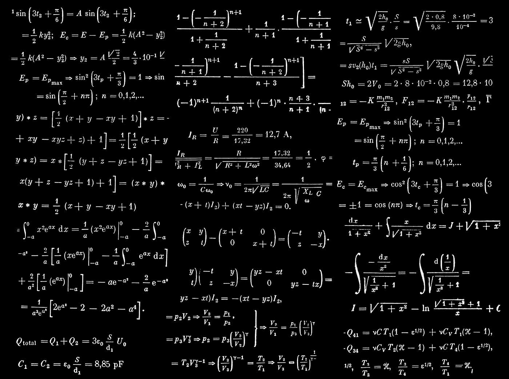

# LeetCode 69: Sqrt(x)(用图像获取解决方案)

> 原文：<https://blog.devgenius.io/leetcode-69-sqrt-x-86679311b8a0?source=collection_archive---------0----------------------->

链接:→[https://leetcode.com/problems/sqrtx/](https://leetcode.com/problems/sqrtx/)



丹·克里斯蒂安·pădureț在 [Unsplash](https://unsplash.com?utm_source=medium&utm_medium=referral) 上拍摄的照片


# 问题:→

给定一个非负整数`x`，计算并返回 `x`的平方根*。*

由于返回类型是整数，小数位数被**截断**，只返回结果的整数部分**。**

**注意:**不允许使用任何内置的指数函数或运算符，如`pow(x, 0.5)`或`x ** 0.5`。

**例 1:**

```
**Input:** x = 4
**Output:** 2
```

**例二:**

```
**Input:** x = 8
**Output:** 2
**Explanation:** The square root of 8 is 2.82842..., and since the decimal part is truncated, 2 is returned.
```

**约束:**

*   `0 <= x <= 231 - 1`

# 解决方案:→

这个解决方案可以使用**线性时间复杂度**轻松实现，如下所示

假设我们要求 9 的平方根，

1*1 = 1

2 * 2 = 4

**3 * 3 = 9**

所以，在这里， **3** 是结果，但是我们试图避免这种方法，

让我们看看二分搜索法的其他可能性。

同上，我们试图用**二分搜索法**求出 **9** 的平方根。

首先我们会放一些条件，比如，如果给定值是 **0** 或 **1** ，那么它的平方根是相同的，所以我们可以返回那个值，而不是做他们的计算，


在二分搜索法，我们需要两个终点，在这两个终点之间，我们将努力取得结果，


这里， **end** 我们取了 **x/2** ，这是因为，任何值(不包括 0 和 1)的平方根，总是小于或等于它的一半值，

比如，

**4** 的平方根是 2，即**等于**的 4/2。

**9** 的平方根是 3，比**小 9/2。**

**16** 的平方根是 4，小于**16/2，以此类推。**

因此，为了减少步骤，我们将用 **x/2 设置**结束**值。**

现在，我们将经历 while 循环条件，


首先，我们将检查，

> **开始≤结束**=>**1 ≤( x/2)**=>**1 ≤( 9/2)**=>**1≤4**=>**真。**


现在，我们将尝试获取 **mid** 值，

> **中期** = > **(开始+结束)/2**=>**(1+4)/2**=>**(5/2)**=>**2。**


现在，我们将检查，

> **中期*中期>x**=>**2 * 2>9**=>**4>9**=>**假**。


由于 **4 > 9** ，我们需要消除 **1，2** 值，因为我们得到的想法是，如果 **2 的平方**不会比 **9** 多**，那么 **1 的平方**也不会比 **9** 多。所以，**启动**值应该大于 **2** ，也就是 2 + 1 = **3** 。**


现在，对于下一次迭代，while 条件，

> **开始≤结束**=>**3 ≤( 4)**=>**真。**


同样，我们将尝试获取 **mid** 值，

> **中期** = > **(开始+结束)/2**=>**(3+4)/2**=>**(7/2)**=>**3。**


现在，我们将检查，

> **mid * mid>x**=>**3 * 3>9>=**9>9**=>**假。****


> **开始** = **中期+1**=>**3+1**=>**4**


现在，对于下一次迭代，while 条件，

> **开始≤结束**=>**4 ≤( 4)**=>**真。**


同样，我们将尝试获取 **mid** 值，

> **中期** = > **(开始+结束)/2**=>**(4+4)/2**=>**(8/2)**=>**4。**


现在，我们将检查，

> **mid * mid>x**=>**4 * 4>9**=>**16>9**=>**真。**


> **end**=**mid—1**=>**4–1**=>**3**


现在，对于下一次迭代，while 条件，

> **开始≤结束**=>**4 ≤( 3)**=>**假。**


现在，当条件变为**假**时。

现在，最后我们会回来，


哪一个是 **3、**这是我们的答案。

现在，让我们看看完整的源代码。

# 代码(Java): →

# 代码(Python): →

# 时间复杂度

既然我们在这里使用了二分搜索法，那么时间复杂度将是 **O(log(n))** 。

# 空间复杂性

由于我们没有使用任何额外的数组，所以，空间复杂度将是***【O(1)***。

感谢你阅读这篇文章，❤

如果我做错了什么？让我在评论中。我很想进步。

拍手声👏如果这篇文章对你有帮助。