# LeetCode: 70 爬楼梯(用图片获取解答)

> 原文：<https://blog.devgenius.io/leetcode-70-climbing-stairs-get-solution-with-images-1939a8e6d525?source=collection_archive---------0----------------------->

链接:→【https://leetcode.com/problems/climbing-stairs/ 

# 问题:→

你正在爬楼梯。到达顶端需要`n`步。

每次你可以爬`1`或`2`台阶。有多少种不同的方式可以让你爬上顶峰？

**例 1:**

```
**Input:** n = 2
**Output:** 2
**Explanation:** There are two ways to climb to the top.
1\. 1 step + 1 step
2\. 2 steps
```

**例 2:**

```
**Input:** n = 3
**Output:** 3
**Explanation:** There are three ways to climb to the top.
1\. 1 step + 1 step + 1 step
2\. 1 step + 2 steps
3\. 2 steps + 1 step
```

**约束:**

*   `1 <= n <= 45`

# 解决方案:→

让我们先理解这个问题，

→如果楼梯只有**一级**，则只需用 **1** 的方式爬 1 级即可。

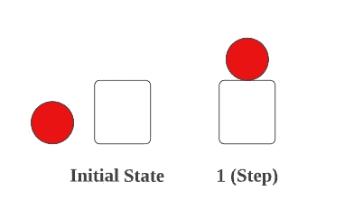

→如果楼梯箱有**两个台阶**，那么可以用**两个**方式实现，

**——(第一种方式)→ 1(步骤)+ 1(步骤):→**

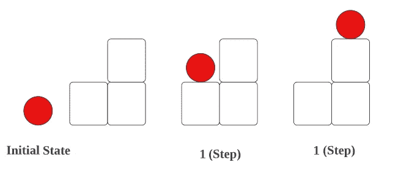

**——(第二种方式)→直接走 2 步。**

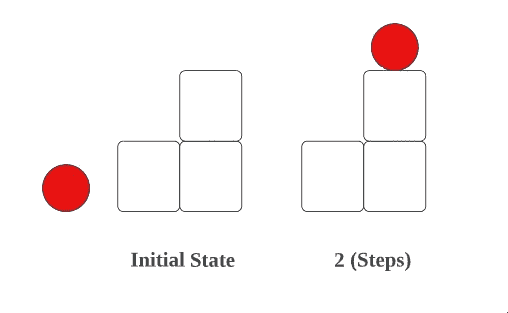

**→** 如果梯级箱有**三个台阶**，那么可以用**三个**方式来实现，

**——(第一路)→ 1(步)+ 1(步)+ 1(步):→**

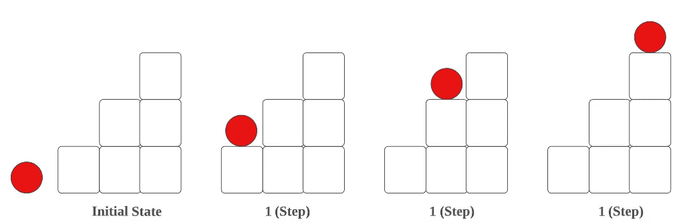

**——(第二路)→ 2(步)+ 1(步):→**

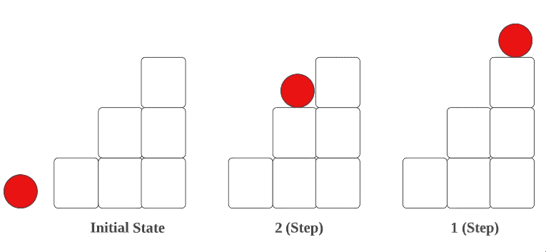

**—(第三路)→** 1 **(步进)+ 2(步进):→**


通过检查过程，你会意识到

如果楼梯有 **1 步= 1 路。**

如果楼梯有 2 个****台阶= 2 个方向。****

**如果楼梯有 **3 级= 3 路(这里是(1 + 2)的组合)。****

**如果楼梯有 **4 级= 5 路(这里是(3 + 2)的组合)，如下图为 4。****

> **1) 1 + 1 + 1 + 1**
> 
> **2) 2 + 2**
> 
> **3) 1 + 1 + 2**
> 
> **4) 2 + 1 + 1**
> 
> **5) 1 + 2 + 1**

**基于数据，你会意识到**

**1, 2, 3 (2+1), 5 (3+2), 8 (5+3)……**

**每个**下一步**结果都是前两步的**组合。****

**就像**斐波那契数列。****

**让我们用代码实现这些东西。**

**首先，我们将条件设为，如果给定值是 **1，2，3** ，我们将原样返回该值，因为对于 **1，2 和 3** ，**方式**相同。**

**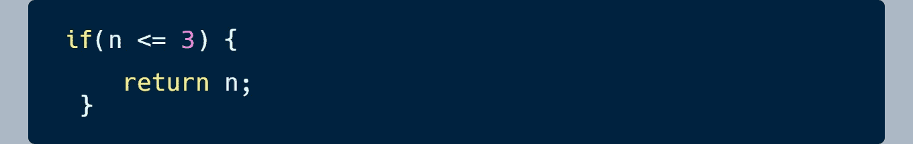**

**现在对于 **4，5…到 n** ，我们将需要对**之前的两个值**做**加法**。**

**因此，我们已经检查到**中的 **3** ，如果条件**像上面的**、****

**因此，对于 **4** →我们需要将前面两个 2、3 相加。**

**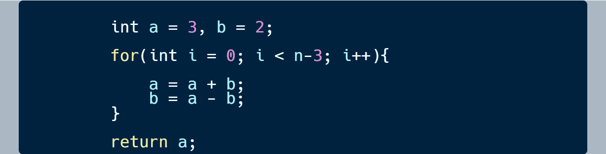**

**在上图中，这就是为什么我选择了 **a =3 和 b =2** (之前的值)。**

**现在，我们将从 **0 到** **(n-3)** 的循环设为**，因此对于 4 将是**(4–1)**=**1**。****

**在这里，你可以看到我们已经采取了，**

****a = a + b，****

**这个 **a** 将是前面两个值的**相加**。**

****b = a — b，****

**这个 **b** 将保存 **a** 的**前一个**值，我们来举例看看，**

**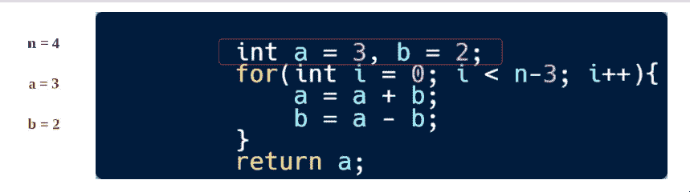**

**现在用 for 循环， **i** 从 0 开始。**

**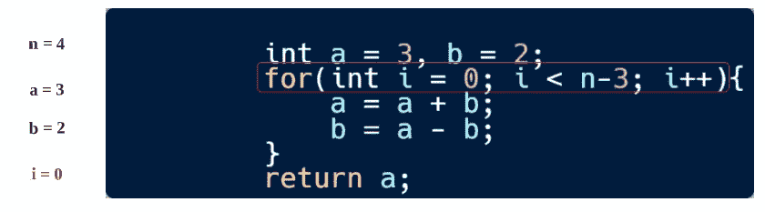**

**首先，将进行加法运算，**

****a**= a+b =>3+2 =>**5。****

**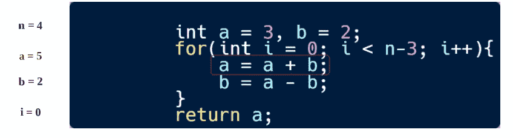**

**现在，在子站中，这里的 **b** 将保持 **a 的先前值**的值，让我们检查如何保持。**

****b**= a—b =>5–2 =>**3。←** 你可以看到这个是 **a 之前的**值也就是 **3。****

**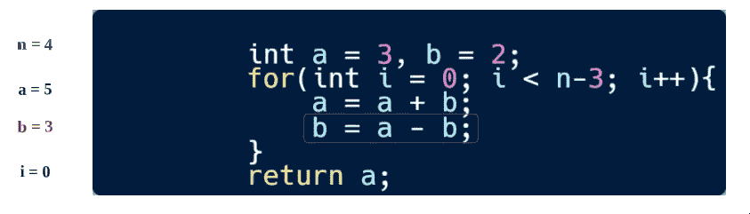**

**现在，对于下一次迭代， **i** 将为 **1** ，因此，条件将为**失败**，因为:**

****I**<n-3 =>1<4–3 =>**假。****

**所以最后， **a 的值**会被返回。将是我们的**回答**。**

**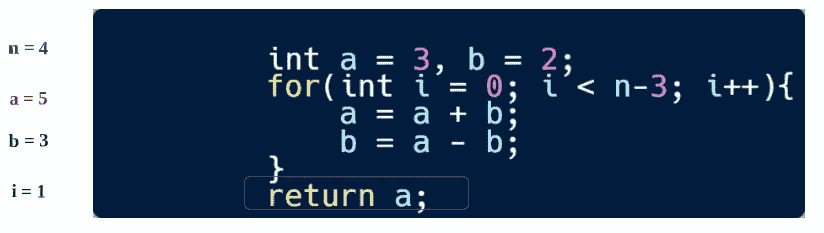**

**现在，让我们看看完整的源代码。**

# **代码(Java): →**

# **代码(Python): →**

# **时间复杂度**

**该序列的时间复杂度为 O(N ),即线性的。**

**但是在约束条件中，已经提出 n 值会在 1 到 45 ( 1 <= n <= 45), so O(45) → **O(1)** 之间。所以它也会被认为是一个 **O(1)** 。**

# **空间复杂性**

**既然我们没有使用任何额外的数组，那么，空间复杂度将是***(1)***。**

**感谢你阅读这篇文章，❤**

**如果我做错了什么？让我在评论中。我很想进步。**

**拍手声👏如果这篇文章对你有帮助。**