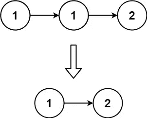
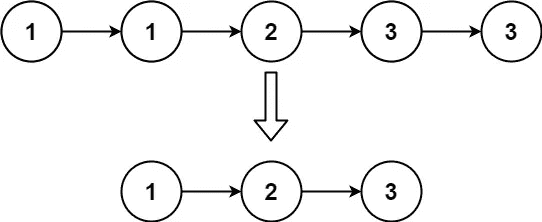
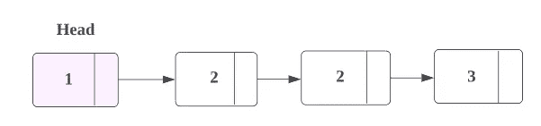
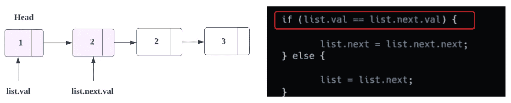
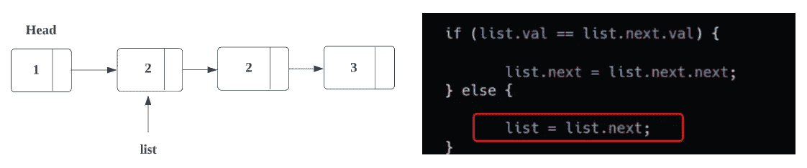
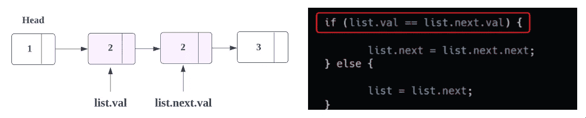
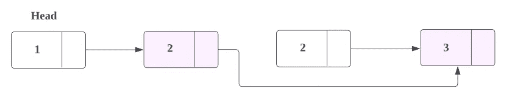
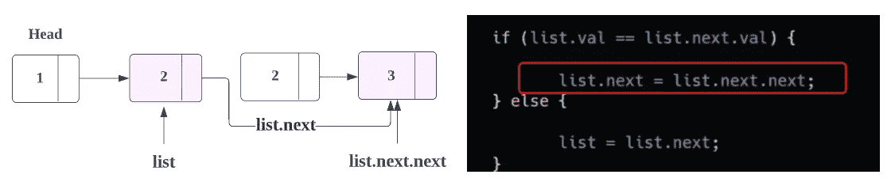
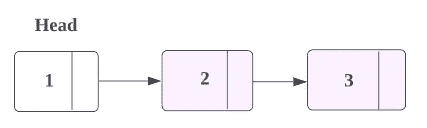

# LeetCode: 83。从排序列表中删除重复项(获取图像解决方案)

> 原文：<https://blog.devgenius.io/leetcode-83-remove-duplicates-from-sorted-list-get-solution-with-images-ddfa56b191f?source=collection_archive---------4----------------------->

# 问题:→

给定一个排序链表的`head`，*删除所有重复项，使得每个元素只出现一次*。返回*链表* ***排序后的*** *以及*。

**例 1:**



```
**Input:** head = [1,1,2]
**Output:** [1,2]
```

**例 2:**



```
**Input:** head = [1,1,2,3,3]
**Output:** [1,2,3]
```

**约束:**

*   列表中的节点数量在范围`[0, 300]`内。
*   `-100 <= Node.val <= 100`
*   该列表保证按升序**排序**。

# 解决方案:→

这里，我们有一个链表，我们需要从中删除所有重复的值，

让我们用一个例子来理解解决方案，

假设，我们已经给出了下面的链表。



在这里，我们可以看到它的**当前节点的**值和它的**下一个节点的**值，

=> **1！= 2** = > **假**

因为没有重复的值，所以我们在这里什么也不做。



因此，我们处于**否则条件**，这里我们将移动到**下一个节点**。现在，我们的**当前节点**被更改。



现在，在下一次迭代中，我们将再次比较当前节点的值与下一个节点的值。



这里，值是匹配的 **(2 == 2)** ，所以我们必须删除其中一个节点，所以这里我们将尝试让我们的**当前节点**指向它的**下一个节点的** **下一个节点**。如下图所示。



通过这样做，您可以看到，我们已经自动删除了重复的节点。



所以，最后的结果，会像下面这样。



现在，让我们看看完整的源代码。

# 代码(Java): →

# 代码(Python): →

# 时间复杂度

该序列的时间复杂度为 O(N ),即线性的。

但是在约束条件中，已经提出了**节点**的个数会在 0 到 300 之间(0 < = n < =300)，所以 O(300) → **O(1)** 。

所以它也会被认为是一个 **O(1)** 。

# 空间复杂性

由于我们没有使用任何额外的链表，所以，空间复杂度将是***(1)***。

感谢你阅读这篇文章，❤

如果我做错了什么？让我在评论中。我很想进步。

拍手声👏如果这篇文章对你有帮助。