# LeetCode 88:合并排序后的数组(用图像获取解决方案)

> 原文：<https://blog.devgenius.io/leetcode-88-merge-sorted-array-get-solution-with-images-a6a40539c50?source=collection_archive---------2----------------------->

链接:→【https://leetcode.com/problems/merge-sorted-array/ 

# 问题:→

给你两个整数数组`nums1`和`nums2`，按**非降序排序**，两个整数`m`和`n`，分别代表`nums1`和`nums2`中元素的个数。

**将** `nums1`和`nums2`合并成一个按**非降序排列的数组**。

最终排序后的数组不应该被函数返回，而是被*存储在数组* `nums1`里面。为了适应这种情况，`nums1`的长度为`m + n`，其中第一个`m`元素表示应该合并的元素，最后一个`n`元素被设置为`0`并应该被忽略。`nums2`的长度为`n`。

**例 1:**

```
**Input:** nums1 = [1,2,3,0,0,0], m = 3, nums2 = [2,5,6], n = 3
**Output:** [1,2,2,3,5,6]
**Explanation:** The arrays we are merging are [1,2,3] and [2,5,6].
The result of the merge is [1,2,2,3,5,6] with the underlined elements coming from nums1.
```

**例 2:**

```
**Input:** nums1 = [1], m = 1, nums2 = [], n = 0
**Output:** [1]
**Explanation:** The arrays we are merging are [1] and [].
The result of the merge is [1].
```

**例 3:**

```
**Input:** nums1 = [0], m = 0, nums2 = [1], n = 1
**Output:** [1]
**Explanation:** The arrays we are merging are [] and [1].
The result of the merge is [1].
Note that because m = 0, there are no elements in nums1\. The 0 is only there to ensure the merge result can fit in nums1.
```

**约束:**

*   `nums1.length == m + n`
*   `nums2.length == n`
*   `0 <= m, n <= 200`
*   `1 <= m + n <= 200`
*   `-109 <= nums1[i], nums2[j] <= 109`

# 解决方案:→

让我们通过一个例子来解决这个问题。

假设我们给了两个如下排序的数组，

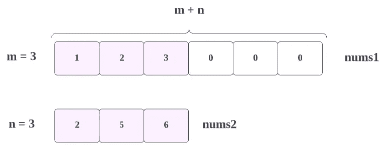

在这里我们将进行比较，最后两位数字 **nums1[m-1] == nums2[n-1]**

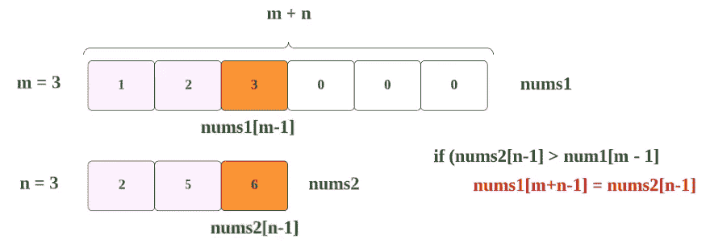

无论最大值是多少，都将被追加到 **nums1[m+n-1]，**

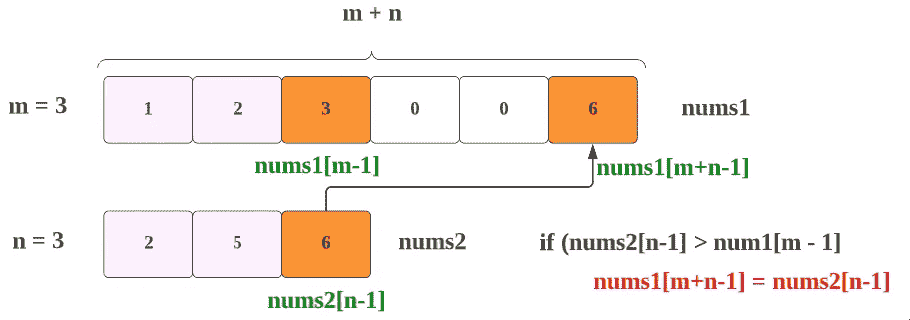

因为我们发现 **nums2[n-1]** 的值更大，所以我们将移动到它的前一个元素，即 **nums2[n-2]** 和**比较**和 **nums1[m-1]。**

另外， **nums[m+n-1]** 已经被填充，所以我们将移动到它的前一个元素，即 **nums[m+n-2]**

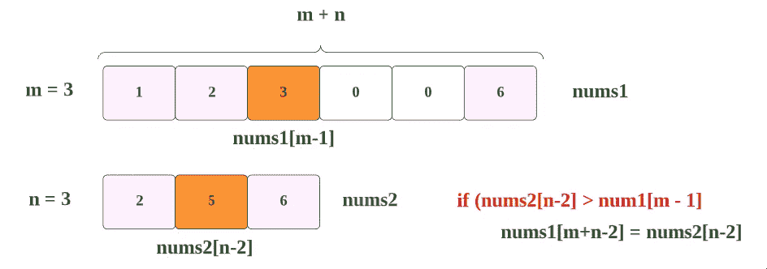

如上一步，无论最大值是多少，都将被附加到 **nums1[m+n-2]，**

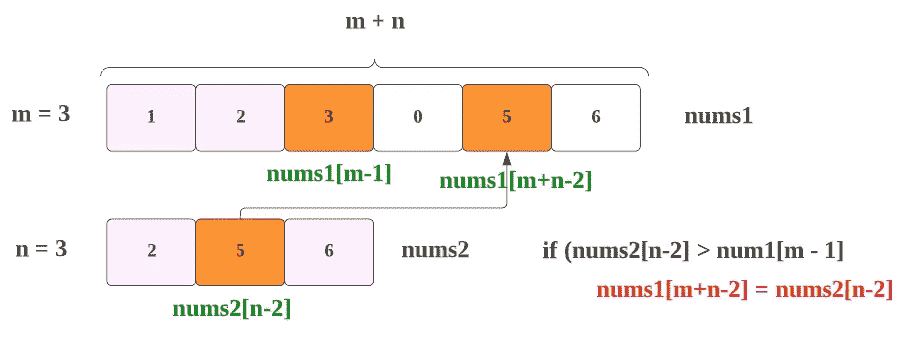

这里 **nums2[n-2]** 是的更大值，所以我们将移动到它的前一个元素，即 **nums2[n-3]** 和**比较**和 **nums1[m-1]。**

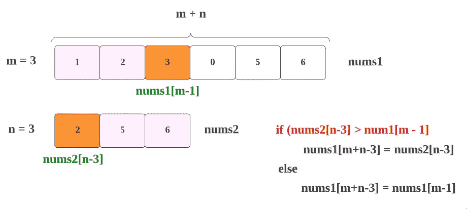

但在这里，**nums 2[n-3]>nums 1[m-1]**=>**2>3、**条件变成了**假。**

因此，如前一步，无论最大值是什么，都将被附加到 **nums1[m+n-3]，**


这里 **nums1[m-1]** 是的更大值，所以我们将移动到它的前一个元素，即 **nums1[m-2]** 和**比较**和 **nums2[n-3]。**

另外， **nums[m+n-3]** 已经被填充，所以我们将移动到它的前一个元素，即 **nums[m+n-4]**


这里，**nums 2[n-3]≥nums 1[m-2]**=>2 = = 2**，**条件变为**真。**

因此，如前一步，无论最大值是什么，都将被附加到 **nums1[m+n- 4]，**

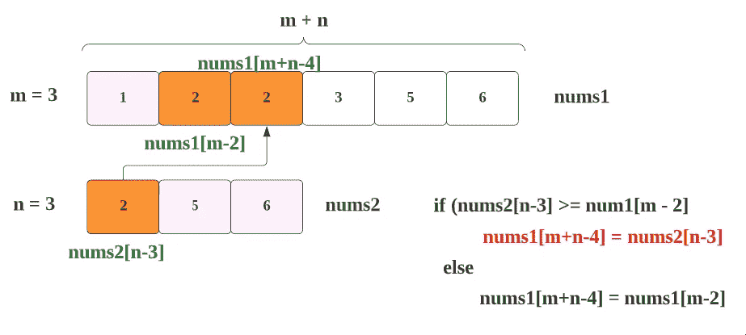

在这里 **nums2[n-3]** 是的更大值，所以我们将移动到它的前一个元素 **nums2[n-4]** ，但是 **nums2 的长度**是以**结束**。因此，我们不能去它的前一个元素，我们必须需要通过**来避免这些步骤，如果条件**。

所以，我们得到了下面的结果，

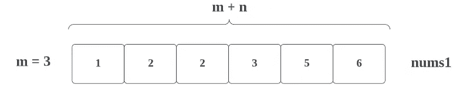

注意:在上面的例子中，你可以看到 **nums2** 比 **nums1** 早到达 **0** 。但是如果 **num1** 比 **nums2** 早达到 0 呢？

像下面这样，

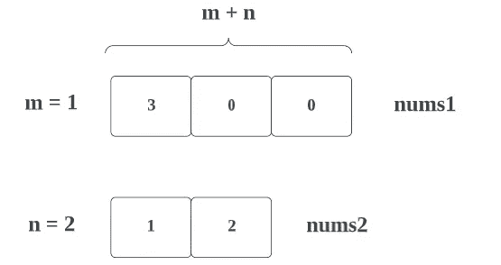

在这种情况下，首先我们将一步一步来，就像上面我们看到的那样，

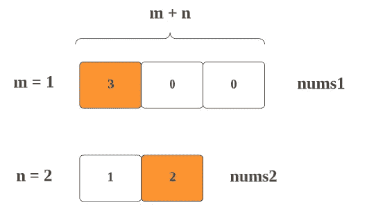

这里， **nums1[m-1]** 也就是 **3** 比较大所以，

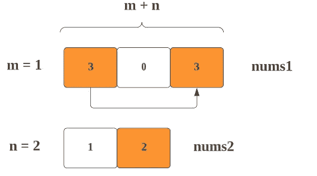

这里 **nums1[m-1]** 是更大的值，所以我们将移动到它的前一个元素，即 **nums1[m-2]** ，但是 **nums1 的长度**是以**结束的**。所以，我们不能去它的前一个元素，我们必须通过条件来避免这些步骤。

在这里，我们不能停止整个过程，因为我们没有遍历 **nums2，**的所有元素，也没有得到正确的 num1。

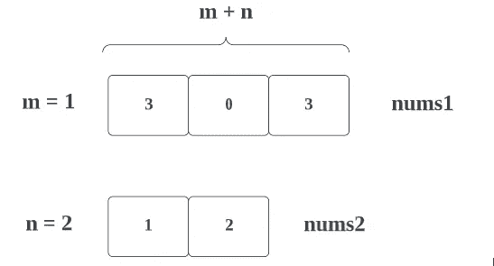

因此，在最后，我们需要将 nums2 的元素一个接一个地放置到剩余的 nums1 的元素中，如下所示，

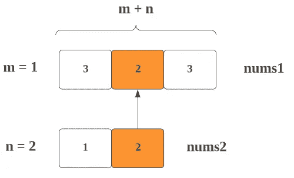

接下来，

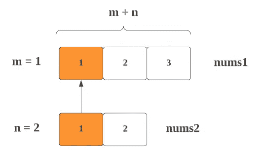

现在，我们得到了正确的结果，

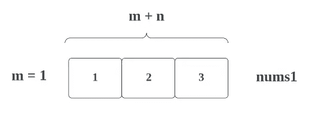

现在，让我们看看完整的源代码。

# 代码(Java): →

# 代码(Python): →

# 时间复杂度

这里我们用的是 while 循环 with (m+n)，所以时间复杂度会是 **O(m+n)** 。

# 空间复杂性

既然我们没有使用任何额外的数组，那么，空间复杂度将是***【O(1)】T5。***

*感谢你阅读这篇文章，❤*

*如果我做错了什么？让我在评论中。我很想进步。*

*拍手声👏如果这篇文章对你有帮助。*