# Leetcode — 9 回文数(用图像获得解答)

> 原文：<https://blog.devgenius.io/leetcode-9-palindrome-number-389c2c2720d3?source=collection_archive---------1----------------------->

链接:→[https://leetcode.com/problems/palindrome-number/](https://leetcode.com/problems/palindrome-number/)


阿诺德·弗朗西斯卡在 [Unsplash](https://unsplash.com?utm_source=medium&utm_medium=referral) 上拍摄的照片

# **问题:**

给定一个整数`x`，如果`x`是回文整数，则返回`true`。

当一个整数向后读和向前读一样时，它就是一个回文。

*   例如，`121`是回文，而`123`不是。

**例 1:**

```
**Input:** x = 121
**Output:** true
**Explanation:** 121 reads as 121 from left to right and from right to left.
```

**例 2:**

```
**Input:** x = -121
**Output:** false
**Explanation:** From left to right, it reads -121\. From right to left, it becomes 121-. Therefore it is not a palindrome.
```

**例 3:**

```
**Input:** x = 10
**Output:** false
**Explanation:** Reads 01 from right to left. Therefore it is not a palindrome.
```

**约束:**

*   `-231 <= x <= 231 - 1`

# **解决方案:**

*   我们需要找出一个给定的数是否是回文。
*   回文数是一个反过来给出相同数字的数。
*   例如，121 是回文数，因为它的反序也是 121，但 123 不是，因为当反序时，它给出的 321 不等于 123。

我们可以很容易地解决这个问题，通过反转给定的数字，并将反转的数字与给定的数字进行比较。

1.  如果数字是负数，返回`false.`
2.  将给定的数字`x`存储在变量`temp`中。我们这样做是因为我们将在 **x** 上执行操作，因此，它的值将会改变。我们会在程序的最后用`temp`与反数进行比较。
3.  反转数字。
4.  如果反数和给定数相等，返回`true`，否则返回`false`。

让我们通过图片来理解:

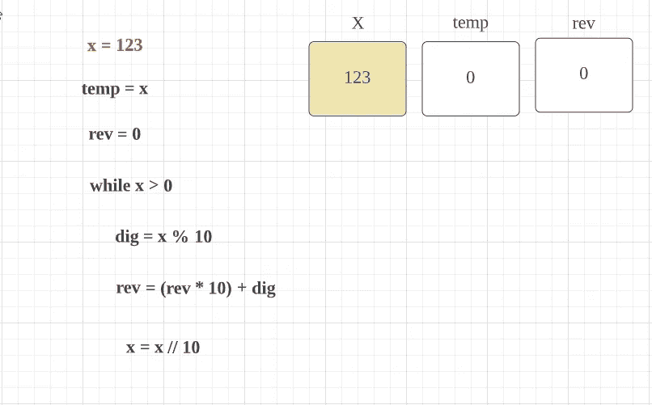

**x** 是给定的值。例如，这里是 123

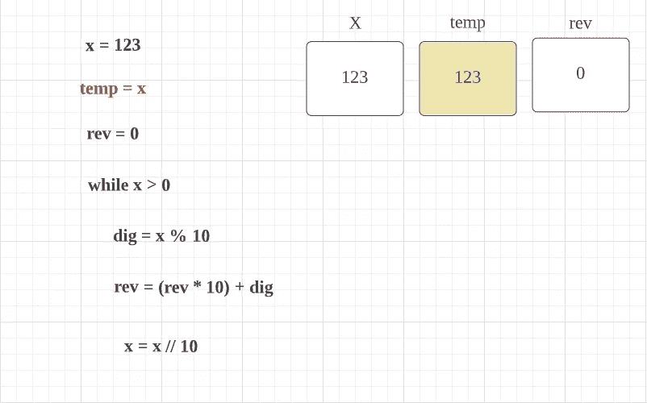

我们将该值存储到 **temp** 变量中，因为将来我们将与 **rev(它是倒数)**进行比较

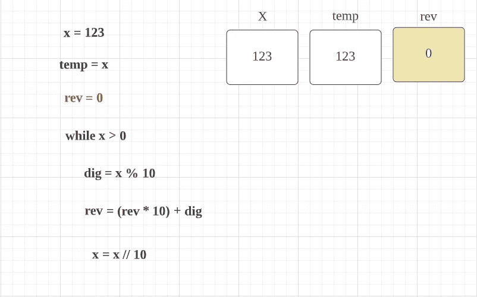

在初始化的时候我们会把 **rev = 0** ，这里 **rev 是反数变量。**

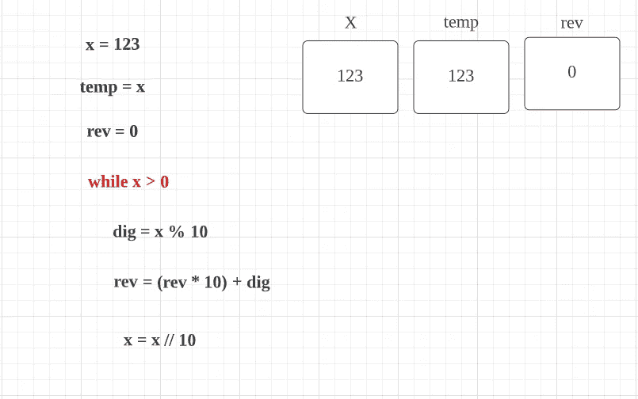

x = 123，因此条件为**真**

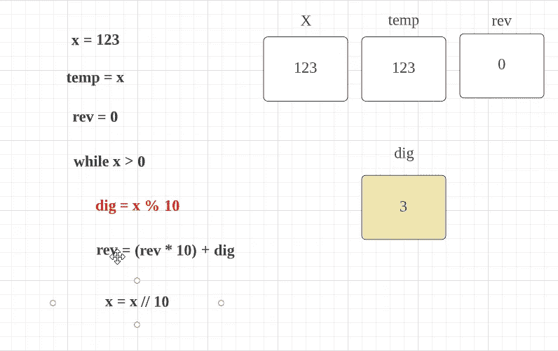

这里 x 是 123，所以 123 % 10 = 3，所以 dig = 3。

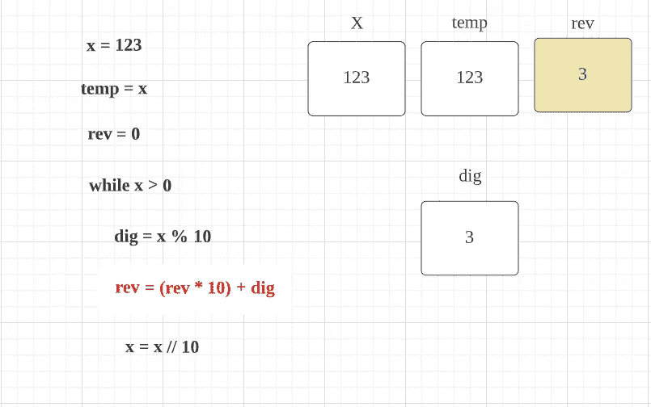

开始时 **rev = 0** ，现在&挖**变成 **3****

所以，rev = (0*10)+3 = 3

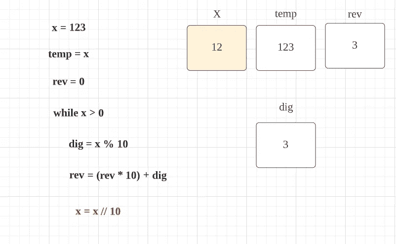

x 是 123，

x = 123 // 10 = 12。

注意:在 python 中，底数除法(//)将结果向下舍入到最接近的整数。


现在因为 x 是 12，而条件变成真。

所以 dig = 12 % 10 = 2


rev 是 3，dig 变成了 2

所以 rev = (3 * 10) + 2 = 32。

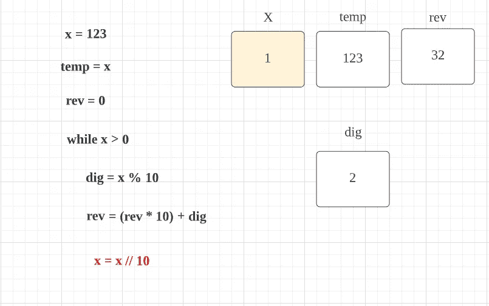

x 是 12 岁，

所以 12 // 10 = 1

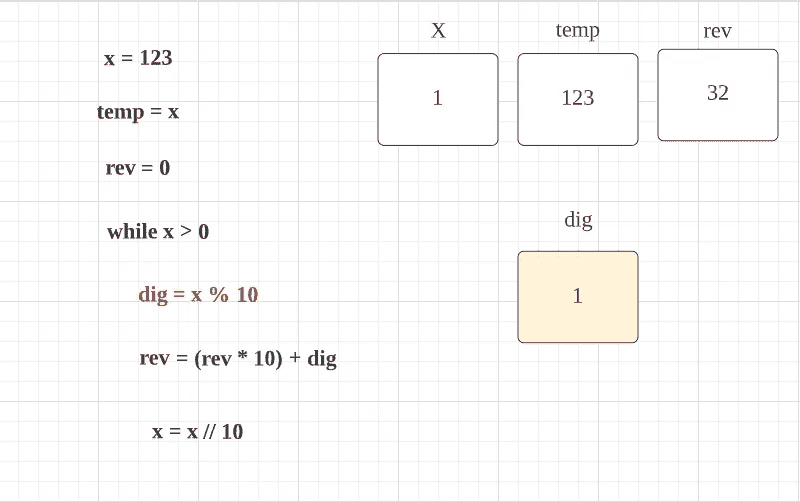

这里 x 是 1，所以当条件为真时

dig = 1 % 10 = 1

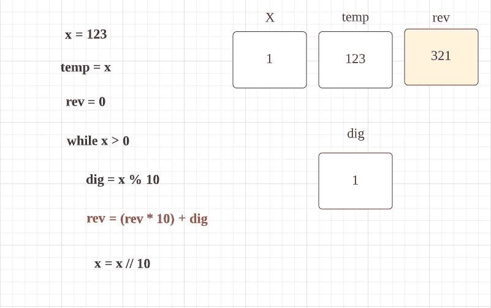

rev 是 32，现在 dig 是 1

所以 rev = (32*10)+1 = 321

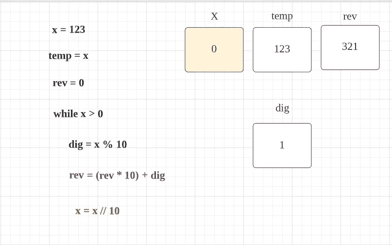

x 是 1，

所以 x = 1//10 = 0

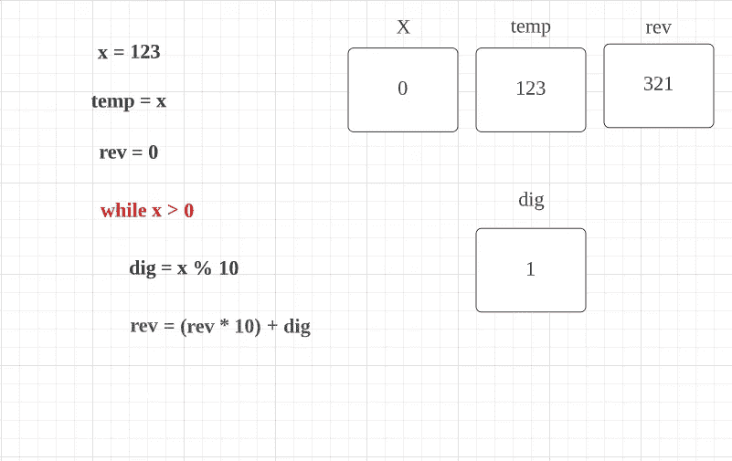

现在，当条件变为假时。

现在我们可以比较值**温度**和**转速**

记住**温度**是存储 **x** (第一次分配的数字)的原始值，因为 **x** 的值正在改变。

*   `temp == rev`

如果上述条件为真，则为**回文**，否则为非回文。

**代码(Python):**

**代码(Java):**

## 时间复杂度:

既然我们是一位一位的遍历整个数，那么时间复杂度应该是 ***O(log10n)*** 。因为在每次迭代中，我们都将这个数除以 10。所以时间复杂度可以说等于一个数的位数。

## 空间复杂性:

**O(1)** 因为我们使用了一个额外的变量来存储反转后的数字。

感谢你阅读这篇文章，❤

如果我做错了什么？让我在评论中。我很想进步。

拍手声👏如果这篇文章对你有帮助。