# LeetCode: 94。二叉树有序遍历(图像解决方案)

> 原文：<https://blog.devgenius.io/leetcode-94-binary-tree-inorder-traversal-69ae4aa46547?source=collection_archive---------0----------------------->

链接:→[https://leet code . com/problems/binary-tree-in order-traversal/](https://leetcode.com/problems/binary-tree-inorder-traversal/)

# 问题:→

给定一棵二叉树的`root`，返回*其节点值*的 ***以便遍历*** *。*

**例 1:**


```
**Input:** root = [1,null,2,3]
**Output:** [1,3,2]
```

**例 2:**

```
**Input:** root = []
**Output:** []
```

**例 3:**

```
**Input:** root = [1]
**Output:** [1]
```

**约束:**

*   树中的节点数量在范围`[0, 100]`内。
*   `-100 <= Node.val <= 100`

**跟进:**递归求解很简单，你能迭代吗？

# 解决方案:→

不像线性数据结构(数组、链表、队列、堆栈等)只有一种逻辑方式来遍历它们，树可以用不同的方式来遍历。

> 遍历是:
> (a)顺序(左，根，右):4 2 5 1 3
> (b)前顺序(根，左，右):1 2 4 5 3
> (c)后顺序(左，右，根):4 5 2 3 1

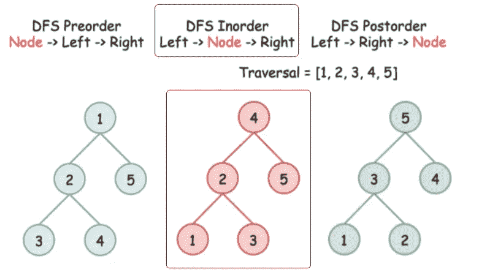

在问题中，清楚地提到我们必须以的方式遍历**。**

让我们先了解什么是**以便**。

1.  遍历左边的子树，
2.  访根。
3.  遍历右边的子树，

→例如，当输入为[1，2，3，4，5](如下图所示)
时，输出应为[4，2，5，1，3]

让我们了解它将如何计算。

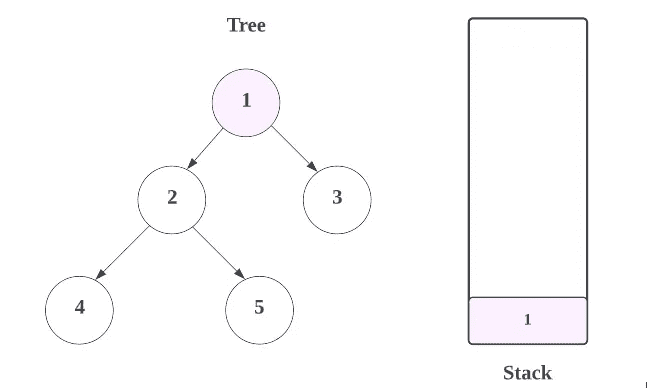

首先，我们将尝试遍历树的左侧节点，并将这些值添加到**堆栈**中，直到我们变空(NULL)。

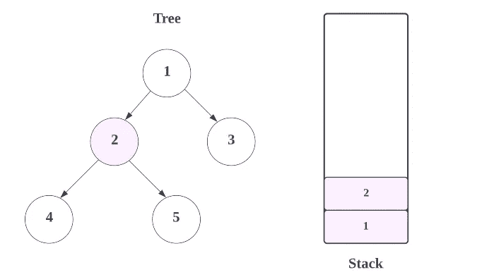

最后是，

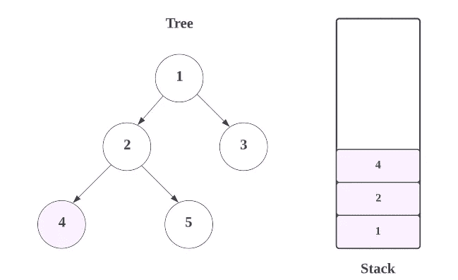

现在，在这里的 **4，**如果我们去它的**左侧**，我们将得到空(NULL)，因为在 **4 的左侧没有节点。**

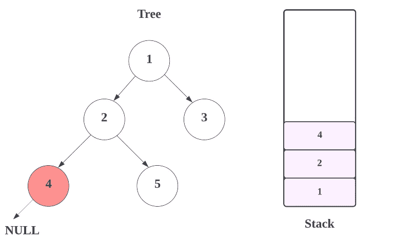

现在，由于**当前节点** (4)没有任何左节点，我们将把**当前节点**的值放到列表中，我们将从堆栈中移除值，并将该值添加到**列表中。**

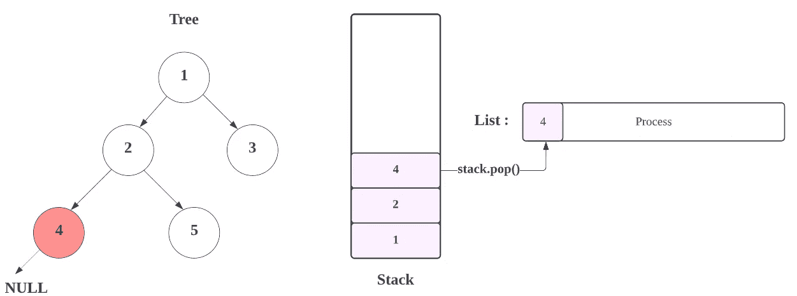

现在检查**当前节点**的**右侧**(为 4)，也是**空**

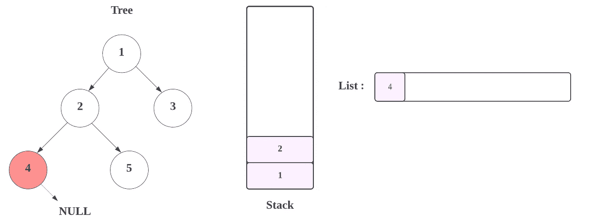

现在，我们从堆栈中弹出值，并将其添加到列表**。**

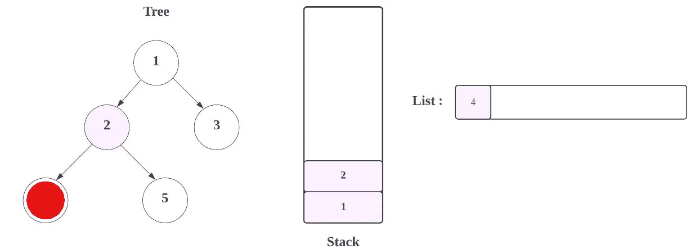

所以，结果会是，

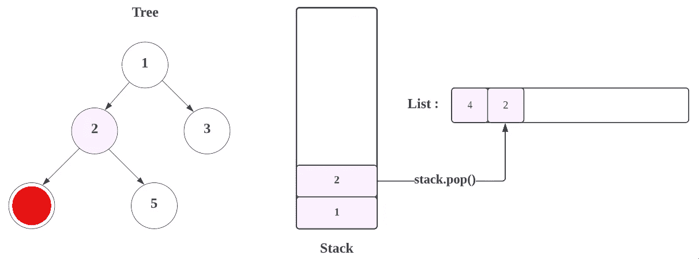

现在，我们将检查 2 的右侧，即 5，将当前节点(即 5) 的所有**左节点放入**堆栈**——但是 **5** 没有任何左节点。我们将顶部节点的值(即 5)放入列表中。**

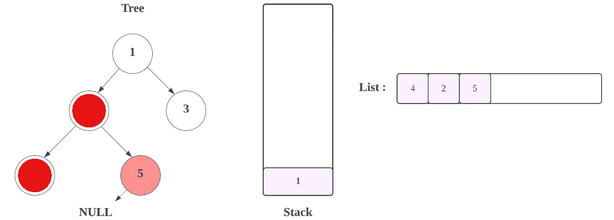

检查当前**节点的右节点**，也是**空。**


现在，我们从堆栈中弹出值，并将其添加到列表**。**

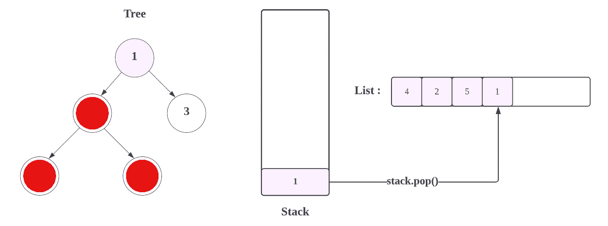

现在检查**电流节点** (1)的**右侧**，为 3


现在，将当前节点(即 3) 的所有**左节点放入**堆栈**——但是 3 没有任何左节点。**

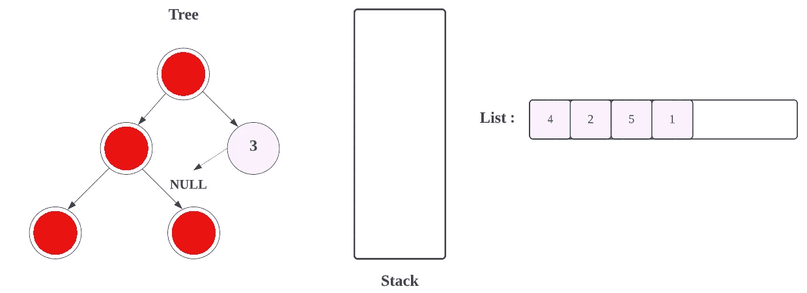

现在，下一步，我们将把当前节点的值添加到列表中。

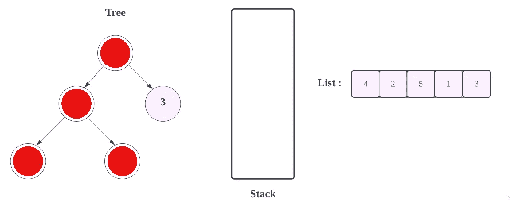

然后检查**当前节点**的所有**右侧**，也是**空。**

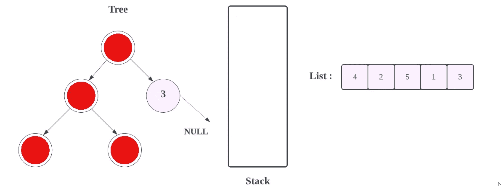

然后，


这里**节点**和**栈**都是**空**和**空**。没有节点可以添加到列表中。我们完了！

现在，让我们看看完整的源代码。

# 代码(Java): →

# 代码(Python): →

# 时间复杂度

这里，我们遍历树的所有节点一次，所以总时间复杂度是 **O(n)** 。

# 空间复杂性

由于我们使用了两个额外的数组，如 **res** 和 **stack** ，所以，空间复杂度将为*O(2n)=>****O(n)***。

感谢你阅读这篇文章，❤

如果我做错了什么？让我在评论中。我很想进步。

拍手声👏如果这篇文章对你有帮助。