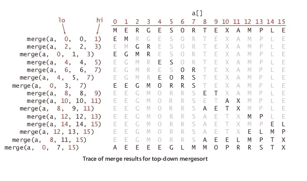
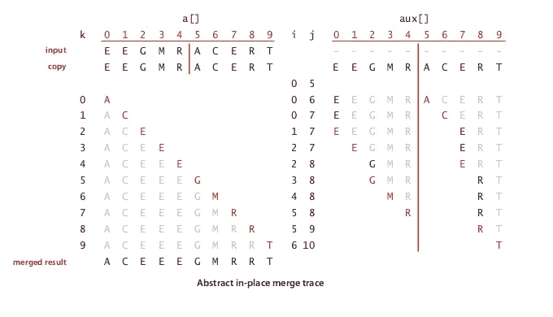
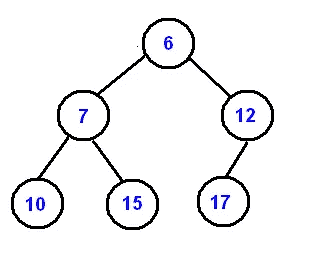

# Leetcode 问题:使用 MinPQ (Ruby)合并 K 排序列表

> 原文：<https://blog.devgenius.io/leetcode-problem-merge-k-sorted-lists-using-minpq-ruby-a63c4f325796?source=collection_archive---------18----------------------->

LeetCode！:0

*！！！在阅读之前，请确保您了解基本的排序算法，如插入排序、合并排序和优先级队列数据结构。我强烈建议，如果你不熟悉基本算法和数据结构，在解决 Leetcode 问题之前，先熟悉所有的基本算法和数据结构。如果没有算法和数据结构的基础知识，就很难跟上解决方案的解释并实现除暴力之外的解决方案，这是低效的。*

*我强烈推荐罗伯特·塞奇威克的《算法》第四版。*

## 那么首先是什么问题呢？

这个问题是 Leetcode 上非常流行的“硬”级问题。查看问题[这里](https://leetcode.com/problems/merge-k-sorted-lists/)。

**合并 k 个排序链表:**
合并 k 个排序链表，作为一个排序链表返回。分析并描述其复杂性。

例:
输入:

1->4->5、
1 - > 3 - > 4、
2->6

输出:1->1->2->3->4->4->5->6。

我们现在可以把链表看作数组，以消除处理节点的复杂性。

**看待这个问题的一种方式是把它看做一个合并排序问题，或者“实现合并排序”问题**。在合并排序中，从最小的子数组开始，我们递归排序，直到整个数组都被排序。这被称为“分治”算法。

看看这个 mergesort 的痕迹。

我们可以将相同的算法应用于 k 链表。递归排序两个列表，直到我们得到一个组合结果。我们的问题与 mergesort 的唯一不同之处是我们从 k 个排序的子数组开始，而不是给出一个完整的未排序的数组。

如果我们使用分治合并算法，我们将得到 O(N log k)的运行时间。(合并排序的正常运行时间为 O(N log N)。然而，在这个问题中，我们从 k 个排序的子数组开始，所以我们必须对每个值进行排序的比较次数是 log k，而不是 log N。)

另一种看问题的方法是同时合并所有子阵列。当我们合并*两个*子数组时，我们比较两个子数组的下一个元素，并将较小的一个插入我们的结果中。我们重复这个过程，直到整个数组合并。

合并两个排序的子数组的轨迹:“例如 M R”和“A C E R T”。左半部分显示合并结果的轨迹，右半部分显示我们为每个“合并”比较的值的轨迹。

找到两个值之间的最小值是一个简单的比较操作，但是我们需要同时合并 k 个列表。**如何从 k 个数值中快速找到最小值？**这样做的一个方法是保存一个有序的列表数组。

即
用例子:

1->4->5、
4 - > 5 - > 7、
2 - > 6

链表排序数组:[1，2，4]
删除第一个节点，并添加到 ans
结果:1
添加被删除节点的 next 并重新排序(节点 1 - > 4 的 next 为 4，add 4)

链表的排序数组:[2，4，4]
删除第一个节点，并添加到 ans
结果:1 - > 2
添加被删除节点的下一个并重新排序

排序后的数组:[4，4，6]
删除第一个节点，并添加到 ans
结果:1- > 2 - > 4
添加被删除节点的下一个并重新排序

重复直到排序后的数组为空…

使用链表的排序数组是可行的，但是为每个节点移除/插入保持数组排序将花费 O(k)的运行时间(使用插入排序来排序部分排序的数组)。**如果我们使用优先级队列，我们可以减少寻找下一个最小值并将下一个节点插入 O(log k)的运行时间。**

## 优先级队列/二进制堆

优先级队列或二进制堆看起来像这样…

**二叉堆是满足堆性质的二叉树:父代小于或等于其子代；子代大于或等于其父代。**最小二进制堆的根总是所有值中的最小值。****

我们不会过多地讨论二进制堆，但是这里有一些基本的东西:二进制堆中的值保存在从索引 1 开始的数组中。节点的子节点的索引是 2*i & 2*i+1。
**要添加一个节点，**我们添加到数组的末尾，并沿着树向上“游”节点，直到满足堆属性。
**为了去掉最小值，**我们用堆中的最后一个元素交换最小值(索引 1)。然后，我们弹出最小值。最后，我们通过向下移动交换的元素来满足堆属性，直到满足堆属性。*如果你不熟悉二进制堆，你应该看一下*[*https://www . brianstorti . com/implementing-a-priority-queue-in-ruby/*](https://www.brianstorti.com/implementing-a-priority-queue-in-ruby/)*了解数据结构的完整描述和实现。*

**在优先级队列中，删除最小值和插入新值都有 log X 的运行时间，其中 X 是节点总数。**因此，如果我们使用优先级队列而不是排序数组，我们可以将每个节点移除/插入-下一个/重新排序的运行时间减少到 O(log k)。对每个节点执行这个过程将得到 O(N log k)的总运行时间。

这是我们将要讨论的解决方案！

## 使用最低优先级队列的解决方案:

首先，这是我们的 minPQ。

*注意:我硬编码了 PQ 来接受节点作为元素。它将使用 node.value 在两个节点之间进行比较。*

现在在我们的 merge_k_lists 方法中:
首先，我们创建一个 min PQ 并将每个列表插入其中。

记住，输入“列表”基本上是每个列表头的数组。所以如果我们有名单…

【
1 - > 4 - > 5、
1 - > 3 - > 4、
2 - > 6
。

…我们插入到 PQ 中的节点列表实际上只包括[1，1，2]。

## 无需额外内存即可创建新的合并列表:

通过跟踪我们添加的前一个节点，我们可以在不使用额外内存的情况下创建一个新的链表(我们还需要跟踪头部，以便在创建完新的链表后返回头部)。)

对于我们添加的第一个节点，设置初始 head 和 prev:
head = first _ node _ to _ be _ added
prev = first _ node _ to _ be _ added

对于我们要添加的每个节点:
prev . next = next _ node _ to _ be _ added
prev = next _ node _ to _ be _ added

简单！

好了，现在我们有了一个带有链表的 min PQ，并且知道了如何创建一个新的链表，我们可以实现我们的解决方案了。

首先，**我们设置磁头和初始 prev** :我们从 PQ 中弹出(删除 min)并将其设置为磁头和 prev。如果删除的节点有一个. next，我们将下一个节点添加到 PQ。*注意:如果 m.pop 永远为零，这意味着我们的 PQ 是空的。*

一旦我们设置了 head 和 prev，**我们重复地将下一个最小值添加到我们的链表中，直到我们的 PQ 为空**:获取下一个最小值，将其添加到我们的 linked_list 中。如果。下一个节点不为空。在 pq 旁边。重复一遍。

一旦 PQ 为空，我们将有一个完全排序的列表，并且**我们可以返回头(我们的列表)。**

## 我们算法的分析:

**时间复杂度为 O(N log k)** ，其中 N 是总节点数，k 是列表数。对于每一个最小的 pop 和它的下一个插入，运行时间是 O(log k)。我们有 N 个节点要插入，这样我们的总运行时间为 O(N log k)。

空间复杂度将是 O(k)，即优先级队列所需的空间。我们的 PQ 的大小与输入中链表的数量成正比。我们正在创建我们的结果，所以我们不需要额外的空间来创建和返回一个新的列表。

## 在检查中

我们在这里实现的解决方案非常类似于合并排序的内部过程(合并两个排序的子数组)。然而，这里我们同时合并 k 个数组，所以我们需要实现一个优先级队列来有效地从 k 个不同的值中找到最小值。

我们也可以使用 mergesort 使用的同样的分治算法来解决这个问题。组合并合并两个子数组，直到整个数组排序完毕。这也将给我们一个 O(N log k)的运行时间。

下面是一个比较两种不同解决方案的轨迹的例子。

**分而治之貌似:** 输入:【
1 - > 2 - > 4、
1 - > 4 - > 6、
2 - > 3 - > 5、
2 - > 6 - > 7
]

1 -> 2 -> 4
1 - > 4 - > 6
合并:1->1->2->4->4->6。

2-> 3-> 5
2->6->7
合并:2->2->3->5->6->7。

合并两者合并:
1->1->2->2->2->3->4->4->5->6->6->7。

**使用一个 min PQ 看起来像:**
输入:【
1 - > 2 - > 4、
1 - > 4 - > 6、
2 - > 3 - > 5、
2 - > 6 - > 7

Min PQ 包含[1，1，2，2](使用上面的顺序—未排序的顺序)
移除 Min 并添加到列表
我们的链表:
1

Min PQ 包含[2，1，2，2]
移除 Min 并添加到列表
我们的链表:
1 - > 1

Min PQ 包含[2，4，2，2]
移除 Min 并添加到列表
我们的链表:
1 - > 1 - > 2

等等..直到 min PQ 为空。

感谢阅读，我希望你发现这是有帮助的！