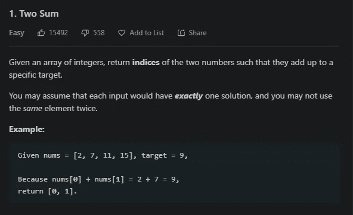
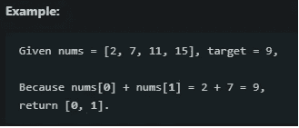
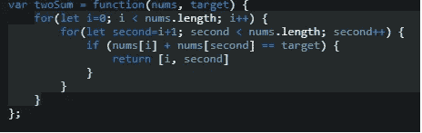

# LeetCode 两个夏季挑战

> 原文：<https://blog.devgenius.io/leetcodes-two-sum-challenge-548683b43cb5?source=collection_archive---------21----------------------->

欢迎来到二和码挑战。

## **说明-**

*给定一个整数数组，返回两个数的索引，使它们加起来达到一个特定的目标。*

*你可以假设每个输入都只有一个解，你可以* ***而不是*** *两次使用同一个元素。*

让我们快速分解这些指令，这里有些重要的东西。

第一部分是不言自明的，但是第二行有一个陷阱。

您可以假设每个输入只有一个解决方案，并且不能两次使用同一个元素

当添加时，可能有多个项目等同于目标。我们只需要担心第一个匹配的。但是，规则规定，在比较项目的总和与目标值时，不能多次引用同一项目的索引。

# 简单来说-

如果数组中的两个元素相加后的值与目标值相同，返回这些元素的索引。这意味着我们希望在进行比较时保留条目索引的引用。

很简单，真的。所以事不宜迟，让我们来解决这个问题。

# 实施-

我在这个挑战中遇到的第一个问题是，我想利用 JS 方法 indexOf()来获取我的项目的索引。问题是 indexOf()只返回匹配该值的第一个索引的索引。

这意味着它不能通过测试，因为它违反了“相同元素两次”的规则。

那么我们该如何解决这个问题呢？

让我们开始编码吧。

我们知道，我们必须遍历这个数组至少一次，才能看到它的所有内容。

我们还知道，我们需要进行第二次循环，将一个项目与整个数组的其余部分进行比较。

突出显示的是我的代码。

我决定使用传统的 for 循环，这样我就可以从启动 for 循环时创建的变量中直接引用我的索引。( ***第一*** 和 ***第二*** )

**注意** -我的 ***第二个*** 变量与我的 ***i*** 变量使用方式不同。它实际上被设置为 ***i*** + 1，这样我可以保证我不会将同一个项目与其自身进行比较。解决“同一个元素出现两次”的问题。

现在我们已经解决了这个问题，让我们来看看条件。

*if(nums[I]+nums[秒] == target)*

所以在这个例子中，如果 2 + 7 == 9(确实如此)

{以数组形式返回计数器变量}

在这种情况下它看起来会像[ ***i*** ，***ii***

差不多就是这样了！我觉得同一个元素法则是一个曲线球，如果你找到了不同的解决方法，请在下面评论！\

我很想看看另一个解决方案，并与我最初的想法进行比较。

我希望这篇文章对你有帮助，谢谢你的阅读！