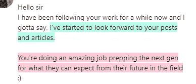
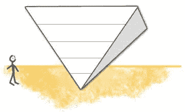
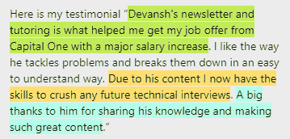

# 来自高级亚马逊云解决方案架构师的经验

> 原文：<https://blog.devgenius.io/lessons-from-a-senior-aws-cloud-solutions-architect-335efaead5ee?source=collection_archive---------1----------------------->

## 如何进入新兴技术，建立一个惊人的职业生涯，导师的好处等等

为了帮助我了解您[请填写此调查(匿名)](https://forms.gle/7MfQmKhEhyBTMDUD7)

作为一名开发人员，你如何取得成功？你能做些什么来确保你总是站在像技术这样不断变化的领域的最前沿？如何过渡到云计算/机器学习/AR/VR/元宇宙/插入新的花式领域？你如何找到最好的网上资源来学习？导师在其中扮演了什么角色？

我与 AWS Nordics(AWS 在丹麦、瑞典和其他斯堪的纳维亚国家的分支机构)的解决方案架构师[穆罕默德·赛义德](https://www.linkedin.com/in/musa/)就这些想法(以及更多)进行了交谈。除了在 Amazon 的工作，他还经常在一些社区和公司活动和会议上发表关于云、架构和云原生软件开发的演讲。在那次谈话中，我将涉及并详述一些最重要的观点。你可以在下面找到完整的未经编辑的对话。

**事实证明，我真的需要努力提高我的镜头表现力**。下次我会更好。但是，如果你可以忽略这一点，对话是惊人的，并收到了很多积极的评论(主要是因为赛义德)。

# 主要亮点

该职位将涵盖以下几点-

1.  新兴技术需要枯燥的技能- 如何进入一个新兴领域？赛义德是云计算的巨人之一。在他那个时代，没有认证，也没有你可以做的云计算个人项目。他是如何进入这个领域的？**通过展示他在基础软件工程方面的技能**。通过展示自己是一名顶级开发人员，他展示了自己构建可伸缩且健壮的解决方案的能力。*当你是一名优秀的开发者时，成为一名优秀的云/虚拟现实/人工智能/元宇宙开发者会容易得多*。
2.  **每个人都应该开始指导-** 赛义德是一位导师(更多关于你以后如何联系他的信息)。他坚信每个人都应该开始指导，不管他们认为自己有多好。我同意。**如果你处于 1 级，你就处于帮助在 0 级挣扎的人的最佳位置**。
3.  **积累知识对软件开发人员来说是必不可少的-** 在我们的谈话开始时，赛义德谈到了有声读物，以及他是多么喜欢听它们。他还说，一旦你认为你可以停止学习，你的职业生涯就结束了。这和我一直在写的东西非常吻合。毫无疑问，这是我能感受到的。
4.  **如何筛选出合适的信息-** 互联网的问题在于，即使你想学习，来源也太多了。并不是所有的都是好的。[我已经在这里报道了多少伟大的创造者通过撒谎机器学习来欺骗他们的观众](https://medium.com/geekculture/the-internet-is-lying-to-you-about-machine-learning-2ea53e952a2d)。赛义德挑选最佳来源的标准很简单——他们必须得到报酬，必须提供退款，还必须有很好的证明。我向你保证我没有贿赂他这么说。我们将讨论我关于寻找最佳资源的建议。

这将是一段美好的时光。让我们开始吧。

# 新兴技术需要枯燥的技能

正如我已经提到的，赛义德在云计算出现之前就进入了云计算领域。你们中的许多人正在阅读这篇时事通讯，同时怀着进入区块链、加密货币、去伪存真、AR/VR、元宇宙和其他类似新领域的愿望。你怎么能这样做？

事实证明驾驭新浪潮需要久经考验的技能。赛义德提到，虽然云确实有很多细微差别，但技术的基本原理与旧的内部解决方案非常相似。类似地，虽然加密看起来非常新奇，但通读货币的历史，你会看到许多类似的系统。对基础知识有很强的理解永远不会让你失望，因为你可以很快转移到新的领域。

请记住我们在本新闻简报中多次提到的 80-20 原则。这对软件工程来说是非常正确的。你会注意到，当我们讨论软件解决方案和成功的程序员/项目分析时。有许多反复出现的想法和主题。这些都是基于基本面的。花时间掌握它们，你将永远不会挣扎着去适应任何情况/环境。所有热门领域都会向你敞开大门。**就像他们在拳击中说的——你可以成为你的刺拳冠军。**

说个题外话，如果有人宣扬什么‘掌握 X 的 7 种方法’，‘如何在 7 个月内成为专家’等。-像躲避瘟疫一样躲避他们。他们是假先知，会浪费你的时间和资源来赚快钱。有一些窍门和技巧可以让你快速掌握特定的东西。但是，这需要一个非常坚实的基础，通过长期不懈的努力来建立。随着时间的推移，只有经过深思熟虑的练习才能掌握基础知识。在我们寻找最佳资源的章节中有更多关于这方面的内容。进入下一部分。

赢得可靠的唯一方法是不断改进和对教育的投资。花了很多时间练习基础知识。

# 每个人都应该指导

赛义德坚信每个人都应该开始辅导。对自己和他人都有很多好处。这里有一些主要的-

1.  指导别人会帮助你更好地理解事情。记住，当你在教一些东西的时候，你也在重新学习它。一旦我开始报道机器学习，我对许多想法的理解就直线上升。
2.  你帮助别人。
3.  你和更多的人建立了关系网，这有很多好处。
4.  你把自己放在那里，被迫发展你的沟通和表达技巧。
5.  你有一些有趣的事情要谈。
6.  你记录你的专业知识。
7.  你可以从别人的经历中学习。

去年，我写了一篇关于写作如何改变我的生活的文章，尽管我没有达到任何传统的成功标准。那时我甚至没有一个货币化的计划。在不到一年的时间里，事情对我来说变得非常不同。**只是想告诉你，当你为一件好事付出时，你最终会有所收获。即使这需要一些时间。**

写作对我来说是一种指导。这显然是有回报的。

赛义德积极参与导师项目。他做了很多演讲，会见了很多人，并与来自世界各地的开发人员进行了一对一的合作。我会在最后留下他的联系方式，你可以联系他。这可能不适合每个人，但可以考虑伸出援手。赛义德是网上最好的导师之一，他可能对你有用。

你不需要成为一个专家来指导人们(记住在我们的领域里，没有这种东西)。你已经经历了挑战，吸取了教训，并通过事情导航。你有过只有你自己才会真正珍惜的人生经历。你的旅程会对其他人有价值。分享出来，你永远不知道你感动了谁。当我开始写作时，我最没想到的是 LinkedIn 的一位分析总监，一位负责数十亿美元项目的 T4，会成为我的读者。如果你想了解更多关于我们的对话，请阅读这个。

 [## 领英分析总监的领导力课程

### 如何管理最高水平的团队？

medium.com](https://medium.com/geekculture/organizational-lessons-from-a-director-of-analytics-at-linkedin-ee11a5f74ca4) 

如果你们谁想过来和我谈谈，我很乐意。只需回复这封邮件，发表评论或通过我的社交媒体链接联系我。我相信你有故事要分享，如果你能和我分享，那将是我的荣幸。如果你想要一些分享你的故事的建议，你知道该找谁。

# 作为软件开发人员，积累知识是关键

我和赛义德产生共鸣的另一点是。赛义德在各个领域宣扬持续教育的重要性。我的写作涵盖金融、故事和‘不相关’的主题的原因是，这样你可以建立一个更完整的画面，而不是只做一个只擅长少数事情的玻璃炮。

赛义德分享了一个非常有趣的知识模型——叫做倒金字塔。这里你挑一个领域深入(AI 为我，云为他)，深入其他强度较低的。这是我一直分享的东西。通过定制你喜欢和感兴趣的领域，你将建立一个独一无二的知识库。那就是你的竞争优势，[你的蓝海](https://codinginterviewsmadesimple.substack.com/p/keys-to-building-a-200-billion-dollar?r=4tnbw&s=w&utm_campaign=post&utm_medium=web)。

作为工程师，我推荐以下你必须了解的主题(技术和非技术)

1.  数学和理论计算机科学
2.  编码
3.  经济和金融
4.  哲学+逻辑
5.  写作。

要了解我推荐的一些资源，以及如何使用它们，请查看我的帖子 [**我是如何在 21 点【周六故事时间】获得 100 美元/小时的报价的**](http://how%20i%20got%20a%20usd%20100/hour%20offer%20at%2021[Storytime%20Saturdays]) **。**

然而，当你开始自学时，你将不得不趟过许多干草去找你的针(好的来源)。让我们接下来讨论这个问题。

# 过滤以找到最佳资源

赛义德有一套很好的标准来寻找最好的资源。正如我已经提到的，**赛义德使用的任何资源都必须付费，他们必须提供退款，他们必须有很好的证明。**是的，[我的简讯](https://codinginterviewsmadesimple.substack.com/)符合所有标准。不，我没有让赛义德给出这些标准。

在寻找最佳资源时，这通常是一个很好的经验法则。给你免费资源的人不会给你详细的定制计划，告诉你如何最好地利用它们，以及你需要关注什么。也就是说，网上惊人的免费资源有很多价值。我在这个 NL 上分享了很多。所以我会对他的标准的第一部分稍作调整。而不是支付，**来源必须有一些在相关领域赚钱的凭据。从长期来看**(骗子获得了惊人的短期回报)。即使我没有从我的文章中赚钱，我也有证据证明我从事过机器学习并交付了成果。任何好的来源都会有相同的。他们会出示收据。

对于那些有兴趣了解更多关于赛义德和他的导师的人- [点击赛义德的 LinkedIn 这里](https://www.linkedin.com/in/musa/)和他多聊聊。如果你想联系我，请使用下面的链接。

更多这样的文章，请查看我的时事通讯[技术采访变得简单](https://codinginterviewsmadesimple.substack.com/)。Tech Made Simple 是寻求在技术领域建立惊人职业生涯的人的最佳资源。它将帮助您概念化、构建和优化您的解决方案。**它涵盖了从系统设计、计算机科学概念和 Leetcode 问题解决的技术方面到网络和职业发展的详细指南的所有内容**。*在一个地方找到你所有的需求，节省你的时间、精力和金钱。* [**使用此处的链接可享受 20%的优惠，优惠期长达一整年**](https://codinginterviewsmadesimple.substack.com/subscribe?coupon=1e0532f2) **。**

我创造了[技术面试，使用通过指导多人进入顶级技术公司而发现的新技术，使面试变得简单](https://codinginterviewsmadesimple.substack.com/)。时事通讯旨在帮助你成功，避免你在 Leetcode 上浪费时间。**我有一个 100%满意的政策，所以你可以尝试一下，不会有任何风险。[您可以阅读常见问题解答，并在此了解更多信息](https://codinginterviewsmadesimple.substack.com/p/faqs-and-about-this-newsletter?r=4tnbw&s=w&utm_campaign=post&utm_medium=web)**

如果你也有任何有趣的工作/项目/想法给我，请随时联系我。总是很乐意听你说完。

以下是我的 Venmo 和 Paypal 对我工作的金钱支持。任何数额都值得赞赏，并有很大帮助。捐赠解锁独家内容，如论文分析、特殊代码、咨询和特定辅导:

https://account.venmo.com/u/FNU-Devansh

贝宝:[paypal.me/ISeeThings](https://www.paypal.com/paypalme/ISeeThings)

# 向我伸出手

使用下面的链接查看我的其他内容，了解更多关于辅导的信息，或者只是打个招呼。另外，查看免费的罗宾汉推荐链接。我们都得到一个免费的股票(你不用放任何钱)，对你没有任何风险。所以不使用它只是在损失免费的钱。

查看我在 Medium 上的其他文章。https://rb.gy/zn1aiu

我的 YouTube:[https://rb.gy/88iwdd](https://rb.gy/88iwdd)

在 LinkedIn 上联系我。我们来连线:[https://rb.gy/m5ok2y](https://rb.gy/f7ltuj)

我的 insta gram:【https://rb.gy/gmvuy9 

我的推特:【https://twitter.com/Machine01776819 

如果你正在准备编码/技术面试:[https://codinginterviewsmadesimple.substack.com/](https://codinginterviewsmadesimple.substack.com/)

获得罗宾汉的免费股票:[https://join.robinhood.com/fnud75](https://join.robinhood.com/fnud75/)