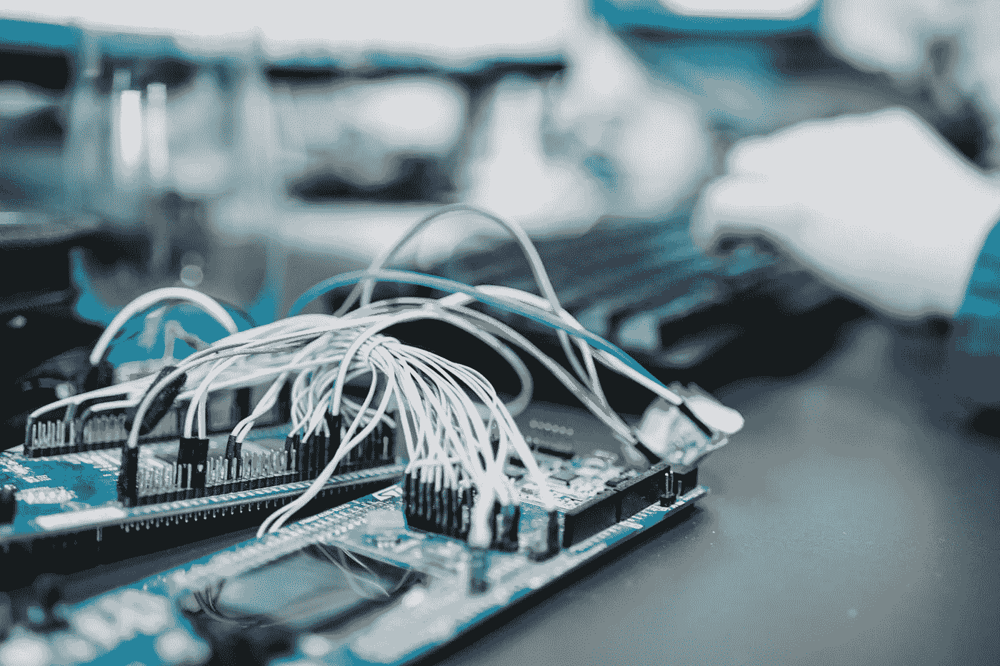

# 我从零开始开发物联网项目中学到的经验

> 原文：<https://blog.devgenius.io/lessons-i-learned-from-developing-an-iot-project-from-scratch-bdc7a05af4c4?source=collection_archive---------19----------------------->

我正在做一个物联网项目。我在我的项目中使用医疗物联网设备。

Unsplash 上 Zan 的照片

这些是我从这个项目中学到的经验:

**人脉**:你必须知道网络是如何运作的。您必须对 TCP 和 UDP 等网络协议有很好的了解。如果你将使用具有多个网络接口的物联网设备，你必须了解 CIDR。一些物联网设备使用不同的技术，如蓝牙和串口(COM)进行数据传输。此外，还有 LPWAN 等物联网专用网络技术。

**数据结构**:物联网设备使用不同的数据结构。由于资源有限，他们倾向于压缩数据和发送/接收小数据。一些转换为物联网的旧设备使用奇怪的方法处理数据。所以你必须知道字节序，有符号和无符号的数字和编码。物联网设备可以产生大数据。设计您的系统来保存和处理大数据。

**并行处理**:异步编程有利有弊。每种情况都是不同的，没有真正的解决方案。它不是银弹。你必须知道进程和线程的区别，调试和跟踪异步函数。

构建嵌入式软件现在比以前更容易了。你可以很容易地用 Arduino，Raspberry Pi 和许多其他平台构建一个特定的解决方案。我找不到符合我需求的物联网设备。所以我决定开发一个。有大量关于 Arduino 的信息。我用 Arduino 在 3 天内实现了一个物联网解决方案。

**加密**:不仅仅是为了保密需要。它还用于用户认证和检查数据消息的完整性。对加密有基本的了解就足够了。它有太多的工具和库。

**构建一个模拟设备**:我当时在做一个医疗物联网设备(除颤器)。准备该设备和配置设置有时需要一个小时。所以我做了一个模拟设备，完全是一个模拟这个设备的软件。我使用这个模拟设备有很多原因:流量监控、安全和完整性检查，但主要是为了在会议中演示。我们只有一个设备，但是不止一个开发人员可以同时在模拟设备上工作。

**尽可能使用同一台设备**:编辑一个配置，boom！什么都没用！关于物联网设备的文档不是最新的。在更改配置或物联网设备何时会按预期工作时，不要做任何假设。测试一下！

你会处理很多线缆、三插头、电池、螺丝刀、wi-fi 设备、SD 卡、u 盘。

当一切按预期运行时，使用物联网设备很有趣:)

原帖:[https://www . SaaS command . com/2020/06/lessons-I-learn-from-developing-IOT . html](https://www.saascommando.com/2020/06/lessons-i-learned-from-developing-iot.html)