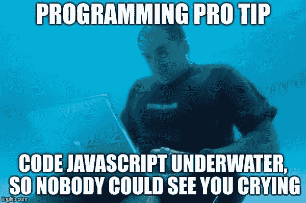
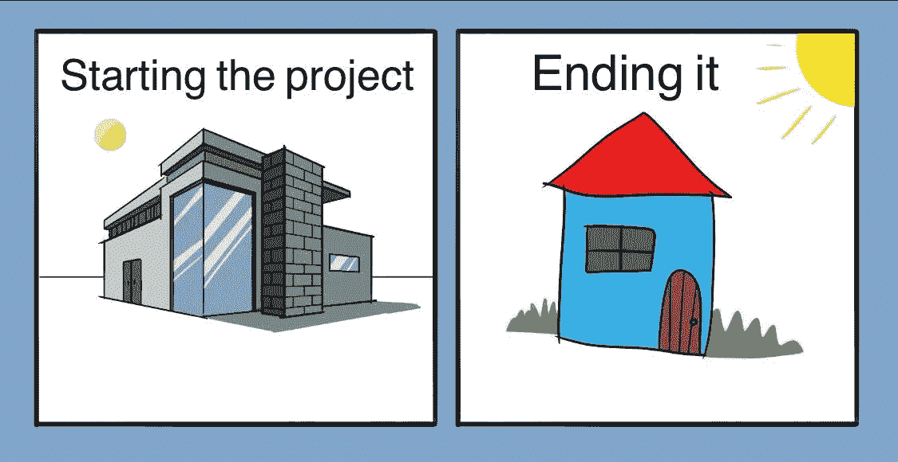
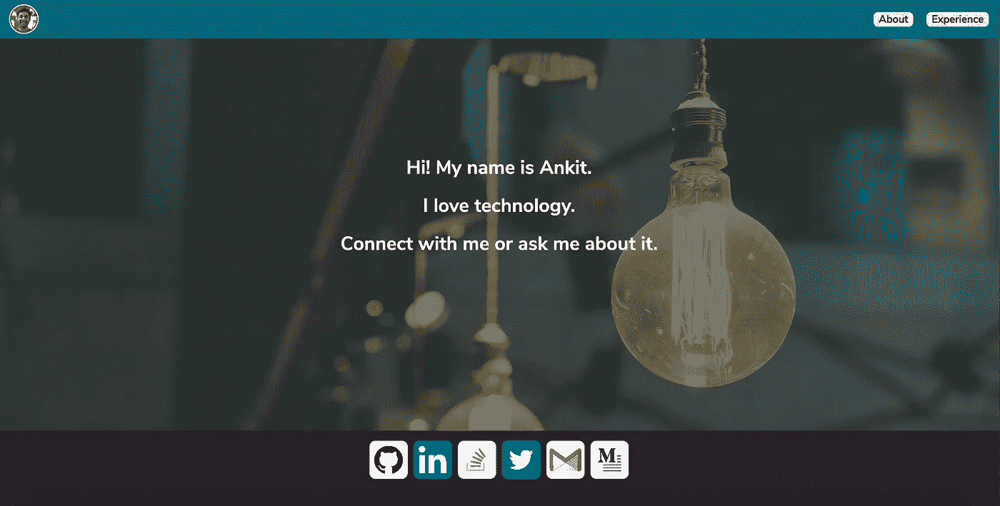

# 建立个人网站的经验教训

> 原文：<https://blog.devgenius.io/lessons-learned-building-a-personal-website-58ad1a9f91d3?source=collection_archive---------40----------------------->

或者如何不花 10 个月时间不做事

戈兰·艾沃斯在 [Unsplash](https://unsplash.com?utm_source=medium&utm_medium=referral) 上的照片

我在谷歌发布的第一个小时就买下了域名 [ankitsharma.dev](http://www.ankitsharma.dev) 。2019 年 2 月开发域名，目标是将其用作我的个人网站。虽然我的主要兴趣是应用程序开发，但我认为这将是一个学习 web 开发并拥有一份可以维护和更新的在线简历的好机会。

起初，我对其他开发者在他们的在线投资组合中放了什么做了一些研究。我遇到了一些非常好的具有很多功能的投资组合，这些功能可能会花我几个月的时间来构建。如果我真的对 web 开发感兴趣的话，这可能会很棒，但是由于一些无法解释的原因，我就是无法让自己爱上 JavaScript。可能是===和==不一样。(如果你感兴趣，有大量的文献描述了 JavaScript 的古怪之处。[读到这里](https://charlieharvey.org.uk/page/javascript_the_weird_parts)。)但它从未像我早年的 C/C++那样召唤过我。最近，我很喜欢写科特林和达特。对我来说，即使是充满谬误和冗长的 Java 也没有 JS 那么令人困惑。反正我跑题了。

在做了一些简单的研究后，我想出了一个惊人的主意，关于我如何制作这个网站。整个网站将像一个故事一样流动，看我网站的人将不得不使用他们的键盘和鼠标来玩游戏，以了解更多关于我的旅程。尽管这是一个伟大的想法，但我可能要花上几个月甚至更多的时间来学习所有必要的技能。编程、设计、动画、交互性、图形等等。

然后我开始寻找像 WordPress、Wix 这样的解决方案(现在有一百多个)。他们给你工具。你添加图片和文字，瞧，你有一个网站。我见过很多人使用这些工具，创造出非常漂亮的投资组合。然而，作为一个主要的软件构建者，对我来说，不构建自己的东西是不对的。

我花了近 8 个月的时间试图推迟做任何事情，因为我想建立一个完美的投资组合，因为我不喜欢 JavaScript，我也没有在空闲时间学习任何关于 web 开发的知识。这一年结束了，我的投资组合还有 0 行代码。

完美地抓住了我所有的副业

我想建造这个美丽的东西，但是，我什么也没有建造。我决定转向。我打算做一个最简单的网页，而不是建立一个漂亮的网站。一个普通的 HTML/CSS 静态网页。

我听到你在尖叫。

*你说真的？现在是 2020 年，你的网页使用 HTML/CSS。没有 JS？亵渎神明！！！！！！*

是的，链接将在中结束。但它将会是。我决定参加一个关于 HTML/CSS 的 Udemy 课程。我在一个月内完成了那门课程，并开始制作我的简单网页。我没有使用 Sketch 或 Figma 之类的工具，这需要我花一些时间来学习，而是使用笔和纸来绘制我希望网页在桌面/移动设备上的外观。我在几周内就有了一个可行的解决方案，它在桌面和移动设备上都有响应。我使用 Google Cloud 来托管 HTML 文件，并编写了一个小的 Golang 脚本来服务 HTML 页面。这是登录页面的外观。

这是它在移动设备上的外观。

在这个过程中，我学到了最重要的产品设计课程。

> 发布比完美更好

我学到的另一件事是，你不总是需要最好的解决方案来完成你的工作。
如果你在一个副业项目上没有取得进展，问问自己，有没有一个*更简单的解决方案可以让你先开始工作？*

我已经在麻省理工学院的许可下开源了 [*组合代码*](https://github.com/anklinuxboy/Portfolio) 。你可以随意调整它。GitHub 自述文件还列出了我在 Google Cloud 上托管它的步骤。我唯一要求你的是，如果你真的要用它，请发微博给我，地址是[*@ kitlovestech*](http://twitter.com/kitlovestech)！

编码快乐！👨🏽‍💻🤘