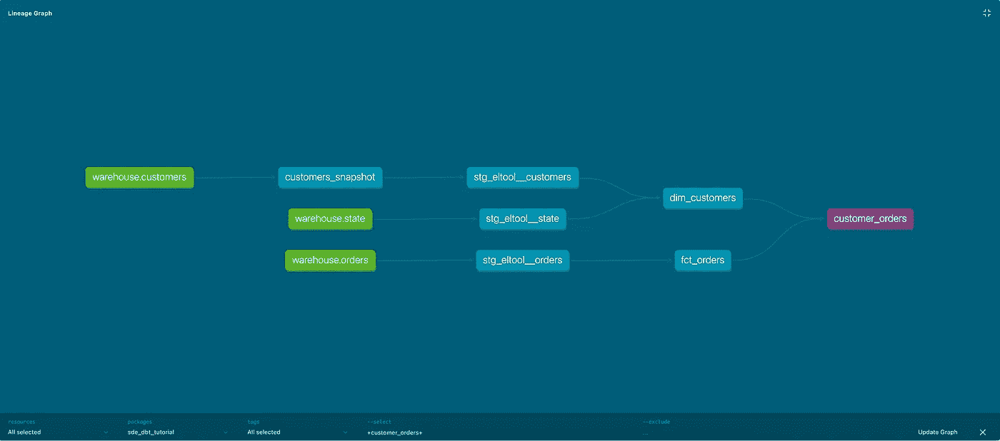

# 经验教训:加入已经使用 dbt 的组织

> 原文：<https://blog.devgenius.io/lessons-learnt-joining-a-organisation-already-using-dbt-738fa2d3f8bf?source=collection_archive---------7----------------------->

我和我的一些数据朋友谈论了 dbt，我整理了一个清单，供曾经是我的人学习使用 dbt 的经验。

目标是提供我对如何在让您开始运行和开始为您的 dbt 项目做贡献之间取得平衡的想法，同时也了解我认为作为一名 dbt 用户的良好实践者的基本要素。

成为一个好的 dbt 用户将减少修复本可以避免的事情，并有助于将来更好的实践(称为技术债务)。

使用 dbt 的重点是使数据可靠、可访问和可用。

# **第一课:完成入职 dbt 文档**

如果一个组织已经在使用 dbt，那么应该有入职文档。这通常可以在你的自述文件中的 Git Repo 中找到，类似于 Confluence。

**他们应该涵盖以下内容:**

*   如何设置您的 dbt 项目—背景
*   在您的笔记本电脑上设置 dbt
*   要安装哪个 dbt 版本
*   最终目标应该是期望做一个`dbt debug`，或者`dbt run`

在经历它之后，你应该能够准备好去！

# **了解幕后**

dbt 项目报告本质上是一个文件列表，它将源数据转换为报告数据。重要文件如下:

*   [profiles.yml](https://docs.getdbt.com/reference/profiles.yml) —连接您的数据仓库
*   [dbt_project.yml](https://docs.getdbt.com/reference/dbt_project.yml) —设置目录并在您的 dbt 项目中工作
*   [packages.yml](https://docs.getdbt.com/docs/building-a-dbt-project/package-management) —可以在项目中重用的代码
*   [sources.yml](https://docs.getdbt.com/docs/building-a-dbt-project/using-sources) —命名并描述加载到仓库中的数据

有必要了解每个。yml 文件以及它们如何一起工作。如果您是使用 dbt 的新手，那么了解这些文件是很有价值的。

# **使用 dbt 进行调试**

在我的整个职业生涯中，如果你在寻求他们的支持之前试图解决问题，人们会更欣赏你。

1.  谷歌错误信息
2.  如果运气不好，寻找文档，这包括 **:** dbt 文档，dbt Slack，在线论坛 Google。
3.  询问最近加入的人可能是值得的，因为他们以前可能遇到过同样的问题。

# **花些时间学习 dbt 基础课程(约 5 小时)**

如果你以前没有使用过 dbt，这是一个很好的开始——[链接此处](https://courses.getdbt.com/collections)这将帮助你快速掌握 dbt。

我会经历以下情况:

*   物化如何工作
*   测试如何工作
*   模型和部署
*   jinja 如何工作——如果你需要使用它！

根据您的数据团队，dbt 功能的一些内容可以跳过，例如:种子文件、快照、dbt 云在我工作过的组织中没有使用。

如果你想通过 dbt 认证，你可以把一些内容放在一边，然后回去学习。

学习基础课程将扩大你的工具箱！

# **阅读公司 dbt 风格指南**

通常，许多数据团队都同意我们是否应该有一致的风格，我们应该做什么，不应该做什么。数据团队采用 dbt-labs 指导的基本 dbt 风格。

风格指南的好处是，很多时间都浪费在讨论如何格式化代码上，而注意力应该放在实际的代码上。

风格指南应在入职文档中包括以下内容:

*   模型应该如何命名
*   模型应该如何存储

如果您的组织更先进，可能会实现 [dbt 预提交](https://docs.getdbt.com/blog/enforcing-rules-pre-commit-dbt)或 [SQL Fluff](https://www.sqlfluff.com/) 。这些工具允许 dbt 评审者关注代码而不是代码的格式化方式。

# **了解您将与之合作的主要型号**

根据您将从事的业务领域，了解 dbt 模型如何工作是值得的。

这将有助于调试模型，改进模型。

我建议查看来自`dbt docs serve`和`[dbt docs generate](https://docs.getdbt.com/reference/commands/cmd-docs#dbt-docs-generate)`的 dbt DAGs

# 摘要

我们浏览了入门文档、如何设置 dbt 项目、在 dbt 中调试、dbt 基础课程、dbt 风格指南以及了解模型。还有更多的要掩盖，但随着时间的推移，这些应该会把所有的信息拼凑在一起。

最后但同样重要的是，理解你所交付的工作的附加值是值得的。

什么是客观的关键结果(OKR)，我在 dbt 工作过，可以提供以下内容:

*   要捕捉的新产品特性
*   为数据目录和文件做出贡献
*   数据报告的监管要求
*   节省优化模型的成本

# 玩得开心，享受学习过程！

我将分享更多我的经验中关于 dbt 技巧的信息。

你可以在这里找到我，或者你可以留下评论，我会尽快回复你。