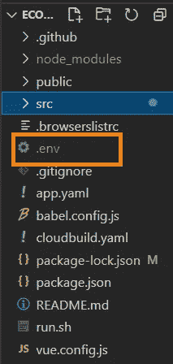

# 让我们在 Vue.js 中为我们的电子商务应用程序添加一个结账功能

> 原文：<https://blog.devgenius.io/lets-add-a-checkout-feature-in-vue-js-for-our-ecommerce-app-84b5fc2df17a?source=collection_archive---------1----------------------->

在本教程中，我们将学习如何在演示电子商务应用程序中使用 Stripe 在 VueJs 中集成支付网关


# 介绍

我们正在从头开始构建一个电子商务应用程序，前端使用 Vue.js，后端使用 Java 和 Springboot。你可以在这里查看这个系列的第一个前端教程。

[](https://javascript.plainenglish.io/lets-create-vue-js-frontend-for-products-in-our-e-commerce-app-14cc8c3459c8) [## 让我们用 Vue.js 为我们的电子商务应用程序创建一个前端

### 我们正在从头开始构建一个完整的电子商务应用程序。今天，我们将添加产品功能。

javascript.plainenglish.io](https://javascript.plainenglish.io/lets-create-vue-js-frontend-for-products-in-our-e-commerce-app-14cc8c3459c8) 

支付网关是电子商务应用程序的重要功能。在上一个教程中，我们使用 Spring Boot 和 Stripe 集成了一个支付网关。现在，我们将构建它的前端部分，如接受购物车商品和卡的细节。

> 如果你想参考支付网关的后端部分，请使用下面的链接。

[](https://medium.com/javarevisited/lets-add-a-checkout-feature-in-spring-boot-for-our-ecommerce-app-72b12a7f3648) [## 让我们在 Spring Boot 为我们的电子商务应用程序添加一个结账功能

### 在本教程中，我们将学习如何在我们的演示电子商务应用程序中使用 Stripe 来集成 Spring Boot 的支付网关

medium.com](https://medium.com/javarevisited/lets-add-a-checkout-feature-in-spring-boot-for-our-ecommerce-app-72b12a7f3648) 

# 现场演示

https://infallible-swartz-b50174.netlify.app/


结帐演示 gif

你可以在 [Github](https://github.com/webtutsplus/ecommerce-vuejs) 找到完整的代码。

# 先决条件

1.  关于 **Vuejs** 的知识
2.  [Visual Studio 代码](https://code.visualstudio.com/) **—** 开源(推荐)
3.  一个好的浏览器 **—** (Chrome —推荐)

# 我们将使用的 API


## getCartItems:

这是一个 get 方法，我们将使用它在一个数组中存储购物车商品，这样我们就可以使用 Axios 将它作为请求体传递给我们的后端 API。


## checkoutList:

这是一个 post 方法，作为一个响应体，我们将把购物车商品的数组传递给它。该方法负责生成会话 id。


如果购物车包含这两种产品，则发布主体


我们获得会话 id 作为响应

## 下单:

这是一个 post 方法，如果支付成功，我们将使用它在我们的数据库中的订单表中添加订单。因此，作为 Axios post 方法的参数，我们将传递登录用户的令牌和生成的会话 id。


我们将会话 id 和令牌作为参数传递，如果支付成功，订单就会被发出

# 项目结构


# 种类

Stripe 是处理在线支付的最佳方式之一，最近他们发布了 Stripe 元素。 [Stripe Elements](https://stripe.com/elements) 是其预建的 UI 组件库，可帮助您轻松创建自己的结账流程。现在，为您的应用程序设置自定义支付表单比以往任何时候都更容易。

在本教程中，我们将使用 [Stripe.js](https://stripe.com/docs/js) 来创建[支付网关](https://stripe.dev/stripe-java/index.html)。

首先，我们需要自己的条纹测试 API key。因此，继续操作，在 stripe 上创建一个帐户,然后从控制面板获取 API 密钥以进行测试。将密钥存储在环境变量中。为此:

**在源文件目录下创建一个扩展名为`.env`的文件**



在这个文件**中创建一个变量**来存储 API 密匙。

将变量命名为`VUE_APP_VARIABLENAME=YOURAPIKEY`。

# 教程的流程

> 必需数据变量的声明
> 
> 条纹的安装
> 
> 条带元素的初始化和配置
> 
> 实现获取购物车商品的方法
> 
> 实现将购物车物品传递给后端 API 方法，并接收会话 id 作为响应
> 
> 根据条纹支付的状态将用户导航到成功或失败支付组件

# 现在让我们编码

创建一个名为 Checkout 的文件夹，并在该文件夹中创建一个名为 Checkout 的 vue 文件，该文件将保存支付网关的前端逻辑。


结帐组件

# 1.数据变量的创建

`stripeAPIToken`:存储 API 密钥

`stripe`:条纹元素

Stripe Element 是一个包含各种元素的组件集合，您可以使用这些元素来创建结帐表单，如按钮和用于收集用户信息的输入。我们要关注的是卡片元素。card 元素允许您在一个元素中收集所有的卡信息。它包括一个动态更新的卡品牌图标，以及电子邮件，到期，CVV，国家名称，持卡人姓名的输入。

`token`:存储用户的令牌

`sessionId`:按条带存储生成的 sessionId

`checkoutBodyArray`:我们将被发送到后端 API 的响应体

# 2.条纹的安装

Stripe 元素是`Stripe.js`的一部分，因此我们需要通过使用`includeStripe` 方法(我们将进一步实现)来包含脚本，我们将脚本源 URL 传递给该方法，由于`includeStripe` 是一个回调函数，我们将调用我们将在前面实现的`configureStripe` 方法。那么我们什么时候把这个方法叫做`includeStripe` 方法呢？当组件被渲染时，我们初始化这个方法。

也就是说，在`mounted` 方法中，我们调用这个函数。

> 我们正在绑定它，这样我们就可以在回调中访问本地组件的方法，并且一旦所有东西都被加载了，我们就调用 configureStripe。我们还没有实现，但这是下一步！这是我们的回调方法，它将在组件内本地设置 Stripe。

此外，当用户从购物车页面单击确认订单时，将呈现这个`checkout` 页面。如果你想看一看，你可以参考这个。因此，当用户点击确认订单时，我们调用`cart` 组件中的`checkout`方法，其中我们使用路由器方法将用户导航到`Checkout` 组件。对于这个路由器方法，我们传递 params id 作为购物车的大小(购物车中的商品数量)。

```
checkout(){ 
this.$router.push({ name: ‘Checkout’,params:{id:this.len}}) 
}
//from the Cart.vue
```

> 现在，我们为什么要传递参数 id？

当且仅当用户点击`confirm order button`时，我们传递 id 以检查`checkout` 页面是否被调用。假设用户在某个其他页面上，比如产品页面，并且从那里他通过在 URL 中显式地提及来导航到结帐页面，用户将不能这样做，因为默认情况下 id 将被作为未定义的来传递。在`Checkout`组件的`mounted` 方法中，我们首先检查 id 是否是有效的数据类型(在这种情况下，它应该是字符串，因为我们在`Cart`组件的 router 方法中将 id 作为参数传递),然后我们只呈现`Checkout` 组件。

如果 id 未定义，即用户试图导航至`checkout` 页面而未确认订单，则他将被重定向至`Home` 页面。此外，如果购物车为空，则确认订单按钮被禁用，但如果用户试图通过在 URL 中明确提及来导航到`checkout` 页面，则用户仍将被导航到`Home` 页面，因为在这种情况下，传递给`Checkout` 组件的 id 也将是未定义的。

因此，从`Cart`组件传递 params id(购物车的大小),以确认用户是否通过确认订单导航到`Checkout` 组件。

# 3.条带元素的初始化和配置

> 动态包含 Stripe.js

## 3.1 包括条纹:

它将创建一个脚本标签，加载我们的 Stripe javascript 文件，并将其添加到我们的应用程序的头部。这个方法接受两个参数，一个是我们动态加载的文件的 URL，它将是 Stripe JS 文件，另一个是在文件加载时运行的回调函数。

现在，当我们正确加载文件后，我们将进行回调，条带将被配置。

> 配置条带元素

## 3.2 **配置条纹:**

还记得在`mounted` 方法中我们调用了`includeStripe`方法，然后作为回调函数我们调用了`configureStripe`方法，它负责为特定的支付会话创建 Stripe 对象。

我们之前声明为数据变量的`stripe`将包含我们加载的 Stripe JS API 中的`Stripe`对象的本地实例。

# 4.实现获取购物车商品的方法

首先，我们需要将购物车中的商品存储在一个数组中，并声明为一个名为`checkoutBodyArray`的数据变量。

> 那么，我们希望如何在数据变量中存储购物车商品呢？

由于 post API，我们在[之前的](https://medium.com/javarevisited/lets-add-a-checkout-feature-in-spring-boot-for-our-ecommerce-app-72b12a7f3648)教程中实现需要购物车物品列表作为请求体，我们将购物车物品存储在`checkoutBodyArray`中。

## 获取购物车商品

我们实现了`getAllItems`方法，该方法调用 get API /cart，该 API /cart 返回购物车中的商品作为响应。因此，我们将这个响应存储在`checkoutBodyArray`中，并将这个数组作为请求体传递给结账后端 API。

我们在 mounted 方法中调用`getAllItems` 方法，因为我们希望在呈现 Checkout 组件时获取购物车商品。**所以在我们之前实现的 mounted 方法中调用这个方法。**

# 5.实现将购物车物品传递给后端 API 方法

## 将购物车商品传递给后端 API

现在，由于我们在`checkoutBodyArray`中有购物车条目，我们需要将它传递给 post 方法。所以我们实现了调用 Axios post 的函数`goToCheckout`。在将购物车商品数组传递给后端 API 之后，我们获得会话 id 作为响应。

因此，我们将会话 id 存储在本地存储中，然后调用 Stripe 的`redirectToCheckout`方法，在该方法中，我们将从响应数据中收到的会话 id 存储在我们的`sessionId`中，这将把用户重定向到 Stripe 托管的页面，以安全地收集支付信息。当用户完成购买后，他们会被重定向回我们的网站。

这是条纹结帐页面的外观


# 6.根据条纹支付的状态将用户导航到成功或失败支付组件

在这里，我们处理付款的结果，即如果付款成功，我们将订单添加到订单表中，如果付款失败，我们将不添加该订单，并将用户导航到订单历史页面。

那么支付的结果在哪里处理呢？我们没有在前端定义它，所以如果你还记得的话，在[之前的](https://medium.com/javarevisited/lets-add-a-checkout-feature-in-spring-boot-for-our-ecommerce-app-72b12a7f3648)后端教程中(更准确地说是在`OrderService`类中)我们定义了如下的`success URL`和`failure URL` 。

```
SessionCreateParams params = SessionCreateParams.*builder*()
        .addPaymentMethodType(SessionCreateParams.PaymentMethodType.*CARD*)
        .setMode(SessionCreateParams.Mode.*PAYMENT*)
        .setCancelUrl(failedURL)
        .addAllLineItem(sessionItemsList)
        .setSuccessUrl(successURL)
        .build();
```

并且 `failedURL` 和`successURL` 被定义为

```
String successURL = baseURL + "payment/success";
String failedURL = baseURL + "payment/failed";
```

baseURL 是我们正在开发的[前端 Vuejs URL](http://localhost:8081/) 。

> 根据条纹支付的状态将用户导航到成功或失败支付组件

首先，我们需要在源目录中创建一个名为`helper` 的文件夹，并在该文件夹中创建另一个名为`payment`的文件夹。在这个文件夹中创建两个 vue 组件`Failed.vue` 和`Success.vue`。


文件夹结构

## 支付成功组件

因此，在成功组件中，我们创建了**数据变量**令牌和会话 id，并定义了一个**方法**来**将当前订单保存**到我们的数据库中。

所以在`saveOrder` 方法中，我们使用后端 API /order/add

我们将在下一篇教程中讨论这个问题。

要了解 API 的作用，请参考上面的 API 描述:

成功后，我们将用户重定向到订单历史组件，在那里可以看到当前订单和旧订单。


## 支付失败组件

在该组件中，我们从本地存储中删除会话 id，并且不将该订单保存在订单表中。最后，我们仍然将用户导航到订单历史页面，但在这里当前订单不可见，但以前的订单将可用。

# 恭喜你！！！

您已经使用 Vuejs 和 Stripe 成功实现了支付网关的前端部分。你可以在 [Github](https://github.com/webtutsplus/ecommerce-vuejs) 找到完整的代码。