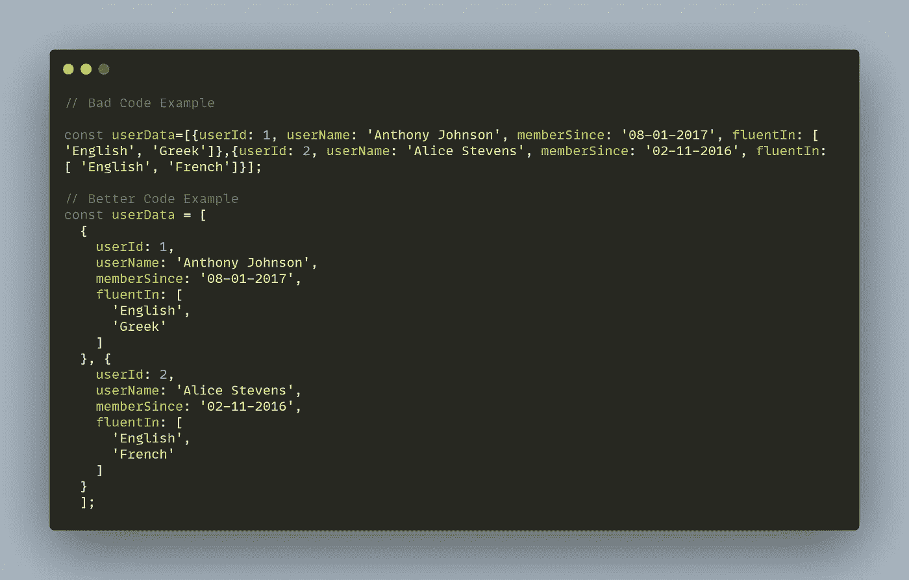
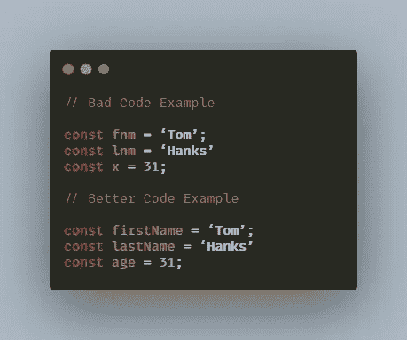
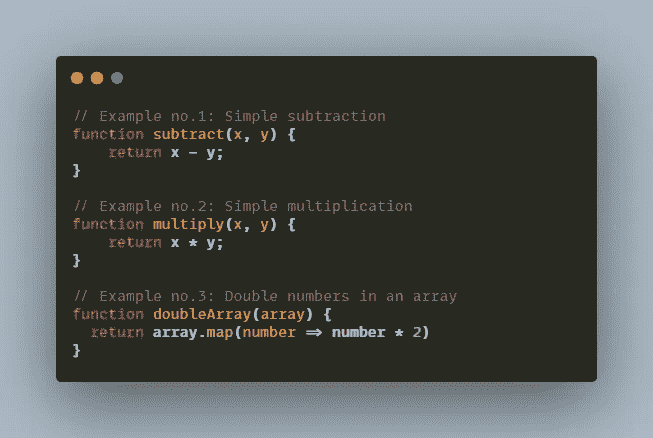

# 让我们养成保持代码整洁的习惯

> 原文：<https://blog.devgenius.io/lets-adopt-a-habit-to-keep-our-code-clean-5a9f9c73315?source=collection_archive---------9----------------------->

## 点睛之笔可以让你完美！

编写干净的代码不是一项简单的任务。问题是，在这个问题上有许多实践、技巧和任务，这往往令人不知所措。因此，开发人员通常很难选择那些值得遵循的技巧和实践。

摄影:Unsplash.com

> 不要因为忘记擦眼镜就说世界脏！
> 
> —艾伦·希尔

让我们简化这个任务。在这个测试中，我们将首先讨论编写干净代码的一些好处。然后，我们将跳转到一些技巧，或实践，来编写干净的代码，使之成为一个好习惯。

# 主要优势:

最大的好处之一是干净的代码帮助我们最大限度地减少时间。我们愿意花时间阅读并尝试了解代码。混乱的代码有一种不可思议的能力，可以阻碍任何开发人员，让他们的工作更加困难。

编写干净代码的另一个优势与主要优势密切相关。它允许更容易和更快的采用。我的意思是这样的！比方说，我们想雇用另一名开发人员。她要花多长时间才能知道密码并找到破解方法？看情况。如果我们的代码很乱，写得很差，她将需要更长的时间来督促它。另一方面，如果我们的代码是干净的、可读的、可理解的和简单明了的，她将准备好更快地开始。

现在，一旦我们讨论了编写干净代码的好处，是时候找出一些可以帮助我们的技巧了。

# 为人类写作:

我们写的代码会被机器解释。然而，它会被人类阅读和改进。因此，写出难以置信的漂亮、令人印象深刻、吸引人和可读的代码。

缩进的例子——使代码对人们可读

# 使用有意义的名称:

有意义的名字具有足够的描述性，使得其他开发人员能够理解变量、函数或对象的目的。

对变量、函数和方法使用有意义的名称

# 一个功能中的一个任务:

让每个**函数**只执行一个任务。这可能会使您的函数变得更小，并提高您在实现特定功能时的专业化程度，从而提高调试该函数的能力。

> 这种让每一个功能或方法只执行一个任务的实践被命名为 [**单一责任原则**](https://en.wikipedia.org/wiki/Single-responsibility_principle) **。**
> 
> —介绍人 [**罗伯特·马丁**](https://en.wikipedia.org/wiki/Single-responsibility_principle) **。**

一个功能或方法只执行一项任务(单一责任原则)

无论你多么努力地想写出可读的代码，有时你应该在代码中插入一些注释来阐明原因，让你的代码更容易理解。

# 一致性是关键:

选择一组编码实践，然后在你的项目中坚持这些实践。回到旧代码并从停止的地方继续会容易得多。如**缩进**、**命名样式**、**文件结构化**、**、**等。

# 检查您的代码:

当你写代码时，如果你想让它保持最佳状态，你就要定期更新它。你应该每天回顾它，清理它，并改进它。

# 关键要点:

最后，一开始看起来有点力不从心，但要一步一步来。适应它，然后做下一个。使用渐进的方法来培养**编写更干净代码的习惯。**

这些有用的提示和实践使得我们的代码**更清晰**、**可读性更强**、更容易理解以及**更简单**。没有必要实现所有这些实践。只实施和遵循一两个就足以带来积极的结果。

***希望你喜欢，感谢每一个抽出时间来阅读它的人*** *。这里是我写的一些更有趣的文章，我相信你会喜欢的。*

 [## JavaScript 中应该用 map()还是 forEach()。

### 了解何时使用哪种类型的数组方法

medium.com](https://medium.com/javascript-in-plain-english/should-i-use-map-or-foreach-in-javascript-af9da3b4adc3)  [## 九个强有力的提醒让你的生活步入正轨。

### 回到你生活中的时刻。

medium.com](https://medium.com/age-of-awareness/nine-powerful-reminders-to-keep-your-life-on-track-6996253ec742) 

继续学习！

快乐的编码👩‍💻