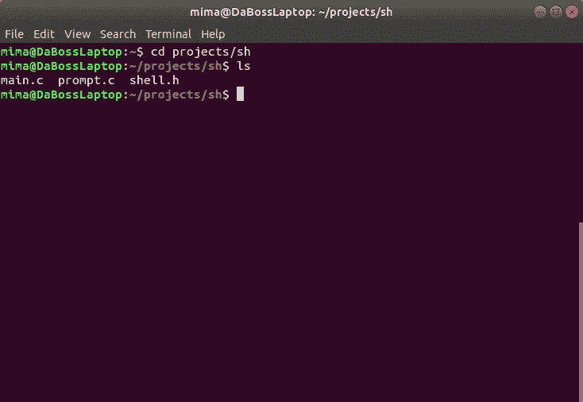
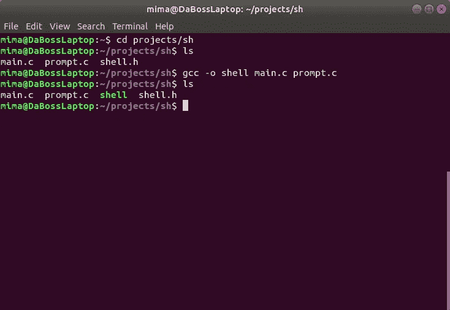
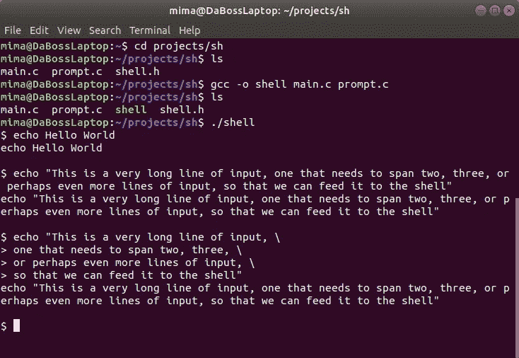
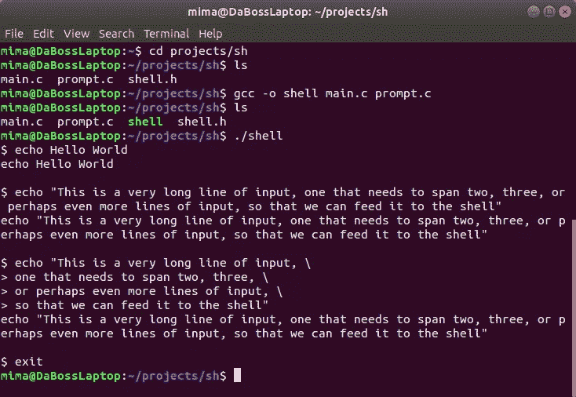

# 让我们构建一个 Linux Shell —第一部分

> 原文：<https://blog.devgenius.io/lets-build-a-linux-shell-part-i-954c95911501?source=collection_archive---------1----------------------->


在 [Unsplash](https://unsplash.com?utm_source=medium&utm_medium=referral) 上 [Sai Kiran Anagani](https://unsplash.com/@_imkiran?utm_source=medium&utm_medium=referral) 拍摄的照片

自 Unix 早期以来，shell 一直是用户与操作系统交互的重要部分。第一个 Unix shell([Thompson shell](https://en.wikipedia.org/wiki/Thompson_shell))的功能非常有限，主要是 I/O 重定向和命令管道。后来的 shell 在早期 shell 的基础上进行扩展，增加了越来越多的功能，这些功能包括单词扩展、历史替换、循环和条件表达式等等。

# 为什么是这个教程

在过去的 20 年里，我一直使用 GNU/Linux 作为我的主要操作系统。我用过很多 GNU/Linux shell，包括但不限于 **bash** 、 **ksh** 和 **zsh** 。然而，我一直被这个问题所困扰:*是什么让壳滴答作响？*喜欢，例如:

*   shell 如何解析我的命令，将它们转换成可执行指令，然后执行这些命令？
*   shell 如何实现不同的单词扩展过程，比如参数扩展、命令替换和算术扩展？
*   shell 是如何实现 I/O 重定向的？
*   …等等。

由于大多数 GNU/Linux shell 都是开源的，如果您想了解 shell 的内部工作原理，您可以在网上搜索源代码并开始钻研(我实际上就是这么做的)。但这个建议其实说起来容易做起来难。例如，您应该从哪里开始阅读代码呢？哪些源文件包含实现 I/O 重定向的代码？哪里可以找到解析用户命令的代码？我想你明白了。

这就是为什么我决定写这篇教程，来帮助 Linux 用户和程序员更好地理解他们的 shells。我们将一起从零开始实现一个全功能的 Linux shell，*。*在这个过程中，我们将看到 Linux shell 如何通过实际编写完成上述任务的 C 代码来解析和执行命令、循环和条件表达式。我们将讨论单词扩展和 I/O 重定向，并且我们将看到执行特性的代码。

在本教程结束时，我们将有一个基本的 Linux shell，它现在不会做太多，但我们将在接下来的部分中扩展和改进它。在本系列的最后，我们将拥有一个全功能的 Linux shell，它可以解析和执行一组相当复杂的命令、循环和表达式。

# 你需要什么

为了完成本教程，您需要以下内容:

*   一个正常工作的 GNU/Linux 系统(我个人用的是 [Ubuntu](http://ubuntu.com/) 和 [Fedora](http://fedoraproject.org/) ，不过可以随意使用你喜欢的 Linux 发行版)。
*   [GCC](https://gcc.gnu.org/)(GNU 编译器集合)来编译我们的 shell。
*   一个文本编辑器来编写代码(我个人使用 [GEdit](https://wiki.gnome.org/Apps/Gedit) ，但是你也可以使用 [Vim](https://www.vim.org/) 、 [Emacs](https://www.gnu.org/software/emacs/) ，或者任何其他编辑器)。
*   如何用 c 编程？

在这里，我不打算深入讨论安装所需软件的细节。如果您不确定如何让您的系统运行以上任何软件包，请参考您的 Linux 发行版的文档，并确保您在继续下一步之前已经设置好了一切。

现在让我们言归正传。我们将从鸟瞰 Linux shell 的组成开始。

# Linux Shell 的组件

外壳是一个复杂的软件，包含许多不同的部分。

任何 Linux shell 的核心部分都是**命令行解释器**，或 **CLI** 。这个部分有两个目的:它读取并解析用户命令，然后执行解析后的命令。你可以认为 CLI 本身有两个部分:一个**解析器**(或前端)，一个**执行器**(或后端)。

**解析器**扫描输入并将其分解成令牌。一个**令牌**由一个或多个字符(字母、数字、符号)组成，代表一个输入单元。例如，标记可以是变量名、关键字、数字或算术运算符。

**解析器**获取这些标记，将它们组合在一起，并创建一个特殊的结构，我们称之为**抽象语法树**，或 **AST** 。您可以将 AST 看作是您赋予 shell 的命令行的高级表示。**解析器**获取 AST 并将其传递给**执行器**，执行器读取 AST 并执行解析后的命令。

shell 的另一部分是用户界面，它通常在 shell 处于**交互模式**时运行，例如，当您在 shell 提示符下输入命令时。这里，外壳在一个循环中运行，我们称之为**读取-评估-打印循环**，或者 **REPL** 。顾名思义，shell 读取输入，解析并执行它，然后循环读取下一个命令，依此类推，直到您输入一个命令，如`**exit**`、`**shutdown**`或`**reboot**`。

大多数 shell 实现了一个称为**符号表**的结构，shell 用它来存储关于变量的信息，以及它们的值和属性。我们将在本教程的第二部分实现符号表。

Linux shells 也有一个历史功能，允许用户访问最近输入的命令，然后编辑和重新执行命令，而不需要太多的输入。shell 还可以包含**内置实用程序**，这是一组特殊的命令，作为 shell 程序本身的一部分来实现。内置的实用程序包括常用的命令，如`**cd**`、`**fg**`和`**bg**`。随着本教程的进行，我们将实现许多内置的实用程序。

现在我们已经知道了典型 Linux shell 的基本组件，让我们开始构建我们自己的 shell。

# 我们的第一个贝壳

我们的第一版 shell 不会做任何花哨的事情；它将只打印一个提示字符串，读取一行输入，然后将输入回显到屏幕上。在本教程的后续部分，我们将添加解析和执行命令、循环、条件表达式等功能。

让我们首先为这个项目创建一个目录。我通常在我的项目中使用`*~/projects/*`,但是也可以随意使用你觉得舒服的路径。

我们要做的第一件事是编写基本的 REPL 循环。创建一个名为`**main.c**`的文件(使用`**touch main.c**`，然后使用您喜欢的文本编辑器打开它。在您的`**main.c**`文件中输入以下代码:

```
*#include <stdio.h>
#include <stdlib.h>
#include <errno.h>
#include <string.h>
#include "shell.h"*int **main**(int **argc**, char ****argv**)
{
    char ***cmd**; do
    {
 **print_prompt1();** **cmd = read_cmd();** if(!cmd)
        {
            exit(EXIT_SUCCESS);
        } **if(cmd[0] == '\0' || strcmp(cmd, "\n") == 0)**        {
            free(cmd);
            continue;
        } **if(strcmp(cmd, "exit\n") == 0)**        {
            free(cmd);
            break;
        } **printf("%s\n", cmd);** **free(cmd);** } while(1); exit(EXIT_SUCCESS);
} 
```

我们的`**main()**`函数非常简单(我已经突出显示了最重要的几行，我们将在接下来讨论)，因为它只需要实现 REPL 循环。我们首先打印 shell 的提示符，然后读取命令(现在，让我们将命令定义为*一个以* `*\n*`结尾的输入行)。如果读取命令时出现错误，我们将退出 shell。如果命令为空(即用户没有写任何东西就按下了`ENTER`，我们跳过这个输入，继续循环。如果命令是`**exit**`，我们退出 shell。否则，我们回显命令，释放用于存储命令的内存，并继续循环。很简单，不是吗？

我们的`**main()**`函数调用两个自定义函数`**print_prompt1()**`和`**read_cmd()**`。第一个函数打印提示字符串，第二个函数读取下一行输入。让我们仔细看看这两个函数。

# 打印提示字符串

我们说过，shell 在读取每个命令之前会打印一个提示字符串。实际上，有五种不同类型的提示字符串: **PS0** 、 **PS1** 、 **PS2** 、 **PS3** 、 **PS4** 。第 0 个字符串， **PS0** ，只有 **bash** 使用，这里就不考虑了。其他四个字符串是在特定的时间打印的，此时 shell 想要向用户传递特定的消息。在这一节，我们将谈论 PS1 和 PS2。其余的将在我们讨论更高级的 shell 主题时讨论。

现在创建源文件`**prompt.c**`并输入以下代码:

```
*#include <stdio.h>
#include "shell.h"*void **print_prompt1**(void)
{
    fprintf(stderr, "$ ");
}void **print_prompt2**(void)
{
    fprintf(stderr, "> ");
} 
```

第一个函数打印**第一个提示字符串**，或 **PS1** ，这通常是在 shell 等待您输入命令时看到的。第二个函数打印**第二个提示字符串**，或 **PS2** ，当您输入一个多行命令时，shell 会打印该字符串(下面将详细介绍)。

接下来，让我们读取一些用户输入。

# 读取用户输入

打开文件`**main.c**`并在最后输入以下代码，就在`**main()**`函数之后:

```
char ***read_cmd**(void)
{
    char **buf**[1024];
    char ***ptr** = NULL;
    char **ptrlen** = 0;

 **while(fgets(buf, 1024, stdin))**    {
        int buflen = strlen(buf);

        if(!ptr)
        {
 **ptr = malloc(buflen+1);**        }
        else
        {
 **char *ptr2 = realloc(ptr, ptrlen+buflen+1);**            if(ptr2)
            {
                ptr = ptr2;
            }
            else
            {
                free(ptr);
                ptr = NULL;
            }
        }

 **if(!ptr)**        {
            fprintf(stderr, "error: failed to alloc buffer: %s\n", 
                    strerror(errno));
            return NULL;
        }

 **strcpy(ptr+ptrlen, buf);**        if(buf[buflen-1] == '\n')
        {
            if(buflen == 1 || buf[buflen-2] != '\\')
            {
                return ptr;
            }

            ptr[ptrlen+buflen-2] = '\0';
            buflen -= 2;
            print_prompt2();
        }

        ptrlen += buflen;
    }

    return ptr;
}
```

这里我们从 *stdin* 中读取 1024 字节块的输入，并将输入存储在一个缓冲区中。第一次读取输入(当前命令的第一个块)时，我们使用`**malloc()**`创建缓冲区。对于后续的块，我们使用`**realloc()**`扩展缓冲区。我们在这里应该不会遇到任何内存问题，但是如果发生了错误，我们会打印一条错误消息并返回`NULL`。如果一切顺利，我们将刚刚从用户那里读取的输入块复制到我们的缓冲区，并相应地调整我们的指针。

最后一段代码很有趣。为了理解我们为什么需要这段代码，让我们考虑下面的例子。比方说你要输入一个真的，*真的*长行输入:

```
echo "This is a very long line of input, one that needs to span two, three, or perhaps even more lines of input, so that we can feed it to the shell"
```

这是一个愚蠢的例子，但它完美地展示了我们正在谈论的东西。要输入这么长的命令，我们可以在一行中写下全部内容(就像我们在这里做的那样)，这是一个繁琐而丑陋的过程。或者我们可以把鱼线切成小块，然后把这些小块放进鱼壳里，一次一片:

```
echo "This is a very long line of input, **\**
      one that needs to span two, three, **\**
      or perhaps even more lines of input, **\**
      so that we can feed it to the shell"
```

在键入第一行之后，为了让 shell 知道我们没有完成输入，我们用反斜杠字符`\\`结束每一行，后面跟着换行符(我还缩进了这些行，使它们更易读)。我们称这种**转义**为换行符。当 shell 看到转义的换行符时，它知道需要丢弃这两个字符并继续读取输入。

现在让我们回到我们的`**read_cmd()**`函数。我们讨论了最后一段代码，它是这样的:

```
 if(buf[buflen-1] == '\n')
        {
            if(buflen == 1 || buf[buflen-2] != '\\')
            {
                return ptr;
            }

            ptr[ptrlen+buflen-2] = '\0';
            buflen -= 2;
            print_prompt2();
        }
```

在这里，我们检查缓冲区中的输入是否以`\n`结束，如果是，那么`\n`是否被反斜杠字符`\\`转义为**。如果最后一个`\n`没有被转义，则输入行完成，我们将其返回给`**main()**`函数。否则，我们去掉这两个字符(`\\`和`\n`，打印出 **PS2** ，继续读取输入。**

# 编译外壳

有了上面的代码，我们的小生境 shell 就差不多可以编译了。在继续编译 shell 之前，我们将添加一个带有函数原型的头文件。这一步是可选的，但是它极大地提高了我们的代码可读性，并且防止了一些编译器警告。

创建源文件`**shell.h**`，输入以下代码:

```
*#ifndef SHELL_H
#define SHELL_H* void **print_prompt1**(void);
void **print_prompt2**(void);

char ***read_cmd**(void);

*#endif*
```

现在让我们编译外壳。打开您最喜欢的终端模拟器(我使用 [GNOME 终端](https://help.gnome.org/users/gnome-terminal/stable/)和 [Konsole](https://kde.org/applications/en/system/org.kde.konsole) 测试我的命令行项目，但是您也可以使用 [XTerm](https://invisible-island.net/xterm/) ，其他终端模拟器，或者 Linux 的[虚拟控制台](https://en.wikipedia.org/wiki/Virtual_console))。导航到您的源目录，并确保其中有 3 个文件:



现在使用以下命令编译 shell:

```
gcc -o shell main.c prompt.c
```

如果一切顺利，`**gcc**`应该不会输出任何东西，当前目录下应该有一个名为`**shell**`的可执行文件:



现在通过运行`**./shell**`调用 shell，并尝试输入几个命令:



在第一种情况下，shell 打印 **PS1** ，默认为`**$**`和一个空格。我们输入我们的命令`**echo Hello World**`，shell 向我们回显这个命令(我们将在第二部分中扩展我们的 shell，使它能够解析和执行这个——以及其他——简单的命令)。

在第二种情况下，shell 再次响应我们的(稍微长一点的)命令。在第三种情况下，我们将长命令分成 4 行。注意每次我们键入一个反斜杠后跟`ENTER`，shell 打印 **PS2** 并继续读取输入。输入最后一行之后，shell 合并所有的行，删除所有的转义换行符，并将命令返回给我们。

要退出 shell，请键入`**exit**`，然后键入`ENTER`:



就是这样！我们刚刚完成了我们的第一个 Linux shell。耶！

# 下一步是什么

尽管我们的 shell 目前可以工作，但它并没有做任何有用的事情。在下一部分中，我们将修复我们的 shell，使它能够解析和执行简单的命令。

你可以从这里阅读第二部。

敬请期待！