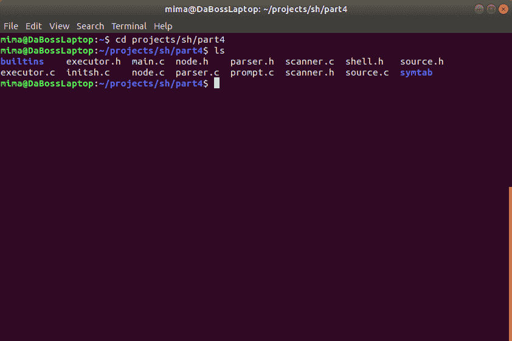
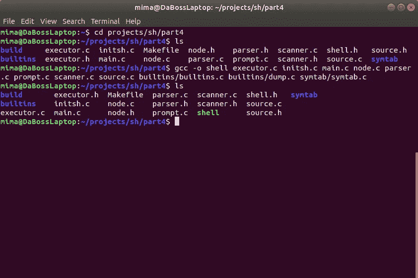
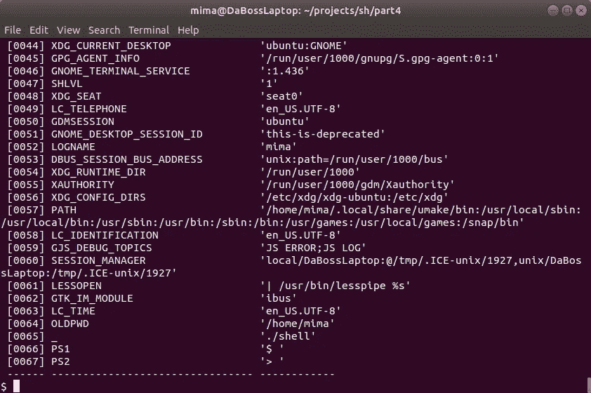

# 让我们构建一个 Linux Shell —第四部分

> 原文：<https://blog.devgenius.io/lets-build-a-linux-shell-part-iv-cefdd8f58138?source=collection_archive---------3----------------------->


在 [Unsplash](https://unsplash.com?utm_source=medium&utm_medium=referral) 上 [Sai Kiran Anagani](https://unsplash.com/@_imkiran?utm_source=medium&utm_medium=referral) 拍摄的照片

这是关于如何构建 Linux shell 的教程的第四部分。可以从以下链接阅读本教程的前几部分:[第一部分](https://medium.com/dev-genius/lets-build-a-linux-shell-part-i-954c95911501)、[第二部分](https://medium.com/swlh/lets-build-a-linux-shell-part-ii-340ecf471028)、[第三部分](https://medium.com/swlh/lets-build-a-linux-shell-part-iii-a472c0102849)。

**注意**:你可以从[这个 GitHub 库](https://github.com/moisam/lets-build-a-linux-shell/tree/master/part4)下载第四部分的完整源代码。

# 第四部分导言

在这一部分，我们将把[符号表](https://en.wikipedia.org/wiki/Symbol_table)添加到 shell 中。**符号表**是一种数据结构，由[编译器](https://en.wikipedia.org/wiki/Compiler)和[解释器](https://en.wikipedia.org/wiki/Interpreter_(computing))使用，将[变量](https://en.wikipedia.org/wiki/Variable_(computer_science))存储为表中的条目。每个条目由一个键(变量的**名**)和一个关联值(变量的**值**)组成。键通常是唯一的，也就是说，我们不能有两个条目共享同一个键(也就是说，不能有两个变量共享同一个变量名)。

通常，Linux shell 会在启动时填充它的符号表。在填充了符号表之后，编译器或解释器可以很容易地在表中搜索一个变量来检索该变量的值。我们还可以执行[类型检查](https://en.wikipedia.org/wiki/Type_system#Type_checking)，强制执行[范围规则](https://en.wikipedia.org/wiki/Scope_(computer_science))(例如，使变量仅对声明它的函数可见)，以及[将外壳变量](http://www2.linux-training.be/funhtml/ch14.html#idp53826080)导出到外部命令。

为了填充符号表，shell 读取**环境变量**列表，该列表从其父进程(通常是用户登录的进程，或者是登录进程的子进程)传递给 shell。shell 将每个变量(及其值)添加到符号表中。然后，我们可以使用适当的内置实用程序随意编辑、删除或导出 shell 变量(我们将在本系列的后面讨论)。

# 为什么我们需要一个符号表？

简而言之，符号表使我们能够定义外壳变量，修改它们的值，在执行[变量扩展](https://www.gnu.org/software/bash/manual/html_node/Shell-Parameter-Expansion.html)时使用不同外壳变量的值，并将变量导出到外部命令。当我们在本系列后面讨论[位置](https://www.gnu.org/software/bash/manual/html_node/Positional-Parameters.html)和[特殊外壳参数](https://www.gnu.org/software/bash/manual/html_node/Special-Parameters.html)时，符号表也会变得很方便。

每当您要求 shell**回显**、**导出**或**取消设置**shell 变量的值时，您实际上是要求 shell 访问和/或修改其符号表。所有 shell 都有某种符号表实现，尽管有些 shell 可能有不同的名称。

例如，假设您调用了以下命令:

```
echo $PATH
```

这应该会产生类似如下的输出:

```
/usr/local/sbin:/usr/local/bin:/usr/sbin:/usr/bin:/sbin:/bin
```

您可能知道`echo`命令与您在屏幕上看到的输出没有任何关系，除了`echo`打印出路径这一事实。是外壳真正理解了`$PATH`代表一个外壳变量名。也是*外壳*用实际路径值替换了单词`$PATH`，然后传递给`echo`。`echo`命令只是简单地回显了 shell 传递给它的参数，这是您在屏幕上看到的可执行路径。

因此，为了能够定义、修改、取消设置和导出 shell 变量，我们首先需要实现我们的符号表。让我们看看下一步该怎么做。

# 实现符号表

实现符号表有不同的方式，常见的有[链表](https://en.wikipedia.org/wiki/Linked_list)、[哈希表](https://en.wikipedia.org/wiki/Hash_table)和[二分搜索法树](https://en.wikipedia.org/wiki/Binary_search_tree)。每种方法都有利弊，我们没有时间也没有空间来详细讨论每一种方法。出于我们的目的，我们将使用**链表**，这是最容易实现的，并且在访问速度和内存使用方面也相当不错。(**注:**如果你想把 shell 用于*除了学习之外的任何事情*，你应该考虑把符号表实现改成使用哈希表或者二叉树的。你可以在这里找到哈希表实现[的例子。](https://github.com/moisam/Layla-Shell/tree/master/src/symtab)

现在让我们开始破解代码。在您的源目录中，创建一个名为`*symtab*`的子目录(从您的终端模拟器调用`**mkdir symtab**`)。导航到那个目录(`**cd symtab**`)并创建一个名为`**symtab.h**`的文件。将以下代码添加到刚刚创建的头文件中:

```
*#ifndef SYMTAB_H
#define SYMTAB_H**#include "../node.h"**#define MAX_SYMTAB	256*/* the type of a symbol table entry's value */
enum **symbol_type_e**
{
    SYM_STR ,
    SYM_FUNC,
};/* the symbol table entry structure */
struct **symtab_entry_s**
{
    char     ***name**;
    enum      symbol_type_e **val_type**;
    char     ***val**;
    unsigned  int **flags**;
    struct    symtab_entry_s ***next**;
    struct    node_s ***func_body**;
};/* the symbol table structure */
struct **symtab_s**
{
    int    **level**;
    struct symtab_entry_s ***first**, ***last**;
};/* values for the flags field of struct symtab_entry_s */                       
*#define FLAG_EXPORT (1 << 0) /* export entry to forked commands */*/* the symbol table stack structure */
struct **symtab_stack_s**
{
    int    **symtab_count**;
    struct symtab_s ***symtab_list**[MAX_SYMTAB];
    struct symtab_s ***global_symtab**, ***local_symtab**;
}; struct symtab_s       ***new_symtab**(int level);
struct symtab_s       ***symtab_stack_push**(void);
struct symtab_s       ***symtab_stack_pop**(void);
int **rem_from_symtab**(struct symtab_entry_s *entry, struct symtab_s *symtab);
struct symtab_entry_s ***add_to_symtab**(char *symbol);
struct symtab_entry_s ***do_lookup**(char *str, struct symtab_s *symtable);
struct symtab_entry_s ***get_symtab_entry**(char *str);
struct symtab_s       ***get_local_symtab**(void);
struct symtab_s       ***get_global_symtab**(void);
struct symtab_stack_s ***get_symtab_stack**(void);
void **init_symtab**(void);
void **dump_local_symtab**(void);
void **free_symtab**(struct symtab_s *symtab);
void **symtab_entry_setval**(struct symtab_entry_s *entry, char *val); *#endif*
```

`**symbol_type_e**`枚举定义了我们的符号表条目的类型。我们将使用类型`**SYM_STR**`来表示 shell 变量，使用`**SYM_FUNC**`来表示函数(我们将在本系列的后面处理 shell 函数)。

`**struct symtab_entry_s**`结构代表我们的符号表条目。该结构包含以下字段:

*   `name` = >此条目代表的外壳变量(或函数)的名称。
*   `val_type` = > `SYM_STR`为外壳变量，`SYM_FUNC`为外壳函数。
*   `val` = >字符串值(仅适用于 shell 变量)。
*   `flags` = >表示我们将分配给变量和函数的不同属性，比如 export 和 readonly 标志(我们将在本系列的后面处理这些)。
*   指向下一个符号表条目的指针(因为我们将该表实现为一个单链表)。
*   `func_body` = >对于 shell 函数，函数体的**抽象语法树**，或 **AST** (我们在本教程的[第一部分](https://medium.com/dev-genius/lets-build-a-linux-shell-part-i-954c95911501)中讨论过 AST)。

`**struct symtab_s**`结构代表一个单一的符号表。首先，我们将使用一个符号表，在其中我们将定义所有的 shell 变量。稍后，当我们讨论 shell 函数并开始使用脚本文件时，我们将需要定义更多的符号表。第零个符号表将是**全局表**，我们将在其中定义我们的**全局**变量(shell 可访问的变量，以及它执行的所有函数和脚本)。第一个及以上的符号表是**局部表**，我们将在其中定义我们的**局部变量**(这些变量只能被声明它们的 shell 函数或脚本访问)。通过以这种方式级联符号表，我们有效地实现了[变量范围](https://en.wikipedia.org/wiki/Scope_(computer_science))。

我们的`**struct symtab_s**`结构包含以下字段:

*   `level` = > 0 为全局符号表，1 及以上为局部符号表。
*   `first`、`last` = >分别指向表格链表中第一个和最后一个条目的指针。

现在，为了能够像我们上面讨论的那样级联符号表，我们需要定义并实现一个符号表栈。**堆栈**是一种**后进先出**或 **LIFO** 的数据结构，其中最后添加(或**推入**)的项目是第一个移除(或**弹出**)的项目。结构代表了我们的符号表堆栈。该结构包含以下字段:

*   `symtab_count` = >当前堆栈中符号表的数量。
*   指向堆栈符号表的指针数组。第 0 项指向全局符号表，`symtab_count-1`项指向最后一个(或局部)符号表。堆栈最多可以容纳`MAX_SYMTAB`条目，我们在头文件的开头定义为 256 个。
*   `global_symtab`、`local_symtab` = >分别指向全局和局部符号表的指针(便于访问)。

我们将在本课稍后实现堆栈。现在，我们将从编写使用符号表所需的函数开始。

# 符号表功能

创建`**symtab.c**`文件(在`*symtab*`子目录中),并通过添加以下代码开始:

```
*#include <stdlib.h>
#include <stdio.h>
#include <string.h>
#include "../shell.h"
#include "../node.h"
#include "../parser.h"
#include "symtab.h"* struct symtab_stack_s **symtab_stack**;
int    **symtab_level**; void **init_symtab**(void)
{
    symtab_stack.symtab_count = 1;
    symtab_level = 0; struct symtab_s ***global_symtab** = malloc(sizeof(struct symtab_s)); if(!global_symtab)
    {
        fprintf(stderr, "fatal error: no memory for global symbol table\n");
        exit(EXIT_FAILURE);
    } memset(global_symtab, 0, sizeof(struct symtab_s));
    symtab_stack.global_symtab  = global_symtab;
    symtab_stack.local_symtab   = global_symtab;
    symtab_stack.symtab_list[0] = global_symtab;
    global_symtab->level        = 0;
}
```

首先，我们有两个全局变量:

*   指向符号表堆栈的指针(我们每个 shell 只需要一个堆栈)。
*   `symtab_level` = >堆栈中的当前级别(如果我们正在使用全局符号表，则为 0，否则为非零)。

函数初始化我们的符号表堆栈，然后为我们的全局符号表分配内存并初始化。

接下来，添加以下函数:

```
struct symtab_s ***new_symtab**(int **level**)
{
    struct symtab_s ***symtab** = malloc(sizeof(struct symtab_s)); if(!symtab)
    {
        fprintf(stderr, "fatal error: no memory for new symbol table\n");
        exit(EXIT_FAILURE);
    } memset(symtab, 0, sizeof(struct symtab_s));
    symtab->level = level;
    return symtab;
}
```

每当我们想要创建一个新的符号表时(例如，当我们要执行一个 shell 函数时)，我们将调用`**new_symtab()**`函数。

接下来，添加以下函数:

```
void **free_symtab**(struct symtab_s ***symtab**)
{
    if(symtab == NULL)
    {
        return;
    } struct symtab_entry_s ***entry** = symtab->first; while(entry)
    {
        if(entry->name)
        {
            free(entry->name);
        } if(entry->val)
        {
            free(entry->val);
        } if(entry->func_body)
        {
            free_node_tree(entry->func_body);
        } struct symtab_entry_s *next = entry->next;
        free(entry);
        entry = next;
    } free(symtab);
}
```

当我们处理完一个符号表时，我们将调用`**free_symtab()**`函数，我们希望释放符号表及其条目所使用的内存。

接下来，我们将定义一个调试函数:

```
void **dump_local_symtab**(void)
{
    struct symtab_s ***symtab** = symtab_stack.local_symtab;
    int **i** = 0;
    int **indent** = symtab->level * 4; fprintf(stderr, "%*sSymbol table [Level %d]:\r\n", indent, " ", symtab->level);
    fprintf(stderr, "%*s===========================\r\n", indent, " ");
    fprintf(stderr, "%*s  No               Symbol                    Val\r\n", indent, " ");
    fprintf(stderr, "%*s------ -------------------------------- ------------\r\n", indent, " "); struct symtab_entry_s ***entry** = symtab->first; while(entry)
    {
        fprintf(stderr, "%*s[%04d] %-32s '%s'\r\n", indent, " ",
                i++, entry->name, entry->val);
        entry = entry->next;
    } fprintf(stderr, "%*s------ -------------------------------- ------------\r\n", indent, " ");
}
```

这个函数打印本地符号表的内容。当我们的 shell 启动时，局部和全局符号表将引用同一个表。只有当 shell 将要运行一个 shell 函数或脚本文件时，我们才有一个不同于全局表的本地表。(在本课的后面，我们将编写一个内置的实用程序，它将调用`**dump_local_symtab()**`来帮助我们可视化 shell 的全局符号表的内容)。

现在让我们定义一些函数来帮助我们处理符号表条目。在同一个文件(`**symtab.c**`)中，添加以下函数:

```
struct symtab_entry_s ***add_to_symtab**(char ***symbol**)
{
    if(!symbol || symbol[0] == '\0')
    {
        return NULL;
    } struct symtab_s ***st** = symtab_stack.local_symtab;
    struct symtab_entry_s ***entry** = NULL; if((entry = do_lookup(symbol, st)))
    {
        return entry;
    } entry = malloc(sizeof(struct symtab_entry_s)); if(!entry)
    {
        fprintf(stderr, "fatal error: no memory for new symbol table entry\n");
        exit(EXIT_FAILURE);
    } memset(entry, 0, sizeof(struct symtab_entry_s));
    entry->name = malloc(strlen(symbol)+1); if(!entry->name)
    {
        fprintf(stderr, "fatal error: no memory for new symbol table entry\n");
        exit(EXIT_FAILURE);
    } strcpy(entry->name, symbol); if(!st->first)
    {
        st->first      = entry;
        st->last       = entry;
    }
    else
    {
        st->last->next = entry;
        st->last       = entry;
    } return entry;
}
```

此函数向局部符号表添加一个新条目。请记住，在本课开始时，我说过每个条目必须有一个唯一的键，这是我们给 shell 变量或函数的名称。为了确保这种唯一性，我们首先通过调用`**do_lookup()**`(我们将在一分钟内定义它)来检查给定名称的条目是否存在。如果具有给定名称的条目存在，我们只是返回现有的条目，而不添加新的条目。否则，我们添加条目，设置其名称，并调整符号表的指针。最后，我们返回新添加的条目。

下一个函数执行相反的工作，即删除其关键字与给定名称匹配的符号表条目:

```
int **rem_from_symtab**(struct symtab_entry_s ***entry**, struct symtab_s ***symtab**)
{
    int **res** = 0;
    if(entry->val)
    {
        free(entry->val);
    } if(entry->func_body)
    {
        free_node_tree(entry->func_body);
    } free(entry->name); if(symtab->first == entry)
    {
        symtab->first = symtab->first->next; if(symtab->last == entry)
        {
            symtab->last = NULL;
        }
        res = 1;
    }
    else
    {
        struct symtab_entry_s ***e** = symtab->first;
        struct symtab_entry_s ***p** = NULL; while(e && e != entry)
        {
            p = e;
            e = e->next;
        } if(e == entry)
        {
            p->next = entry->next;
            res = 1;
        }
    } free(entry);
    return res;
}
```

这个函数释放条目使用的内存，并调整链表指针，从符号表中删除条目。

要执行查找(即搜索具有给定名称的变量)，我们需要在同一个文件中定义以下函数:

```
struct symtab_entry_s ***do_lookup**(char ***str**, struct symtab_s ***symtable**)
{
    if(!str || !symtable)
    {
        return NULL;
    } struct symtab_entry_s ***entry** = symtable->first; while(entry)
    {
        if(strcmp(entry->name, str) == 0)
        {
            return entry;
        }
        entry = entry->next;
    } return NULL;
}
```

这个函数从第一个条目开始搜索给定的符号表。如果条目的键与我们正在寻找的变量名相匹配，函数将返回条目。否则，该函数会跟随链表指针依次查看每个条目，直到找到一个条目，它的键与我们想要的名称相匹配。如果没有找到匹配，我们返回`NULL`。

接下来，添加以下函数:

```
struct symtab_entry_s ***get_symtab_entry**(char ***str**)
{
    int **i** = symtab_stack.symtab_count-1; do
    {
        struct symtab_s ***symtab** = symtab_stack.symtab_list[i];
        struct symtab_entry_s ***entry** = do_lookup(str, symtab); if(entry)
        {
            return entry;
        } } while(--i >= 0); return NULL;
}
```

此函数搜索其关键字与给定名称匹配的符号表条目。起初这似乎是多余的，因为我们已经定义了`**do_lookup()**`函数来搜索本地符号表。这里的区别是`**get_symtab_entry()**`从局部符号表开始搜索整个栈。目前，这种区别并不重要，因为我们的局部和全局符号表指的是同一个表。只有当我们讨论 shell 函数和脚本文件时，您才能体会到这个函数的作用(所以请坚持住！).

最后，添加以下函数:

```
void **symtab_entry_setval**(struct symtab_entry_s ***entry**, char ***val**)
{
    if(entry->val)
    {
        free(entry->val);
    } if(!val)
    {
        entry->val = NULL;
    }
    else
    {
        char ***val2** = malloc(strlen(val)+1); if(val2)
        {
            strcpy(val2, val);
        }
        else
        {
            fprintf(stderr, "error: no memory for symbol table entry's value\n");
        } entry->val = val2;
    }
}
```

该函数释放用于存储旧条目值的内存(如果有)。然后，它创建新值的副本，并将其存储在符号表条目中。

这就是符号表函数。现在让我们写一些函数来帮助我们使用符号表堆栈。

# 符号表堆栈功能

将以下代码添加到同一个源文件`**symtab.c**`:

```
void **symtab_stack_add**(struct symtab_s ***symtab**)
{
    symtab_stack.symtab_list[symtab_stack.symtab_count++] = symtab;
    symtab_stack.local_symtab = symtab;
} struct symtab_s ***symtab_stack_push**(void)
{
    struct symtab_s ***st** = new_symtab(++symtab_level);
    symtab_stack_add(st);
    return st;
} struct symtab_s ***symtab_stack_pop**(void)
{
    if(symtab_stack.symtab_count == 0)
    {
        return NULL;
    } struct symtab_s ***st** = symtab_stack.symtab_list[symtab_stack.symtab_count-1]; symtab_stack.symtab_list[--symtab_stack.symtab_count] = NULL;
    symtab_level--; if(symtab_stack.symtab_count == 0)
    {
        symtab_stack.local_symtab  = NULL;
        symtab_stack.global_symtab = NULL;
    }
    else
    {
        symtab_stack.local_symtab = symtab_stack.symtab_list[symtab_stack.symtab_count-1];
    } return st;
} struct symtab_s ***get_local_symtab**(void)
{
    return symtab_stack.local_symtab;
} struct symtab_s ***get_global_symtab**(void)
{
    return symtab_stack.global_symtab;
} struct symtab_stack_s ***get_symtab_stack**(void)
{
    return &symtab_stack;
}
```

以下是上述功能的快速分类:

*   `symtab_stack_add()`将给定的符号表添加到堆栈中，并将新添加的表指定为本地符号表。
*   创建一个新的空符号表，并将其放入堆栈顶部。
*   `symtab_stack_pop()`移除(或弹出)堆栈顶部的符号表，根据需要调整堆栈指针。
*   `get_local_symtab()`和`get_global_symtab()`分别返回指向局部和全局符号表的指针。
*   `get_symtab_stack()`返回一个指向符号表堆栈的指针。

# 初始化我们的符号表堆栈

还记得在本教程开始时我告诉过你，shell 需要初始化它的全局符号表，并将环境列表中的变量添加到该表中吗？在这一部分，我们将初始化符号表堆栈和全局符号表。在本系列的下一部分，我们将读取环境变量列表并将它们添加到符号表中。

继续在您的源目录中创建一个名为`initsh.c`的源文件，并添加以下代码:

```
*#include <string.h>* *#include "shell.h"
#include "symtab/symtab.h"*extern char ****environ**;void **initsh**(void)
{
    init_symtab(); struct symtab_entry_s ***entry**;
    char ****p2** = environ; while(*p2)
    {
        char ***eq** = strchr(*p2, '=');
        if(eq)
        {
            int **len** = eq-(*p2);
            char **name**[len+1]; strncpy(name, *p2, len);
            name[len] = '\0';
            entry = add_to_symtab(name); if(entry)
            {
                symtab_entry_setval(entry, eq+1);
                entry->flags |= *FLAG_EXPORT*;
            }
        }
        else
        {
            entry = add_to_symtab(*p2);
        }
        p2++;
    } entry = add_to_symtab("PS1");
    symtab_entry_setval(entry, "$ "); entry = add_to_symtab("PS2");
    symtab_entry_setval(entry, "> ");
}
```

此函数初始化符号表堆栈(包括全局符号表)并扫描环境列表，将每个环境变量(及其值)添加到表中。最后，该函数添加了两个变量，我们将使用它们来存储我们的提示字符串， **PS1** 和 **PS2** (我们在[第一部分](https://medium.com/dev-genius/lets-build-a-linux-shell-part-i-954c95911501)中讨论过提示字符串)。不要忘记将函数原型添加到您的`**shell.h**`头文件中:

```
void **initsh**(void);
```

接下来，在进入 REPL 循环之前，我们需要从我们的`**main()**`函数中调用这个函数。为此，将下面一行添加到`**main()**`，就在循环体之前:

```
initsh();
```

我们需要做的最后一件事是更新我们的提示字符串打印函数，这样它们将使用我们刚刚添加到`**initsh()**`的全局符号表中的 **PS1** 和 **PS2** 变量。我们还将编写我们的第一个内置实用程序`**dump**`。

接下来让我们将这些更改应用到我们的代码中。

# 更新提示打印功能

打开你的`**prompt.c**`文件。移除`**print_prompt1()**`主体中的线路，并替换为以下代码:

```
void **print_prompt1**(void)
{   
    struct symtab_entry_s ***entry** = get_symtab_entry("PS1"); if(entry && entry->val)
    {
        fprintf(stderr, "%s", entry->val);
    }
    else
    {
        fprintf(stderr, "$ ");
    }
}
```

新代码检查是否存在名为 **PS1** 的符号表条目。如果有，我们使用该项的值来打印第一个提示字符串。否则，我们使用默认的内置值，即`$` 。

对`**print_prompt2()**`函数的代码改动也差不多，这里就不展示了，不过你可以去我在本页顶部提供的 GitHub repo 链接查看。

不要忘记在文件的顶部添加下面的 include 指令，就在`*#include "shell.h"*`行之后:

```
*#include "symtab/symtab.h"*
```

# 定义我们的第一个内置实用程序

[**内建实用程序**](https://www.gnu.org/software/bash/manual/html_node/Shell-Builtin-Commands.html) (又称为内建或内部命令)是一个命令，其代码被编译为外壳可执行程序本身的一部分，即外壳不需要执行[外部程序](http://www.theunixschool.com/2012/03/internal-vs-external-commands.html)，也不需要[派生](https://en.wikipedia.org/wiki/Fork_(system_call))一个新进程来执行该命令。我们日常使用的许多命令，比如`cd`、`echo`、`export`和`readonly`，实际上都是内置的实用程序。你可以在 POSIX 标准[链接](https://pubs.opengroup.org/onlinepubs/9699919799/utilities/V3_chap02.html)中阅读更多关于 shell 内置工具的内容。

在本教程的过程中，我们将添加不同的内置工具来扩展我们的外壳。我们将从定义一个结构开始，这个结构将帮助我们存储关于不同内置实用程序的信息。

打开您的`**shell.h**`头文件，并在最后添加以下代码，就在`#endif`指令之前:

```
/* shell builtin utilities */
int **dump**(int **argc**, char ****argv**);/* struct for builtin utilities */
struct **builtin_s**
{
    char ***name**;    /* utility name */
    int (***func**)(int **argc**, char ****argv**); /* function to call to execute the utility */
};/* the list of builtin utilities */
extern struct builtin_s **builtins**[];/* and their count */
extern int **builtins_count**;
```

函数原型声明了我们的第一个内置实用程序`**dump**`。`**struct builtin_s**`结构定义了我们的内置实用程序，并具有以下字段:

*   `name` = >内置的实用程序名，我们将用它来调用该实用程序。
*   `func` = >函数指针，指向在我们的 shell 中实现内置实用程序的函数。

我们将使用`**builtins[]**`数组来存储关于内置实用程序的信息。该数组包含`**builtins_count**`个元素。

现在创建一个新的子目录，命名为`*builtins*`。这是我们定义所有内置实用程序的地方。接下来，创建文件`**builtins.c**`并向其中添加以下代码:

```
*#include "../shell.h"*struct builtin_s **builtins**[] =
{   
    { "dump"    , dump       },
};int **builtins_count** = sizeof(builtins)/sizeof(struct builtin_s);
```

接下来，我们将添加一个内置的实用程序，名为`**dump**`，我们将使用它来转储或打印符号表的内容，这样我们就知道幕后发生了什么(我主要写了这个实用程序，以便我们的讨论听起来不会太抽象和理论化)。

在`*builtins*`子目录中，创建文件`**dump.c**`，并在其中添加以下代码:

```
*#include "../shell.h"
#include "../symtab/symtab.h"*int **dump**(int **argc**, char ****argv**)
{
    dump_local_symtab();
    return 0;
}
```

简单吧？这个函数实现了我们的`**dump**`内置实用程序，它打印本地符号表的内容。

# 更新执行者

接下来，我们需要告诉我们的执行器我们新的内置实用程序，以便当我们输入命令`**dump**`时，shell 执行我们的`**dump()**`函数，而不是搜索名为 **dump** 的外部命令。为此，我们需要修复我们的`**do_simple_command()**`函数。

在源目录中，打开`**executor.c**`源文件并导航到`**do_simple_command()**`函数的定义。现在找到两条线:

```
argv[argc] = NULL;
pid_t **child_pid** = 0;
```

在这两行之间插入一个新行，并输入以下代码:

```
 int **i** = 0;
    for( ; i < builtins_count; i++)
    {
        if(strcmp(argv[0], builtins[i].name) == 0)
        {
            builtins[i].func(argc, argv);
            free_argv(argc, argv);
            return 1;
        }
    }
```

现在，我们的 shell 将检查它将要执行的命令的名称是否是内置实用程序的名称，如果是，它将调用实现内置实用程序的函数并返回。

就是这样！现在让我们编译并测试我们的 shell。

# 编译外壳

让我们编译我们的外壳。打开您最喜欢的终端模拟器，导航到您的源目录，并确保其中有 14 个文件和 2 个子目录:



现在使用以下命令编译 shell:

```
gcc -o shell executor.c initsh.c main.c node.c parser.c prompt.c scanner.c source.c builtins/builtins.c builtins/dump.c symtab/symtab.c
```

如果一切顺利，`**gcc**`应该不会输出任何东西，当前目录下应该有一个名为`**shell**`的可执行文件:



(如果您从 [GitHub repo](https://github.com/moisam/lets-build-a-linux-shell/tree/master/part4) 下载了源文件，您可以简单地从源目录运行`**make**`，它会负责编译 shell)。

现在通过运行`**./shell**`调用 shell，并尝试我们新的内置实用程序`**dump**`:



正如您在输出中看到的，我们的全局符号表(级别 0)包含许多变量(在上面的例子中是 67)，这些变量对应于从我们的父进程传递给我们的 shell 的环境变量。最后两个条目代表我们的 **PS1** 和 **PS2** 变量。尝试输入一些其他命令，看看我们的 shell 在解析和执行简单命令方面表现如何。

# 下一步是什么

现在可能还不明显，但是我们在这一部分所做的是一个巨大的成就。我们的符号表将使我们能够在 shell 中做一些重要的事情，比如执行单词扩展、将变量导出到外部命令、定义 shell 函数等等。

在下一部分中，我们将讨论单词扩展过程，以及如何在 shell 中添加单词扩展功能。

敬请期待！