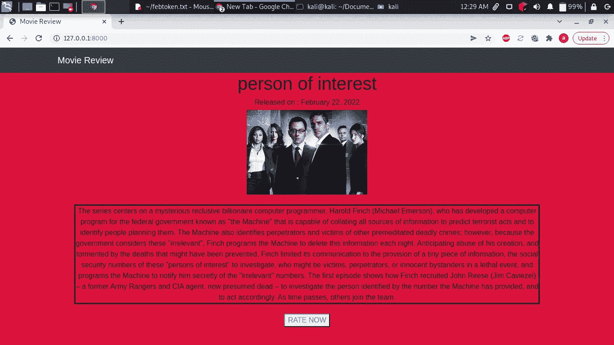
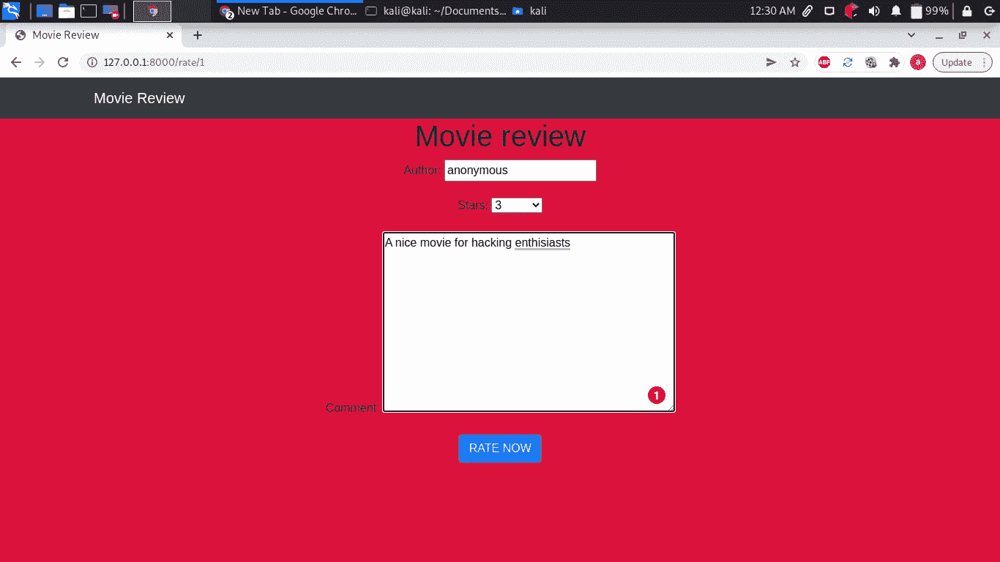
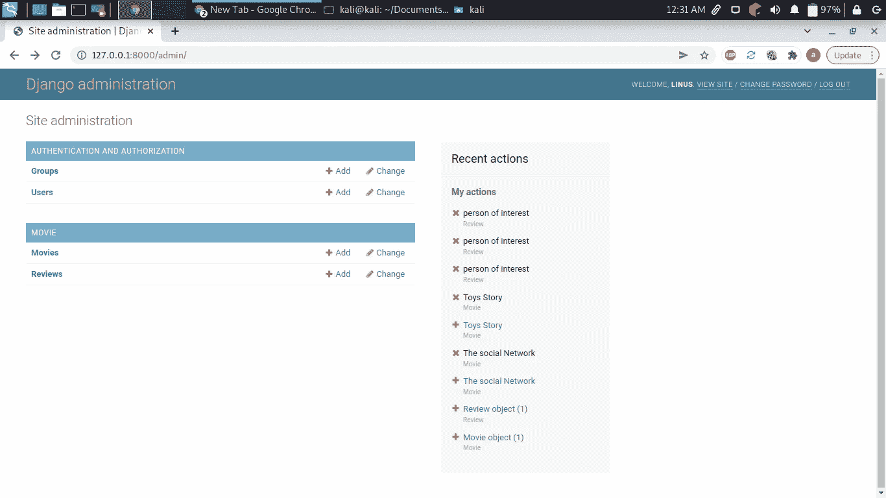
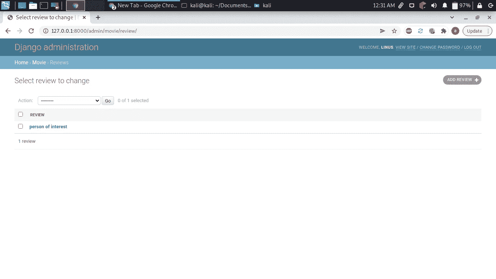
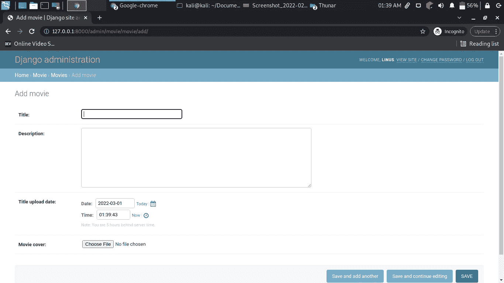
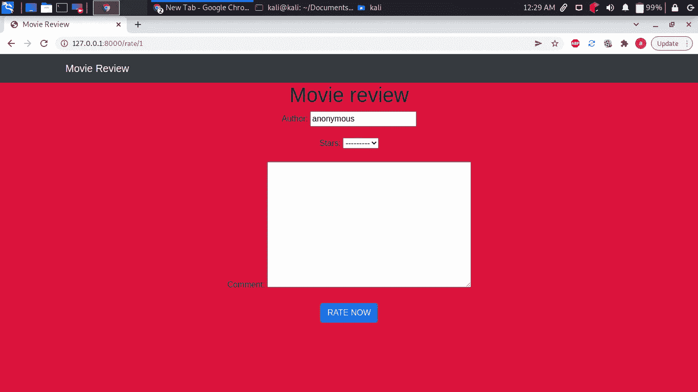

# 让我们建立一个电影评论 django 应用程序

> 原文：<https://blog.devgenius.io/lets-build-a-movie-review-django-app-47658f8e3751?source=collection_archive---------2----------------------->

这是一个基于 django 的网络应用程序，用于通过留下评论和给出星级来评论电影。

尼基塔·卡特塞维奇在 [Unsplash](https://unsplash.com/s/photos/tech?utm_source=unsplash&utm_medium=referral&utm_content=creditCopyText) 上拍摄的照片

在我们开始我们的教程之前，这里有一些我们应用程序的截图。

主页

费率页面

管理仪表板

显示审核的管理仪表板

这个应用程序的工作原理是，管理员上传电影标题，描述，封面图片，然后用户可以对相应的电影发表评论和星级评定。

希望你现在有一个线索，我们将建立什么。首先，我们需要安装 django。安装 django 运行`pip3 install django`

现在让我们建立我们的 django 项目。类型`django-admin startproject movie_review`。Movie_review 是我们 django 项目的名字。Cd 进入`movie_review`目录并运行`python3 manage.py startapp movie`。这将创建一个名为**电影**的 django 应用程序。

接下来，我们需要配置我们的应用程序，为此，将下面几行添加到`settings.py`文件。

接下来，我们需要为我们的应用程序配置路线。将以下几行添加到`movie_review/urls.py`

在`movie_review/settings.py`文件的底部添加以下内容。这是为了帮助 django 定位图像或者静态文件

现在我们可以进入我们的主应用程序。让我们创建一些模型。我们将有两个模型，一个是电影，另一个是评论。我们的审查模型将与电影有多对一的关系。这是我们的`models.py`

现在让我们为我们的评论模型创建一个表单，以便从用户那里收集一些评论。创建一个名为`forms.py`的文件

现在让我们注册我们的模型，以便被管理员访问。在`admin.py`文件中添加以下内容。

现在让我们创建我们的视图。我们将从主页视图开始，该视图将显示要评级的电影。这里是`views.py`文件中的视图。

现在让我们为我们的主页功能创建一个模板。这里是`home.html template`

现在是我们回顾视图的时候了。

当用户看完一部电影后，我们需要将他重定向到一个成功页面。这是成功功能的视图。

这里是它的模板，`success.html`

现在让我们为我们的应用程序创建路线。创建一个文件`urls.py`并添加以下内容。

现在我们需要运行一些命令，以便为我们的应用程序创建一些表。为此，运行`python3 manage.py makemigrations`。那次运行成功后运行`python3 manage.py migrate`。现在我们的表创建成功，但我们需要创建一个超级用户，他将是管理员，也负责上传电影进行审查。要创建超级用户，请运行`python3 manage.py createsuperuser`。您将被要求输入您的用户名、电子邮件和密码。毕竟现在已经设定好跑`python3 manage.py runserver`了。

打开浏览器，输入`[http://127.0.0.1:8000/admin](http://127.0.0.1:8000/admin)`。您需要使用创建超级用户时使用的凭证登录。现在转到电影选项，点击添加电影，并输入您希望用户审查的电影。您将需要电影标题，描述和电影上传的日期，但这将是我们在模型中定义的自动完成。你现在可以点击保存。

下面是这个过程的图片。

电影上传

现在，上传完电影后，回到主页，根据你上传的标题，你会看到类似这样的内容。

主页

现在，您可以继续评价您的电影，如下所示。

审查页面

本教程到此为止。感谢阅读。要获取源代码，请点击此处的****。****