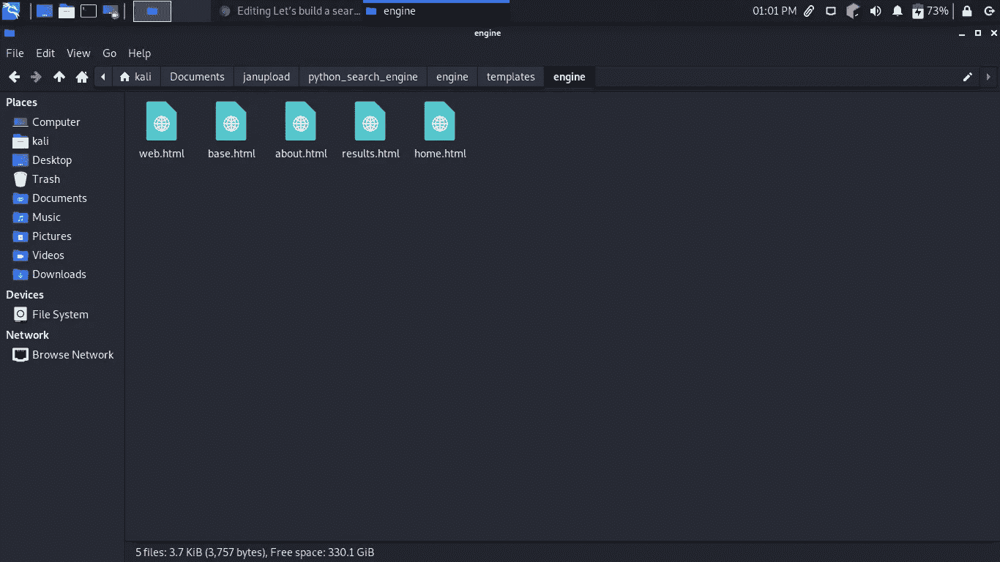

# 让我们用 python 来构建一个搜索引擎

> 原文：<https://blog.devgenius.io/lets-build-a-search-engine-with-python-3f8dd3320210?source=collection_archive---------0----------------------->

由 unsplash 提供

## **！！！更多有趣的教程，请访问 www.bytexplain.com**[***。***](http://www.bytexplain.com)

在本教程中，我们将使用 python 构建一个搜索引擎。这里有几张最终产品的截图。

这是主页。

这是结果页

**什么是搜索引擎？**

搜索引擎是一种帮助用户在万维网上查找信息的软件程序。一个搜索引擎通常有三个基本步骤，即爬行，索引和排名。爬行阶段是程序以预定义的方法爬行网络，收集数据，如图像、链接等。索引阶段是将收集的数据存储在数据结构中的阶段，最后是排名阶段，收集的数据按相关性进行排名，排名越高，答案越准确。

我们将在 django web 框架上构建我们的搜索引擎。

**免责声明！！！我们将在 lycos 搜索引擎的基础上构建我们的搜索引擎。**

项目的 Python 包；

1.  美丽的声音
2.  html5lib
3.  要求
4.  姜戈

要下载这些软件包，请使用 **pip3 安装<软件包名称>**

首先在终端上键入**django-admin start project python _ search _ engine**。CD 放入 python_search_engine 目录。运行**python 3 manage . py startapp engine**这将创建一个名为 engine 的应用。

现在我们需要配置 django 项目。将这些行添加到 python _ search _ engine**settings . py**文件中。

现在让我们修改我们的 **urls.py** 文件。

我们的搜索引擎的基本功能依赖于网络报废。我们将废弃**lycos.com**来获取我们查询的搜索结果。

首先，我们将创建一些文件和文件夹。在**引擎**文件夹中创建一个名为**模板**的文件夹在**模板**文件夹中创建一个名为**引擎**的文件夹。在**引擎**文件夹中创建以下文件:home.html，results.html 和 home.html。

模板

base.html 包含了我们项目的基本布局。这是我们的基本模板。

基础模板

现在让我们创建我们的视图。在 engine views.py 中添加以下内容。

这个视图将呈现我们的主页，我们将在这里输入我们的搜索查询。

这是 html 模板。

为了建立我们的 scrapper，我们将使用 lycos.com 作为我们的基本搜索引擎。首先，我们检查网站的基本结果页面，这里是一个标题检查的截图。

头衔检查

接下来，我们检查描述

描述检查

然后我们看到他们使用了**结果描述**作为描述类，**结果标题**作为标题类，**结果 url** 作为 url 类。这将是我们的 web scrapper 的基础。如果你想知道我们为什么使用 lycos，那是因为他们简单地设计了他们的用户界面，从而使我们更容易抓取，而 google 或 bing 对我来说几乎是不可能抓取的。现在，让我们着手利用手头的这些有价值的信息来制作我们的废品。

现在让我们为搜索创建视图。

首先，我们导入几个库。

接下来，我们转到结果视图。

现在我们一步一步来。我们首先从模板中请求搜索表单，稍后我们将创建该模板。

我们插入 lycos 搜索的 url，然后从搜索栏追加我们的查询。接下来，我们为来自 lycos.com 的搜索结果插入容器类，其中包含结果标题、结果 url 和结果描述。

这是我们的主页模板。

接下来，我们将迭代结果，然后将它们追加到一个列表中。

然后，我们将结果传递给 results.html 模板。

这是 results.html 模板。

这里我们从 base.html 模板继承了我们的模板。我们的搜索栏在顶部，然后我们在下面呈现我们的结果。

我们使用之前添加的索引来访问结果列表中的条目。

接下来，我们创建一个关于页面，它将提供一些关于我们的搜索引擎的信息。

这是我们的“关于”视图。

接下来，我们创建“关于”模板。

**现在让我们创建路线**

在引擎文件夹中创建一个文件 **urls.py** 。

添加以下几行。

我们的项目现在已经完成，要启动它，请键入**python 3 manage . py runserver**在浏览器中输入这个 url，您应该会看到这个。

主页

现在在搜索栏中输入你的查询，你应该会得到这样的结果。

结果页面

感谢阅读。你可以在这里 **查看源代码 [**。你也可以在这里捐款来支持我们。**](https://github.com/bunnythecompiler/python_search_engine)**

 [## 捐赠给 bunnythecompiler

### 通过捐赠或与朋友分享来帮助支持 bunnythecompiler。

www.paypal.com](https://www.paypal.com/donate/?hosted_button_id=ERQPL5YQWQX6J) 