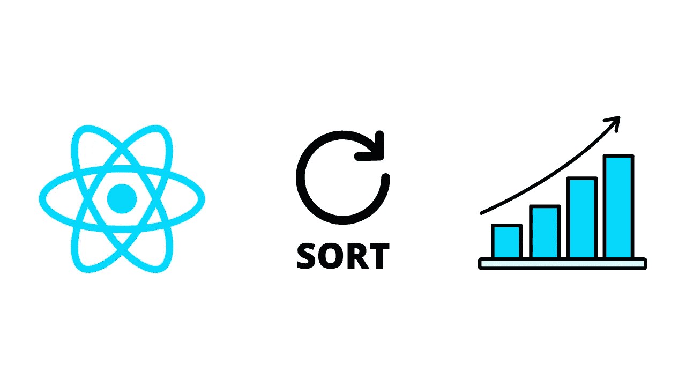
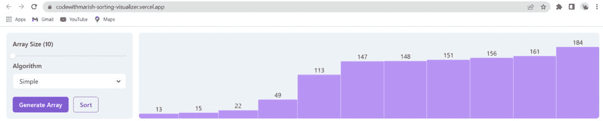

# 让我们使用 React 构建一个排序可视化工具——第一部分

> 原文：<https://blog.devgenius.io/lets-build-a-sorting-visualizer-using-react-part-i-91259271e9f?source=collection_archive---------2----------------------->



朋友们好，我带着一个新项目回来了，我们将使用 React JS 构建一个排序可视化工具，我将使用 Chakra UI 来加速 UI 开发。排序可视化是一个惊人的项目，以加强你的反应技能。我们还可以了解算法。所以让我们开始吧。

使用创建新的 React 项目

> *npx 创建-反应-应用排序-可视化工具-反应*

创建后，清理 App.js 中的基本代码并删除 App.css

如前所述，我将使用 chakra ui 来加速 ui 开发，所以我们将使用

> *NPM I @ chakra-ui/react @ emotion/react @ @ emotion/styled @framer-motion@⁶*

要了解更多关于查克拉用户界面和安装指南，你可以参考下面的文件。

[](https://chakra-ui.com/guides/first-steps) [## 第一步

### 你好，欢迎来到查克拉界面😄。如果你是新来的，请观看我们下面的免费课程。无论您是哪种框架或工具…

chakra-ui.com](https://chakra-ui.com/guides/first-steps) 

让我们从代码开始。

在 index.js 中，我们将在 ChakraProvider 中包装我们的应用程序组件，以使用 chakra UI 组件。

```
...
import { ChakraProvider } from "@chakra-ui/react";
const root = ReactDOM.createRoot(document.getElementById("root"));
root.render(
  <React.StrictMode>
    <ChakraProvider>
      <App />
    </ChakraProvider>
  </React.StrictMode>
);
....
```



以上是我们将作为这个应用程序的基础版本开发的用户界面。我们有两个组件侧栏和可视化组件。因此，在 src 下创建一个组件文件夹，并创建两个组件侧栏和可视化工具。

在侧边栏中，我们有一个选择数组大小的表单元素滑块，一个选择算法的下拉菜单，以及两个按钮，一个用于生成新数组，另一个用于对数组排序。我们已经利用了 chakra UI 滑块组件来选择数组大小，以及下拉列表的选择组件。我们有 generateArr 和 sort 作为 props，这是一个函数，当分别点击 generate array 和 sort 按钮时会被调用。

```
import {
  Box,
Button,Flex,FormControl,FormLabel,Select,Slider,SliderFilledTrack,SliderThumb,
  SliderTrack } from "@chakra-ui/react";
import React, { useState } from "react";const Sidebar = ({ generateArr, sort }) => {
  const [formState, setFormState] = useState({
    size: 10,
    algorithm: "linear",
  });

  return (
    <Box minW="xs" bg="gray.100" p={"4"} borderRadius="lg" overflow="hidden"> <FormControl>
        <FormLabel htmlFor="size">{`Array Size (${formState.size})`}</FormLabel>
        <Slider
          onChangeEnd={(v) => setFormState({ ...formState, size: v })}
          aria-label={"10"}
          min={10}
          max={200}
          defaultValue={10}
        >
          <SliderTrack>
            <SliderFilledTrack />
          </SliderTrack>
          <SliderThumb />
        </Slider>
      </FormControl>
      <FormControl>
        <FormLabel htmlFor="algorithm">Algorithm</FormLabel>
        <Select
          onChange={(v) => setFormState({ ...formState, algorithm: v })}
          bg={"white"}
          id="algorithm"
          variant={"outline"}
        >
          <option value="simple">Simple</option>
          <option value="select">Selection</option>
          <option value="insert">Insertion</option>
        </Select>
      </FormControl>
      <Flex gap={"3"} mt={"5"} direction="row">
        <Button onClick={() => {
            generateArr(formState);
          }} colorScheme="purple"
        >
          Generate Array
        </Button> <Button onClick={sort}
          colorScheme="purple"
          variant="outline"
        >
          Sort
        </Button>
      </Flex>
    </Box>
  );
};export default Sidebar;
```

对于 Visualizer 组件，我们需要将数据作为 props 传递，这是一个数组，我们将通过它进行映射，并显示自动列网格下的可视条。

```
import { Box } from "@chakra-ui/react";
import React from "react";const Visualiser = ({ data }) => {
  return (
    <Box
      rounded={"lg"}
      display="grid"
      gridAutoFlow={"column"}
      gridAutoColumns={"auto"}
      bg="gray.100"
      minH={"full"}
      overflow={"auto"}
      flex="1"
    >
      {data.map((d) => {
        return (
          <Box
            display={"flex"}
            justifyContent="flex-end"
            textAlign="center"
            flexDirection="column"
          >
            <p>{d}</p>
            <Box
              roundedTop={"sm"}
              border={"1px"}
              borderColor={"purple.200"}
              bg={"purple.300"}
              style={{ height: `${d}px` }}
            ></Box>
          </Box>
        );
      })}
    </Box>
  );
};export default Visualiser;
```

现在在 App.js 中，我们将把这两个组件放在 row flex 下返回。现在我们将创建需要传递给侧栏和可视化组件的状态变量。创建一个 arr 变量来存储需要排序的数字，生成(布尔变量检查一个新数组是否正在生成)，排序(布尔变量检查一个数组是否正在排序)。

```
...
function App() {
  const [arr, setArr] = useState([]);
  const [generating, setGenerating] = useState(false);
  const [sorting, setSorting] = useState(false);
...
  return (
    <Box p={"4"}>
      <Flex gap={"4"}>
        <Sidebar
          generateArr={generateArr} sort={sort}
        />
        <Visualiser data={arr} />
      </Flex>
    </Box>
}
```

现在对于函数，我们需要创建一个函数来生成一个随机数组初始化一个空数组，我们将循环直到长度变成我们通过 form 得到的大小，我们将添加一个随机数，在添加之前，我们将检查该数是否存在。将此函数作为道具传递给侧栏组件，当单击生成数组按钮时，我们将调用此函数，并传递包含数组大小和所选算法的格式。我们还将在组件挂载时调用 generate 数组，因此创建一个带有空依赖数组的 useEffect 并调用 generate array()。

```
...
const generateArr = (formState) => {

      let newArr = [];
      while (newArr.length <= formState.size) {
        let random = Math.floor(Math.random() * (200 - 10) + 10);
        if (newArr.indexOf(random) === -1) {
          newArr.push(random);
        }
      }
      setArr([...newArr]); };
useEffect(() => {
    generateArr({ size: 10 });
  }, []);
...
```

到目前为止，对于排序函数，我们有一个简单的排序算法，其中我们使用一个嵌套的 For 循环来迭代数组，并检查当前元素是否大于下一个元素，如果大于，则与该元素交换。再次将它作为侧栏组件的道具传递给排序函数，并在单击排序按钮时调用它。在这一点上，你可以看到一切都很好，但所有发生在一个单一的过程中，如果我们这样做，我们不能做到可视化或实现任何动画或其他功能，我们将包括在未来的职位。所以我们将使用 setTimeout 来延迟 for 循环的外部和内部，这样外部的延迟就比内部的多。我在尝试不同的计时器后设置了这个延迟时间，所以我建议你尝试调整和尝试。

```
const sort = () => {
    setTimeout(() => {
      let newArr = [...arr];
      for (let i = 0; i < arr.length - 1; i++) {
        setTimeout(() => {
          for (let j = i + 1; j < arr.length; j++) {
            if (newArr[i] > newArr[j]) {
              let temp = newArr[i];
              newArr[i] = newArr[j];
              newArr[j] = temp;
              let newStep = [...newArr]; setTimeout(() => {
                setArr([...newStep]);
              }, j * 100);
            }

          }
        }, i * 1000);
      }
    }, 500);
  };
```

现在，为了一些小的改进，我们将在调用生成数组函数时将生成设置为真，并在函数完成时再次将其设置为假。这里，当我将更改设置得如此之快，以至于它立即设置为 true 并设置为 false 时，我们将再次使用 setTimeout 来延迟生成设置为 true 后的时间。同样，我们将把排序设置为 true 或 false。基于此，我们在脉轮 UI 按钮组件的 isLoading & disabled 属性的帮助下显示了加载或禁用按钮。您可以通过使用不同的计时器进行测试来调整延迟。

```
...
const generateArr = (formState) => {
    setGenerating(true);
    setTimeout(() => {
      ...
      setGenerating(false);
    }, 500);
  };
...
const sort = () => {
    setSorting(true);
    setTimeout(() => {
      ...
    }, 500)
}...
```

对于现场演示，您可以查看下面的链接。

 [## React 应用

### 使用 create-react-app 创建的网站

codewithmarish-sorting-visualizer . vercel . app](https://codewithmarish-sorting-visualizer.vercel.app/) 

你可以尝试添加其他算法。这只是该应用程序的初始版本，我们将在接下来的帖子中实现更多的功能。

你可以在我们的网站上阅读这篇文章来获得代码和探索更多。

[](https://codewithmarish.com/post/sorting-visualizer-using-react-part1) [## 让我们使用 React 构建一个排序可视化工具——第一部分

### 朋友们好，我带着一个新项目回来了，我们将使用 React JS 构建一个排序可视化工具，我将使用…

codewithmarish.com](https://codewithmarish.com/post/sorting-visualizer-using-react-part1) 

感谢阅读这篇文章，如果你觉得这篇文章有帮助，请分享最大，感谢阅读😊敬请关注。

如果您有任何问题，请通过我们的联系部门联系我们。

[](https://codewithmarish.com/contact) [## 联系我们| CodeWithMarish

### 我们很乐意回答您的问题，并请随时张贴您的建议，因为您的建议可以帮助我们…

codewithmarish.com](https://codewithmarish.com/contact) 

另外，请不要忘记订阅我们的 youtube 频道 codewithmarish，了解所有与网络开发相关的挑战。

[](https://www.youtube.com/channel/UCkPYmdVz8aGRH6qCdKMRYpA) [## 和玛丽莎一起编码

### 我是 Fullstack 开发者，博客作者& Youtuber。我喜欢做挑战和项目，因为我相信通过学习…

www.youtube.com](https://www.youtube.com/channel/UCkPYmdVz8aGRH6qCdKMRYpA) 

在地球上的某个地方和❤️一起发布