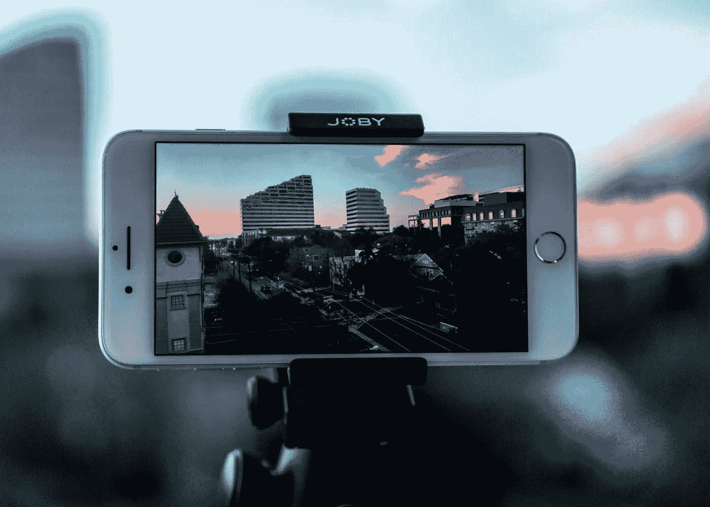
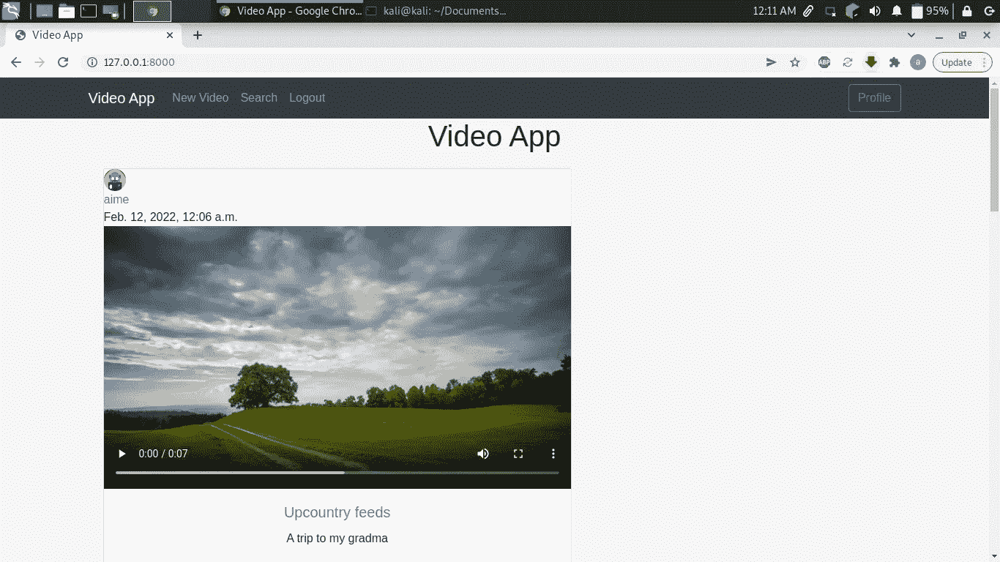
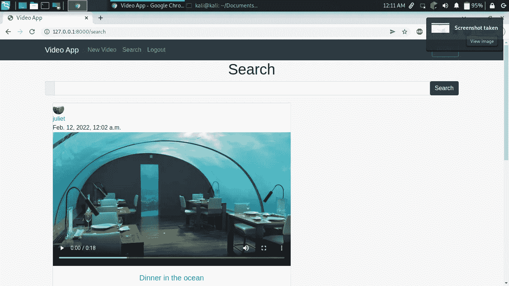
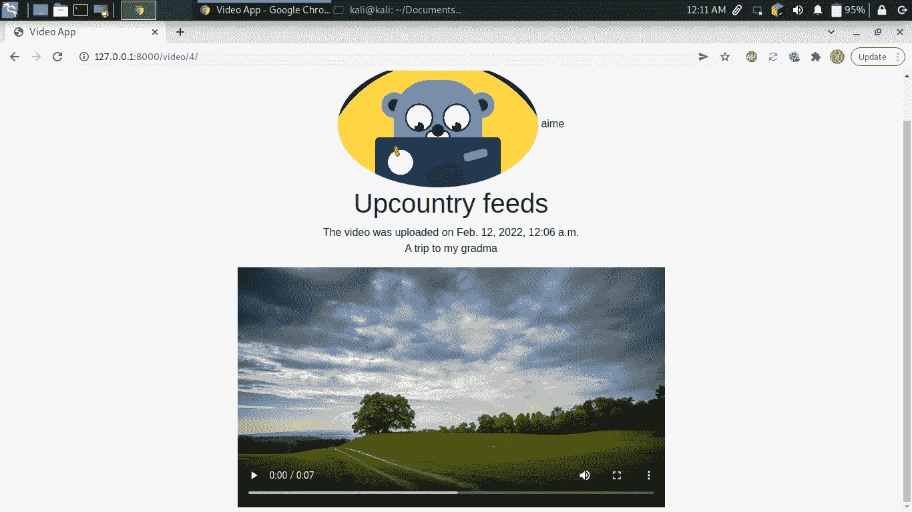
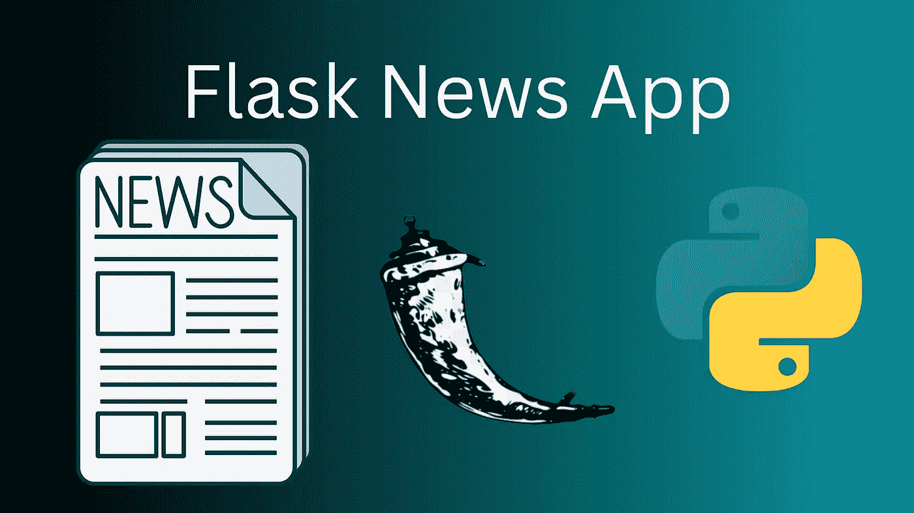

# 让我们和 Django 一起建立一个视频分享应用程序

> 原文：<https://blog.devgenius.io/lets-build-a-video-sharing-app-with-django-dacde3660a7d?source=collection_archive---------1----------------------->

这是一个使用 Django 构建的视频共享应用，支持认证和授权。

来自 unsplash 的 Thomas Russel 的照片

在本教程中，我们将构建一个具有高级功能的视频共享应用程序，如配置文件创建、身份验证和授权。

以下是我们最终应用的几张截图。

这是显示由不同用户创建的所有视频的主页

这是搜索页面

这是我们的用户页面，包含他们上传的所有视频

希望你现在对我们将要构建的内容有所了解。坚持到最后，因为我会分享我对这个项目的最终想法。

**免责声明！！！这个项目的用户界面不是很吸引人，因为我更像是一个后端的家伙，我的主要焦点是后端逻辑。**

**当前应用功能**

1.  用户创建
2.  视频上传
3.  视频删除
4.  视频搜索
5.  视频上传
6.  登录注销功能
7.  查看某个用户上传的视频
8.  更多

**即将推出的功能**

1.  喜欢
2.  不喜欢
3.  帐户删除
4.  重新定义的 UI
5.  更多的

现在我们开始吧。

**要求**

1.  姜戈
2.  枕头

要安装这些软件包，请运行`pip3 install <package name>`

安装后，现在打开您的终端并运行以下

`django-admin startproject video_app`

这将创建一个名为`video_app`的文件夹

Cd 放入文件夹，并运行以下程序；

`python3 manage.py startapp stream`

这是将处理视频的应用程序，接下来让我们创建一个将处理用户的应用程序。在这个项目中，我们的用户将被称为`streamers`

现在运行下面的代码来创建 streamers 应用程序

`python3 manage.py startapp streamers`

现在这就是应用程序的创建，这是我们整个项目的目录结构。

数据库. sqlite3

manage.py

媒体

└──简介-图片

溪流

├──移民

│ └── __pycache__

├──__ 皮切奇 _ _

├──静电

│ ├──

│ └── js

└──模板

└──河

飘带

├──移民

│ └── __pycache__

├──__ 皮切奇 _ _

└──模板

└──飘带

视频 _ 应用

└──__ 皮切奇 _ _

现在让我们在 **settings.py** 中配置我们的应用程序，以便我们的应用程序被识别。

在 settings.py 文件中添加以下内容；

我们现在将首先开始构建我们的流应用程序。首先让我们创建我们的模型，在`stream/models.py`文件中添加以下内容；

在这里，我们已经定义了数据库中需要的项目，换句话说，我们将拥有作为用户的 streamer。

接下来，我们需要创建我们的视图。先说`video-create`视图。在`views**.py**` 文件中添加以下几行:

这里我们有从泛型`CreateView`继承而来的基于类的`VideoCreateView`。我们还增加了`loginrequiredmixin` ，这将确保只有登录的用户可以访问上传视频路径。我们还增加了一个`form_valid`功能，确保登录的用户就是上传视频的人。

接下来是我们的视频创作模板。我们整个项目的所有模板都将从`base.html`模板继承。

接下来是我们的 `video_list`视图，它将在主页中列出所有用户的所有视频。这是它的视图。

我们按上传日期排列视频，最新的视频会最先出现。接下来，我们有我们的视频列表模板。

现在让我们转到我们的`video_update`视图。在`**stream/views.py**` 中插入以下内容:

这里我们插入了**userpasseststmixin**，这将确保只有视频所有者可以更新视频。我们还定义了一个表单有效函数，它将确保在保存表单之前添加用户，从而避免完整性错误。我们还定义了一个 **test_func** 函数，它将确保只有视频的登录用户和所有者可以更新表单。

接下来，我们有视频更新模板。

现在我们转到详细视图，这将有助于我们看到每篇文章的细节。

这里是`video-detail`模板。

在细节模板中，我们将显示 streamer `profile picture`、`username, video title , description` 和`video`本身。我们还创建了一个条件语句，只有当您是该视频的所有者时，该语句才会显示更新和删除按钮。

接下来，我们转到搜索视图。我们将根据它们的标题查询视频。

接下来，我们创建搜索模板，我们将有我们的搜索栏。

在上面的模板中，我们将搜索栏命名为`title`，它将在搜索视图中用于查询视频。然后，输出将呈现在搜索栏下方，如图所示。

接下来我们移动到`delete view`，它将用于删除视频。

这里，我们将**登录所需的**和**用户密码测试**混合插入到我们的删除视图中，这将分别限制登录用户和上述视频作者的删除功能。`test_func`函数意在声明。

接下来，我们需要创建一个模板来确认我们的删除活动。当用户或更确切地说是 streamers 按照我的项目定义按下删除按钮，他们将被引导到这个页面，以确认删除特定的视频

现在我们需要创建一个视图来查询属于某个用户的所有视频。如果你点击某个视频的用户名，你将被引导到一个包含某个用户曾经上传的所有内容的页面。

现在让我们为上面的视图创建一个模板。

现在让我们为我们的`stream`应用程序创建路线。在`stream/urls.py`文件中添加以下内容。

这就是我们的 stream 应用程序，现在我们需要转移到包含用户创建功能的 streamers 应用程序。

我们首先为我们的概要文件创建模型。然后，我们导入了枕头库，这将帮助我们调整上传的个人资料图片的大小。然后，我们创建了图像模型，它的缺省值是一个图像。然后，我们为上传的照片定义了路径，这些照片将存储在`project directory`内的`profile-pics`文件夹中。然后，我们创建了一个 save 函数，它将覆盖默认的 save 函数，以便保存一个小得多的图像，从而节省文件系统中的空间并提高页面加载速度。

接下来我们需要创建一个`forms.py` 文件来存储我们的`registration, userupdate and profileupdate`表单。

首先让我们创建一个注册功能。在`forms.py`中，我们导入了 django 内置的`usercreationform`。然后，我们创建了一个从`usercreationform`继承而来的注册表单。还会创建一个电子邮件字段。

现在让我们为注册创建一个模板。

接下来，我们转到配置文件更新功能。这是个人资料图片字段以及用户名和电子邮件的表单。

这是档案更新的模板。

现在我们需要创建我们的登录和注销功能。为了启用这些功能，我们首先需要导入 django 内置的登录/注销功能。

为此，我们需要转到主项目`video_app`中的`urls.py`

在`urls.py` 内添加以下内容

登录和注销 URL

现在让我们为各自的功能创建模板。这是登录模板。

现在让我们创建注销模板。

现在我们需要为整个项目创建路线。在`video_app`内，将以下内容添加到`urls.py` 文件中。在这里，我们已经注册了整个项目的所有路线。

当用户注册一个帐户时，我们需要将他重定向到一个登录页面，以确认他的凭据。为此，我们需要在`video_app/settings.py`文件中添加这一行。

`LOGIN_URL = 'login'`

这将调出`video_app/urls.py`中定义的登录页面，启动登录功能。

接下来，我们需要在用户登录后将他重定向到主页。为此，我们将在`video_app/settings.py`中添加以下行

`LOGIN_REDIRECT_URL = '/'`

现在，在我们结束项目之前，我们需要配置一些东西。

为了让我们的应用程序能够存储和检索媒体文件，如个人资料图片和视频，我们需要首先设置访问它们的路径和位置。

在`settings.py`中添加以下内容；

现在我们需要配置我们的`urls.py`文件。添加以下内容

为了在每次成功注册后创建一个配置文件，我们需要创建信号。首先我们需要在`streamers`目录中创建一个名为`signals.py` 的文件。在`signals.py`文件中，我们添加以下内容。

首先我们有`create_profile`函数，它接收一个参数`User`作为发送方，然后创建配置文件。然后我们有一个`save_profile` 函数，它也接受一个参数`User`作为发送者，但是现在保存而不是创建。为了结束信号，我们需要将它们导入到`streamers/apps.py`文件中，如下所示。

然后，我们最终需要在`admin.py`文件中注册我们的`streamers`模型，如下所示。

我们的项目终于要结束了，但我们需要做一件事。在`video_app` 项目文件夹中，我们需要创建一个名为`media`的文件夹，并在其中插入一张名为`mountain.jpg`的照片，如`stream`模型中所定义的。每当有人创建帐户时，这将作为我们的默认个人资料照片。

现在我们需要创建表并迁移所有数据。为了完成第一次运行`python3 manage.py makemigrations`，在成功运行之后，将创建两个表`stream`和`streamers`。现在我们需要迁移所有的数据。为了做到这一点，运行`python3 manage.py migrate`完成后，我们需要让我们的服务器运行`python3 manage.py runserver`。如果 **runserver** 命令成功运行，现在我们可以创建一个新帐户并开始上传视频。

**最终想法**

这个项目仍然缺乏很多功能，但我仍在努力与前面提到的一些即将到来的功能的下一个版本。敬请关注。你可以在这里获得这个项目[的源代码。一如既往地感谢您的阅读。你可以在这里捐款来支持我们。谢谢你。](https://github.com/bunnythecompiler/video_app/tree/master)

 [## 捐赠给 bunnythecompiler

### 通过捐赠或与朋友分享来帮助支持 bunnythecompiler。

www.paypal.com](https://www.paypal.com/donate/?hosted_button_id=ERQPL5YQWQX6J)