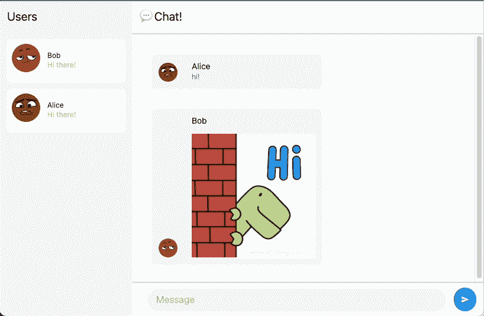
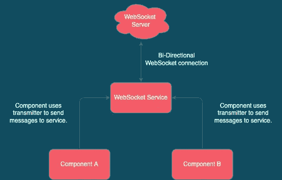
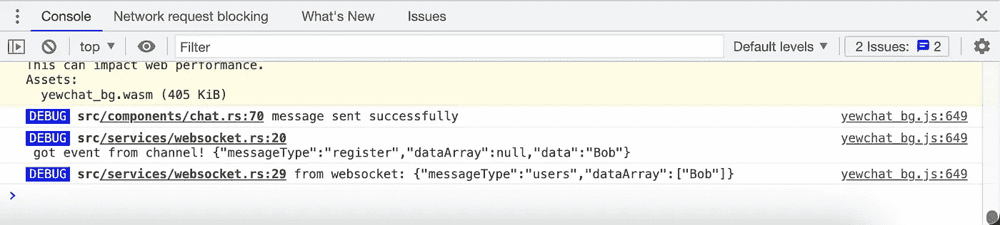
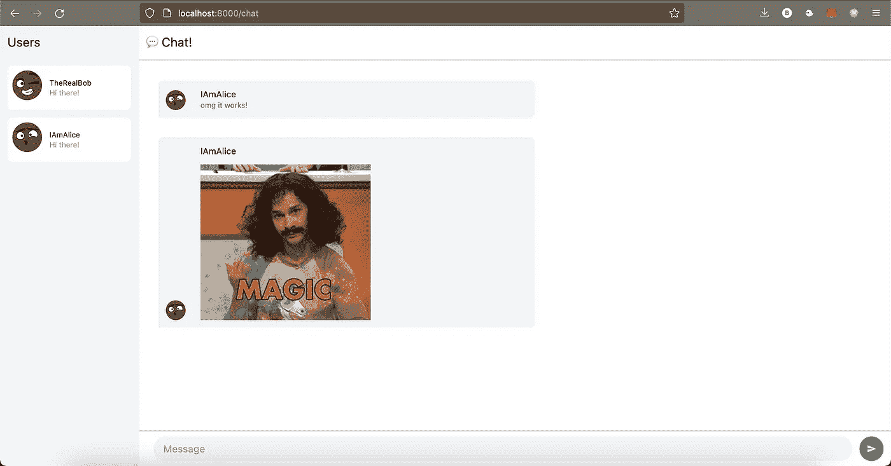

# 让我们用 Rust 和 Yew 0.19 构建一个 WebSockets 项目🦀

> 原文：<https://blog.devgenius.io/lets-build-a-websockets-project-with-rust-and-yew-0-19-60720367399f?source=collection_archive---------0----------------------->


照片由[迈克·温克勒](https://unsplash.com/@ahmeyer?utm_source=unsplash&utm_medium=referral&utm_content=creditCopyText)在 [Unsplash](https://unsplash.com/s/photos/socket?utm_source=unsplash&utm_medium=referral&utm_content=creditCopyText) 上拍摄

让我先说我是红豆杉的超级粉丝。使用 Rust 的能力和灵活性来构建前端组件，我觉得随着 WebAssembly 的适应能力的增长，这只会变得越来越大。最近，我的一个副业项目需要一些 WebSockets love。我认为这将是深入了解 Yew 最近发布的 0.19 版本的最佳时机，该版本引入了对框架的几项重大更改(移除了`web-sys`及其支持的服务(即`ConsoleService`)并引入了*、*等功能组件)。

正如你可能已经从标题中猜到的那样，我们将使用 Yew、yew-router、yew-agent 和其他几个箱子来构建一个聊天应用程序(这是一个陈词滥调，我知道，我将展示我自己)。


至少它有 GIF 支持！

为了让你对我们将要建造的东西有所了解，请看这张可爱的图片:



> *🛑* 在前进之前，确保你已经安装了 Rust 和 NodeJS。

# 🗿WebSocket 服务器

要在客户端使用 WebSockets，您需要一台能够使用 WebSockets 的服务器(我知道这很令人震惊)。为了保持这篇文章的合理长度，也为了专注于一个主题，我们不会过多地讨论 WebSockets 服务器。简而言之:除了处理传入和传出连接，服务器还将传入连接保存在一个名为`users`的数组中。每隔几秒钟，服务器就会将`users`数组与服务器当前的活动连接列表进行比较，以验证列表中的所有用户实际上都仍然处于连接状态。

虽然你可以为我们可爱的聊天应用程序构建/使用自己的 WebSockets 服务器，但这里更简单的解决方案是克隆我在 https://github.com/jtordgeman/SimpleWebsocketServer 使用的 NodeJS WebSocket 服务器。克隆完成后，运行`npm i`，然后运行`npm start`，如果一切顺利，您现在应该有一个可爱的 WebSockets 服务器在端口 8080 上本地运行。

# 该走了🚀

1.  在[https://github.com/jtordgeman/YewChat](https://github.com/jtordgeman/YewChat)克隆启动项目
2.  安装工具链依赖项

```
npm i
```

> starter 项目只是一个已经设置了 wasm-pack 和 webpack 的空项目，因此我们可以将注意力集中到 Yew 上

# **🛤 ️Routing**

我们的应用程序有三种可能的路线:

1.  登录——一个简单的页面，带有一个文本框和一个按钮，供用户输入昵称
2.  聊天——主页面——有一个用户列表、聊天显示和一个用于向聊天中输入内容的文本框
3.  404——如果任何人试图去一个不存在的页面——这个包罗万象的页面将显示其所有的荣耀

如果你来自 React，你可能知道(并使用)`react-router-dom`。好消息。`yew-router`几乎是完全相同的想法！`yew-router`根据 URL 处理不同页面(组件)的显示。

理论讲够了，让我们开始吧:

1.  在 **src** 文件夹下新建一个名为 **components** 的文件夹。我们将在这里托管所有组件。
2.  在新创建的组件文件夹下创建三个文件: **chat.rs** 、 **login.rs** 、 **mod.rs.** 我们暂时将 chat 和 login 留空，在 mod.rs 中添加以下内容:

3.在 **lib.rs** 的顶部，添加以下使用语句:

注意**登录**和**聊天**将显示为未解决。当我们以后开始处理组件时，我们会解决这个问题。

4.多亏了`yew-router`，我们可以使用 enum 来定义我们的路线。我们将把它添加到我们的**库**中，如下所示:

非常好的东西！我们用它处理的 URL 注释每个条目。注意，404 路由使用了一个额外的注释:`#[not_found]`——这个宏来自`yew-router`包，基本上是它使得这个路由成为一个无所不包的路由。

5.接下来，我们需要一种方法来将路由的 enum 值转换为实际的组件。在 Route enum 的正下方添加以下`switch`函数:

6.为了渲染我们的路由器(以及它路由到的组件)，我们将使用**一个功能组件。你可能会问，什么是功能组件？
功能组件是常规 Yew 组件的简化版本，它可以接收属性并通过返回 HTML 来确定呈现的内容。简而言之——功能组件基本上是被简化为只有`view`方法的组件。**

7.最后但同样重要的是，我们需要一个应用程序的入口点 JavaScript 可以调用这个函数来启动我们的 Yew 应用程序。将`run_app`函数添加到 lib.rs，如下所示:

🔬那么我们这里有什么？

*   **第 1 行**:使用`wasm_bindgen`宏，我们将`run_app`函数暴露给 JavaScript。
*   **第 3 行**:我们初始化`wasm_logger`板条箱。使用`wasm_logger`和`log`机箱，我们可以将调试日志写到浏览器的控制台。
*   **第 4 行**:我们将主组件(在上一步中定义)传递给`yew`的`start_app`方法，正如你可能已经猜到的那样，启动应用程序。

有了合适的路由，让我们继续创建组件。

# 🪅 **️Components —第一阶段**

为了简单起见，我们的应用程序将由两个组件组成:

*   **登录** —一个简单的功能组件，用于获取用户名并连接到 WebSockets 服务器。
*   **聊天**——该应用的主要组件——显示聊天窗口，以及一个向聊天内容写入内容的文本区域。

当用户浏览到**登录**组件时，他们将输入一个用户名并点击连接——然后该用户名需要传递到**聊天**组件并在那里用于连接到 WebSocket 服务器。为了实现这一点，我们将使用一个**上下文**(将其视为应用程序的全局状态)，它将保存任何组件要使用的用户名。我们定义上下文的方式如下:

1.  为上下文定义一个`struct`并为其定义一个`type`别名:

2.在`main`组件中，使用`use_state`钩子定义一个上下文:

3.最后，让我们通过用一个`ContextProvider`元素包装主组件 HTML 来使用上下文，这使得子元素能够实际使用这个上下文。

一个`ContextProvider`元素需要一个上下文结构(`User`)和一个上下文对象(`ctx`)，这是使用元素的`context`属性设置的。

> *👁️* 注意:每当上下文改变时，ContextProvider 的子元素将重新呈现。

有了上下文，让我们构建**登录**组件！

1.  在**组件/登录. rs** 中添加**登录**功能组件:

2.声明一个`use_state`钩子来管理用户输入的用户名的状态。当声明一个`use_state`钩子时，我们提供默认值(在我们的例子中是一个空的`String`)，类似于 React 的`use_state`钩子:

3.要获得对上下文的引用(您可能还记得，它将保存用户名的全局状态)，请使用`use_context`钩子:

4.登录组件 UI 将包含一个输入元素和一个按钮。每当输入改变时，我们需要更新本地`username`变量。为了连接 UI 元素和`username`，我们使用了一个`callback`:

🔬那么我们这里有什么？

*   **第 7 行**:我们克隆了用户名状态处理程序，这样我们以后可以使用它的`set`方法更新它。
*   第 9 行:我们从 input 元素的`onchange`事件中创建一个回调。
*   **第 10 行**:我们使用`InputEvent`的`target_unchecked_into`方法获取目标元素(触发事件的元素)。
*   **第 11 行**:我们使用元素的`value`方法，用`input`元素当前保存的新值更新`username`状态。

> *🎉如果你曾经做过 HTML 元素的 JavaScript 工作，那么所有这些应该看起来非常相似。*

5.我们需要创建的下一个回调是针对提交按钮的。一旦输入了用户名，并且用户单击了提交按钮，我们需要将用户名保存到全局上下文中，以便其他组件在需要时可以使用它。如下创建`onclick`回调:

6.最后，让我们使用`html!`宏为这个组件添加实际的 UI:

👀一些标注:

*   `input`元素注册到`oninput`回调中。每次输入改变时，我们调用`oninput`并更新`username`状态。
*   我们使用`yew_router`箱中的`Link`元素，通过`to`属性将浏览器路由到`Chat`路径。
*   `Link`元素包含一个`button`元素，它注册到`onclick`回调函数，后者用`username`的值更新全局上下文。除此之外，该按钮还设置了`disabled`属性以防止用户点击它，除非`username`的长度为 2 个字符或更多。

这就是登录组件的包装🎊。我们现在有了一个使用上下文的组件，以便与其他组件共享其数据(在我们的例子中是用户名)。

现在我们可能很想跑过去创建聊天组件，但是让我们停下来想一想聊天组件是如何工作的…

# 👋你好网络插座！

我们聊天应用程序的核心是 WebSockets。WebSockets 使我们能够在服务器和客户端之间异步发送和接收消息，而不需要客户端不断轮询。这个特性使得 Websockets 成为我们聊天应用的完美核心。让我们继续创建一个 WebSocket 服务，它将处理我们的应用程序中使用 WebSockets 的所有方面！

1.  在 **src** 文件夹下创建一个名为 **services** 的新文件夹。
2.  在**服务**中添加一个名为 **mod.rs** 的新文件，内容如下:

3.我们的 Websocket 服务将处理以下内容:

*   侦听来自 WebSocket 服务器的传入消息。
*   将消息写入 WebSocket 服务器。
*   使用 MPSC(多生产商单消费者)通道与其他组件通信(稍后将有更多内容🤔)

在**服务**文件夹中添加一个名为 **websocket.rs** 的新文件，内容如下:

😱OMG 这里发生了很多事情，让我们来看看整个事情:

*   **第 6–8 行:**创建保存类型`Sender`的单个属性的`WebsocketService`结构。`Sender`允许我们按照消息发送的顺序，在接收方稍后将接收的通道上异步发送消息。`Sender`是可克隆的，这意味着每个使用该服务的组件都可以克隆它，并用它将消息发送回接收方，顾名思义——只能有一个。
*   **第 11–46 行**:`new`函数初始化服务，类似于其他语言中的构造函数。该函数执行以下操作:
    -连接到 WebSocket 服务器(第 12 行)
    -创建 MPSC 通道(第 16 行)
    -在当前线程上生成一个新的 future(异步任务)，该线程将侦听 MPSC 通道的接收端，并将收到的消息写入 WebSocket 服务器。这就是组件与我们的服务通信的方式——通过通道发送消息(第 18–23 行)。
    ——在当前线程上产生另一个新的 future 来监听来自 WebSocket 服务器的传入消息并将其注销(第 25–43 行)。
    -最后，该函数返回一个保存通道发送器(`in_tx`)的`WebSocketService` ( `Self`)实例。

这里有一个方便的图表，直观地展示了所有事物之间的联系:



太棒了，有了 WebSocket 服务，让我们继续创建实际的聊天组件吧！

# 🪅 ️Components —第二阶段

对于我们的聊天组件，我们将使用一个常规的(不是 T4)组件，因为我们将充分利用它不同的生命周期方法。

1.  打开 **chat.rs** 并添加以下内容:

👀一些标注:

*   `Msg` enum 保存我们的组件可以接收的可能消息(读取动作)。Chat 有两个基本功能:要么它处理从 WebSocket 服务器收到的消息(`HandleMsg`)，要么它向服务器提交消息(`SubmitMessage` ) —例如当用户在聊天中键入一些内容时。
*   `MessageData`表示聊天消息，包含消息来自谁以及实际消息是什么。
*   enum 保存了组件可以发送或接收的不同类型的消息。
*   最后，`WebSocketMessage`表示发送给 WebSocket 服务器的消息的样子:它有一个类型(`message_type`)，然后是一个字符串数组(比如在聊天用户列表的情况下)或单个字符串(比如向服务器发送聊天消息的情况下)。

2.接下来，让我们添加聊天组件本身:

聊天组件包含用户列表(`users`)、键入到文本框中的输入(`chat_input`)、对 Websocket 服务的引用(`wss`)，最后是键入到聊天中的所有消息的数组(`messages`)。

3.我们添加的第一个组件生命周期方法是`create`方法。`create`初始化组件状态，它的`ComponentLink`:

👀这里发生了相当多的事情，让我们来分解一下:

*   我们获取保存在`Context`(第 4-7 行)中的`user`(属于`type Rc<UserInner>`)对象，然后克隆它的`username`字段(第 9 行)，这是用户用来登录的实际用户名。
*   我们创建一个新的 WebSocket 消息，向 WebSocket 服务器注册当前客户端(第 11–15 行)。接下来，我们使用`WebSocketService`的通道发送器(`tx`)将它发送到 WebSocket 服务器(第 17–23 行)。如果一切顺利，我们将向控制台记录一条消息(第 22 行)。
*   我们通过发送一个新的`Chat`实例来结束这个方法(第 25–30 行)。

4.接下来，我们添加 view 方法，它负责呈现组件:

这是一个很长的方法😅这里的大部分内容只是 HTML 和样式，所以我们不会深究，但这里有一些有趣的提示:

*   在第 4 行，我们创建了一个类型为`MouseEvent`的`callback`，在点击提交按钮时使用。每当点击按钮时，`callback`将发送类型为`SubmitMessage` 的消息。该消息将由`update`生命周期方法处理。
*   在第 10 行，我们通过使用`map`和`collect`来迭代`users`字段，以呈现当前连接的用户列表(每个用户都呈现在其自己的`div`元素中)。
*   在第 33 行，我们迭代了`messages`字段，类似于我们之前对`users`所做的。
*   我们在`input`元素(第 57 行)上使用了`ref`属性，这样我们就可以在`view`生命周期方法之外引用它(即读取它的值)。
*   我们设置提交按钮的`onclick`属性(第 58 行)来提交第 4 行定义的回调。

5.我们终于准备好第一次运行这个项目，看看我们到目前为止取得了什么成果！在项目根文件夹中运行`npm start`。这将启动将我们的应用程序编译成 WASM、优化它、构建 HTML(使用 Webpack)以及最终运行开发服务器的过程。

如果一切顺利，您应该会看到一个登录页面，您可以在其中输入用户名。完成后，主聊天屏幕出现，让我们检查开发工具控制台:



几乎立即出现了三行字:

*   我们成功地从聊天组件向 WebSocket 服务器发送了一条 WebSocket 消息(第一个调试行)
*   WebSocket 服务将用户名发送到 WebSocket 服务器
*   WebSocket 服务器返回了一个类型为`users`的消息，其中包含一个包含已连接用户名称的数组。

这就引出了一个问题:如果我们的 WebSocket 服务收到了所有连接用户的消息——为什么我们在 UI 上看不到呢？我们的聊天组件到底收到消息了吗？

眼尖的读者可能会注意到，当我们之前讨论 WebSocket 服务时。我们只讨论了组件如何向服务发送消息，但是没有提到服务如何向组件发回消息。让我们再深入一下我们的 WebSocket 服务……

# 🔌WebSockets —第二阶段

我们目前使用 MPSC 通道在组件和 WebSocket 服务之间进行通信，但是顾名思义，我们不能使用相同的方法来更新组件，因为我们需要相反的方向，即多消费者(组件)单生产者(服务)，这是不存在的。

我们用紫杉药剂！代理可以用来“独立于组件层次结构中的位置在组件之间路由消息”(摘自 Yew 的官方文档)。这意味着我们可以使用代理的调度程序将消息从 WebSocket 服务发送到任何监听组件。让我们创建一个事件总线服务，我们将使用它来发送这些消息。

在 services 下创建一个名为 **event_bus.rs** 的新文件，并将以下内容粘贴到其中:

🔬那么我们这里有什么？

*   **第 10–13 行**:我们创建了`EventBus`结构，它保存了一个链接和一个订户列表。
*   **第 15–47 行**:我们为`EventBus.`实现了`Agent`特征。我们需要实现很多方法(`connected`、`disconnected`等)，但我们最关心的是`handle_input`，它遍历所有订阅者，并使用`link`向他们发送消息内容。

现在让我们回到 WebSocket 服务，使用新的事件总线:

1.  打开服务文件夹下的 **websocket.rs** 。添加所需的`use`语句和`event_bus`初始化。我们正在创建一个`dispatcher`,因为我们需要服务和组件之间的单向通信通道:

2.要在信道上发送消息，我们只需使用`send`:

你可以看到我们正在利用我们在 **event_bus.rs** 中定义的`EventBusMsg`结构来沿着通道发送一条`String`消息(第 9 行和第 15 行)。

最后，我们需要将事件总线添加到聊天组件中。

1.  打开**组件**文件夹下的 **chat.rs** ，将`_producer`添加到聊天结构中:

2.转到`Chat`的`create`生命周期方法，将`_producer`的默认值添加到返回的`Self`语句中:

如果你现在再次运行应用程序，你会发现没有什么真正的变化。原因是我们从未实现过`update`生命周期方法，该方法负责处理组件获得的不同消息(如`HandleMsg`或`SubmitMessage`)。该方法返回一个布尔值，指示是否应重新呈现组件。

3.在`create`方法下，添加以下`update`的实现:

🔬那么我们这里有什么？

该方法将`msg`匹配到组件可能获得的两个消息之一:`HandleMsg`或`SubmitMessage`。如果消息是类型`HandleMsg`的，我们执行另一个匹配并检查它是类型`Users`还是类型`Message`的消息。每当连接的用户列表发生变化(用户连接/断开连接)时，就会发送类型为`Users`的消息，在收到该消息时，我们会用每个连接的用户的姓名和头像填充`users`数组。当用户在聊天中发布消息时，类型为`Message`的消息被发送，与我们处理`users`的方式非常相似，我们将新消息添加到`messages`数组中。在这两种情况下，我们都返回`true`,因为我们需要组件用新数据重新呈现自己。

在消息类型为`SubmitMessage`的情况下，我们从`input` HTML 元素中获取消息文本(还记得我们之前设置的`ref`属性吗？)并使用 WebSocket 服务通道发送器(tx)将消息发送到 WebSocket 服务器。在`SubmitMessage`的情况下，我们返回`false`，因为我们不需要组件自己重新呈现。

随着这一变化，我们的应用程序现在已经准备好黄金时间！



这篇文章肯定比较长，但我希望你能体验到在构建 web 应用程序时与 Yew 一起工作的感觉。你可以在 https://github.com/jtordgeman/YewChat 找到完整的源代码。欢迎在 Twitter 上给我打电话或者在这里留言——我保证我会很好地回答；p

最后但同样重要的是，非常感谢[萨拉·卢梅尔斯基](https://medium.com/u/9caa2c6ac2a4?source=post_page-----60720367399f--------------------------------)校对并纠正了我愚蠢的拼写错误！:)