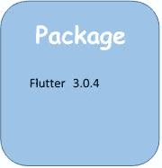
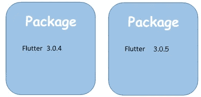
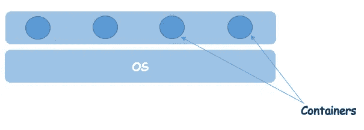
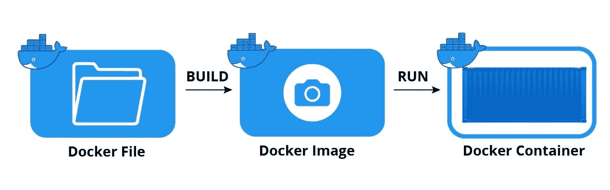
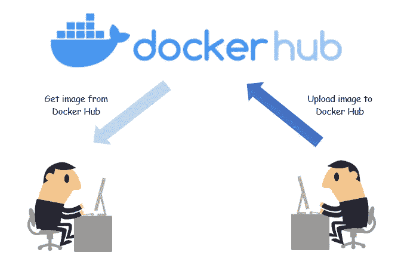

# 让我们用 Docker 构建、运行和发布应用程序。

> 原文：<https://blog.devgenius.io/lets-build-run-and-ship-applications-with-docker-d0e26797dbfd?source=collection_archive---------9----------------------->

## Docker 简介

由于 Docker 是 IT 行业的热门话题和广泛使用的技术之一，我开始了解这个 Docker 是什么。所以在这里，我收集了一些我收集到的知识。让我们潜水吧…

[伊恩·泰勒](https://unsplash.com/@carrier_lost?utm_source=medium&utm_medium=referral)在 [Unsplash](https://unsplash.com?utm_source=medium&utm_medium=referral) 上拍照

## Docker 是什么？

Docker 构建、运行和发布应用程序。

众所周知，我们构建的大多数应用程序在开发机器上都运行流畅。但是当我们把它部署在另一个设备上时，哦…不…肯定会弄得一团糟。为什么会这样？为什么应用程序可以在开发机器上运行，而不能在其他机器上运行？原因如下。

*   一个或多个文件丢失。
*   软件版本不匹配。
*   不同的配置设置。

这就是为什么我们需要 Docker。码头工人帮助我们走出困境。

Docker 有助于一致地运行和运行应用程序。这意味着它有助于在其他机器上运行和操作应用程序，就像在开发机器上一样。

## 这是怎么发生的？

其实 Docker 是一个容器管理系统。在 Docker 中，我们可以快速打包应用程序所需的一切，并使用 Docker 在任何系统的任何地方运行它们。

例如，假设您的应用程序需要 flutter 版本 3.0.4。因此您可以将它包含在您的应用程序包中。之后，你就可以拿着这个包在任何装有 Docker 的电脑上运行了。

Docker 的主要目的是运行容器。所以…

## 什么是容器？

容器是一个孤立的环境。它使许多应用程序能够同时使用一些软件的不同版本。

例如，上面的两个程序可以在同一台机器上运行而不会相互干扰。当我们使用完一个应用程序并且不再需要它时，我们可以一步删除它及其所有依赖项，而不会影响其他应用程序。

集装箱

*   允许独立运行多个应用程序
*   不要使用整个操作系统
*   使用主机的操作系统
*   它需要更少的硬件资源

## 你了解 Docker 建筑吗？

Docker 采用客户端-服务器架构。因此，它有一个通过 REST API 与服务器通信的客户端组件。服务器，也称为 Docker 引擎，在后台运行，负责创建和执行 Docker 容器。

从技术上讲，容器只是在你的计算机上运行的另一个进程。所有容器共享主机的内核。(内核负责管理程序和硬件资源。)

## 我们如何对应用程序进行归档？

要对应用程序进行 docker 化，我们必须首先包含一个 docker 文件。

docker 文件是一个纯文本文件，包含 Docker 将这个应用程序打包成一个映像的指令。

## 什么是 Docker 图像？

Docker 里的一切都是基于图像的。Docker 映像包括作为只读模板的文件系统和参数，以及用于创建可以在 Docker 平台上运行的容器的指令。它包括

*   精简的操作系统
*   运行时环境
*   应用程序文件
*   第三方库
*   环境变量

jfrog.com 的照片

## 什么是 Docker Hub？

Docker 和 Docker Hub 就像 Git 和 Github 一样。Docker Hub 是一项云注册服务，允许您下载其他社区创建的 Docker 映像。您还可以将使用 Docker 创建的图像上传到 Docker Hub。

## Docker 有什么特点？

*   Docker 可以通过提供更小的操作系统来减少开发规模。
*   这使得跨不同单位的团队更加容易。
*   Docker 容器可以部署在任何地方，物理机、虚拟机和云中。
*   Docker 容器是相当轻量级的，并且容易扩展。

这里我们已经到了文章的结尾。我希望你知道 Docker 是什么。让我们在另一篇文章上见面。在那之前…

快乐学习！