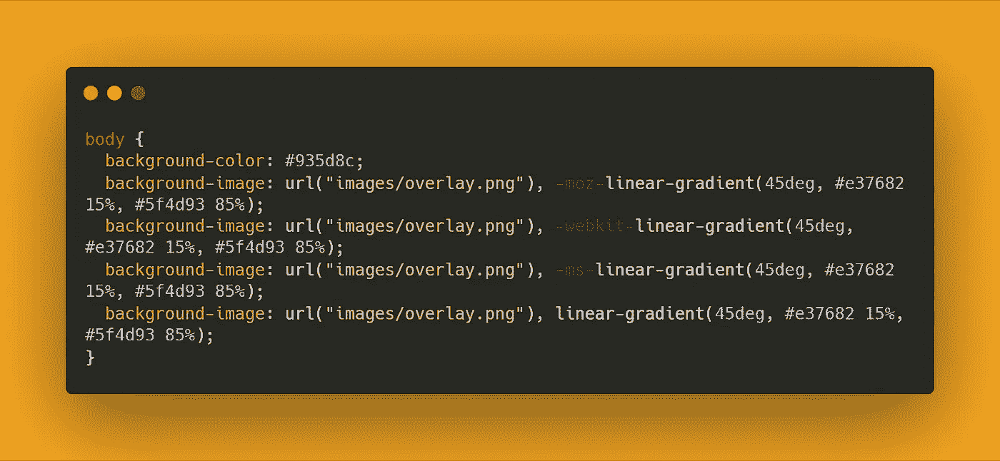
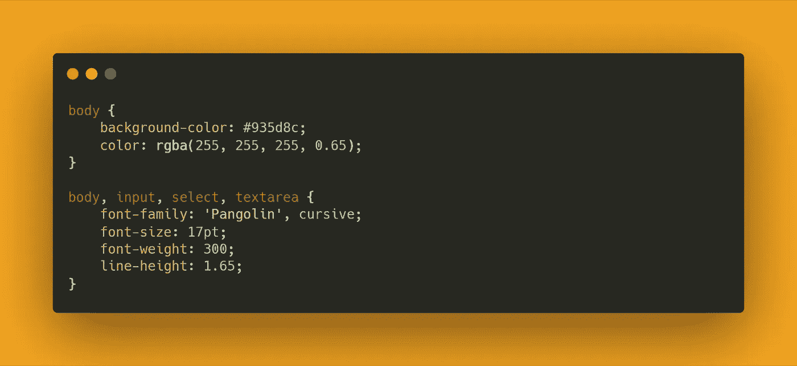

# 我如何在 10 分钟内获得在线作品集？

> 原文：<https://blog.devgenius.io/lets-building-your-online-portfolio-in-10-mins-a7e670b54eca?source=collection_archive---------15----------------------->

## 初学者指南

## 一个完整的前端初学者指南，通过编辑现有的模板来建立一个在线投资组合，并将其放在 GitHub 上。


照片由[克莱门特·H](https://unsplash.com/@clemhlrdt?utm_source=medium&utm_medium=referral)在 [Unsplash](https://unsplash.com?utm_source=medium&utm_medium=referral) 上拍摄

你好，这篇文章会给你一些关于如何创建你的投资组合以及作为初学者学习前端开发的想法。编辑现有的文件夹模板是掌握 HTML 和 CSS 技能的一个很好的练习，但建议尝试从头构建一个新的文件夹。

对于那些只想创建一个在线作品集以便在找工作时更好地曝光的人来说，也欢迎加入这个旅程！

简而言之，我们将首先在网上挑选一个模板，然后将其编辑成我们自己的风格，最后，将其放在我们的 GitHub 页面上，以获得一个分享给我们朋友的 URL 链接，或者将其放在我们的社交媒体上。

# 在我们开始编辑之前:

请安装代码编辑器和浏览器。

我个人将在 [Visual Studio 代码](https://code.visualstudio.com/)上编码，并在谷歌 Chrome 上显示。这里有一个提示给那些在 VScode 上编码的人，安装一个叫做 live-server 的扩展。这个扩展将使我们的代码体验更好，每当我们在 VScode 上保存代码时，它都会刷新浏览器。


虚拟代码的左上角


VScode 的右下角

这里有一些关于什么和为什么的额外链接，请随意看看。不去查看这些链接是完全没问题的。

*   [什么是 HTML、CSS、JavaScript？](https://medium.com/dev-genius/html-css-javascript-8b67a0b9796b)
*   [什么是 GitHub，为什么是 GitHub？](https://medium.com/@fengyuan.yap/what-is-github-260412a0dcd7)
*   [如何免费部署网页？](https://medium.com/dev-genius/how-to-deploy-a-webpage-for-free-af3588cd32f9)
*   [什么是代码编辑器&如何选择？](https://medium.com/@fengyuan.yap/what-are-code-editors-ide-37727d6b8060)

# 挑选模板

网上有大量免费资源。选择一个符合你风格的并下载到你的本地机器上。请注意，我们至少需要 HTML 和 CSS 文件。我选择了 HTML5up.com 上的 Stellar，可以随意克隆 Git[GitHub repo](https://github.com/TheKinng96/Medium10minsPortfolio)。[不知道怎么克隆？](https://medium.com/dev-genius/git-to-getting-repos-from-others-ff829802ba54)

[](https://html5up.net/) [## HTML5 以上

### 由@ajlkn 设计并在 Creative Commons 许可下发布的响应式 HTML5 和 CSS3 站点模板。

html5up.net](https://html5up.net/) [](https://www.free-css.com/free-css-templates) [## 3055 免费网站模板

### 有人问我们是否可以建立一个免费 CSS 中所有免费网站模板的概述…

www.free-css.com](https://www.free-css.com/free-css-templates) 

# 关于文件夹和文件:

在我们进入 VScode 之前，让我们看看惊喜盒子里有什么。


在 zip 文件夹中

删除 elements.html，因为它只是一个文件，显示该模板中使用的元素的设计。让我们深入了解一下资产。


在资产文件夹内

资产文件夹存储代码。正如你可能意识到的，所有的代码都是按照它们的功能分组的，同样，代码也是以小组件的形式编写的。把所有的代码都写在一起也就是说所有的 CSS 都在一个文件中是可能的，但是这会降低你的代码的可读性，因为它可能有 1000 多行代码。

顺便说一下，除了 webfonts 和 sass，我们将只编辑每个文件夹中名为 main 的文件。Sass 是一种 CSS 编写模式。

# 开始剪辑吧！！！

## index.html

这是投资组合的主页，我们的故事从这里开始。PS 记得打开 vscode 上的 live-server 扩展，否则，您需要手动刷新浏览器来检查更改的代码。

在 HTML 文件中，所有东西都被包在左箭头括号`<a></a>`或右括号`<a />`中。写在左括号中的文本将在浏览器上显示，而在右括号中只能执行内置函数。举个例子，

```
<a>
   <b>MESSAGES</b>
   <c />
</a>
```

上面显示了如下的概念，但是在浏览器上，只会显示“消息”。这是 HTML 文件中的基本概念，通过了解它，现在我们可以看到文件夹中有什么以及如何改变它。


## `<head>`一节

此部分表示浏览器点击时显示的元素。


标题旁边的图标称为 favicon，它可以是 ico、png 或 SVG 文件。

我们来看看如何编辑。


实际上，这里只有两件事你可以调整:标题和`<title>`下面的`<link>`。随意更改“给你的网页加个标题”并刷新你的浏览器，看看会发生什么:)记得在切换到浏览器之前保存一次文件。此外，在代码编辑器中编辑 index.html 时，在浏览器中保留 index.html 是完全可以的。

关于 favicon，你需要改变`href= “”`里面的链接，链接模式和终端里的目录地址一样。简而言之，文件夹是基本文件夹，如果你把 favicon 放在 images 文件夹中，那么你可以复制并粘贴上面的代码，但是，如果你把 favicon 放在基本文件夹中:`href= “favicon.png”`。

# 章节

这是编辑练习的主要部分。`<body>`里面的代码会显示在浏览器主体中，这就是为什么是`<body>`的原因。LOL。

在我编辑的文件夹中，主体看起来像这样…


了解网页的组成部分是至关重要的，尤其是你想从头开始创建一个新的网页。对你将要编辑或构建的东西有一个清晰的心态将会节省你的时间和精力。

标题包含徽标、姓名标签和简短的简历或消息类文本。


与 favicon 相同，要替换徽标，只需更改`scr= “”`中的地址，而`alt`是当徽标以某种方式不显示时您想要显示的消息。

如果你想改变字体大小和颜色，不用担心，我们会在 CSS 编辑中完成。记住，HTML 文件只是网页的骨骼。

这是导航栏部件，它会将观众引导到正文的相关部分。导航条是可选的，如果你不想要，可以随意删除下面的代码。


只需将“主体部分 X”编辑为您的投资组合部分的名称。如果你想有更多的部分:复制并粘贴`<li><a href= “#XXX”> Body Section </a></li>`。详细来说，`<a></a>`是链接标签，它会指引你到指定的地方，在这种情况下，`href= “”`里面的地址就是目的地。`#XXX`意为把观众带到`id = “XXX”.`的容器前

现在你可能会问，什么是`id`？`id`是那些在 HTML 文件中唯一的容器的 HTML 标签。`id`可进一步在 CSS 和 JavaScript 文件中调用，以分配特殊模式或功能。另外，你可能会发现在`<li>`的第一行有一个`class= “active”`。`class`是另一个类似于`id`的标签，但是`class`可以重复使用。这些标签将在另一篇文章中详细讨论。

## 主体部分 1

所有主体部分都可以相互替换。您可能会发现`<section>`标签，为了替换和复制模板中的某个设计，复制并粘贴整个`<section> … </section>`。


还记得导航条部分的`<li><a href= “#intro”> Body Section </a></li`吗？第一行有一个`id = “intro”`，这个会被`#intro`的 navbar 调用。对于主体，只需用自己的内容替换`<h2>`和`<p>`。

`<p>`后面的`<li>`标签是按钮，同样的事情在这里`href`会把你带到指定的目的地。在这种情况下，该按钮将引导您到另一个名为`generic.html`的 HTML 文件。如果您不想创建它，请随意删除它。此外，“`Link to another page`”是您希望在按钮中显示的文本。``是图像标签，通过替换`src = “”`，你的 jpg 文件会显示在那里。

如果你担心 jpg 文件太大，可以看看这篇文章:)

[](https://medium.com/dev-genius/get-your-code-minimized-b6eda365ab79) [## 让你的代码最小化

### 所有高级开发人员都知道的技能，初级开发人员也应该知道。

medium.com](https://medium.com/dev-genius/get-your-code-minimized-b6eda365ab79) 

## 主体部分 2

这一部分很长，但是相信我，这里的代码是一样的。这一部分使用三个大图像来吸引观众的眼球，如果你在浏览器上看一看 index.html，这一部分是简单的。


深呼吸并阅读代码，现在，你可能对模式很熟悉，知道在哪里以及如何替换代码。只有一部分你可能不知道，那就是如何改变圆圈中显示的图像。

这里的答案是图像隐藏在`fa-code`、`fa-copy`和`fa-gem`中。这些是 [font awesome](https://fontawesome.com/) 标签，图像被物理地存储在 [font awesome](https://fontawesome.com/) 云上，我们使用这些代码来调用它们。另一篇文章提供了更多信息。(链接将尽快在此发布)

额外收获:获得字体很棒的图标。


`<i class= “fas fa-chart-pie”></i>`本身可用。另一篇文章中有更多。

## 正文第 3 部分

这部分是另一个很酷的设计，但我不认为这部分有用，因为它可能很难被自己的内容所取代…


老实说，我不知道我可以替换什么作为投资组合，但我也会分享如何编辑它们。教育背景只是这个设计在我脑海中弹出的唯一一件事…


现在你一定很有信心了，因为这里所有的代码都和上面几节完全一样。您可能需要知道的唯一事情是页脚中按钮部分的目的地。选择正确的方式来写`href`:

```
href = "[https://medium.com](https://medium.com/dev-genius/get-your-code-minimized-b6eda365ab79)"
href = "#XXX"
href = "images/example.html"
href = "example.html"
```

## 页脚部分 1 + 2

这个模板在页脚有两个部分，我想第一部分是引导观众到第二页，可能是简历或经验分享。页脚的第二部分是社交媒体和联系人的链接。


基本上同样的事情在这里，它必须是容易的东西，因为你一直跟随到这里。`#`标记是 `none`或`null`，在链接中不告诉浏览器任何东西。将所有的`#`替换成你的主页链接，比如`"[https://medium.com/@fengyuan.yap](https://medium.com/@fengyuan.yap)"`。另外，你可以随意删除不必要的内容。

底部的`&copy;`就是标记。在那里加上你的详细资料，通常会写上你的姓名和年份。同样，像往常一样替换或删除`<a>`标签。

## 现在是 generic.html 的时候了

正如你可能看到的，index.html 和 generic.html 的模式都是一样的。这是因为我们只是想改变内容的主体，所以我们对页眉和页脚保持相同的设计。要创建第三个页面，您可以进一步复制和粘贴整个 HTML 代码，并编辑正文内容部分。

你可能会想:好吧……所有的网页都是这个拷贝粘贴工作流程创建的吗？

当然不是！当您掌握基本的 HTML、CSS 和 Javascript 时，ReactJs、AngularJs、Django 等工具可以让您创建更加动态和灵活的网页。但在这个阶段，知道和理解基本要素比学习那些高级解决方案更重要。

# HTML 完成

恭喜你，你现在已经完成了 HTML 部分。看起来很长，但是相信我，当你理解了这个过程，HTML 可以在 10 分钟内完成。

它是 CSS 编辑的简称，我们不会去 JavaScript 编辑，因为这对初学者来说太难了。但是我们肯定会在其他文章中从基础开始讨论 JavaScript。

# 半铸钢ˌ钢性铸铁(Cast Semi-Steel)

CSS 是网页的技巧。换句话说，CSS 处理字体大小、字体颜色、背景颜色等等。在高级 CSS 使用中，你可以进一步创建简单的动画，比如向下滚动或切换昼夜按钮时出现的动画。

在这个模板中，CSS 以 CSS 和 Sass 样式编码，Sass 样式是 CSS 的高级版本。它比 CSS 稍微复杂一点，但是它同时给程序员带来了代码的灵活性。


与 HTML 不同，CSS 的风格是把东西放在花括号里。

## 要更改背景颜色

在`assets/css/main.css,`中，您将看到以下内容:



#935d8c 代表一种颜色，在代码编辑器中，你可以将鼠标指针移动到那里，颜色选择窗口就会出现。简单地改变那里的颜色，看看浏览器会有什么变化。

## 与字体相关的更改:

在同一个 main.css 文件中，向下滚动时应该会看到以下内容。


`body, input… textarea`是目标标签。字体粗细是你希望字体有多粗，字体家族可以在[谷歌字体](https://fonts.google.com/)上免费找到。

奖励:获得[谷歌字体](https://fonts.google.com/)


复制代码后，返回 CSS main.css 并替换字体系列。



对于 HTML 文件，将 link 标签添加到 head 部分。然后，您将看到浏览器上的字体样式更改为选定的样式。


# 恭喜你！！！！

到这里为止，你已经完成了整个过程中最难的部分。剩下的只是在 GitHub 上创建一个存储库，然后打开 GitHub 页面选项，让你的作品集活起来！！！

如果你没有听说过 GitHub，GitHub 基本上是程序员的脸书，提供免费的网页部署服务。

[](https://medium.com/@fengyuan.yap/what-is-github-260412a0dcd7) [## 什么是 GitHub？

### 这是一篇面向初学者的文章，讲述了为什么我们应该使用并上传我们的代码到 GitHub。以下是我对…的回答

medium.com](https://medium.com/@fengyuan.yap/what-is-github-260412a0dcd7) [](https://medium.com/dev-genius/how-to-deploy-a-webpage-for-free-af3588cd32f9) [## 如何免费部署网页

### 本文讨论了 4 个不同网站(GitHub、Netlify、Pythonanywhere 和 Heroku)上的代码部署…

medium.com](https://medium.com/dev-genius/how-to-deploy-a-webpage-for-free-af3588cd32f9) 

完成后的版本应该是这样的。

## 感谢您的阅读。如果你真的是零到前端编程，这是漫长而艰难的。希望你喜欢编码的过程。您现在是初级开发人员:)