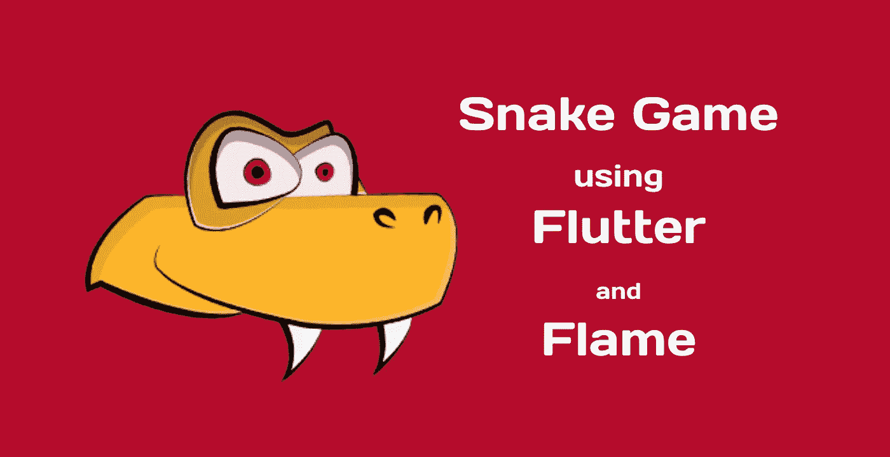
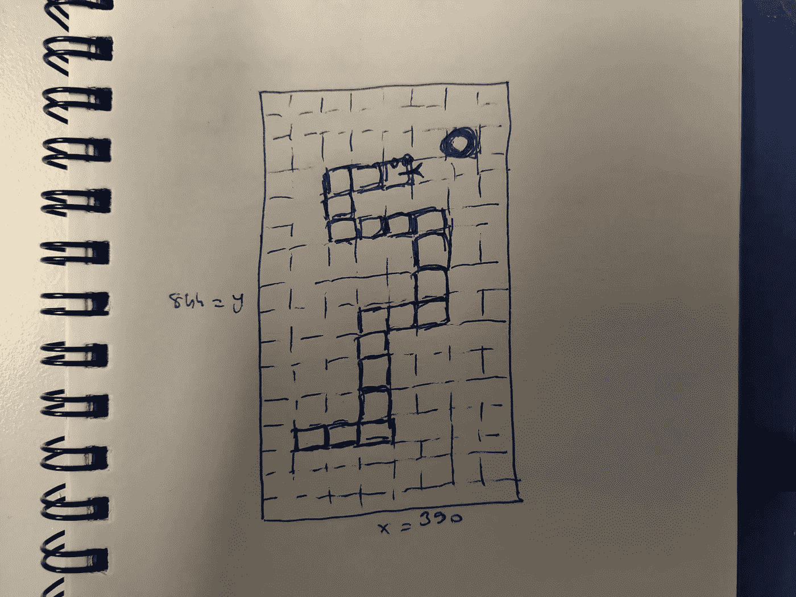
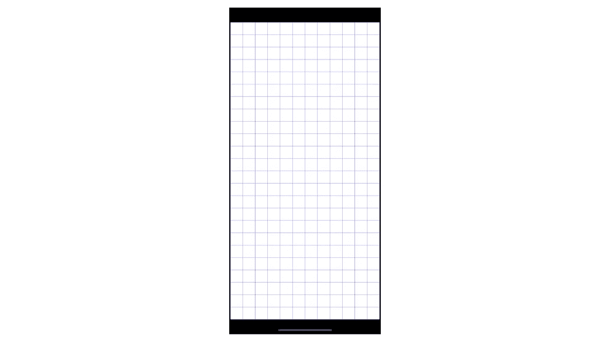
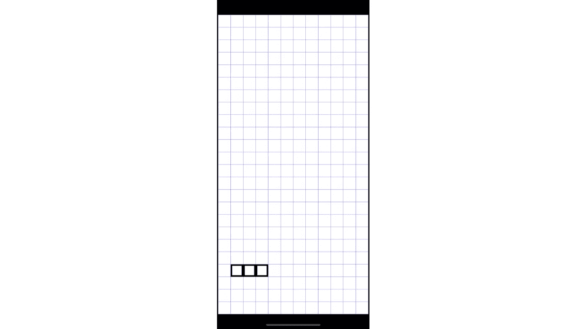
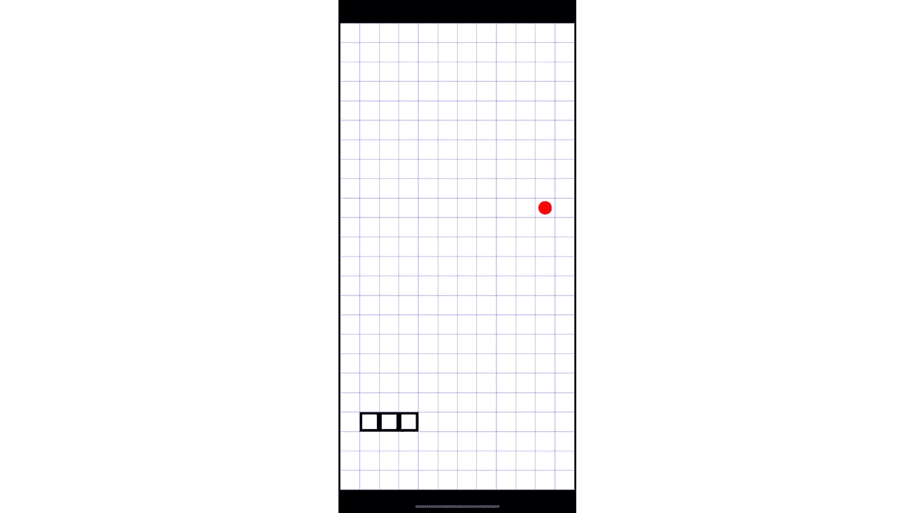
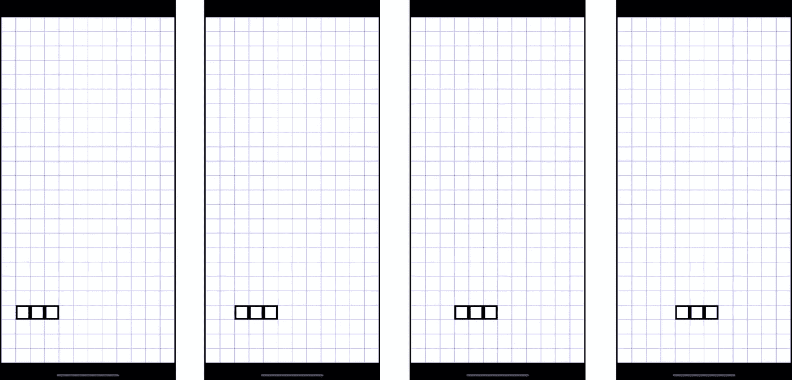

# 让我们用旋舞和火焰创造一个蛇的游戏！

> 原文：<https://blog.devgenius.io/lets-create-a-snake-game-using-flutter-and-flame-38482d3cf0ff?source=collection_archive---------2----------------------->

## Snake 就是这样一个经典的流派——为数不多的让人会心一笑的记忆之一。

在本教程中，我们将学习**火焰游戏引擎**的基础知识，并创建一个可玩的**蛇**游戏。这将是**第一次**迭代。我打算实现精灵，动画，音频，人工智能，电源，货币化，和其他各种次要的概念。密切关注最新动态。

# **我们开始吧！**

如果您只是为了**代码**而来，您可以直接跳到存储库。请留下反馈，给一颗星，或贡献力量！

 [## GitHub-erdi izgi/flute _ flame _ snake:一个使用火焰引擎编写的带有颤振的蛇游戏

### 一个用火焰引擎编写的蛇游戏。这个项目是一个应用程序的起点。一些…

github.com](https://github.com/erdiizgi/flutter_flame_snake) 

我总是从勾画出我想要实现的目标开始。正如你在下图中看到的，这是一幅非常简单的画。

对于这个迭代，我有三个任务。

*   **基于网格的背景:**虽然可以帮助蛇指引方向，但并不总是必要的。
*   **一条正在生长的蛇:**一群相连的方块在网格上爬行。当蛇吃掉食物时，它会扩大一个正方形。
*   **食物:**网格上随机出现一个红圈。

不会有花哨的图形，我们将只看到一个组件是如何工作的。

## 绘制背景

**背景**是一项相当基本的任务。

*   **画一些**柔和的蓝线形成网格。
*   该网格应位于屏幕的**中心**。

就这样。首先，我们定义**某些参数**来帮助我们计算这个网格的大小。

> 小技巧 1:永远使用一个**独立的配置类**，你可以在不影响其他类的情况下微调你的游戏。对游戏的样式和所有文本使用相同的方法。

这些参数足以进行计算，但我们仍然需要**画布大小**来集中网格。幸运的是，每个*火焰游戏*实例都可以访问*详细说明*。因此，我们可以利用它来计算网格偏移。

> 提示 2: **火焰游戏**是你游戏的**基础类**。它可以访问有用的设置，如**相机、画布和组件树**。您可以在这里**为您的游戏添加**和**管理**组件。 **onLoad 方法**是初始化游戏的好地方。

*SnakeGame* 和 *OffSets* 就是上面显示的两个类。 *SnakeGame* 访问*canvasize*并使用它来构造 *OffSets* 对象。这个便利类返回**网格的开始和结束坐标**。最后可以画出我们的背景。

> 提示 3:火焰有一个**组件系统**。有许多不同种类的组件，但最常见的是**位置组件**，它允许您指定实体的位置。这里有三个主要的可重写方法: **onLoad、render 和 update** 。o **nLoad** ()是你初始化组件的地方， **render** ()是你在画布上画东西的地方， **update** ()在每一帧被调用。

我们在**渲染**的第一行绘制一个白色矩形。这将是网格的背景。然后根据**起点和终点坐标点**绘制**垂直线**和**水平线**。读完代码后，您会发现这是多么简单。

> 提示 4:火焰有一个 **HasGameRef** Mixin。这包括对*火焰游戏*的引用。有了 **gameRef** 字段，你可以获得你游戏类的所有公开信息。

最后，我们必须将这个 ***背景*** 组件包含在 ***蛇游戏*** 中，以便在程序启动时渲染。

你可以在下面看到结果。

> 提示 5:你的游戏类(它扩展了 **FlameGame** )必须用 **GameWidget** 包装，才能在任何地方作为 Flutter **widget** 使用。

## 蛇形实体

渲染一条蛇就是**渲染网格的单元格**。所以我们先定义一个网格。它不需要成为一个**组件**，因为它只是一个数据结构——**一个 2d 数组。**

我还包含了一个方便的方法 *findCell* ，如果没有找到单元格，它会返回一个边框。每个单元格都将有一个**状态**，我们将根据状态来渲染单元格。此刻，**单元格**组件就会这样出现。

这里发生了两件事:

*   onLoad 方法计算**单元格**的位置。
*   render 方法检查*单元格类型*并决定绘制什么。

> 技巧 6:避免使用大的渲染方法。如果可能，应该使用不同的实用程序类来呈现每个组件。如果你以后需要更新一些东西，这将使它变得更容易。

蛇的身体部位只是一堆**黑色的长方形**。上面的这个实用程序类在将**开始和结束偏移量**绘制到*画布*之前计算它们。

现在，一些类需要保持 snake 实体的**状态。出于这个原因，我们设计了一个 *Snake* 类，它只是一个 *LinkedList* 包装器。**

我还包含了像 addFirst 和 removeLast 这样的方法，这些方法在蛇移动时会很有用。

我们现在有了一个*网格*和一个*蛇*，但是我们需要一个**容器**类来封装游戏逻辑。这将是 ***世界*** 阶层。

***蛇*** 对象由 ***世界*** 组件初始化。它也可以用来初始化网格，但我认为这种方法更直观。我们现在有更多的组件必须被添加到游戏中来渲染。

一旦所有的东西都渲染好了，场景就会变成这样。

## 食物

到目前为止，我们有一个背景和一个静态的蛇。先从食物逻辑说起，再动蛇。网格应该负责为食物随机生成一个单元格，因为它知道哪些单元格是空的。

前面的函数首先**根据**是否为空**过滤**所有单元，然后**生成随机索引**。最后，将 ***cellType*** 改为 *food* 。

上面的这个实用程序类首先计算单元格的中点和半径，然后绘制一个红色的圆。最终结果将如下所示。

## 移动蛇

我们需要知道**蛇的方向**才能移动它。第一个方向将' ***向右*** . '我们可以使用方向来计算下一个单元格。一旦我们知道了下一个单元格，逻辑就很简单了。

我们从蛇的身体上取下最后一个细胞，让下一个细胞成为新的头部。这个简单的技巧会给人一种蛇在动的感觉。

## 动态 FPS

移动逻辑的问题是，当引擎设置为**每秒 60 帧**时，蛇移动太快。因为这相当于每秒 60 次**移动调用**。因为蛇的速度是游戏难度因素之一，我们应该能够动态调整它**。我设计了一个**自定义火焰组件**，它将根据提供的 fps 配置调用更新功能。**

> **提示 7: Flame 组件包含一个**更新**方法，该方法采用一个名为 **delta time** 的参数。该值代表******前一**帧和**当前**帧之间经过的时间**。****

**它只需**累计δ时间**，然后在达到预定值时运行***updateDynamic***功能。如果你回忆一下，我们在上面定义了 ***世界*** 组件；基本上 ***世界*** 组件会**扩展**这个**动态 fps 组件**以可玩的方式运行游戏逻辑。**

## **输入处理问题**

**我们已经修复了 **FPS 问题**，但是这个解决方案引入了一个新的问题:**输入管理。**通常，在游戏中，你会看到，如果输入是鼠标右键单击，就这样做，等等。然而，因为我们运行在一个**低帧速率**，用户可以在帧之间输入几个输入。我们不想错过他们的意见！**

**当这种情况出现时，最常见的解决方案是使用一个**队列**。它只是将输入添加到一个队列中，当帧被渲染时，我们从队列中执行**第一个命令。为了避免有太多的输入等待，我应该限制队列的大小。****

**在我们的游戏中，输入就是触摸。我想让蛇跟着水龙头的方向走。因此，队列保持屏幕上的**触摸点。****

**我还创建了 evaluateNextInput(snake)方法。这个方法做三件事:**

*   **获取第一个接触点并将其从队列中移除。**
*   **它计算从蛇的头部到触摸位置的位移向量。**
*   **它根据计算出的向量的方向来决定和设置蛇的方向。**

> **提示 8: Flame 有一个名为 **TapDetector** 的 mixin，它有一个关于 TapUp 的方法(TapUpInfo)。 **TapUpInfo** 包含触摸点，因此使用 Flame engine 进行输入处理相当容易。**

**在这里，我将 ***TapUpInfo*** 委托给世界组件，并在那里进行评估。有意义是因为逻辑发生在这个类中。**

**现在，我们保持输入处理简单，它不会成为游戏难度的一个因素。**

## **养蛇**

**现在我们的蛇动了，需要喂养，需要成长。**的成长逻辑**也很简单易懂。这和移动逻辑是一样的，但是我们没有移除蛇的最后一部分。**

## **游戏逻辑**

**正如您可能理解的那样，将所有代码放在这里是不可能的。请检查仓库的详细资料。但是，我们可以在这里检查主要的游戏逻辑。**

*   **我们首先**检查游戏是否结束**，如果没有，我们**评估队列中的下一个输入**。这将设置蛇的方向。**
*   **基于新的方向，我们**计算下一个单元格**。**
*   **如果下一个单元格不是边界，我们**检查蛇是否已经崩溃**到它自己。**
*   **然后我们检查下一个单元的单元类型。如果是**食物**，**蛇生长**并在网格上生成新的食物。**如果没有**，**蛇就移动**。**

**我认为这很清楚。**

## **[网络演示](https://erdiizgi.github.io/flutter_flame_snake/)**

**你可以在这里玩[**网页试玩**](https://erdiizgi.github.io/flutter_flame_snake/) 看看游戏目前的状态。请随时提供反馈，并且[为**库做出贡献。**](https://github.com/erdiizgi/flutter_flame_snake)**

## **下一次迭代的任务**

*   **添加菜单和评分**
*   **为蛇使用精灵和动画**
*   **水平设计**
*   **创建一个比屏幕尺寸更大的世界(使用摄影机和视口)**

**请为这个游戏提供一些新鲜的想法。你可以跟我来了解项目的最新进展。**

**感谢您花时间阅读本文。**

# **资源**

*   **[安装火焰](https://pub.dev/packages/flame)**
*   **[火焰储存库](https://github.com/flame-engine/flame)**
*   **[火焰网站](https://flame-engine.org/)**
*   **[文档](https://docs.flame-engine.org/1.0.0/)**