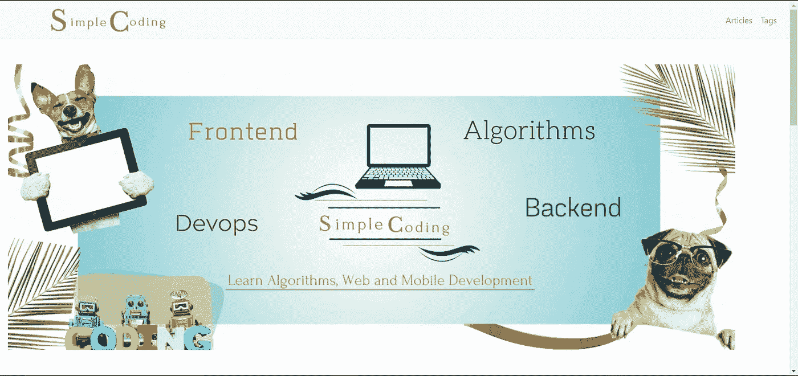
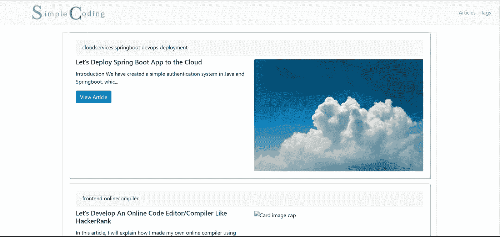
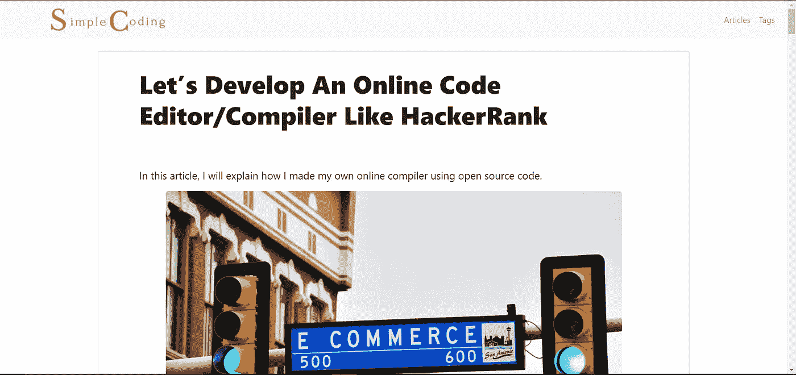
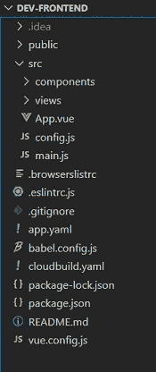
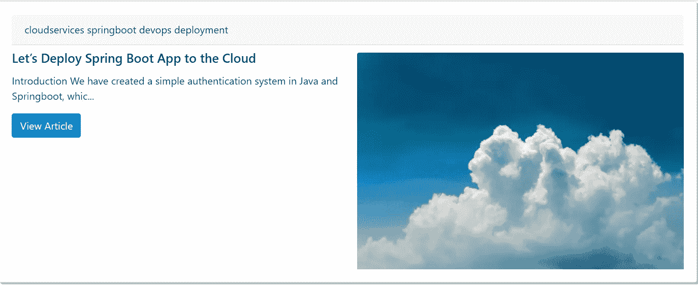
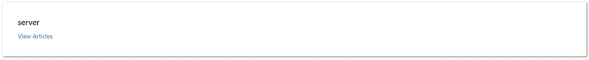
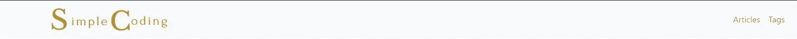
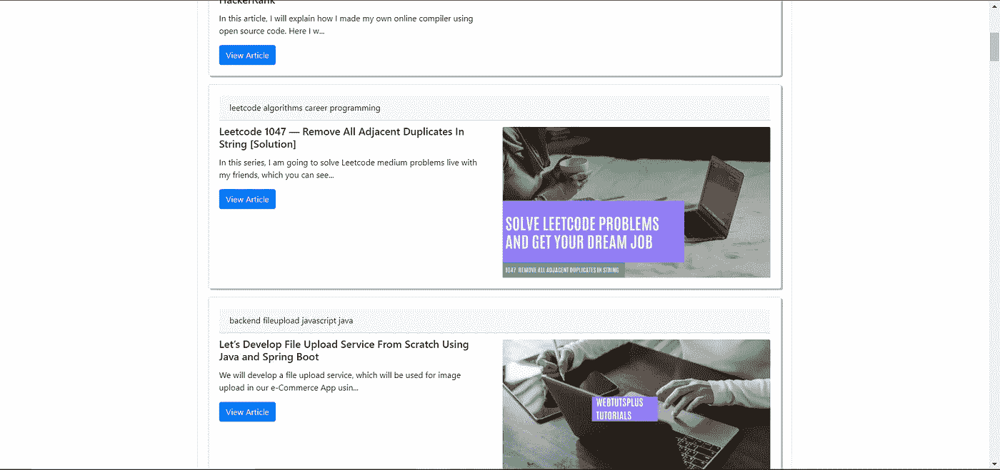
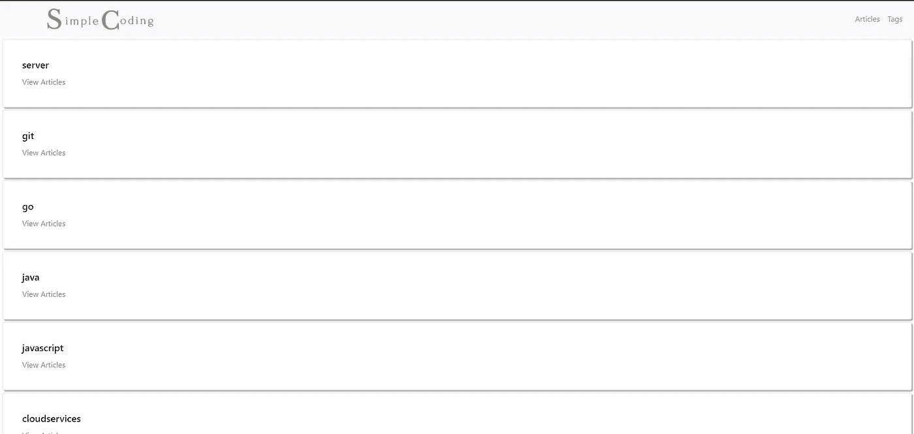

# 让我们为 Forem 后端创建一个 VueJs 前端

> 原文：<https://blog.devgenius.io/lets-create-a-vuejs-frontend-for-our-forem-backend-fa3b9f262f2?source=collection_archive---------6----------------------->

在本教程中，我们将使用 VueJS 为 Forem 后端创建一个前端，为 dev.to 网站提供支持

[HalGatewood.com](https://unsplash.com/@halacious?utm_source=medium&utm_medium=referral)在 [Unsplash](https://unsplash.com?utm_source=medium&utm_medium=referral) 上拍照

在[之前的教程](https://medium.com/p/82286f8cb39f/edit)中，我们在 GitHub 上克隆了 [Forem 的回购](https://github.com/forem/forem)并托管在 Google Cloud 上。我们还创建了一些 API，这样我们就可以使用它的后端存储的信息。

在本教程中，我们将使用 VueJs 创建一个新的前端，并使用这些新创建的 API。

# 我们将建造什么

我们将开发以下网站:- `[https://simplecoding.dev/](https://simplecoding.dev/)`

主页

所有文章页面

文章页面

# 先决条件

我们假设您了解以下方面的基础知识

*   蜜蜂
*   VueJS CLI
*   自举 4

您必须在计算机上安装以下软件

*   NPM
*   节点. js
*   一个好的编辑器(推荐 JetBrains WebStorm/IntelliJ IDEA/MS Visual Studio 代码)
*   好的浏览器(推荐谷歌 Chrome)

# 当心

如果你想看这个教程而不是看，可以在这里看。下面的视频先解释后端代码，再解释前端部分。

简单编码

# 让我们编码

现在是时候动手为我们的前端编写代码了。

**第一步:安装 Vue Cli**

*   使用以下命令在您的 PC 上安装 vue CLI—`npm install -g @vue/cli`
*   使用下面的命令创建一个新的 Vue 项目— `vue create frontend`。这将创建一个名为`frontend`的新目录，其目录结构如下

目录结构

**第二步:创建一个显示文章的组件**

*   让我们创建一个可以显示每篇文章的组件。该组件将使用 URL 中出现的 slug 从 API 获取文章的内容
*   为了从 API 获取数据(在我们的例子中，是整篇文章)，我们将使用 [axios](https://www.npmjs.com/package/axios) 库。你可以使用`npm install axios --save`安装 axios
*   每篇文章还需要一个评论区，读者可以在这里发表评论。为此，我们将使用 [disqus](https://disqus.com/features/engage/) API。在继续本教程之前，您必须在他们的网站上创建一个帐户，并为您的应用程序生成密钥。
*   如果您阅读了前面的教程，您会知道我们的 API 返回一个带有属性`processed_html`的 JSON 对象。这个属性包含文章的 HTML 代码。现在，因为我们的文章包含了 gist，这个 HTML 代码也有一些脚本标签。这些脚本不会被执行，因为 VueJS 是一个前端框架，这些脚本将在浏览器执行完 VueJS 代码后加载到 DOM 中。因此，我们需要手动执行脚本。为此，我们将使用一个名为[postscript](https://www.npmjs.com/package/postscribe)的节点模块。您可以使用`npm install postscribe --save`安装 postscribe
*   你可以在`/src/components/Article.vue`中粘贴以下代码

**第三步:创建一个列表，查看所有文章和标签**

*   我们必须在我们的前端显示所有文章的列表。为此，我们将首先创建一个名为`ArticleCard.vue`的组件。这个组件将代表列表中的每一个条目。
*   将下面的代码粘贴到`/src/components/cards/ArticleCard.vue`

*   这是每张物品卡的样子

物品卡片

*   现在，我们将创建一个名为`ArticleList.vue`的新组件。在这个组件中，我们将创建一个`ArticleCard`组件列表。将以下代码粘贴到`/src/components/lists/ArticleList.vue`

*   现在，我们将创建另一个名为`TagCard.vue`的组件。它将用于显示标签列表中的每个标签。将以下代码粘贴到`/src/components/cards/TagCard.vue`

*   这是每个标签卡的样子

TagCard.vue

**步骤 4.1:创建视图—导航栏**

*   到目前为止，我们只为 VueJS 应用程序创建了组件。现在，我们将使用这些组件创建视图。
*   首先，我们将使用 Bootstrap 4 创建一个导航栏。将以下代码粘贴到`/public/index.html`

*   这是 Navbar 的样子:-

导航条

**步骤 4.2:创建视图——主页**

*   我们现在将创建我们网站的主页。在主页上，我们将显示我们网站的标志，并有四个标签的链接——算法，前端，后端和开发
*   将以下代码粘贴到`/src/views/HomePageView.vue`

*   这是我们主页的样子

 [## 开发前端

### 主页

简单编码](https://simplecoding.dev/) 

**步骤 4.3:创建视图—所有文章视图**

*   我们现在将创建一个视图，在其中显示所有文章的列表。我们将使用`ArticleCard.vue`和`ArticleLists.vue`组件。
*   将下面的代码粘贴到`/src/views/AllArticlesView.vue`

*   这就是`All Articles`页面的样子

所有文章

**步骤 4.4:创建视图—所有标签视图**

*   我们将创建一个显示所有标签的视图。我们将在这个视图中使用`TagCard.vue`组件。将以下代码粘贴到`/src/views/TagListView.vue`

*   标签列表将如下所示

所有标签

*   现在，我们将创建另一个视图，在该视图中，我们将显示包含特定标签的所有文章。我们将重用`ArticleList.vue`组件。
*   将以下代码粘贴到`/src/views/TagArticlesView.vue`

**步骤 4.5:创建视图—主页标签视图**

*   我们在主页中添加了四个标签的链接。我们现在将创建显示与这些标签相关的所有文章的页面。
*   将以下代码粘贴到`/src/component/views/FrontendHomePage.vue`

*   将以下代码粘贴到`/src/component/views/AlgorithmsHomePage.vue`

*   将以下代码粘贴到`/src/component/views/BackendHomePage.vue`

*   将以下代码粘贴到`/src/component/views/DevopsHomePage.vue`

# 就是这样

祝贺您完成教程。你只需要学习如何使用 Forem 的后端，稍微调整一下，为它创建一个单独的前端。你可以在这个 [GitHub Repo](https://github.com/webtutsplus/dev-frontend) 里找到前端的完整代码。