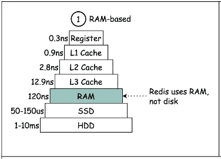
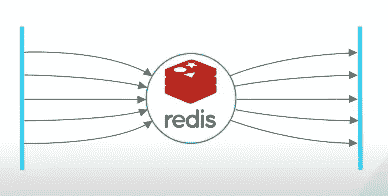
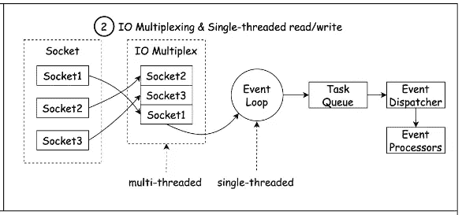
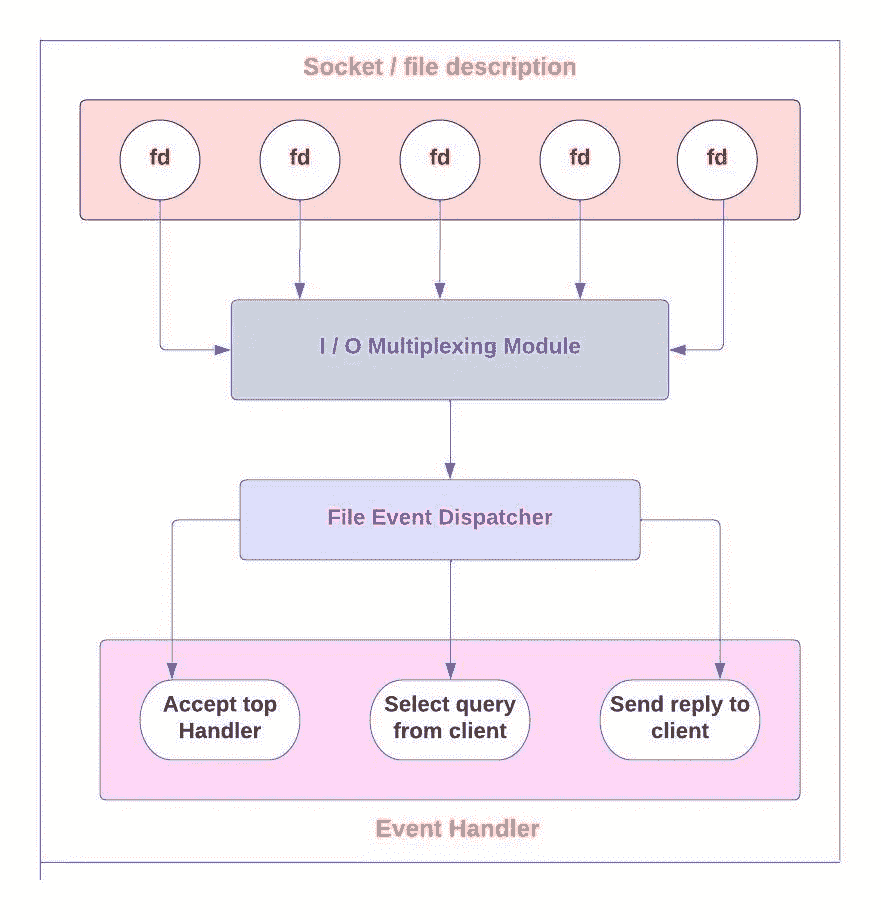
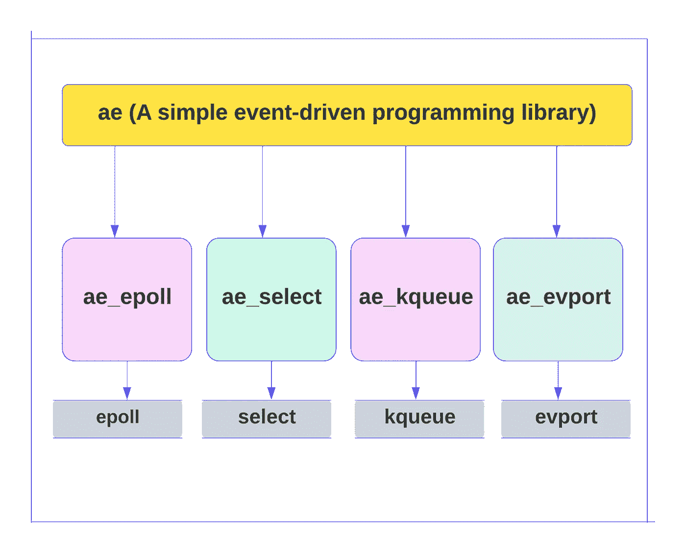
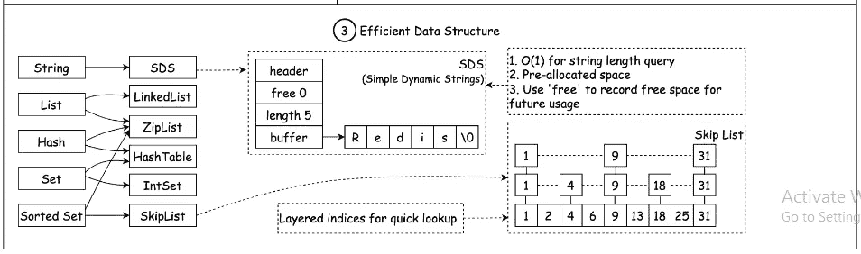

# 让我们在“红色地板”上跳舞

> 原文：<https://blog.devgenius.io/lets-dance-on-the-redis-floor-d93e02828bef?source=collection_archive---------4----------------------->

你好。！在当今世界，一切都是动态的，这意味着数据无处不在，并且在快速增长。为了管理这种快速的步伐，我们必须以同样的速度处理它，这就是“Redis”是我们用数据做自由式快速移动的舞池的地方。

前几天，我在用文档数据库做一些数据工程任务

> **何时…**
> 
> **查理·普斯 pinged 我:**
> 
> **这种情况持续多久了？:(**
> 
> **然后……**
> 
> **肖恩·蒙德兹回答道:**
> 
> **没有什么可以阻挡你回去使用**[**Redis**](https://redis.com/)**:)**

于是我放了同一首歌，设了高低音，在 Redis 舞池里跳了起来。数据以快节奏狂舞，地板是这样的…


嗯，一旦你使用 Redis，上面的例子是非常正确的，但是这些事情是怎么发生的呢？**为什么** 𝐑𝐞𝐝𝐢𝐬 **那么𝐟𝐚𝐬𝐭？**

因此，在本文中，我们将深入探究解释 Redis 的 **Fast** word 的事实。但在重点讨论这一部分之前，我们先请 Redis 介绍一下自己:


[**官方标志:Redis**](https://redis.com/)

> **雷迪斯:**
> 
> 我是一个开源的内存数据结构存储系统，我可以用作数据库、缓存和消息中间件。
> 
> **我支持多种类型的数据结构，如字符串、哈希、列表、集合、有序集合或 ZSet 和范围查询、位图、超对数和地理空间索引半径查询。常见的数据结构类型有字符串、列表、集合、散列和 ZSet。**
> 
> **我内置了复制(replication)、LUA 脚本(LUA scripting)、LRU 驱动事件(LRU 驱逐)、事务(transactions)和不同级别的磁盘持久化(persistence)，并通过 Redis 哨兵和自动分区(Cluster)提供高可用性。**
> 
> 我还提供了持久化的选项，这些选项允许用户将他们的数据保存到磁盘上进行存储。根据实际情况，可以在某个时间将数据集导出到磁盘(快照)，或者追加到命令日志中(AOF 只追加文件)，我会在执行写命令的时候将执行的写命令复制到硬盘上。也可以关闭持久化，将 me 作为高效的网络数据缓存功能。
> 
> **我不使用表，他的数据库也不会预定义或强制用户关联存储在我这里的不同数据。**

现在让我们谈谈它的快速处理，或者试着找出这个问题的答案:为什么𝐑𝐞𝐝𝐢𝐬如此𝐟𝐚𝐬𝐭？

***这里我们来关注一下:***

数据库的工作模式可以分为硬盘数据库和内存数据库。Redis 将数据存储在内存中，读写数据时不受硬盘 I / O 速度的限制，所以速度极快。

> *所以我们有 3 个部分来报道这个故事:*
> 
> **Redis 有多快？**
> 
> **详细说明 Redis 业绩高的原因。**
> 
> **影响 Redis 业绩的因素。**

# Redis 有多快:

要了解 Redis 的发展速度，你需要有一个评估工具。其次，Redis 需要一些平台经验数据来评估 Redis 在数量级上的性能。好在 Redis 提供了这样一个工具，并给出了一些常用硬件平台的体验数据。

下面是一篇长文，核心观点如下:

1.  Redis 基准可以用来评估 Redis 的性能。命令行提供了在正常/管道模式和不同压力下评估特定命令性能的功能。
2.  Redis 性能优异。作为键值系统，最大负载水平为 10W / s，set 和 get 耗时水平分别为 10ms 和 5ms。使用管道可以提高 Redis 操作的性能。

如果不关心具体数据，可以直接跳转到第二部分了解 Redis 表现优异的原因。

# Redis 绩效评估工具:

Redis 包括 Redis benchmark 实用程序，可以模拟 n 个客户端同时发送 total queries 的 m 个运行命令(类似 Apache AB 实用程序)。您可以使用 Redis 基准来评估 Redis 的性能。

支持以下选项:

```
Usage: redis-benchmark [-h <host>] [-p <port>] [-c <clients>] [-n <requests]> [-k <boolean>]

 -H < hostname > server hostname (default 127.0.0.1) -P < port > server port (default 6379) -S < socket > server socket (covering host and port) -A < password > server authentication key -C < clients > number of clients started (parallelism) (default 50) -N < requests > total requests (default 100000) -D < size > get and set request data size (default 2 bytes) --DB number selected by dbnum < DB > (default 0) -K < Boolean > 1 = keep alive 0 = connect (default 1) -R < keyspacelen > use random key value in set / get / incr and random VA in Sadd -P < numreq > the number of requests contained in a pipeline. The default value is 1 (pipeline is not used) -Q quiet mode. Only show QPS value --CSV output in CSV format -L generate loop to execute test permanently -T < tests > make the command of test command, and the command list is separated by commas -I idle mode, only open n idle connections and wait
```

在开始基准测试之前，您需要有一个正在运行的 Redis 实例。我尝试了一个带有默认参数的例子:

```
D:\data\soft\redis-windows>redis-benchmark.exe
.....
====== SET ======
  100000 requests completed in 0.81 seconds
  50 parallel clients
  3 bytes payload
  keep alive: 1

99.90% <= 1 milliseconds
99.93% <= 2 milliseconds
99.95% <= 78 milliseconds
99.96% <= 79 milliseconds
100.00% <= 79 milliseconds
123609.39 requests per second

====== GET ======
  100000 requests completed in 0.70 seconds
  50 parallel clients
  3 bytes payload
  keep alive: 1

100.00% <= 0 milliseconds
142045.45 requests per second

====== INCR ======
  100000 requests completed in 0.71 seconds
  50 parallel clients
  3 bytes payload
  keep alive: 1

99.95% <= 1 milliseconds
99.95% <= 2 milliseconds
100.00% <= 2 milliseconds
140252.45 requests per second
.....
```

在上面的例子中，set / get / incr 的测试结果被截取。

测试结果包括测试的环境参数(请求数量、客户端数量、有效负载)和请求时间的 TP 值。

> **默认情况下，Redis 基准测试使用 100000 个请求、50 个客户端和 3 个字节的有效负载进行测试。**
> 
> **返回的结果显示，set /get / incr 命令在 100000 次请求下的总请求时间小于 0.1s。以 QPS = 10W 为例，计算出的平均时间约为 2ms (1 / (10W / 50))。**

Redis 的性能与许多因素有关，这些因素将在第三部分详细介绍。比如客户端的网络状态，是否使用流水线，链接的客户端。为了展示 Redis 的速度有多快，我们使用了 Redis benchmark 在其官网上测试的一组数据。

> ***警告:*** *请注意，与今天的标准相比，以下大多数基准测试都是几年前使用较旧的硬件获得的。页面应该会更新，但在许多情况下，使用硬件状态，您将会看到两倍的数字。此外，在许多工作负载中，redis 4.0 比 2.6 更快*

## 硬件环境和软件配置:

```
The test was done by 50 clients executing 2 million requests at the same time.All tests are run on redis 2.6.14.The test was performed using the loopback address (127.0.0.1).Perform the test using a million key space.Perform tests with and without a pipeline (16 command pipelines).
Intel(R) Xeon(R) CPU E5520 @ 2.27GHz
```

## Redis 系统负载:

1.  ***无管道测试结果:***

```
$ ./redis-benchmark -r 1000000 -n 2000000 -t get,set,lpush,lpop -qSET: 122556.53 requests per second
GET: 123601.76 requests per second
LPUSH: 136752.14 requests per second
LPOP: 132424.03 requests per second
```

***2。使用管道测试结果:***

```
$ ./redis-benchmark -r 1000000 -n 2000000 -t get,set,lpush,lpop -q -P 16SET: 195503.42 requests per second
GET: 250187.64 requests per second
LPUSH: 230547.55 requests per second
LPOP: 250815.16 requests per second
```

> 从上面可以看出，Redis 作为一个关键值系统，其读写负载约为 10W + QPS。
> 
> 使用流水线技术可以显著提高读写性能。

## 耗时(没有管道的测试结果):

```
$ redis-benchmark -n 100000

====== SET ======
  100007 requests completed in 0.88 seconds
  50 parallel clients
  3 bytes payload
  keep alive: 1

58.50% <= 0 milliseconds
99.17% <= 1 milliseconds
99.58% <= 2 milliseconds
99.85% <= 3 milliseconds
99.90% <= 6 milliseconds
100.00% <= 9 milliseconds
114293.71 requests per second

====== GET ======
  100000 requests completed in 1.23 seconds
  50 parallel clients
  3 bytes payload
  keep alive: 1

43.12% <= 0 milliseconds
96.82% <= 1 milliseconds
98.62% <= 2 milliseconds
100.00% <= 3 milliseconds
81234.77 requests per second
....
```

> **所有 set 操作在 10ms 内完成，get 操作小于 5ms。**

# Redis 为什么这么快:

Redis 是一个单线程应用程序，这意味着 Redis 使用单线程来处理客户端的请求。但是不能用单线程的方式使用多核 CPU 性能，但是可以通过在一台机器上打开多个 Redis 实例来提高！

# **Redis 高性能的原因:**

嗯，我们有三个主要的原因让 Redis 快速和愤怒:

1.  在存储器中
2.  IO 多路复用和单线程实施
3.  优化的低层数据结构

所以让我们深入看看这三个原因:

# **内存存储:**



**Redis 中的内存存储说明(Credit: ByteByteGo)**

Redis 很快，因为它是一个内存数据库。内存访问比随机磁盘 I/O 快几个数量级。纯内存访问提供高读写吞吐量和低延迟。代价是数据集不能大于内存。就代码而言，内存中的数据结构也比磁盘上的数据结构更容易实现。这使得代码简单，并且有助于 Redis 坚如磐石的稳定性。

# IO 多路复用和单线程实施:

Redis 快速的另一个原因有点不直观。它主要是单线程的，这带来了一些问题。

为什么单线程设计会带来高性能？如果它使用线程来利用所有的 CPU 内核，不是会更快吗？

多线程应用程序需要锁或其他同步机制。众所周知，他们很难讲道理。在许多应用程序中，增加的复杂性容易导致错误，并且牺牲了稳定性，因此很难证明性能提升的合理性。对于 Redis，单线程代码路径很容易理解。

单线程代码库如何同时处理成千上万的传入请求和传出响应？线程在单独等待每个请求完成时不会被阻塞吗？



这就是 I/O 多路复用发挥作用的地方。通过 I/O 多路复用，操作系统允许单个线程同时等待多个套接字连接。传统上，这是通过选择或轮询系统调用来完成的。当有成千上万个连接时，这些系统调用的性能不是很好。在 Linux 上，Epoll 是 I/O 多路复用的一个高性能变体，它在恒定时间内支持成千上万个连接。这种单线程设计的一个缺点是，它不能利用现代硬件中所有可用的 CPU 内核。对于某些工作负载，在一台服务器上运行多个 Redis 实例以利用更多 CPU 内核的情况并不少见。



**IO 复用图解&单线程执行(Credit: ByteByteGo)**

让我们看看 Redis 是如何处理客户端连接的。

一般来说，Redis 使用一个反应器设计模式，封装了多个实现(select、epoll、kqueue 等。)来多路复用 IO 以处理来自客户端的请求。



**复用反应堆模式示意图**

反应器设计模式通常用于实现事件驱动。此外，Redis 封装了不同的库，用于在不同平台上复用 io。流程如下:



**Redis**中复用 I / O 不同库的封装示意图

因为 Redis 需要在多个平台上运行，为了最大化执行的效率和性能，会根据不同的编译平台选择不同的 I / O 复用函数作为子模块。

Redis 会优先选择时间复杂度为 O (1)的 I / O 复用函数作为底层实现，包括 Solaris 10 中的 evport，Linux 中的 epoll，Mac OS / FreeBSD 中的 kqueue。这些函数都使用内核的内部结构，可以服务于成千上万的文件描述符。

但是，如果当前的编译环境不具备上述功能，将选择 select 作为替代。由于它在使用时会扫描所有被监控的描述符，时间复杂度较差 o (n)，同时只能服务 1024 个文件描述符，所以一般不作为第一种方案使用。

# 优化的底层数据结构:

Redis 提供了丰富的数据结构和不同场景下的不同实现。

Redis 是一个关键的价值系统。不同类型的键对应不同的操作，或者操作对应不同的实现。同一个键也会有不同的实现。Redis 对 key 进行操作时，会检查类型，调用不同的实现。

为了解决上述问题，Redis 建立了自己类型的系统。该系统的主要功能包括:

Redisobject 对象。
基于重对象的类型检查。
基于 redisobject 对象的显式多态函数。
再贴现的分配、共享和销毁机制。

```
/*
 *Redis object
 */
typedef struct redisObject {

    //Type
    unsigned type:4;

    //Alignment bit
    unsigned notused:2;

    //Coding method
    unsigned encoding:4;

    //LRU time (relative to server.lruclock )
    unsigned lru:22;

    //Reference count
    int refcount;

    //Value to object
    void *ptr;

} robj;
```

> **类型、编码和 PTR 是三个最重要的属性。Redis 分别支持 4 种类型和 8 种编码:**

使用 redisobject，可以轻松实现特定键的操作过程:



**高效低层数据结构的说明(Credit: ByteByteGo)**

我们提到了 Redis 速度快的第三个原因。由于 Redis 是一个内存数据库，它可以利用几种有效的低级数据结构，而不用担心如何有效地将它们持久化到磁盘上——链表、跳表和哈希表就是一些例子。确实有人试图实现新的 Redis 兼容服务器，以从单个服务器中挤出更多的性能。凭借 Redis 的易用性、坚如磐石的稳定性和性能，我们认为 Redis 仍然提供了市场上最佳的性能和稳定性权衡。

> **Redis 除了提供丰富高效的数据结构，还提供 hyperloglog、geo index 等高效算法。**

因此，我们可以得出结论，Redis 是一个非常流行的内存数据库。它坚如磐石，易于使用，而且速度很快。根据 Stack Overflow 的年度开发人员调查，这些属性解释了为什么它是最受欢迎的数据库之一

这意味着…

**“让我们在 Redis 地板上跳舞”**意思是...

**“为我跳舞，为我跳舞，为我跳舞，哦，哦，哦！!"**

我们知道 Redis 快速性能的弦理论(嗯，我们已经探索了 WH 词的所有 10 个维度)，所以**“不要忘记尝试**[**Redis**](http://redis.com)**”**并继续关注即将到来的文章，我们将有一个**架构——乘坐 Redis 的过山车**！！

丁咚:这篇文章是与 Redis 合作的。

# 看到一些很酷的参考:)

*   [免费试用 Redis 云](https://redis.info/3NBGJRT)
*   [观看此视频，了解 Redis 云相对于其他 Redis 提供商的优势](https://redis.info/3Ga9YII)
*   [Redis 开发者中心——关于 Redis 的工具、指南和教程](https://redis.info/3LC4GqB)
*   [RedisInsight 桌面图形用户界面](https://redis.info/3wMR7PR)

非常感谢你的支持。再见！！