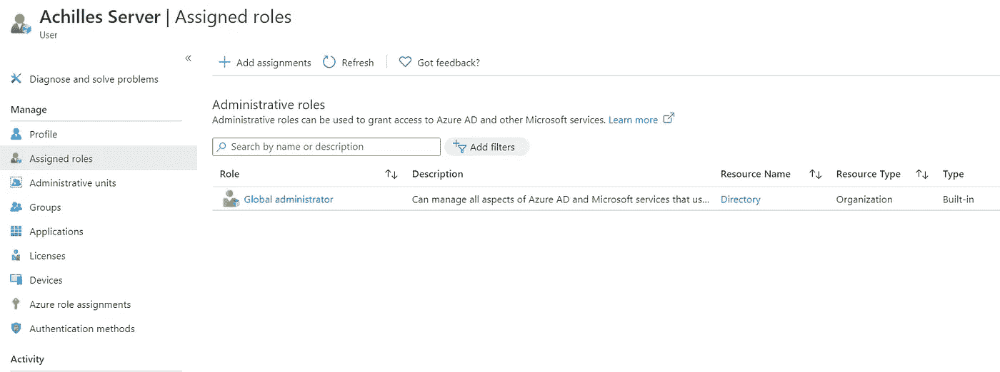
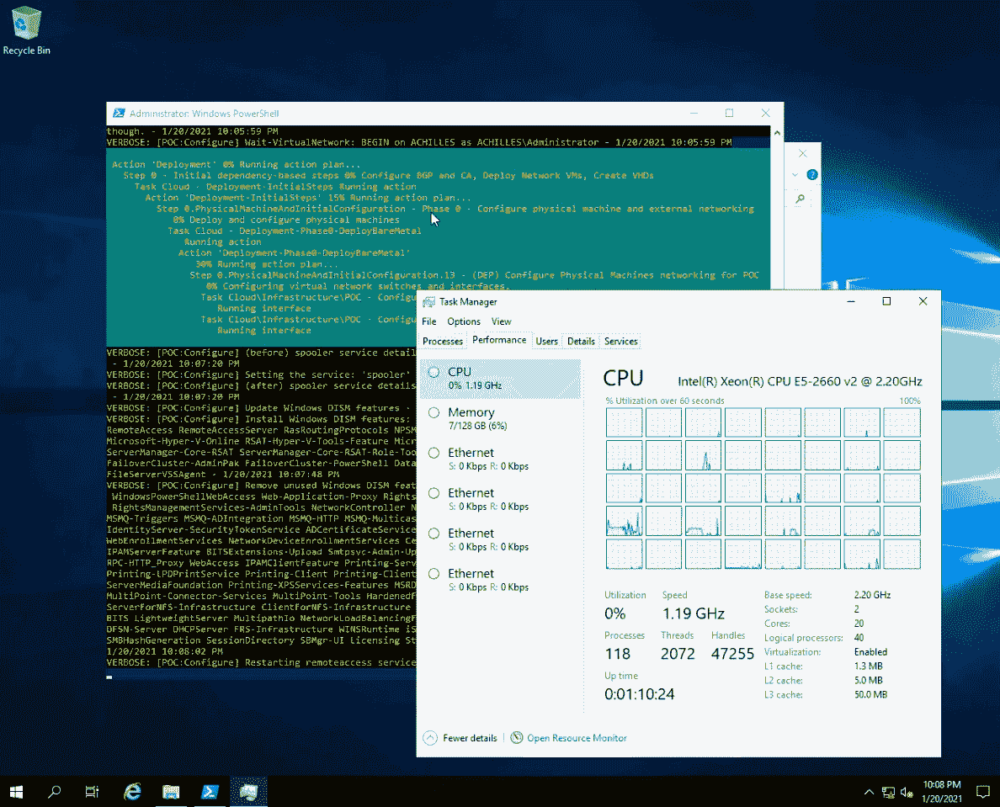
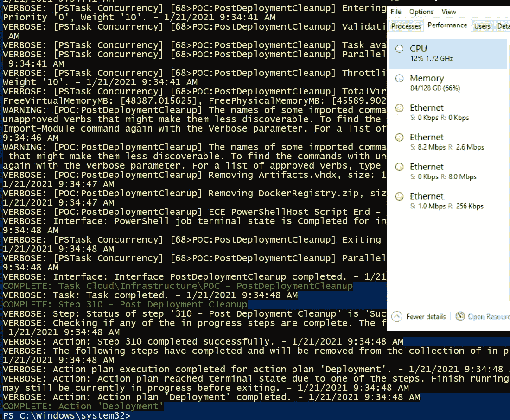

# 让我们部署 Azure Stack (Hub)开发工具包

> 原文：<https://blog.devgenius.io/lets-deploy-azure-stack-hub-development-kit-3973f2f753e0?source=collection_archive---------2----------------------->

Azure Stack Hub Development Kit(ASDK)是微软的 Azure Stack Hub(以前只是“Azure Stack”)的“免费试用版”，你可以在自己的硬件上托管它。从高层次来说，它将 Azure 带到了您的内部环境中。

ASDK 是 100%免费的，但根据微软的说法，不适合生产-但也许它对家庭实验室的使用足够好了。

# 警告

*   ASDK 部署无法更新-您必须从头开始重新部署！
*   没有数据冗余(通过 RAID、集群或其他方式)。
*   ASDK 需要 Azure 订阅(但不需要任何费用！)
*   并不是所有在 Azure 上能买到的东西在 ASDK 都能买到。Azure Stack 缺少的值得注意的东西:Azure Service Bus、Azure SQL for Postgres 和 Azure Functions Runtime v2 或 v3(在撰写本文时仅支持 v1，并且仅限于。NET Framework 4.x 函数)。

# 要求

## 随机存取存储

微软会告诉你 ASDK 需要大量的内存(192GB)，但今天我只用 128GB 就够了。96GB 是自动 ASDK 部署脚本中设置的最小容量。少于这个值，它们将在验证步骤抛出一个错误(脚本从一个配置文件中读取，其中 96 是硬编码的最小值，您可以更改这个值来安装小于 96GB 的 ASDK)。一旦安装完毕，Windows Server 上的 ASDK 会消耗 84 GB 的内存**、，所以你真的需要 96GB 或更多的内存来使用 Azure Stack 做任何事情。**

## **CPU 和磁盘**

**如果你愿意限制你创建的 Azure 资源，CPU 核心数是灵活的。安装 ASDK 后，CPU 使用率接近空闲。然而，磁盘要求是不可协商的。还要注意，没有数据冗余。**

**按照微软的说法，硬盘应该是独立的磁盘，不涉及硬件或软件 RAID。正确的做法是将服务器的 RAID 卡刷新为“IT 模式”或“HBA 模式”(实际上[与这里的](https://www.reddit.com/r/DataHoarder/comments/6o3f6a/dell_hba_mode_vs_it_mode_what_is_the_difference/)相同)。或者，如果主板上有足够的 SATA 端口，直接单独连接硬盘即可。如果这两个选项都没有，您可以将每个硬盘设置为自己的 RAID 0 阵列，这样它们就呈现为五个独立的磁盘。我已经这样做了，没有明显的缺点，但是有一些未知的 IO 性能损失。**

**如果您使用配有 Dell PERC 310 或 710 RAID 卡的戴尔服务器，此处的[是一个关于闪存到 IT 模式的极好指南。](https://fohdeesha.com/docs/perc/)**

## **网卡(以太网适配器)**

**我一直在使用内置在我的 Dell PowerEdge R720 服务器中的 Broadcom (QLogic now) NIC，但截至上个月，这似乎导致了 ASDK 部署的错误(“调用步骤 60 失败…未找到包…”)。将 Broadcom 网卡更换为 Intel 网卡后，部署成功，没有出现任何错误。**

**请注意，如果 ASDK 检测到服务器上有多个网卡，它将拒绝部署。如果您的服务器有一个内置的、不可移动的网卡，并抛出“步骤 60”错误，您可能需要获得一个英特尔 PCIe 网卡，并尝试在设备管理器中禁用内置网卡(如果可以，最简单的方法是物理移除网卡)。**

# **飞行前清单**

*   **一台符合 ASDK 硬件要求的服务器，包括至少 4 个驱动器用于数据存储，1 个驱动器用于运行 ASDK 的 Windows Server**
*   **RAID 卡被刷新到 IT 模式(可选)**
*   **带有 Windows Server 2016 或 2019 安装程序的 USB 驱动器**
*   **来自[微软](https://azure.microsoft.com/en-us/overview/azure-stack/development-kit/?v=try)的 AzureStackDownloader.exe**
*   **来自 [GitHub](https://github.com/Azure/AzureStack-Tools) 的 Azure Stack 工具**
*   **英特尔网卡(可选，但推荐)**

# **部署**

***基于*[*https://docs . Microsoft . com/en-us/azure-stack/asdk/asdk-prepare-host？view = AZS-2008*](https://docs.microsoft.com/en-us/azure-stack/asdk/asdk-prepare-host?view=azs-2008)**

**在我的 20 核 Ivy Bridge Xeon 服务器上部署大约需要 8 个小时(大约 2013 年)。**

**在部署和配置 NIC 的过程中，您可能会偶尔失去 RDP 连接，持续几秒钟。**

1.  **在操作系统磁盘上安装 Windows Server 2016 或 2019。**
2.  **在 Windows Server 安装上启用 RDP 连接。**
3.  **将 AzureStackDownloader.exe 复制到服务器，并开始下载 Azure Stack 磁盘映像。下载速度上限为 250Mbps，如果互联网连接速度至少达到这个速度，大约需要 15 分钟。**
4.  **在 ASDK 下载的同时，从 GitHub 下载 Azure Stack 工具，并复制到 Windows Server 实例。**
5.  **下载 ASDK 磁盘映像后，按照出现的向导提取磁盘映像。这是单线程的，所以 CPU 越新，速度就越快。在常春藤桥上花了大约 45 分钟。**
6.  **从提升的 PowerShell 窗口执行“\ azure stack-Tools-master \ Deployment \ asdk-installer . PS1”。**
7.  **选择“准备环境”并按照向导进行操作！**

## **第 2 部分:从 CloudBuilder 映像启动**

***基于*[https://docs . Microsoft . com/en-us/azure-stack/asdk/asdk-install？view = AZS-2008](https://docs.microsoft.com/en-us/azure-stack/asdk/asdk-install?view=azs-2008)**

**现在，当启动时，你应该看到两个 Windows 服务器的选项。我们想要名为“Azure Stack”的。**

**我也喜欢在这个服务器上启用 RDP，这样我就可以在没有服务器的情况下继续工作。看起来现在远程访问是默认启用的——多方便啊！**

1.  **将 Azure Stack 工具复制到这个新的“Azure Stack”Windows 服务器实例，或者导航到其他 Windows 服务器实例上的 Azure Stack 工具，您应该可以通过 Azure Stack Windows 服务器实例访问这些工具。**
2.  **从提升的 PowerShell 窗口运行 asdk-installer.ps1。**
3.  **点击“安装”**
4.  **好吧！我们需要一个 AAD (Azure Active Directory)来指向这个 ASDK 安装。这很容易(而且 100%免费)在 Azure 中创建。只需浏览到“Azure Active Directory”并创建一个具有“全局管理员”角色的新用户(或使用您现有的 Azure 用户/凭据)。对于 ASDK 安装程序窗口中的密码字段，您可以输入任何内容——这只是本地管理员密码。这并不是让你登录 AAD 账户(这是后面的内容！).**
5.  **对于时间服务器，你可以放在 13.86.101.172(time.windows.com)**
6.  **部署开始！几分钟后，系统会提示您输入您提供的 AAD 的全局管理员用户的凭据。**

****潜在错误:需要强认证****

**通常这意味着你试图用一个设置了 MFA(双因素身份验证)的用户登录 Azure。如果您(或您的组织)经历了设置它的麻烦，我不知道我是否会建议禁用它。理论上，你可以在 Azure AD 中创建一个新的“用户”,目的是将 ASDK 服务器链接到 Azure。只要确保用户拥有**全局管理员**角色即可！**

****

**Azure 门户中的 Azure Active Directory，显示了我的具有全局管理员角色的新用户(“Achilles Server”)。用于登录 ASDK 服务器上 Azure 的帐户必须具有全局管理员角色！**

**然而，这并没有解决错误。我得到了这个错误，即使我正在使用一个全新的 Azure 广告用户关闭了 MFA。我假设 Azure 账户的最高层设置了一些东西，可能会强制 MFA 或者不允许来自“不安全应用”的登录，比如 ASDK。最终，我不得不使用我的个人 Azure 账户中的一个用户(我正在使用我的雇主提供的 Visual Studio 订阅，以利用每月 Azure 点数)。**

## **现在我们等待**

**现在我们等待 Azure Stack 的部署。这是几个小时观察 PowerShell 脚本的进展。对我来说，部署需要足够长的时间，以至于我把它留到晚上，到早上就完成了(假设没有错误)。**

****

**最终，服务器将重启并自动恢复用户 azurestack\AzureStackAdmin 下的部署。如果您改为以管理员身份登录，您将无法监视部署进度，因为部署的 PowerShell 窗口正在 AzureStackAdmin 下运行。**

**如果遇到错误，通过**CD C:\ cloud deployment \ Setup**和**从中断的地方恢复部署。\ installazurestackpoc . PS1-重新运行****

## ****以下是部署错误的一些常见原因以及如何解决它们****

****关于在服务器上找不到 4 个以上的数据磁盘:**确保这些驱动器出现在 Windows Server 实例的“计算机管理”中。它们不需要被格式化成 NTFS 格式并显示在这台电脑上，但是它们必须可以被 Windows 格式化。例如，作为硬件 RAID 配置成员的磁盘不可由 Windows 格式化。如果您将这些磁盘与 RAID 卡的普通 RAID 固件一起使用，请确保将这些驱动器配置为独立的 RAID 0 阵列，每个阵列一个磁盘。如果您将这些磁盘与 IT 模式或 HBA 模式 RAID 卡一起使用，请确保您已将驱动器格式化为任何格式(FAT、NTFS、EXT4 等)。)以便它们不会被格式化为 RAID 成员。我使用带有 Gparted 的 Ubuntu 实时桌面映像来格式化驱动器。**

****在安装过程中，我失去了与 Windows Server 实例的远程桌面(RDP)会话的连接:**这是正常的。在整个安装过程中，您会暂时失去几次连接。**

****调用步骤 60 失败:**这通常是以下三种情况之一:1)服务器暂时失去与互联网的连接 2)服务器上的时间不同步(例如，操作系统的时间完全错误)或 3)安装在服务器上的网卡不受支持。我将首先尝试重新运行部署脚本(。\ installazurestackpoc . PS1-重新运行)。**

**如果您有任何其他问题，请在下面评论！我过去在部署 Azure Stack 时也遇到过其他问题，尽管这些问题通常与服务器配置不正确有关(例如，驱动器没有用 RAID 格式化)。**

# **部署完成！**

****

**几个小时后，您应该会在 PowerShell 窗口的底部看到**完成:操作“部署”****

**恭喜你。**

**关于 ASDK 的一些笔记:**

*   **当服务器重新启动时，ASDK 会自动启动，但需要几分钟时间。通常，当内存消耗达到大约 84GB 时，我可以判断它已经完全启动。**

**现在我们开始配置它(向 Azure 注册，添加 SQL Server、App Service 等服务。).我可能不会为第 2 部分制作指南——它本质上是一个遵循微软官方指南的问题。**