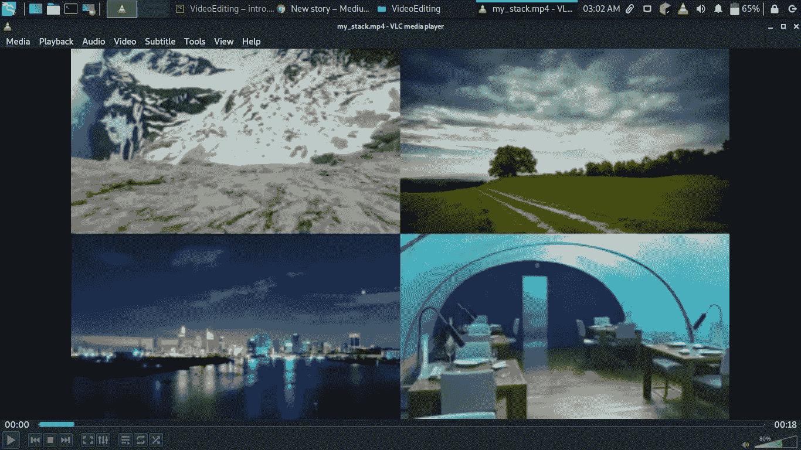
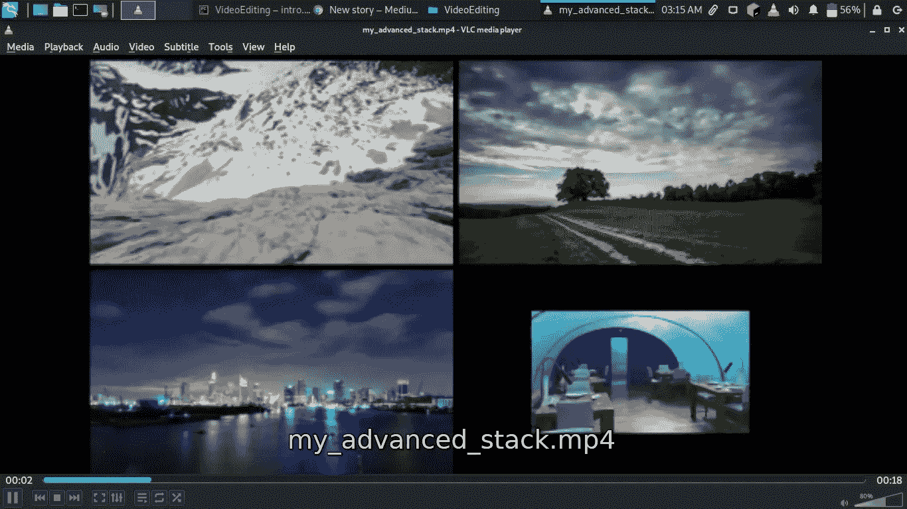

# 让我们用 python 编辑视频

> 原文：<https://blog.devgenius.io/lets-edit-videos-with-python-67d6d9f56ad3?source=collection_archive---------8----------------------->


照片由 [Onur Binay](https://unsplash.com/@onurbinay?utm_source=unsplash&utm_medium=referral&utm_content=creditCopyText) 在 [Unsplash](https://unsplash.com/s/photos/video-editing?utm_source=unsplash&utm_medium=referral&utm_content=creditCopyText) 拍摄

在本教程中，我们将使用 python 编辑视频。我们将利用 **moviepy** 库来编辑我们所有的视频。下面是我们将在本教程中使用的技术列表。

1.  从视频中提取剪辑
2.  堆叠视频
3.  串联视频
4.  调整大小时在视频堆栈中创建边距
5.  从视频中提取图像
6.  旋转视频剪辑
7.  从视频中提取音频
8.  用音频屏蔽视频
9.  从视频创建 gif

**要求**

1.  大蟒
2.  电影

要安装这些软件包，请运行`pip3 install <package name>`

1.  **从视频中提取剪辑**

要从视频中提取剪辑，请在 subclip 函数中指定所需的时间帧。提取剪辑后，你需要将它写入一个新的文件

```
from moviepy.editor import *clip = VideoFileClip('snow.mp4').subclip(12,20)
clip.write_videofile("edited.mp4")
```

2.**堆叠视频**

你需要像在闭路电视监视器中那样把视频堆叠在一起吗？看看这段代码。

```
from moviepy.editor import *clip1 = VideoFileClip('snow.mp4').subclip(4,16)
clip2 = VideoFileClip('clouds.mp4')
clip3 = VideoFileClip('city.mp4')
clip4 = VideoFileClip('underwater.mp4')
final_clip = clips_array([
    [clip1,clip2],
    [clip3,clip4]
])
final_clip.resize(width=480).write_videofile('my_stack.mp4')
```

这是输出



3.**连接视频**

串联视频意味着将几个视频连接在一起，当一个剪辑停止播放时，另一个会立即开始播放。

```
from moviepy.editor import *clip1 = VideoFileClip('snow.mp4').subclip(4,16)
clip2 = VideoFileClip('clouds.mp4')
clip3 = VideoFileClip('city.mp4')
final_clip = concatenate_videoclips([clip1,clip2,clip3])
final_clip.write_videofile('my_concate.mp4')
```

4.**调整大小时在视频堆栈中创建边距**

之前我们制作了一个堆栈，这里我们将在堆栈中的每个视频之间添加一个边距，并调整数组中最后一个视频的大小。

```
from moviepy.editor import *clip1 = VideoFileClip('snow.mp4').subclip(4,16).margin(10)
clip2 = VideoFileClip('clouds.mp4')
clip3 = VideoFileClip('city.mp4')
clip4 = VideoFileClip('underwater.mp4').resize(0.60) #downsize 60%
final_clip = clips_array([
    [clip1,clip2],
    [clip3,clip4]
])
final_clip.resize(width=480).write_videofile('my_advanced_stack.mp4')
```

我们增加了 10 个像素的空白，并将最后一个视频的大小调整为 60%

这是输出



**5。从视频中提取图像**

首先加载视频，然后使用 save_frame 函数捕获帧，然后指定文件名

```
from moviepy.editor import *clip = VideoFileClip('snow.mp4')
clip.save_frame('snow.jpeg') 
```

**6。旋转夹子**

```
from moviepy.editor import *clip = VideoFileClip('snow.mp4').rotate(270)
clip.write_videofile('rotated.mp4')
```

这将把视频旋转 270 度

**7。从视频中提取音频**

```
from moviepy.editor import *clip = VideoFileClip('underwater.mp4')
audioclip = clip.audio
audioclip.write_audiofile('underwater.mp3')
```

8。用另一个音频屏蔽一个视频

这里，我们将使用新的音频屏蔽视频

```
from moviepy.editor import * my_audioclip = AudioFileClip('underwater.mp3')
videoclip = VideoFileClip('snow.mp4')
videoaudio = videoclip.set_audio(my_audioclip)
videoaudio.write_videofile('videowithaudio.mp4')
```

9。创建一个 gif

```
from moviepy.editor import *
clip = VideoFileClip('city.mp4')
clip.write_gif('city.gif',fps=2)
```

这是输出


**结尾**

Moviepy 包含更复杂的函数，其中大部分我无法在本教程中介绍。你可以在这里查库[](https://moviepy.readthedocs.io/en/latest/)****。**感谢阅读。**