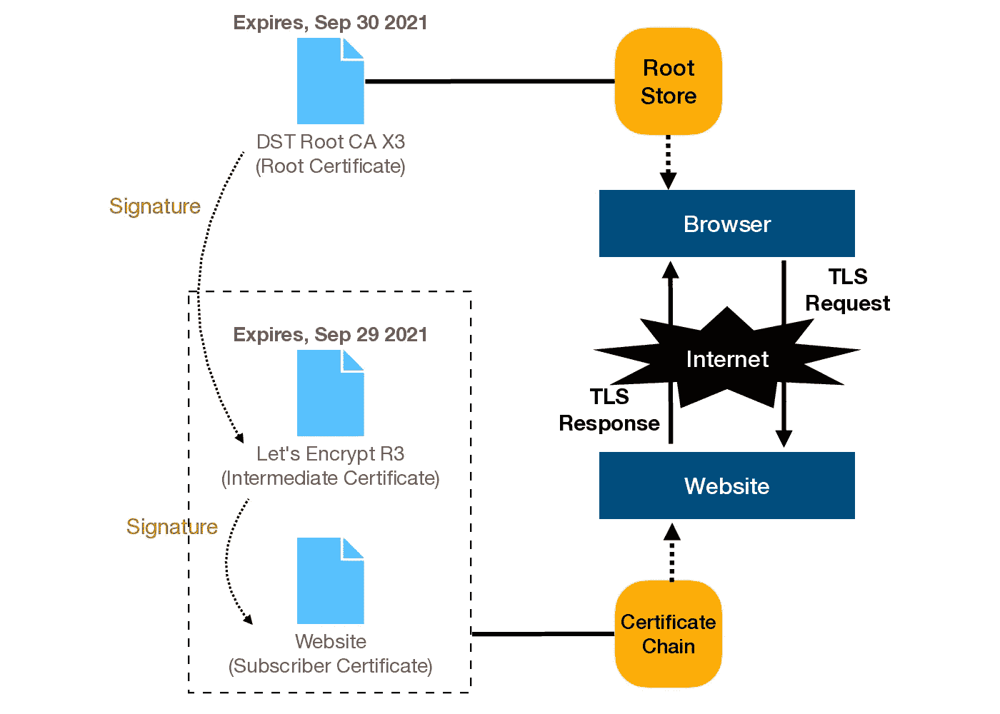
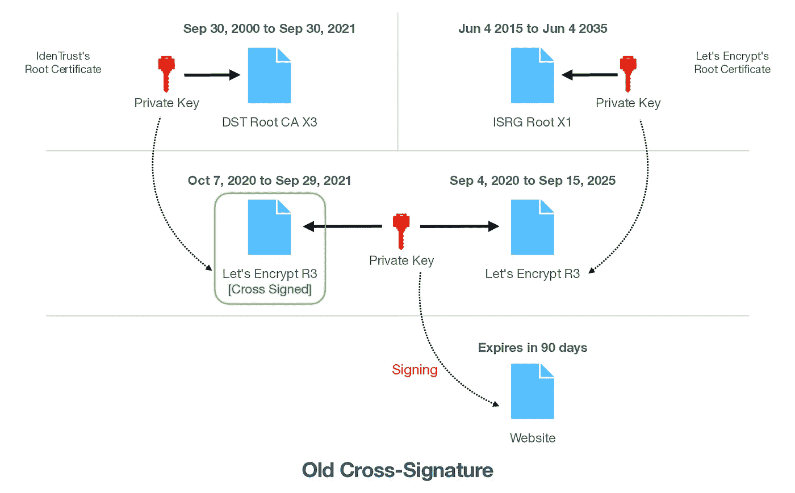
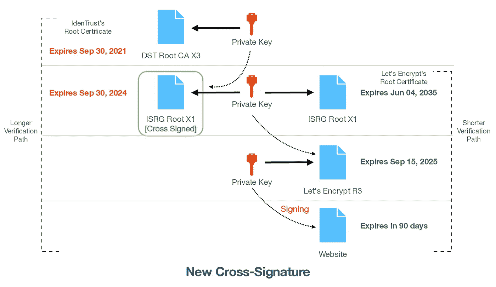
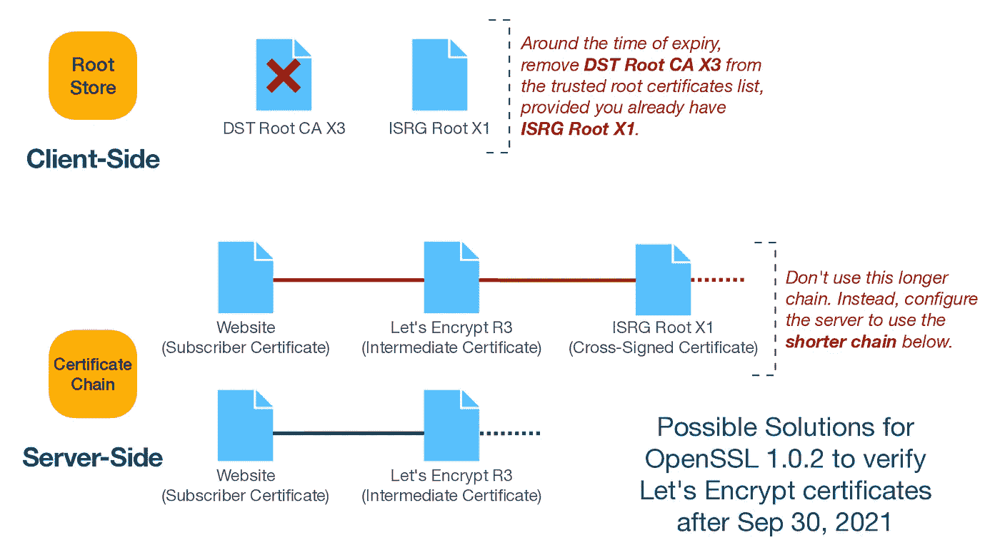

# 让我们加密影响 OpenSSL 1.0.x 和 CentOS 7 的变化

> 原文：<https://blog.devgenius.io/lets-encrypt-change-affects-openssl-1-0-x-and-centos-7-49bd66016af3?source=collection_archive---------0----------------------->

## [第 0 根安全网络](https://www.0snet.com)

## 包含过期根证书的默认证书链


由[泰勒维克](https://unsplash.com/@tvick?utm_source=medium&utm_medium=referral)在 [Unsplash](https://unsplash.com?utm_source=medium&utm_medium=referral) 上拍摄的照片

et 的 Encrypt 是一个由互联网安全研究小组(ISRG)运营的认证机构，它为互联网上的安全通信提供免费的自动 TLS 证书。在网络环境中，每当浏览器通过 *https* 连接到网站时，浏览器**会验证**网站的 TLS 证书，以确保通信安全。

验证 TLS 证书的过程需要 web 浏览器或操作系统来维护根证书的可信数据库。并且，从网站提供的 TLS 证书开始，通过创建到可信数据库中存在的根证书的证书链/路径来验证其颁发者。



不幸的是，可信数据库中的这些根证书有一个截止日期。并且，相应地，由这些根证书颁发的任何中间证书也将与该到期日一致(除了下面解释的新的**交叉签名的 ISRG 根 X1** 中间证书)。

[**交叉签名让我们加密 R3**](https://letsencrypt.org/certs/lets-encrypt-r3-cross-signed.txt) 和 [**DST 根 CA X3**](https://crt.sh/?id=8395) ，中间和根证书分别于**2021 年 9 月 29 日**和**2021 年 9 月 30 日**到期。

> " Android 有意不强制使用作为信任锚的证书的截止日期."

# 根存储包含

任何证书颁发机构的成功最终取决于其根证书受信任的平台和设备。这允许平台和设备上的 TLS 客户端成功地验证由它们颁发的证书。

当 Let's Encrypt 在 2015 年推出时，他们的新根证书 [**ISRG 根 X1**](https://letsencrypt.org/certs/isrgrootx1.txt) 在任何设备或平台上都不可信。因此，由[**DST Root CA【X3】**](https://crt.sh/?id=8395)Root 认证的他们 5 年有效期的中间证书的交叉签名是一个[重要的里程碑](https://letsencrypt.org/2015/10/19/lets-encrypt-is-trusted.html)，它被[延长一年](https://letsencrypt.org/2020/09/17/new-root-and-intermediates.html#the-new-certificates)到 2020 年。



通常，根证书用于签署一堆中间证书，这些中间证书可以**向订户颁发**证书。这些订户证书仅包含作为其**颁发者**提及的中间证书，没有提及任何根证书。

因此，可以有多个由不同认证机构签署的具有相同名称和公钥的中间证书，这些证书被称为[交叉签名证书](https://letsencrypt.org/certificates/#cross-signing)。这导致同一订户证书有不同的证书链和路径。

# 新十字符号

根证书 **ISRG 根 X1** 现在被[大多数平台](https://letsencrypt.org/docs/certificate-compatibility/#platforms-that-trust-isrg-root-x1)和设备信任。然而，为了[保持与旧 Android 设备的兼容性](https://letsencrypt.org/2020/12/21/extending-android-compatibility.html)，Let's Encrypt 决定采取一种独特的方法，

> IdenTrust 已经同意从他们的 **DST 根 CA X3** 为我们的 **ISRG 根 X1** 签发 3 年交叉签名。这个新的交叉标志会有些新奇，因为它超过了根 X3 夏令时的有效期。这个解决方案之所以有效，是因为 Android 有意不强制使用作为信任锚的证书的截止日期。ISRG 和 IdenTrust 联系了我们的审计员和根程序来审查这个计划，并确保没有任何合规性问题。



最初的计划是在一月初过渡到他们自己的根。但是，随着使用特殊交叉签名的计划的改变，新颁发的证书(自 2021 年 5 月 4 日起)使用一个[更长的链](https://community.letsencrypt.org/t/production-chain-changes/150739)与 [**交叉签名的 ISRG 根 X1**](https://letsencrypt.org/certs/isrg-root-x1-cross-signed.txt) 作为中间证书。

这里具有讽刺意味的是，让我们加密颁发一个新的 ECDSA 根证书 [**ISRG 根 X2**](https://letsencrypt.org/certs/isrg-root-x2.txt) 去年声明[更小的证书尺寸](https://letsencrypt.org/2020/09/17/new-root-and-intermediates.html#why-we-issued-an-ecdsa-root-and-intermediates)作为一大好处。但是，使用新的交叉符号，每次连接都需要额外传输 512 字节的证书数据。

# OpenSSL 1.0.2 —不支持

不幸的是，由于构建和验证[证书路径的方式](https://community.letsencrypt.org/t/questions-re-openssl-client-compatibility-changes-for-let-s-encrypt-certificates/143817/37)，并非所有 TLS 的实现都能成功验证交叉签名。 **OpenSSL 1.0.2** 就是这种情况。因此，在 **RHEL/CentOS 7** 上运行的使用 OpenSSL 的程序将[无法验证新的证书链](https://community.letsencrypt.org/t/openssl-client-compatibility-changes-for-let-s-encrypt-certificates/143816)或建立 TLS 连接。

升级到 **OpenSSL 1.1.x** 并不简单，很可能[会破坏一些应用](https://wiki.openssl.org/index.php/OpenSSL_1.1.0_Changes#No_longer_works)。也就是说，有几个选择:要么更新客户端的信任存储，要么更改服务器端的证书链。



这些问题与去年 [Sectigo 根证书到期](https://www.agwa.name/blog/post/fixing_the_addtrust_root_expiration)非常相似。因此，从客户端的可信列表中删除 **DST 根 CA X3** 根证书(或者从服务器端的证书链中删除新的交叉签名的中间证书)应该可以解决这个问题。

然而，有一个微妙的区别。去年，为了避免这个问题，发行机构可以决定不将有问题的中间证书包括在链中。这里，有意识地决定让默认链使用交叉签名证书。

因此，一个干净的解决方案是切换到备用链，只支持 **Android 7.1.1 或更高版本**。然而，如果你有一个旧的 android 设备和客户端的混合与 **OpenSSL 1.0.x** 支持，切换到一个不同的认证机构，也许？

## Certbot

从[版本 1.6.0](https://github.com/certbot/certbot/blob/v1.9.0/certbot/CHANGELOG.md#160---2020-07-07) 开始，Certbot ACME 客户端支持[选项](https://certbot.eff.org/docs/using.html#certbot-command-line-options) `--preferred-chain` [选择](https://github.com/certbot/certbot/issues/8577)越短的加密链。该选项可以如下所示使用，

```
certbot renew --dry-run --preferred-chain "ISRG Root X1"
```

或者，将以下内容添加到*/etc/lets encrypt/renewal/*下的配置中，

```
preferred_chain = ISRG Root X1
```

> 由于证书机器人中的[缺陷，版本](https://github.com/certbot/certbot/issues/8577) [1.12.0](https://github.com/certbot/certbot/blob/master/certbot/CHANGELOG.md#1120---2021-02-02) 将被要求[选择较短的链条](https://community.letsencrypt.org/t/choice-of-default-long-chain-vs-short-chain/161184/30)。然而，截至 2021 年 10 月 6 日，EPEL 上 CentOS 7 的最新版本仅为 1.11.0。因此，在 CentOS 7 上选择较短的链并不直接。

# 测试证书

如果您希望自己重现问题，可以使用下面的测试证书，

## 即将到期的 CA，非常老的 X3

*   [x3.pem](https://www.0throot.com/blog/14/assets/x3.pem) ， [x3.txt](https://www.0throot.com/blog/14/assets/x3.txt)

## 主 CA、根 **X1** 和**由**非常老的 **X3** 交叉签名

*   [x1.pem](https://www.0throot.com/blog/14/assets/x1.pem) 、 [x1.txt](https://www.0throot.com/blog/14/assets/x1.txt) 、 [x1-cross.pem](https://www.0throot.com/blog/14/assets/x1-cross.pem) 、 [x1-cross.txt](https://www.0throot.com/blog/14/assets/x1-cross.txt)

## 主 CA，中间 **R3**

*   [r3.pem](https://www.0throot.com/blog/14/assets/r3.pem) ， [r3.txt](https://www.0throot.com/blog/14/assets/r3.txt)

## 订户，**本地主机**

*   [localhost.pem](https://www.0throot.com/blog/14/assets/localhost.pem) ， [localhost.txt](https://www.0throot.com/blog/14/assets/localhost.txt)
*   *full chain:*[chain-long-localhost . PEM](https://www.0throot.com/blog/14/assets/chain-long-localhost.pem)，[chain-short-localhost . PEM](https://www.0throot.com/blog/14/assets/chain-short-localhost.pem)

## 订户，test.example.com

*   [test.example.com.pem](https://www.0throot.com/blog/14/assets/test.example.com.pem)，[test.example.com.txt](https://www.0throot.com/blog/14/assets/test.example.com.txt)
*   *full chain:*[chain-long-example . PEM](https://www.0throot.com/blog/14/assets/chain-long-example.pem)，[chain-short-example . PEM](https://www.0throot.com/blog/14/assets/chain-short-example.pem)

## CA 文件进行验证

*   [x3.pem](https://www.0throot.com/blog/14/assets/x3.pem) ， [x1.pem](https://www.0throot.com/blog/14/assets/x1.pem) ， [x3+x1.pem](https://www.0throot.com/blog/14/assets/x3+x1.pem)

按如下方式启动测试服务器，

```
nc -kCl --ssl-cert chain-long-example.pem --ssl-key chain-long-example.pem 4433
```

(记住将 test.example.com 的主机条目添加到相应的 IP 地址中。)

## **OpenSSL 1.0.2k (CentOS 7)**

下面的命令试图在未来某个时间**2021 年 10 月 1 日**在端口 **4433** 上建立到*test.example.com*的 TLS 连接。如下所示，如果根证书过期，证书验证就会失败。但是，如果可信列表中没有过期的根证书，验证将会成功。

```
$ faketime '1 Oct 2021' openssl s_client -connect test.example.com:4433 -CAfile **x3+x1.pem** -quiet 
depth=3 C = US, ST = California, L = San Francisco, O = Soon To Expire CA, CN = Very Old X3
**verify error:num=10:certificate has expired**
**notAfter=Sep 30 09:36:31 2021 GMT**$ faketime '1 Oct 2021' openssl s_client -connect test.example.com:4433 -CAfile **x1.pem** -quiet 
depth=2 C = US, ST = California, L = San Francisco, O = Main CA, CN = Root X1
**verify return:1
...**
```

## **Wget 1.14 (CentOS 7)**

不幸的是，由于这种变化，像 **wget** 这样的基础工具将无法验证让我们加密证书。我希望 **ca-certificates** 包将被更新，过期的根证书将被删除，或者提供一些其他的解决方案。

```
$ faketime '1 Oct 2021' wget -q [https://test.example.com:4433/](https://test.example.com:4433/) --ca-certificate **x1.pem** -O-
Hello World$ faketime '1 Oct 2021' wget [https://test.example.com:4433/](https://test.example.com:4433/) --ca-certificate **x3+x1.pem** -O-
...
(test.example.com)|192.168.1.112|:4433... connected.
ERROR: cannot verify test.example.com's certificate, issued by ‘/C=US/ST=California/L=San Francisco/O=Main CA/CN=Intermediate R3’:
  **Issued certificate has expired.**
...
```

## **卷曲度 7.29(百分位 7)**

Curl 似乎没有受到影响，因为它是用 **NSS** 而不是 **OpenSSL** 构建的。

```
$ faketime '1 Oct 2021' curl [https://test.example.com:4433/](https://test.example.com:4433/) --cacert **x1.pem**
Hello World$ faketime '1 Oct 2021' curl [https://test.example.com:4433/](https://test.example.com:4433/) --cacert **x3+x1.pem**
Hello World$ curl --version
curl 7.29.0 (x86_64-redhat-linux-gnu) libcurl/7.29.0 **NSS/3.53.1** zlib/1.2.7 libidn/1.28 libssh2/1.8.0
...
```

# 最后的想法

目前还不清楚这对 CentOS 7 会有什么影响。事实上，我甚至不确定 ACME 客户端是否能够在 CentOS 7 服务器上获取证书，因为 API 端点使用类似的证书链，

```
$ faketime '1 Oct 2021' openssl s_client -connect **acme-v02.api.letsencrypt.org:443** -quiet
depth=2 O = Digital Signature Trust Co., CN = DST Root CA X3
**verify error:num=10:certificate has expired**
notAfter=Sep 30 14:01:15 2021 GMT
```

考虑到 **RHEL 7** 和其他发行版如 **OL 7** (Oracle Linux)和 **AMI 2** (亚马逊机器映像)可能会受到影响，这个问题可能会很普遍。但是，这一切只有在 **DST 根 CA X3** 根证书没有被***CA-certificates***包删除的情况下。一旦它被移除，影响应该是最小的。

# 参考

1.  [DST 根 CA X3 到期](https://letsencrypt.org/docs/dst-root-ca-x3-expiration-september-2021/)(2021 年 9 月)
2.  [扩展 Android 设备兼容性](https://letsencrypt.org/2020/12/21/extending-android-compatibility.html)让我们加密证书
3.  [OpenSSL 客户端兼容性变更](https://community.letsencrypt.org/t/openssl-client-compatibility-changes-for-let-s-encrypt-certificates/143816)

*在第 0 根，我们提供解决方案* [*第 0 根安全网络— 0SNet*](https://www.0snet.com/) *使用 TLS 客户端证书保护组织的内部 web 应用。看看我们的产品吧，它很容易部署，并且可以在*[*AWS*](https://0snet.info/#install.aws)*[*GCP*](https://0snet.info/#install.gcp)*和*[*Azure*](https://0snet.info/#install.azu)*上找到。**