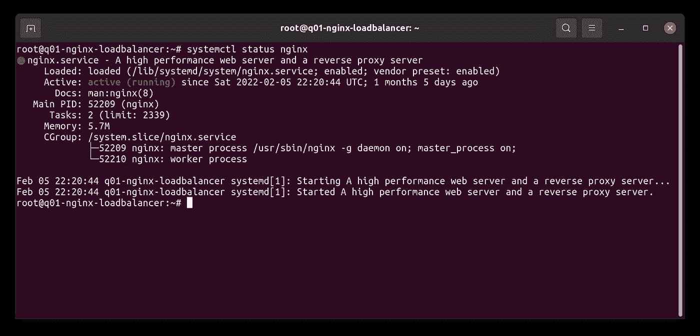

# 让我们用 NGINX 加密你的网站

> 原文：<https://blog.devgenius.io/lets-encrypt-your-site-with-nginx-d1bb049dda0f?source=collection_archive---------5----------------------->


自从谷歌为使用 HTTPS 而不是 HTTP 的网站改变了排名系统，最终网站开始转向加密协议。但是，与其购买昂贵的证书，不如让加密以零成本为我们解决这个问题。

因此，我们将介绍如何设置 NGINX 服务器，并使用“让我们加密”来为我们生成证书，同时使用 certbot，以便我们可以在证书到期时自动获取新证书。

这是一个较小的教程，实际上并不需要花费太多的时间和精力来启动它，但是我认为在这里尽可能清晰地分享启动和运行它的所有必要步骤可能是有用的。我还将分享一个 shell 脚本，如果我们需要从头开始，它将尽可能自动化这个过程。很容易再次运行脚本。

# 安装 NGINX 的设置脚本

登录到您想要用来安装 NGINX 的虚拟机。为了运行这个脚本，我们需要两个文件，我们将在虚拟机上创建第一个名为 **install_nginx.sh** 的文件，并将以下代码放入其中:

```
**#!/bin/bash** *# This script is intended to setup the environment for a NGINX Web Server with SSL certificate using Let's Encrypt.* clear

PROJECT_DIR="/etc/nginx/sites-enabled"
CURRENT_DIR=$(pwd)
DOMAIN="example.com"
EMAIL="foo@bar.com"

*# Get latest updates* echo ""
echo "UPDATING SYSTEM..."
echo ""
sudo apt update

echo ""
echo "###### RUNNING NGINX SCRIPT ######"
echo ""

function install_nginx
{
 SOFTWARE="nginx"
 QUERY="$(sudo dpkg-query -l | grep ${SOFTWARE} | wc -l)"

 if [ "$QUERY" -eq 0 ]; then
  echo ""
  echo "INSTALLING NGINX..."
  echo ""

  sudo apt -y install nginx

  *# Setup configuration file* sudo cp $CURRENT_DIR/$DOMAIN $PROJECT_DIR/$DOMAIN

  *# Setup and configure Certbot* sudo apt -y install certbot python3-certbot-nginx
  sudo certbot --nginx -d $DOMAIN --non-interactive --agree-tos -m $EMAIL
 else
  echo "${SOFTWARE} is already installed. skipping..."
 fi
}

install_nginx
```

让我们看一下第一个 shell 脚本，它是做什么的。

```
clear

PROJECT_DIR="/etc/nginx/sites-enabled"
CURRENT_DIR=$(pwd)
DOMAIN="example.com"
EMAIL="foo@bar.com"
```

我们从清空屏幕开始，以便在控制台上获得更多空间。然后我们添加四个常量，我们将**项目目录**设置为配置文件所在的目录。然后我们获取当前所在的目录，并将其设置为 **CURRENT_DIR** 。我们设置我们的域常量和应该与获取证书相关联的电子邮件。

```
*# Get latest updates* echo ""
echo "UPDATING SYSTEM..."
echo ""
sudo apt update
```

显然，我们在安装软件之前更新了系统的包列表。

```
function install_nginx
{
 SOFTWARE="nginx"
 QUERY="$(sudo dpkg-query -l | grep ${SOFTWARE} | wc -l)"

 if [ "$QUERY" -eq 0 ]; then
  echo ""
  echo "INSTALLING NGINX..."
  echo ""

  sudo apt -y install $SOFTWARE

  *# Setup configuration file* sudo cp $CURRENT_DIR/$DOMAIN $PROJECT_DIR/$DOMAIN

  *# Setup and configure Certbot* sudo apt -y install certbot python3-certbot-nginx
  sudo certbot --nginx -d $DOMAIN --non-interactive --agree-tos -m $EMAIL
 else
  echo "${SOFTWARE} is already installed. skipping..."
 fi
}
```

我们现在创建了一个函数 **install_nginx** 。我们定义将要安装的软件，并在系统上进行查询，以查看我们是否已经安装了该软件，如果已经安装，我们只需打印出一条消息，说明该软件已经安装。

接下来，如果没有安装，我们安装软件并添加标志 **-y** 以避免必须手动输入是/否来安装 NGINX。然后，我们继续将我们创建的配置文件复制到 NGINX 配置的目标目录中。

然后我们安装 **python3-certbot-nginx** ，这样我们就可以有一个 bot 在新证书到期时自动检索它。

我们运行 certbot 并添加标志 **- nginx** ，因此我们告诉它将用于向 nginx 配置中插入 config，并指定应该使用带有 **-d** 标志的域，并且我们不希望它与 **-非交互**标志以及 **- agree-tos** 交互以自动同意和 **-m** 用于应该使用的电子邮件。

如果您想添加 **www。**同样添加到域中，只需添加另一个 **-d** 旗帜，添加[www.example.com](http://www.example.com)以及**example.com**。在这个例子中，我们没有添加它。

# 配置 NGINX 配置

然后我们创建另一个文件，该文件将保存名为**example.com**的 NGINX 配置(将其切换到您自己的域):

```
server {
    root                /var/www/html; index               index.html index.htm index.nginx-debian.html;
    server_name         example.com;
    include             /etc/nginx/mime.types;
}server {
    if ($host = example.com) {
        return 301 [https://$host$request_uri;](/$host$request_uri;)
    } listen              80;
    listen              [::]:80;
    server_name         example.com;
    return              404;
}
```

让我们把文件分解一下。首先，我们定义一个服务器块，我们将使用两个服务器块用于 HTTP 和 HTTPS。第一个是 HTTPS(443 号港口)。

```
root                /var/www/html;
```

这为 NGINX 服务器定义了根文件的位置。这是安装 NGINX 时的默认设置，我们将在本教程中使用。

```
index               index.html index.htm index.nginx-debian.html;
server_name         example.com;
include             /etc/nginx/mime.types;
```

在这里，我们定义从根目录加载什么索引文件。如果找不到我们要找的第一个 index.htm，我们就定义多个，以此类推。然后我们定义服务器的名称。在这里，我们将在运行脚本之前更改到我们想要的域。我们使用包含 nginx mime.types 作为默认设置。

```
server {
    if ($host = example.com) {
        return 301 https://$host$request_uri;
    }

    listen              80;
    listen              [::]:80;
    server_name         example.com;
    return              404;
}
```

这里，我们定义了第二个服务器块，它将监听标准的 HTTP 端口 80。但是在这里，我们将添加一个 if 语句，该语句检查您是否尝试使用 HTTP，您将自动被重定向到为 HTTPS 服务的另一个服务器块。出于安全原因，我们不希望用户使用未加密的协议。

我们可以通过以下方式检查配置是否有效:

```
nginx -c /etc/nginx/nginx.conf -t
```

# 安装 NGINX

现在，我们准备安装 NGINX 服务器。让我们为 shell 脚本设置权限并运行它！

```
chmod +x install_nginx.sh
./install_sh
```

# 确认 NGINX 服务已启动并正在运行

我们可以通过运行以下命令来确认状态:

```
systemctl status nginx
```



systemctl 状态 nginx

我们已经开始行动了。转到您的域网址，并尝试访问它，它应该显示在一个默认的 NGINX 网站使用 HTTPS。但有一个小细节我们需要解决。打开我们添加的配置文件:

```
sudo vim /etc/nginx/sites-enabled/example.com
```

然后删除包含在第一个服务器块中的端口为 80 的线路。然后运行:

```
sudo systemctl reload nginx
sudo systemctl restart nginx
```

# 资源

链接到脚本所在的 git hub Gist:[https://git . git hub . com/mjovanc/5 EFC 10463 A8 e 4662 df 4f 713957 f 32991 #文件-示例-com](https://gist.github.com/mjovanc/5efc10463a8e4662df4f713957f32991#file-example-com)