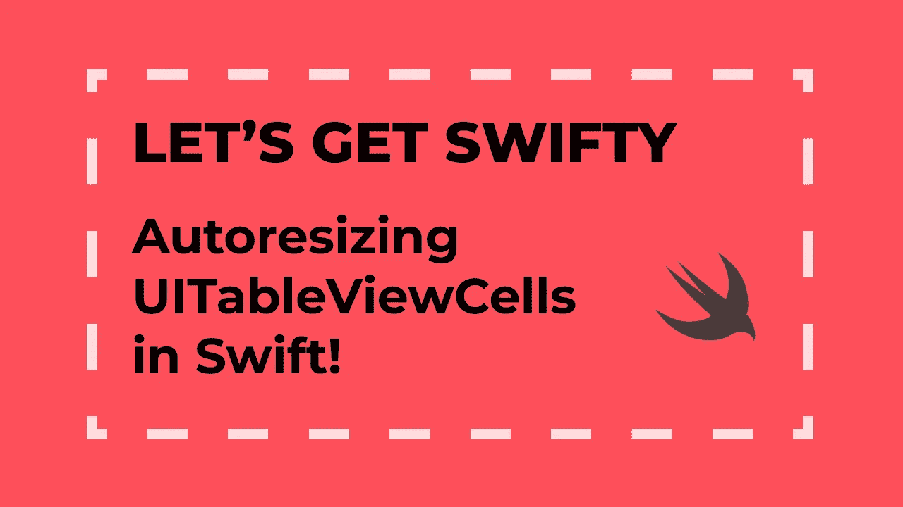
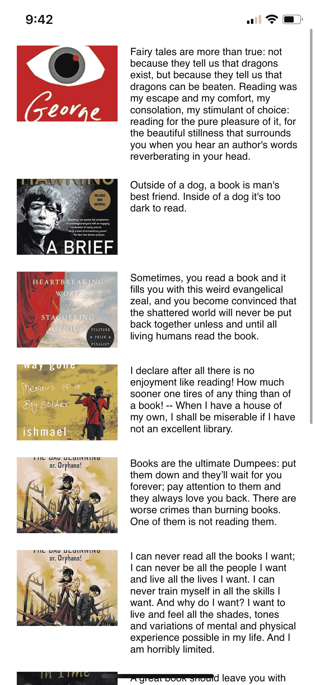

# 让我们快点！使用 UITextView 和 UIImage ⌜Beginner⌟在 iOS/Swift 中自行调整 UITableViewCell 的大小

> 原文：<https://blog.devgenius.io/lets-get-swifty-self-sizing-uitableviewcell-in-ios-swift-using-uitextview-uiimage-beginner-b9123c873d7b?source=collection_archive---------9----------------------->



当你创建一个 UITableViewCell 时，你很少使用固定高度的 tableview。您希望将 tableview 单元格与动态单元格一起使用，以便内容能够紧密地容纳在您的单元格中！

***我们在这里做什么？***
✅自动调整 UITableViewCell 的高度
✅通过 NSLayoutConstraints 使用程序化自动布局
✅大约 20 分钟

这是一个简单的方法来学习如何 UITableViewCells 将能够有动态的高度。你可以利用这一点来帮助你构建自己的应用程序，甚至是 iOS Swift 面试。

从我的 github 链接下载我的 [starter 项目。你可以在下面找到最终的链接项目。](https://github.com/noctisilva/medium_1/tree/Starter)

首先在 ViewController 中创建 UITableView。您可以将它放在 bookCellId 变量下。

```
var mainTableView: UITableView = {
   let tableView = UITableView()
   tableView.translatesAutoresizingMaskIntoConstraints = false
   return tableView
}()
```

让我们将委托& dataSource 引用到 self，并将 NSLayoutConstriaints 设置为 tableview。将此添加到 ViewController 的设置功能中。

```
mainTableView.delegate = self
mainTableView.dataSource = self
mainTableView.register(BookCellId.self, forCellReuseIdentifier: bookCellId)NSLayoutConstraint.activate([
   mainTableView.widthAnchor.constraint(equalTo: self.view.widthAnchor),
   mainTableView.heightAnchor.constraint(equalTo: self.view.heightAnchor),
   mainTableView.centerXAnchor.constraint(equalTo: self.view.centerXAnchor),
   mainTableView.centerYAnchor.constraint(equalTo: self.view.centerYAnchor),
])
```

是时候创建我们的自定义 UITableViewCell 了。将以下内容添加到 BookCellId 文件的 cellMargins 变量下。

```
var bookImage: UIImageView = {
   let imageView = UIImageView()
   imageView.translatesAutoresizingMaskIntoConstraints = false
   imageView.contentMode = .scaleAspectFill
   imageView.clipsToBounds = true
   imageView.layer.masksToBounds = true
   return imageView
}()var bookDescription: UITextView = {
   let textView = UITextView()
   textView.translatesAutoresizingMaskIntoConstraints = false
   textView.setContentCompressionResistancePriority(.required, for: .vertical)
   textView.isEditable = false
   textView.isScrollEnabled = false
   textView.textContainerInset = .zero
   return textView
}()
```

所有项目都应该在单元格的 contentView 中。让我们在 contentView 中创建一个布局边距，作为对图像和文本进行约束的指南。

将以下内容放入设置功能中。

```
contentView.addSubview(bookImage)
let margins = contentView.layoutMarginsGuide
```

现在我们添加子视图并设置约束。将以下内容放在前面的代码下:

```
NSLayoutConstraint.activate([
   bookImage.widthAnchor.constraint(equalToConstant: imageSize.width),
   bookImage.heightAnchor.constraint(equalToConstant: imageSize.height),
   bookImage.leadingAnchor.constraint(equalTo: margins.leadingAnchor),
   bookImage.topAnchor.constraint(equalTo: margins.topAnchor),
   bookImage.bottomAnchor.constraint(lessThanOrEqualTo: margins.bottomAnchor)
])
contentView.addSubview(bookDescription)
NSLayoutConstraint.activate([
   bookDescription.leadingAnchor.constraint(equalTo: bookImage.trailingAnchor, constant: spaceBetweenImageAndText),
   bookDescription.trailingAnchor.constraint(equalTo: margins.trailingAnchor),
   bookDescription.topAnchor.constraint(equalTo: margins.topAnchor),
   bookDescription.bottomAnchor.constraint(equalTo:  margins.bottomAnchor)
])
```

让我们把事情做完。回到我们的 ViewController，寻找 ViewController 的扩展。您应该会看到 UITableViewDelegate 和 UITableViewDataSource 的两个扩展。这样我们就可以将 tableview 及其数据源插入到 ViewController 中。

将 numberOfRowsInSection 返回变量替换为 bookText.count

```
let cell = tableView.dequeueReusableCell(withIdentifier: bookCellId) as! BookCellId
cell.bookImage.image = UIImage(named: imageNames[indexPath.row])
cell.bookDescription.text = bookText[indexPath.row]
return cell
```

最后，我们必须为 RowAt 函数设置 height。转到 heightForRowAt 函数并添加:

```
return UITableView.automaticDimension
```

运行该函数，您应该能够看到一个成功编译的应用程序。

现在，有很多方法可以做到这一点。我的方法只是创建可调整大小视图的一个特殊版本。

如果你有任何问题，欢迎评论或发邮件给我:contact@taehongmin.com

期末项目在[这个环节](https://github.com/noctisilva/medium_1/tree/COMPLETED)。

感谢您的阅读！

