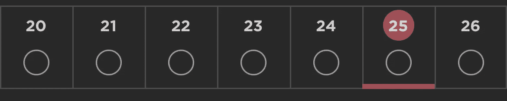

# 让我们来点中缀乐子吧

> 原文：<https://blog.devgenius.io/lets-have-some-infix-fun-68a70ce4fea4?source=collection_archive---------9----------------------->

最近，我在使用一个 RecyclerView，它以一个准日历视图显示阅读计划的进度，一次显示一周。

由于每个 recycle view 项目代表一周，因此 recycle view 项目的数量(即周数)是通过将阅读计划中的天数除以 7 来计算的。在我最初的编码中，我引入了一个 bug，这个 bug 在测试中浮出了水面。

如果你没有马上发现，这是一个在 Java 和 Kotlin 中非常容易犯的整数除法错误。Java/Kotlin 在整除整数时简单地丢弃余数，本质上是执行一个`floor()`。所以 9 除以 7 等于 1。这意味着如果我需要显示 9 天，我的计算将只考虑第一周。上周，我实际上放弃了一半的可能情况。就令人沮丧的反复犯错误而言，对我来说，这比忘记在新应用程序中加入互联网许可标签更重要。

我的修复最初看起来是这样的

这是可行的，但是它非常丑陋，并且对于遇到它的未来开发人员来说，第一眼可能看不出它的意图。

这似乎是一个享受一些`infix fun`的好机会。在 Kotlin 中，“标有`infix`关键字的函数也可以使用中缀符号来调用(省略调用的点号和括号)。”有关中缀函数的更多信息，请参见 [Kotlin 文档](https://kotlinlang.org/docs/functions.html#infix-notation)。

所以我在 MathUtils.kt 文件中将丑陋的造型和舍入移到了一个`infix fun`后面。

现在我的原始函数是这样的

最终结果可读性更好，而且我有一个可重用的实用程序`infix fun`供将来使用。

使用`infix fun`可能会很诱人，所以请*谨慎使用*。然而，当你有需要的时候，`infix fun`会是你 Kotlin 工具箱中一个很好的补充。

*关注更多关于 Kotlin 和 Android 开发的最佳实践。*