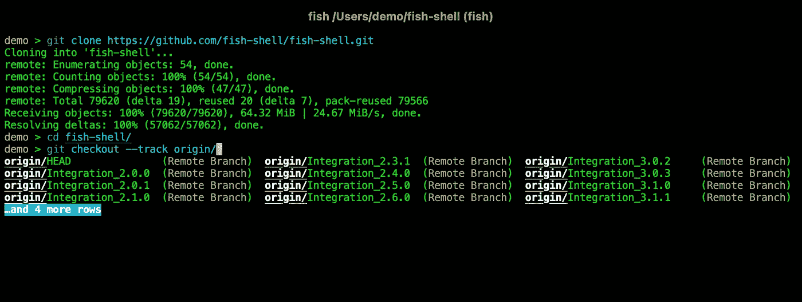
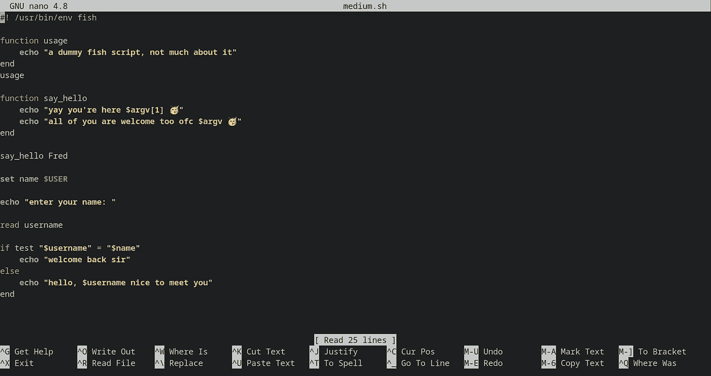
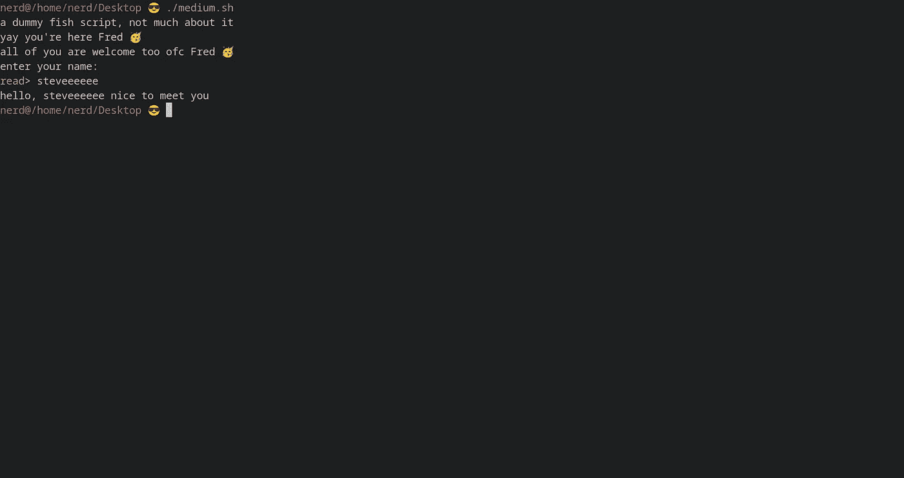
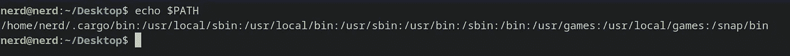
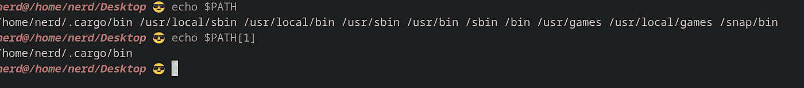
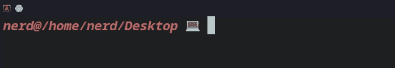

# 让我们学习鱼类脚本🐟

> 原文：<https://blog.devgenius.io/lets-learn-fish-scripting-1d66928ebd2f?source=collection_archive---------4----------------------->

问候书呆子👋你还想在终端上定制你的开发者体验吗？想要提升您的脚本游戏水平并享受其中的乐趣吗？如果是的话，我希望你会发现这个博客有用🙌



https://fishshell.com/

***那么这条鱼到底是怎么回事呢？***

我之前分享了一篇关于 bash 脚本以及它如何让你的生活变得更简单的博客，但是让我们诚实地说一秒钟……你会发现自己每次遇到变量扩展时都想提交🪢，或者忘记了比较运算符或 wuteva

我记得我发现了这个视频，我个人认为它非常有趣和有前途，我决定最终尝试一下 [***鱼***](https://fishshell.com/)

***但是迎头痛击有什么不好？***

你看，bash 很棒，但是真的很容易对它感到失望，尤其是当这个 bug 像我上面说的那么简单的时候

例如，如果你想在 bash 中改变你的 shell 提示符，你会有一个难看的令人困惑的行来格式化颜色和字体，就像这样``\e[0;32m[\u@\h \W]\$ \e[0m`,只是把颜色改成绿色，并显示你的用户名和工作目录

与此同时，在 fish 中，你所要做的就是覆盖这样一个内置函数

```
function fish_prompt; set_color green;echo "$USER@$PWD 😎 "; end
```

所以你看，事情可以变得更简单、更有趣，特别是对于那些刚刚接触 Linux 世界的人

***装酷🍑*端子(可选)**

如果你已经做到这一步，你应该有一个终端，但是我遇到了一个非常酷的终端，它叫做 [alacritty](https://alacritty.org/) ，我已经爱上它了，所以让我们也安装它吧

`sudo add-apt-repository ppa:aslatter/ppa <- add the repo
sudo apt update <- run updates
sudo apt install alacritty <- installing it
alacritty -v <- view the version to make sure it installed`

这是我自己的 alacritty 的截图，以及它和鱼壳的外观



***安装鱼***

安装这个 shell 是如此简单明了，所以根据他们的 repo，您可以通过运行以下命令来安装它

```
sudo apt-add-repository ppa:fish-shell/release-3
sudo apt update
sudo apt install fish
```

然后，在你的终端运行`fish`来获取 shell

***写你的第一个鱼剧本——有点——***

我不会用什么脚本之类的废话来烦你，相反，我们更关注但不完全是什么使 fish 脚本更简单，它在哪里更突出，所以希望我一次捆绑多个概念

**设置变量并使用它们**

在 fish 中，声明变量非常简单，与其他 shells 不同的是，没有 variable=value 语法，所以可以使用关键字`set`

`set girl 'Isla` 🥺 `'
echo "$girl"`

除了声明变量的更干净的方式而不是失去理智之外，没有什么改变，因为你忘了在两者之间加上等号

所以语法是`set name value`

**鱼类列表**

在 fish 中，在很多地方使用列表是很重要的，例如大多数 shells 中的`$PATH`是一个冒号分隔的列表，就像这样



但在 fish 中，它实际上是一个列表，可以使用从 1 开始的索引来访问它——我知道，这很恶心，当我发现这一点时，我拍了拍我的额头——

这是`$PATH`在鱼壳里面，我们如何访问元素



**循环和条件**

非常基本的东西，除了几个方便的调整感谢鱼壳，所以让我们看看例子

让我们先看看基于循环的范围是如何工作的

```
for i in (seq 20)
    echo "i love fish"
end
```

这是在一个范围内迭代的更简洁的方式，它可以被更多地配置来指定开始、结束、增量，就像这样

```
# specify the start and end
for i in (seq 2 30)
    echo "$i"
end 
# specify the increment value
for x in (seq 1 2 40)
    echo "$x"
end
```

一个`if`语句做了一点改变——结尾没有奇怪的 fi——新的`test`操作符解决了很多例子中的比较问题

```
# comparing numbersecho "enter your age plz: "
read age
if test $age -ge 18
    echo "welcome aboard"
else
    echo "you're too young to be here"
end# comparing strings -there is a catch-echo "what's your name: "
read username
if test "$username" = "$USER"
  echo "welcome back sir"
else
  echo "hello $username, nice to meet you"
end
```

你练习得越多，你就会越习惯使用`test`

现在让我们来看看令人惊叹的`switch/case`

```
switch (uname)
case Windows
    echo "gross plz fuck off"
case Linux 
    echo "based asf"
case Darwin
    echo "a chad too"
end 
```

重要的是，结尾不再有奇怪的`esac`,如果你习惯于另一种编程语言，也不需要`break`关键字

**中的*功能鱼*中的**

函数在编程中的重要性不足为奇，fish 与其他脚本语言没有什么不同，所以让我们看看 fish 中的函数有何不同

```
function myfunc
    echo "arguments passed: $argv"
end
myfunc red green blue #arguments passed: red green blue
```

与 bash 等其他 shells 不同，fish 将传递给函数的参数视为一个列表，可以通过索引来访问——出于某种该死的原因，索引也是从 1 开始的，OMG——

您也可以通过键入`functions`然后回车来查看内置函数

***增加我们的提示***

正如我之前在博客中提到的，改变你的 shell 提示符是如此的简单和可定制，所以让我们来看看如何改变它，因为我想指出一些关于鱼的非常酷的东西

所以在你的终端里输入

```
function fish_prompt; set_color -o -i red;echo "$USER@$PWD 💻 "; end
```

现在让我们解释一下发生了什么

1.  fish 中的所有东西都是一个函数，在这里我们只需改变一个内置函数来编写我们自己的代码，这个函数很有趣，因为它非常简单，它所做的就是使用它的输出来改变提示符，所以无论你输入什么都将是你的新提示符
2.  `set_color`是另一个帮助我们改变文本颜色的神奇功能，它改变跟随它的文本，这里我们使用`-i`标志启用斜体字体，使用`-o`启用粗体字体，关于它或任何功能的更多信息，请使用`man`
3.  分号只是一种在保留一行的同时删除一行的方法

这是我的提示现在的样子



如果你想在右边有一个提示，只需使用`fish_right_prompt`代替上面的那个，然后随意调整

***数学里的鱼***

fish 中的数学运算非常简单和直观，这要归功于一个名为`math`的内置函数，我们可以调用这个函数并在其后跟随一个数学表达式

```
math 1 + 2 # 3
math 40 - 10 # 30
math 30 '*' 3 # you have to escape the asterisk bcz it's an operator in fish by using quotes or \
math 50 / 10 # 5
```

**中的*命令替换*中的**

当你写脚本的时候，99%的情况下你需要将变量的输出分配给命令输出，例如`curl` response，那么在 fish 中我们是怎么做的呢？简单得要命，看看就知道了

```
echo i am currently at (pwd)
echo i am running (uname)
```

是的，这就是为什么我认为 fish 对于编写脚本来说是如此的酷和有趣，如果你正在使用 fish 或者受到启发开始使用它并且喜欢它的其他东西，请在评论中分享它，我也将非常乐意探索它

快乐编码