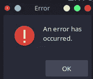

# 让我们用 Shell 脚本假装黑客

> 原文：<https://blog.devgenius.io/lets-pretend-to-be-hackers-with-shell-scripting-113c47554e1?source=collection_archive---------10----------------------->

问候书呆子👋我最近变得非常无聊，并决定写真正的代码来制作假程序，如果这没有意义，想想(几乎)每部好莱坞电影/电视节目都涉及黑客的东西

现在，这个想法让我想到了另一个想法，那就是在我的 shell 脚本中添加基本的 GUI 元素，我想分享这个想法，因为它非常有用，可以方便地用于许多需要一些令人愉快的用户界面的项目


[https://image . shutterstock . com/image-photo/young-Asian-programmer-working-office-260 NW-2129787857 . jpg](https://image.shutterstock.com/image-photo/young-asian-programmer-working-office-260nw-2129787857.jpg)

***天顶简介***

Zenity 是一个有用的工具，它帮助我们将 GUI 部件添加到我们的 shell 脚本中，为它们添加更多的交互性，并允许普通用户与程序进行交互

我相信这些描述足以引起你的兴趣，并为我们的目的服务，所以让我们开始假装超级黑客吧😎

***Zenity widgets***

这里有很多真正有用的小工具，所以我会尽可能多的选择，希望留给你足够的知识去探索剩下的

下面显示了一些小部件的例子，它们是我们将在这个虚拟项目中使用的，所以请继续关注


接受用户输入的入口小部件


日历小部件



出错信息


信息小部件


警告部件


文本信息小部件用于显示各种内容，包括网页或文件


进度指示

你可以在他们的网站上找到更多，或者在你安装 zenity 后运行`zenity --help`就可以找到更多

所有的部件都可以使用`--height`和`--width`选项定制大小

要获得帮助，只需运行`zenity --help`它是如此有用，运行`zenity --help-warning`或任何其他小工具来获得该小工具的特定帮助

***为您的发行版安装 zenity***

所以我用的是 ubuntu，但根据你的软件包管理器，其他发行版也一样，所以要安装 zenity，我们只需运行`sudo apt install zenity`

***我们今天在建造什么以及如何建造***

因此，我们的假黑客工具是一个不和谐的 IP 解析器，基本上你给它一个不和谐的用户 ID，如果我们启用了开发者模式，我们就可以获得它，并且该工具应该会给你那个用户的 IP 地址——相信我，它会在一些高中滑道上工作——

所以计划如下

1.  查看我们将使用 html 创建的虚拟用户协议
2.  提示用户输入目标用户 ID
3.  扔进一堆公牛💩使用 lol cat——一个非常酷的工具——
4.  显示一些虚拟的进度条，就好像工具正在工作一样
5.  展示一个成功的信息……是的，它服务于情节

***第一步:创建许可协议***

只需跳转到 Vscode 并创建一个`index.html`,然后加入我在 Vscode 中使用“lorem”技巧编写的以下废话

```
<!DOCTYPE html>
<html lang="en">
<head>
    <meta charset="UTF-8">
    <meta http-equiv="X-UA-Compatible" content="IE=edge">
    <meta name="viewport" content="width=device-width, initial-scale=1.0">
    <title>LICENSE</title>
</head>
<body>
    <h1>DISCORD IP PULLER LICENSE AGREEMENT</h1>
    <p>
        Lorem ipsum dolor sit, amet consectetur adipisicing elit. Hic, ullam ab voluptatibus exercitationem iure ratione ea at quisquam, quidem ma>
    </p>
    <i>
        Lorem ipsum dolor sit amet consectetur, adipisicing elit. Cupiditate ex ducimus eaque nulla blanditiis distinctio, iure cumque dolorem nem>
    </i>
    <br><br><br>
    <b>&copy; 2022 | DISCORD IP PULLER</b>
</body>
</html>
```

***查看我们的小工具***

现在要使用 zenity 小部件，在本例中是我们的文本信息小部件，我们将运行

```
zenity --text-info --filename="./index.html" --html --height=500 --width=500 --checkbox="I READ AND ACCEPT THE TERMS AND CONDITIONS"
```

`--html`启用 html 渲染

`--filename`指定我们的 html 文件

`--checkbox`添加一个复选框，这样用户就可以说他们已经阅读并接受了许可证，以便继续操作


***第二步:使用入口小部件*** 获取用户输入

这相对简单，我们将使用一个入口小部件来获取用户输入，并将其存储在一个变量中

```
set TARGET_ID (zenity --entry --text="ENTER USER ID" --height=150 --width=300)
```

如你所知，我现在只使用鱼壳，因此使用了变量赋值语法

现在，我们将入口小部件的返回值存储在我们的`TARGET_ID`变量中，以便在脚本中使用

***第三步:用 lolcat 和其他 widgets 找乐子***

`lolcat`是一个 Ruby 宝石，用来给你的终端输出着色，就像彩虹一样，要安装它你首先需要安装 Ruby——它已经在很多 linux 发行版上了——然后运行`gem install lolcat` ,它会给你这样的输出


很可爱吧？它主要用于许多工具中，使它们看起来更酷，对非编程人员更有吸引力，而且使用起来非常简单

只要在 lolcat 中输入任何命令，就能看到魔法和彩虹🌈

另一个个人最喜欢的标志是`-a`,用于向输出添加动画

现在回到我们的脚本，我们现在需要打印一些真正的废话，当然，用 lolcat 调味，所以我决定添加这个有趣的部分

```
for i in (seq 1 50)
  echo "intercepting packets to obtain $TARGET_ID ip address..." | lolcat
  if test $i -gt 20
    set_color -o brred
    echo "IP ADDRESS PULLED......"
  end
end
```

没有什么太花哨，只是一个小循环，以模拟一些进展中的工作

***第四步:添加一点进度条和最后的润色***

现在让我们添加一个进度指示器，因为它看起来超级酷，所以请和我一起输入

```
begin
  for i in (seq 1 10 100)
    echo $i
    sleep 1
  end
end | zenity --progress --text="REPORTING BACK TO THE CNC SERVER" --percentage=0 --auto-close
```

同样，这是一个 fish shell 语法，我们只是使用`begin`和`end`关键字来使用一个代码块，这基本上是一个代码块，我们可以将其输出传输到一个进度条小部件中，因为相信我这就是它的工作方式，我不知道它是如何工作的，但是是的👍

我们使用`--auto-close`,这样当计数完成时，进程会自动关闭


现在是最后一条消息，确认我们惊人的破解已经完成


以及与之配套的代码

```
zenity --info --text="IP ADDRESS HAS BEEN SUCCESSFULLY PULLED AND REPORTED BACK" --height=150 --width=250
```

***为我们的脚本添加横幅***

你知道这些黑客脚本中有多少像这样花哨的 ascii 艺术吗


我们将使用一个叫做`figlet`的便利工具来帮助我们生成这个 ascii 艺术，以便安装它`sudo apt install figlet`，你可以`man figlet`弄清楚它是如何工作的

所以让我们添加一个愚蠢的横幅，我将把这个工具命名为“密码”，以《速度与激情 8》中的网络恐怖分子命名

```
set_color -i green
figlet "CYPHER"
set_color -o green
echo "
  A blazingly fast tool to resolve any Discord user ID into an IP address
  by : G3tPwn3d
  version: 1.0
  Github_repo: soon!***INSTRUCTIONS***
  1- Go to your discord settings
  2- Look for "developer mode" and enable it
  3- Go to integrations then webhooks and create one
  4- Copy the link
  5- Go to your target and right click on their name
  6- Click "copy ID"
***USAGE***
  simply run ./discord_ip_puller"
```

我添加了一些说明，它看起来更酷，更合法

***最终剧本***

既然我们已经结束了这个有趣的教程，我将把完整的脚本留在下面供那些懒惰的书呆子复制和粘贴，我希望你会喜欢它，并随时添加你自己的风格或添加更多的功能

快乐编码