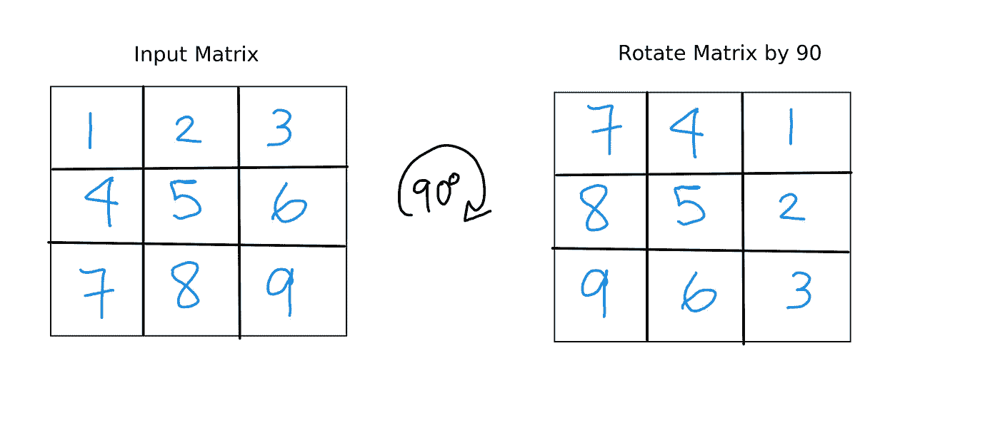
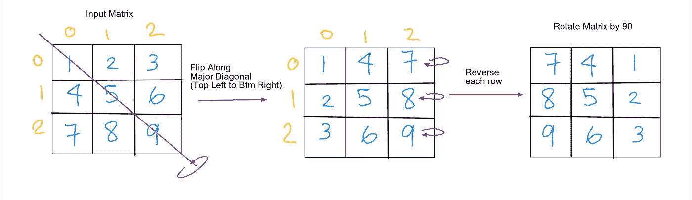
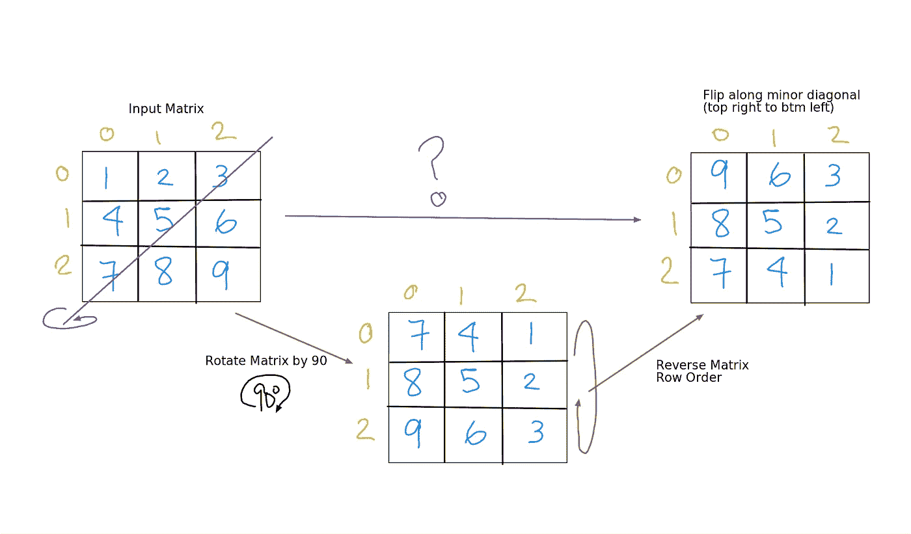
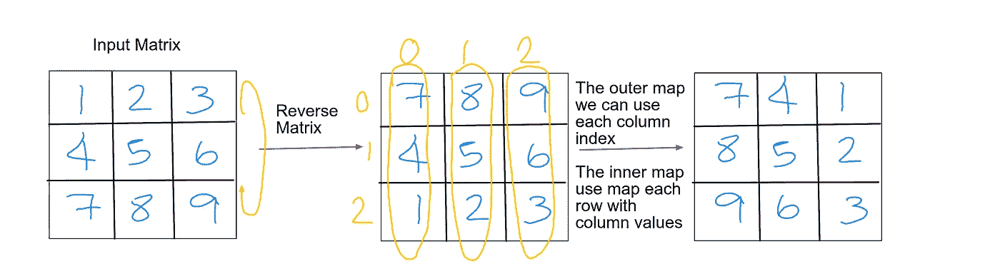

# 让我们顺时针旋转一个矩阵！JavaScript 初学者

> 原文：<https://blog.devgenius.io/lets-rotate-a-matrix-clockwise-javascript-beginners-65a9c34aa0a6?source=collection_archive---------1----------------------->

Honey Yanibel Minaya Cruz 在 [Unsplash](https://unsplash.com?utm_source=medium&utm_medium=referral) 上拍摄的照片

给定一个 n×n 的矩阵，我们如何将它顺时针旋转 90 度？这是一个标准的算法问题，在我们重构和优化代码之前，让我们看一个直观的解决方案。

我们的目标是编写一个函数，它接受任意 n×n 大小的输入矩阵，并返回旋转矩阵的输出。请参见下面的 3 x 3 矩阵示例，这是我们输入和输出的数组表示。

本博客将涵盖以下内容，并使用一个 3 x 3 矩阵示例:

1.  矩阵旋转过程中每一步的视觉效果
2.  如何翻转主对角线和次对角线上的矩阵
3.  使用 JavaScript 内置方法的其他解决方案

# 让我们旋转这个矩阵…

3 x 3 矩阵旋转 90 度

比较输入矩阵和输出矩阵，列现在是行，但是颠倒了。例如，输入中的第一列现在变成了输出中的第一行，但是被颠倒了。

# 旋转矩阵有哪些步骤？

旋转矩阵的步骤

要访问矩阵中的每个值，可以使用一个简单的嵌套循环。

1.  矩阵沿主对角线翻转(从左上到右下)。这将把列转置为行。这是通过将对角线上半部分的值与下半部分的值交换来实现的。例如，[行:索引 0][列:索引 1]处的值为 2，将被[行:索引 1][列:索引 0]处的值 4 替换，反之亦然。记住要确保交换只发生一次，内部嵌套循环(列索引)必须正确初始化。
2.  反转矩阵中的每一行。这可以用 JavaScript 内置的 reverse 方法来执行，或者用 for 循环交换两端的值，直到到达中心。

现在我们知道如何沿着主对角线翻转并旋转矩阵。让我们更进一步。

# 如何沿次对角线翻转矩阵？

从右上到左下的短对角线。

沿次对角线翻转的步骤

在没有旋转矩阵的情况下，用交换索引值来解决这个问题可能很麻烦。沿着次对角线交换索引值不像主对角线那么简单。

然而，通过旋转矩阵，我们可以直观地看到解决方案很简单。只需反转(上下颠倒)旋转后的矩阵！这些步骤是:

1.  将矩阵旋转 90 度
2.  颠倒整个矩阵的顺序，上下翻转。底部一排现在在顶部，以此类推。

让我们看看代码。函数表达式已经通过不同的方式被隔离以操纵矩阵。

不同函数表达式的摘要:

*   旋转矩阵:沿主对角线翻转，然后反转每一行
*   翻转主对角线:将对角线上半部分的每个值与下半部分交换。为了确保交换不会发生两次，请将内部循环(列索引)初始化为从外部循环(行索引)开始。
*   翻转次对角线:旋转矩阵，然后反转整个矩阵

# 使用 JavaScript 内置映射方法的其他解决方案

利用 JavaScript 的 map 方法，我们可以压缩代码来进一步旋转矩阵，如下所示。

对于更深入的研究，下面的参考资料是很好的解决方案！

 [## 矩阵旋转♻️

### 深潜

medium.com](https://medium.com/front-end-weekly/matrix-rotation-%EF%B8%8F-6550397f16ab) 

用地图旋转矩阵

要深入分析此解决方案:

1.  反转整个矩阵
2.  使用外部映射获取所有列索引
3.  使用内部映射用列值更改每一行

希望这对某人有帮助！

我要结束黑客反应堆的第六周。我 10 个月大的孩子到处乱爬乱爬。我们过去两周的练习包括解 N 皇后和学习 HTTP，REST API，互联网流量如何传输的机制和 MVC。使用 jQuery，我们可以在不刷新页面的情况下，使用 Parse API 作为后端从服务器获取数据。毫无疑问，感觉总是有很多东西要学！