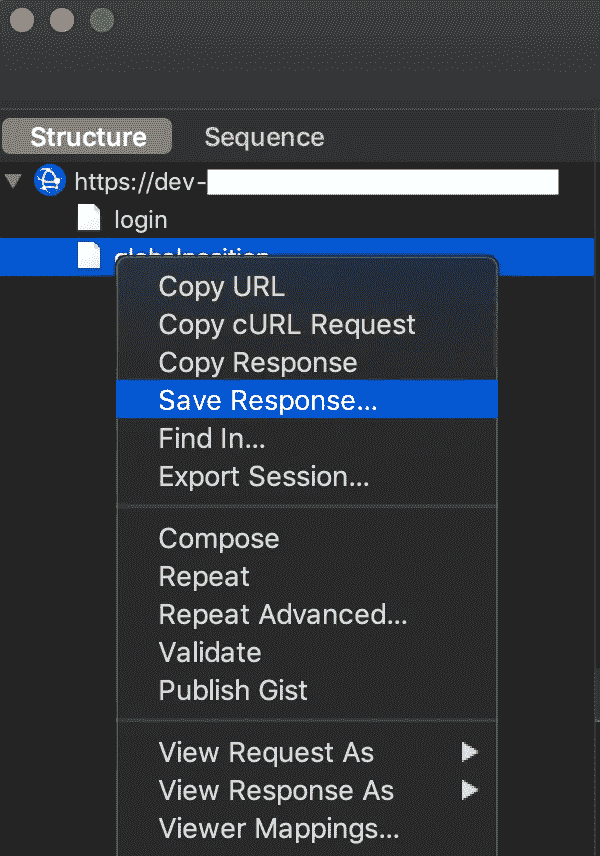

# 让我们用 Xcode 在 iOS 模拟器中设置 Charles

> 原文：<https://blog.devgenius.io/lets-setup-charles-in-ios-simulator-with-xcode-c4bfa0daae7?source=collection_archive---------2----------------------->

在开始这篇文章之前，我们应该问问自己什么是查尔斯。

*“Charles 是一个 HTTP 代理/ HTTP 监控/反向代理，使开发者能够查看他们的机器和互联网之间的所有 HTTP 和 SSL / HTTPS 流量。这包括请求、响应和 HTTP 头(包含 cookies 和缓存信息)。”*

*现在，对于什么我们可以用**查尔斯**？。基本上是调试我们应用程序中的网络请求。很多时候，作为开发人员，我们希望更改一些请求，看看是否会失败，或者迫使应用程序接收一个错误的值，看看我们的应用程序如何对该请求做出反应。其他时候，我们只是想看看有什么反应，以找出应用程序失败的原因。我们想测试的东西很多，有时候不知道怎么测试。我们可以用查尔斯做所有这些事情。让我们开始吧。*

1.  ***安装查理**[**https://www.charlesproxy.com/download**](https://www.charlesproxy.com/download)*
2.  ***打开 Charles，点击菜单:帮助> SSL 代理，选择** _ ***在 iOS 模拟器中安装 Charles 根证书****

**

*3.**现在确保您选择了 macOS 代理选项，这样我们就可以监听流量，所以在菜单中单击:代理> macOS 代理***

**

*4.重启你的模拟器，确保你正在记录进来的流量。你应该在右下方看到一个“*录音* _ **标签”。如果没有，只需点击“*开始记录*按钮“***

**

*5.**在模拟器中运行 app，这时你应该会在左边看到进来的流量***

*6.**现在，您必须确保为您想要测试的 URL 启用 SSL 代理。有两种方法可以做到这一点:***

*   *第一种方法是在菜单中单击:代理> SSL 代理设置，然后添加您想要的 URL。*

****

*   *第二种方法是，当您在 Charles 的左视图中看到传入的流量时，只需右键单击您想要的 URL，然后单击*启用 SSL 代理**

**

*7.**现在重启模拟器，您将看到响应***

*8.**如果你点击响应，和*内容*你可以看到我们得到的 JSON。现在我们可以检查为什么我们在应用程序中得到一个错误，如果是这样的话。***

**

*9.让我们在本地映射一些响应，这样我们就可以模拟它们了。在响应中点击右键，点击*保存响应……**

**

*10.**现在右键单击请求，然后单击*查看器映射…* 并复制主机、端口和路径，因为我们接下来将使用它。***

****

*11.**现在在菜单中点击:工具>地图本地…并添加一个新的。对于本地路径:您将选择您保存的响应，对于主机、端口和路径，您将用您在上一步中获得的信息填充它。***

******

*12.**现在您可以编辑 JSON 并开始测试您的网络响应***

*这就是你如何设置 iOS 模拟器查尔斯。如有任何问题，您可以联系我。*

*与我们合作:*

* [## 阿维拉泰克

### 技术创新的发展

www.avilatek.com](https://www.avilatek.com/en/) 

领英:[https://www.linkedin.com/in/marcelo-laprea/](https://www.linkedin.com/in/marcelo-laprea/)*