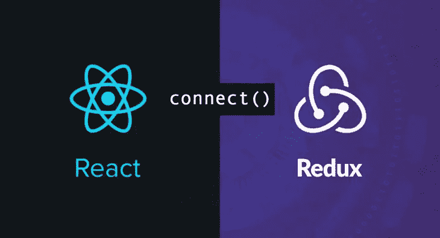
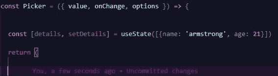
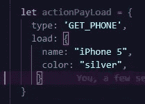
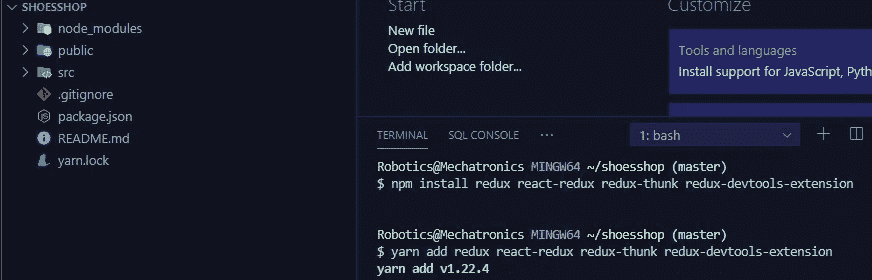
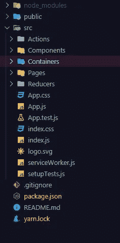
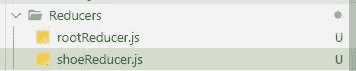
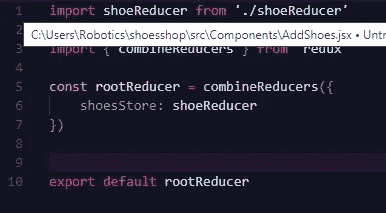
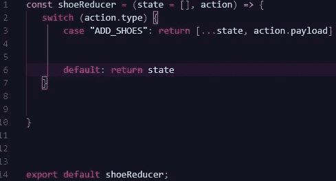
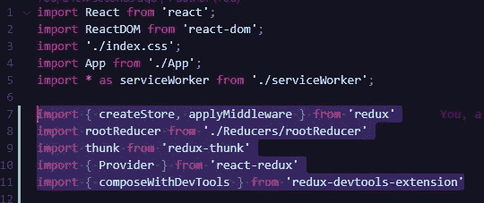
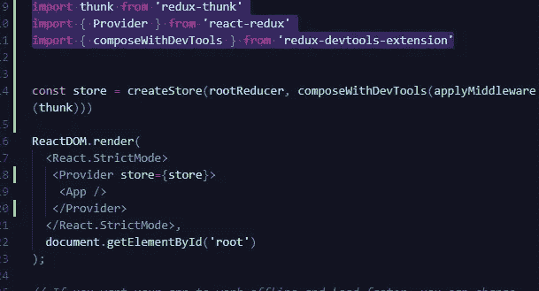

# 让我们简化 React Redux

> 原文：<https://blog.devgenius.io/lets-simplify-react-redux-996fbb52c547?source=collection_archive---------0----------------------->

react Redux-让我们简单点

当今世界上的大多数前端工作，甚至是您的个人项目，总是需要一个健壮的 UI 状态管理器，因为随着应用程序扩展，数据传输、数据突变和控制会增加。

如你所知，这个问题的解决方案是 Redux 或 Mobx-State-Tree(MST)。我喜欢函数式编程，尤其是在编写前端代码时，因此我选择深入学习 Redux，而不是 MST，后者更像是 OOP(面向对象编程)风格。在这篇文章中，我将简化 React Redux，尽管它看起来很复杂，只要保持冷静，边喝咖啡和吃饼干边读完。

尼日利亚购物中心

# 概念和术语

想象一下你正在参观一个非常大的购物中心，就像上面显示的那样，你可以在这里买到任何你想要的东西--手机、食物、衣服等等。而不是在 A 区有电话市场，在 B 区有食品市场，在 C 区有服装市场，万岁！！！有了购物中心，你可以在一个地方拥有所有的市场类型。

这同样适用于您的 UI，而不是每个组件管理自己的状态，如下所示

无状态功能组件— ReactJS

我们现在有一个名为 REDUX STORE 的商场或商店，其中保存了每个组件的所有状态(服装市场、食品市场和电话市场组件)或数据，可以随时随地进行检索或更新，太棒了！！！因此，组件 A(手机市场)现在在商店或商场中，如果我需要一部手机，我只需开车去商场，不需要将道具传递给组件 A(手机市场)来获得手机，这同样适用于所有其他组件。

这使得您的应用程序组件摆脱了逻辑，轻量级，因为它们只消耗数据，根本不管理状态，超级动态，因为它们只需要开车到商场或 redux 商店去获得他们需要的任何东西。

## 还原剂

由于我们现在有一个大商场或 redux 商店，我们仍然需要销售人员来处理商场的每个部分。在 Redux 中，这些处理商场或商店各个部分的销售人员被称为 REDUCERS，他们接受你的请求并给你一个答复，例如

我:我需要一部 iPhone 5

销售人员:你好，我是约翰，我经营 iPhones，先生，你需要什么颜色的？

## 行为

去商场时，我会口头或书面要求购买我需要的物品。在 Redux 中，包含标题或类型以及简短描述的请求被称为动作或动作负载(这是一个普通的 javascript 对象)

重复操作

## 派遣

Dispatchers 或 Dispatch 只是我们将我们的动作或有效负载发送到商店的方式(一个方法或函数),一旦它到达商店，处理 GET_PHONE 动作类型的 Reducer 现在继续从商店获取电话的事务处理

## 连接

CONNECT 是另一个可以理解的简单术语，对于一个买家(一个需要数据的组件)来说，要想从商场得到一件商品，我必须把车开到商场。前往商场的汽车或驾驶过程在 React-Redux 中称为 CONNECT。这只是从商店获取信息或向商店发送动作或有效负载的一种方式。因此，通过 CONNECT，我可以从商店中获得一些东西，还可以分派一个操作。

# 让我们构建 REACT REDUX 鞋子销售应用程序

对于这个应用程序，我们将使用一个 react 应用程序，所以打开你的 cmd 并创建一个

*npx 创建-反应-应用程序 shoesshop 商店*

在这里了解更多: [react app](https://reactjs.org/docs/create-a-new-react-app.html)

如果您已经完成，请安装以下依赖项

*npm 安装 redux react-redux redux-thunk redux-dev tools-extension 或 yarn add redux react-redux redux-thunk redux-dev tools-extension*

您应该有一个类似的目录

在 src 文件夹中创建以下文件夹:

1.  组件文件夹:这个文件夹包含了我们所有的组件。创建 AddShoes.jsx、ViewShoes.jsx、EditShoes.jsx
2.  容器文件夹:这个文件夹包含了我们所有的容器。创建 Ad.jsx、ViewShoesCont.js、EditShoesCont.js。

**容器:**想象一下一个孕妇，她做所有的进食、行走和药物治疗，而婴儿只是记录她的生命体征。在 React Redux 中，容器(孕妇)是组件的包装器，它们与存储交互，获取所有数据，甚至调度动作，然后将结果作为道具传递给组件。这种最佳实践有助于保持组件的轻量级和无逻辑。

3.行动文件夹:这个文件夹包含了我们所有的行动或行动创建者。

**动作创建者:**动作创建者是返回动作的普通 javascript 函数

4.Reducer 文件夹:这个文件夹包含了我们所有的 redux reducers。

**REDUCERS(技术定义):**是 Javascript 函数，获取应用程序的前一个状态和动作，并返回新的或下一个状态。因此，它们是纯函数。

5.页面文件夹:这个文件夹存放了我们所有的页面。在里面创建 Home.jsx，Sales.jsx，dashboard.jsx 文件。

我们的文件结构

## 将 REDUX 集成到 REACT 应用程序中

在 Reducer 文件夹中添加 rootReducer.js 和 shoeReducer.js 文件。

我们正在构建的应用程序只需要一个 reducer(我们商场的销售人员)，她(shoeReducer)处理所有与鞋子有关的事务。

因此，如果你正在构建一个有多个概念的应用程序，你将需要更多的 reducers 来处理每个概念。我希望在下一篇关于在 React-Redux 中处理异步/同步操作的文章中构建这样一个应用程序。

在 *rootReducer.js 中添加下面的代码*

首先，我们进口了我们的*鞋减速器*，然后我们从 *redux 进口了*联合收割机减速器*。有了 combine reducer*，我们可以用一种统一的方式保存我们所有的 app reducers。它接受一个对象(键值对)，所以在 mall(redux store)中，我们的 *shoeReducers* 被标识为 *shoesStore* ，如上图所示

在 *shoeReducer.js* 中添加以下代码

记住，redux 中的 reducers 是纯 javascript 函数。它的第一个参数是状态，另一个是动作对象。

在 redux 中，状态必须是不可变的，所以你永远不会使用 *state.name，state[0].user.country，*你只会使用 filter，map，spread syntax(…)等方法返回一个新的或下一个状态，这些方法不会篡改原始数组，而是返回一个新的数组。

在根目录下的 *index.js* 中导入以下模块

***redux:*** 我们导入 *createStore* ，这使我们能够实际创建商店，所以在 redux 中将其视为土木工程师。applyMiddleware 是一个包装器，它使我们能够使用 redux 进行 API 调用

***rootReducer:*** 我们导入上面创建的 rootReducer.js 文件

***thunk:*** thunk 帮助我们进行 API 调用，它只是一个使之成为可能的中间件

***provider:***provider，就像 React 上下文 API 中一样，使应用程序中的每个组件都可以使用我们的存储中的数据

***composewithdevtools:***这有助于我们使用她的[浏览器扩展](https://chrome.google.com/webstore/detail/redux-devtools/lmhkpmbekcpmknklioeibfkpmmfibljd?hl=en)在浏览器中可视化我们的 redux 商店

现在，我们使用导入的函数来实际创建商店，并用 ***提供者*** 包装我们的根组件(App.js)

添加以下代码:

一个变量存储然后被分配给 *createStore* ，首先接受我们的 rootReducer 和 *composewithdevtools* 包装我们的 *thunk* 中间件

# 结论

这并不是本教程的结束，而只是开始，Redux 始终是一个庞大的主题，需要在一篇文章中从头开始深入探讨。在我的下一篇文章《在浏览器中可视化 React-Redux 商店》中，我将完成这个应用程序，并向您展示如何在浏览器中可视化商店。

回购条款:[https://github.com/armstrong99/Simplifying-React-Redux](https://github.com/armstrong99/Simplifying-React-Redux)

非常感谢您的阅读。