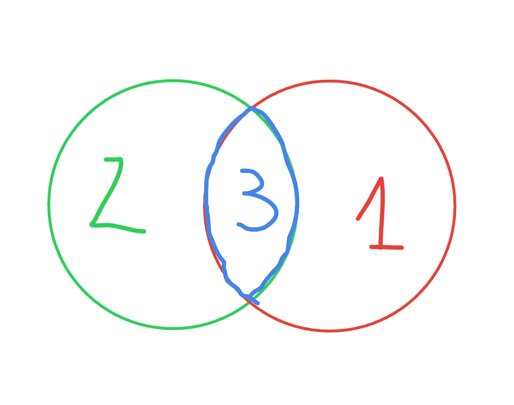

# 让我们来解决 Leetcode 2441:最大的正整数和它的负数

> 原文：<https://blog.devgenius.io/lets-solve-leetcode-2441-largest-positive-integer-that-exists-with-it-s-negative-9771740c27f7?source=collection_archive---------5----------------------->


在这篇文章中，我将解释我对 leetcode 问题的解决方案:*与其负数同时存在的最大正整数。*

此处链接问题[。](https://leetcode.com/problems/largest-positive-integer-that-exists-with-its-negative/)

## 问题

给定一个整数数组`nums`，其中**不包含**任何零，找到**最大的正整数**使得`-k`也存在于数组中。

返回*正整数* `k`。如果没有这样的整数，返回`-1`。

## 概观

0.迭代`nums`

1.  寻找符合这个标准的整数对:`k = |-k|`

2.从满足条件的对中返回最大的正整数`k`，如果没有对，返回-1

*注:*保证`nums`中没有零

## 强力 O(n2)

当你解决任何问题时，你要做的第一件事就是考虑非最优的暴力解决方案。让我们来看看这个整数列表:

```
nums = [-1,2,-3,3]
```

检查来自`nums`的每一个配对组合，并将来自配对的满足给定标准的正数`k = |-k|`添加到数组中，这是解决这个问题的一个非常简单的方法。

以下是一些初始组合:

*对于索引 0 处的-1:*

(-1,2), (-1,2), (-3,3)

*对于索引 1 处的 2:*

(2,-1), (2,-3), (-2,3)

*以此类推……*

最后我们会发现这对:

*(3，-3)*

符合标准`k = |-k|`。

现在可以将该对中的正整数 **3** 添加到结果数组中。

如果不为空，函数**将从结果数组**返回最大值。如果为空 **-1 将被返回**。

时间复杂度: **O(n2)** 因为嵌套了 for 循环。

记忆复杂度: **O(n)**

## **O(n)时间和 O(n)内存使用设置**

解决方案概述:

声明两个集合:一个将记录正整数，第二个将记录负整数的绝对值。


说明照片

现在，当我们有两个集合时，让我们找到共同的部分:



两个集合的公共部分

应该返回公共部分的最大数字——在本例中是 3。如果没有公共部分-1 应该被返回。

## 代码:

以下是用 Python 编写的解决方案:

python 解决方案

## 代码解释:

*第 3-4 行:*

声明空集来记录数字。

其中一个将收集正数，另一个将收集负数。

*6 号线*:

开始遍历 num

*7–8 号线*:

检查数字是否大于 0，如果是，则将其添加到正数集合中

*第 9–10 行:*

检查 number 是否小于 0，如果是，将其绝对值**加到负整数集合中。**

*第十二行*:

得到正集和负集的公共部分

*第 14 行*:

如果交集为空，则返回-1。否则返回集合中的最大值。

## 总结

我们可以看到，上面介绍的解决方案非常有效:


结果