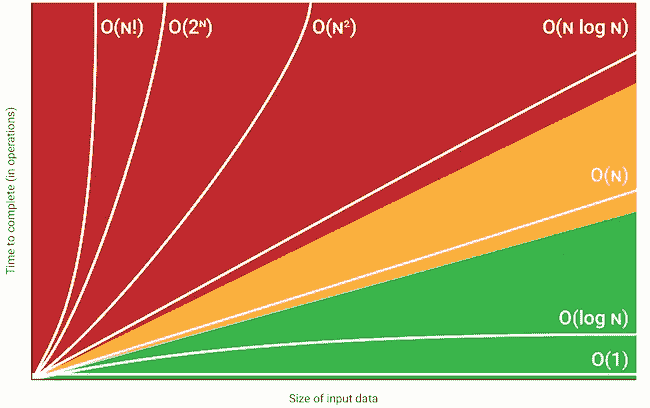

# 让我们来谈谈大 O

> 原文：<https://blog.devgenius.io/lets-talk-a-little-bit-about-big-o-1b592dd1a40c?source=collection_archive---------48----------------------->

对于任何软件开发人员/工程师来说，这都是最重要的话题之一。它已经存在很长时间了，它可以真正让你成为一个更好的开发者。太重要了！大的地方像谷歌，亚马逊等都知道这个。如果你不知道这个话题，你就无法通过筛选面试。

它将好的代码与伟大的代码区分开来。要成为一名优秀的开发人员，深入钻研数据结构和算法是很重要的。

大 O 渐近分析可以看出一个问题解决的有多好！我们应该从大 O 是什么以及我们如何定义它的角度来谈论它。它区分好代码和坏代码，好代码和伟大代码。在这里建立一个坚实的基础是明智的，因为它与数据结构和算法有着密切的关系。

什么是好代码？它是可读的。它是可扩展的。

大 O 符号允许我们度量我们的代码……它的伸缩性有多好！

可伸缩代码的想法…大 O！

JavaScript 有一个很好的方法来衡量一个函数运行需要多长时间。浏览器内置了性能。Research performance.now()来尝试一下。

在 JavaScript 中，我们可以创建一个大规模数组，有许多因素会影响性能:您使用什么编程语言，您的设备上运行多少其他应用程序，您设备的性能规格。谁的代码更好？我们如何从效率的角度来衡量这一点？什么是好代码和坏代码？什么代码规模？回答这些问题的一个方法是使用大 O 比较两个算法/函数，看看哪个更好。

当我们谈论代码的大 O 和可伸缩性时，我们只是简单地指:当我们随着我们的输入越来越大时，算法或函数变慢了多少。如果元素列表增加，我们还需要做多少操作？这叫算法效率。大 O 让我们可以解释这个概念。随着元素/输入数量的增加，我们看到循环中的操作或事情的数量也在增加！当我们谈论代码的大 O 和可伸缩性时…当我们的输入越来越大时，它慢了多少？越慢越好！我们可以计算出一台计算机将执行多少次运算。大 O 关心的是我们在一个函数中走了多少步！

这是对大 o 的一个非常笼统的介绍。我们可以在以后的帖子中更具体地讨论这个主题。

我强烈推荐 Andrei Neagoie 和他的所有零到精通课程，以便获得成为一名伟大的程序员和成为一名高级开发人员的基础。

图片来源:[https://danielmiessler.com/study/big-o-notation/](https://danielmiessler.com/study/big-o-notation/)