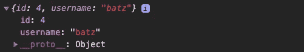

# 我们来谈谈(……)，宝贝

> 原文：<https://blog.devgenius.io/lets-talk-about-baby-8acb607cb7a5?source=collection_archive---------28----------------------->

制造者在 [Unsplash](https://unsplash.com?utm_source=medium&utm_medium=referral) 上 [NESA 的照片](https://unsplash.com/@nesabymakers?utm_source=medium&utm_medium=referral)

在过去的三周里，我已经涉水通过 JavaScript 的深水和它的所有独特的怪癖。最近，我开始使用具有相对频率的特定操作符，并且我真的开始欣赏我们可以部署它的不同方式。我们来谈谈[传播](https://developer.mozilla.org/en-US/docs/Web/JavaScript/Reference/Operators/Spread_syntax)。

首先，什么是传播算子？文档(上面的链接)将 spread 定义为一种语法，该语法允许在应该有零个或多个参数(对于函数调用)或元素(对于数组文本)的地方扩展诸如数组表达式或字符串之类的可迭代对象，或者在应该有零个或多个键值对(对于对象文本)的地方扩展对象表达式。用简单的英语来说，这意味着我们可以通过使用“…”运算符将值注入其他人。

为了清楚起见，文档中的示例

看看上面的例子，你可以看到我们已经定义了一个常量，parts，它是一个字符串数组。我们还定义了一个独立的常量，歌词，这是另一个字符串数组。在歌词中，我们在' *head'* 、*'和'【T9]'值之间“展开”数组，将零件的值注入数组。最终的输出是你最喜欢的童年歌曲中熟悉的顺口溜。神奇！*

好的，史蒂文，我想这很酷，但是我们什么时候会用到这样的东西呢？

很高兴你问了。

让我们看一个简单应用程序的例子，用户可以“喜欢”某本书。每本书都有一批喜欢它的用户。在本例中，如果用户以前不喜欢某本书，我想将该用户添加到数组中。如果用户以前喜欢过这本书，我想将该用户从数组中删除。(我们将使用。找到这部分的方法，所以你今天在这里上了一堂二合一的条件句课。)让我们来看看将要完成这个任务的代码。

对于感兴趣的人来说，这里使用的终端主题是 [SynthWave '84](https://marketplace.visualstudio.com/items?itemName=RobbOwen.synthwave-vscode) 。

对于本例，我们已经将我们的用户硬编码为 myUser，并创建了一个变量 updatedUsers(当前未定义)集，以输入条件逻辑来定义该变量。第一个条件查看' *book* '对象，并检查是否有 ID 设置为 1 的用户。如果存在这样的用户，请从对象中删除该用户。第二个条件告诉程序，如果不存在这样的用户，则将变量 updatedUsers 设置为一个数组，将 spread 运算符应用于 book.users 对象，并包含 myUser。

对于上下文来说，这是我们在 console.log(…book.users)中得到的结果—已经喜欢这本书的用户对象。一旦我们成功地将 myUser 传入，我们就创建一个 updatedBook 变量，设置为 Book 对象的值，并更新 book 以反映新加入的用户。最后，我们发出一个 fetch 调用来“修补”数据库中的 book 对象，以持久化这些更改。

下面，我们记录了 updatedBook 对象，以显示用户已经被传入。

如您所见，spread 运算符是一个方便的小工具，可以直接应用于实际问题。有时候在编程中，尤其是如果你处于理解的初级阶段，你会发现自己在想，“我什么时候会真正用到它？”—我当然知道。幸运的是，通过足够的接触，你会发现语言中这些更微妙的部分会让你的生活变得简单很多。