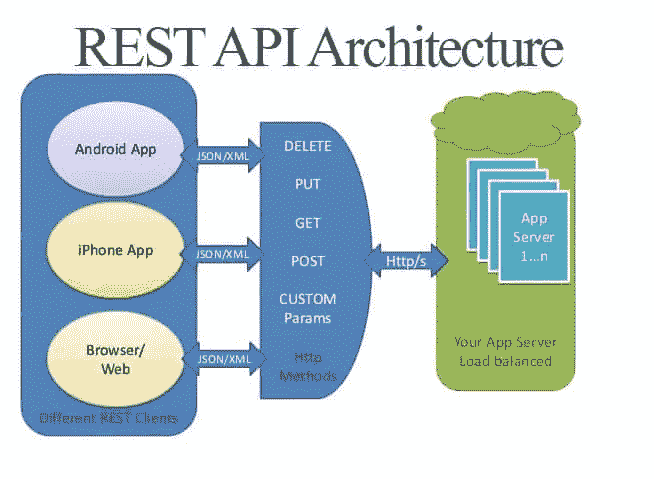
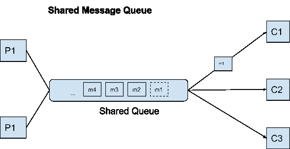

# 让我们来谈谈微服务“拥有”他们的数据

> 原文：<https://blog.devgenius.io/lets-talk-about-microservices-owning-their-data-169f66d64216?source=collection_archive---------2----------------------->

前几天，我和一位同事讨论了我的微服务将用来公开特定数据集的接口的设计。数据由我的微服务保存在弹性搜索中，并根据最终用户选择的过滤器以不同的形式由用户界面使用和呈现。当我仅仅提出让 UI 的后端直接从弹性搜索中查询数据这个亵渎神明的想法时，经典的“微服务不应该暴露其底层数据存储”的论点被点燃了。

谁拥有这些数据？？

# 公开数据的服务

我从头说起。微服务可以通过他们希望的任何方式或任何技术来公开数据，这取决于用例。让我们想象一个简单的数据项，并通过一些例子。
所讨论的数据项将是这个简单的 JSON 对象，它表示一条消息:
*{
id: 2321387
发送者:"乔"
Message _ content:" Hello World Message "
}*

公开这些数据最没有争议的方法可能是:
REST API
GraphQL

这些是“纯”API，因为它们提供了接口和底层数据存储的完全解耦。今天我可能会把数据保存在 Couchbase，明天保存在 Redis，下周我会把它转移到 S3。如果我改变实现，消费者不需要知道任何事情。

通过 REST API 公开数据——没有争议

消息队列中的消息怎么办？像卡夫卡或者 RabbitMQ 之类的？软件工程社区仍然会将这些技术定义为一种无争议的公开数据的方式。在许多产品的架构中，微服务通过消息队列相互通信，对吗？如果我想将我的实现从 Kafka 更改为 RabbitMQ，会发生什么，难道消费者不需要更改他们的实现吗？他们当然会，但是你可能会说完全改变一个产品的整个信息技术是不太可能的。

通过消息队列公开数据——没有争议

现在让我们朝着这个方向再走一步。数据仓库和数据湖呢？把你的数据保存在 S3，让消费者使用 Athena/Presto/BigQuery 在上面运行查询，怎么样？在这个用例中封装数据发生了什么？令人惊讶的是,“接口-数据存储解耦”范式的纯粹主义者根本不认为这是一个坏的实践。

我试图证明，数据湖/仓库用例与通过弹性搜索、Couchbase、Redis 或任何其他技术公开数据之间没有真正的区别。数据的位置不是问题，因此数据的解耦不是解决方案。我们看待这件事的方式是错误的。

不是那样的，别傻了！

# 内部数据与公开数据

真正的区别应该是您定义的服务的“内部”数据或状态，以及您定义的服务的“公开”数据。问题不在于你选择哪种技术来存储数据。

内部数据是其位置和模式可以在不事先通知的情况下更改的数据。它完全是服务和拥有团队内部的，任何消费者都不应该依赖它。某一天它可以是内存中的散列表，另一天它可以是 DynamoDB 中的表，第三天开发人员可以决定将它存储在 S3，因为它太大太贵了。只要这些数据被定义为内部数据，我们就可以在任何时间点引入“突破性变化”，因为它不会“突破”任何消费者。

公开数据是您向您的消费者公开的数据，并对其及其模式负责。不管你是通过一个定义良好的 REST API、一个定义良好的 Kafka 消息、一个定义良好的 S3 ORC 文件还是一个定义良好的 Couchbase 记录来公开它。只要您和您的消费者同意这是公开的公共数据，您就不能在没有通知您的消费者的情况下引入突破性的更改。您甚至可以想象一个使用 2 个 Couchbase 存储桶的服务——一个用于内部数据，一个用于公开数据。同样，技术并不重要，重要的是数据用途的定义。

重要的是要澄清，即使这些数据是公开和共享的，消费者只被允许从中读取。在这种模式中，拥有的服务仍然是对公开数据具有写访问权限的唯一实体(显然对内部数据也是如此)。您可以将此视为微服务的一种 CQRS 实现。

为什么您甚至想通过 Couchbase 或 Athena 公开您的数据，而不是严格地通过 WEB APIs，比如您可能会问的 REST 或 GraphQL。
Amazon Athena 是一个很好的例子，因为它通过多个服务器并行运行您的查询，因此您的数据消费者可以利用 Athena 的能力进行快速大数据查询。有什么选择？您会在自己的服务中构建类似的功能并通过 Web API 公开它们吗？您将如何通过 Web APIs 公开丰富的 SQL 语言呢？GraphQL 能涵盖 SQL 提供的所有选项吗？API 将会是一个通用字符串，您将在内部传递给 Athena 并将结果分页显示给消费者吗？

同样的概念可以应用于 Couchbase、DynamoDB、Aurora 或任何其他数据存储。这些工具是为扩大规模而创建的，旨在接受和响应每秒成千上万的请求。如果一切都严格通过您的服务进行，这意味着您的开发人员要么需要在他们自己的服务中重写这些技术的功能，要么只是在逻辑上降低数据存储的真正底层功能。

# 包裹

您需要在内部数据和共享数据之间进行逻辑划分。后者是您与外界共享的数据，而内部数据是完全封装的实现，您的消费者不需要知道。数据集可以被认为是内部的并驻留在状态存储中，而相同数据的投影可以驻留在相同的状态存储中并对外公开。这完全取决于您的用例，以及向您的消费者公开数据的最佳方式是什么。

祝你下次架构头脑风暴会议好运；)

最诚挚的问候，
Guy Sela
创始人兼 CTO @ [扑克斗士](https://www.poker-fighter.com/)