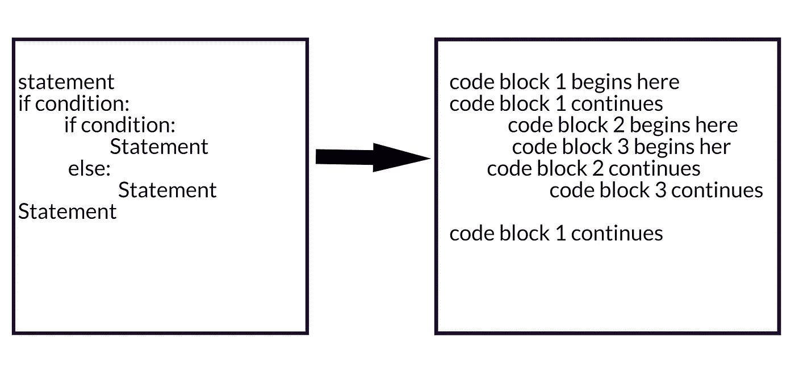
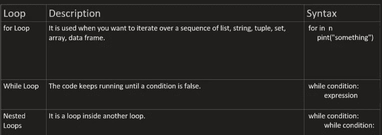

# 再说 python :)episode1。

> 原文：<https://blog.devgenius.io/lets-talk-about-python-episode1-3198eeb3a88c?source=collection_archive---------20----------------------->

# Python 是什么？

Python 是一种解释性的、面向对象的高级编程语言，由 Guildo Van Rossum 创建并于 1991 年发布。它的高级内置数据结构，结合了动态类型和动态绑定，使它对于快速应用程序开发，以及作为脚本语言或粘合语言将现有组件连接在一起非常有吸引力。

# 需要注意一些关键点:

。Python 可以用于 web 开发(重度端)，

。Python 可以用于软件开发，

。Python 可以被工程师使用，

。Python 可以用于系统脚本，

。Python 运行在一个称为 python 虚拟机的解释器系统上，这使得代码一写出来就可以执行，

。python 可以用过程化的方式、面向对象的方式或函数化的方式来处理，

。Python 使用新行来完成命令，这与其他编程语言不同，后者通常使用分号或括号，

。Python 依靠缩进，使用空白来定义范围；例如循环、函数和类的范围。其他编程语言经常为此使用花括号。

**Python 语法**

Display = "hello world "

打印(“显示”)

你好世界

python 中的这种组织方式被称为语法。随着我们的继续，我们将会看到更多的语法以及如何应用它们。

# 变量

变量是数据可以被赋值和存储的实体。例如:

Number = "这是一个实体"

打印(数字)

数据类型

python 中有各种数据类型，其中一些常见的有:

Integers: integer 数据类型是 int 的缩写，是整数，如 1、2、3 等..

Float: float 数据类型是十进制类型的数字。

字符串:字符串数据类型是字符的组合

Char: char 数据类型是单个字符

Boolean:布尔数据类型可以是 true 或 false

评论

在 python 中，使用#符号可以很容易地写出注释。

这里有一个例子:

#这是一条评论

**缩进**

这是 python 最重要的协议之一。缩进是在 python 中工作时组织代码的一种方式，进一步分解，它指的是在语句前添加空白，缩进是告诉 python 一组语句或代码属于特定块的一种方式。

在上面的例子中，

语句(第 1 行)、if 条件(第 2 行)和语句(最后一行)属于同一个块，这意味着在语句 1 之后，if 条件将被执行。假设如果条件为假，Python 将跳转到最后一条语句执行。

嵌套的 if-else 属于块 2，这意味着如果嵌套的 if 变为 False，那么 Python 将执行 else 条件中的语句。

嵌套 if-else 中的语句属于块 3，根据 if-else 条件，只执行一条语句。

**赋值运算符**

**逻辑运算符**

在 Python 中，逻辑运算符用于条件语句(真或假)。它们执行**逻辑与**、**逻辑或**与**逻辑非**运算。

“And”运算符仅在两个条件都为真时有效。

has_high_income = True

has_good_credit = True

如果有高收入和良好的信用:

打印(“符合贷款条件”)

只有当一组条件中的一个或所有条件都为真时,“Or”运算符才起作用。

has_high_income = True

has_good_credit = True

如果收入高或信用好:

打印(“符合贷款条件”)

对于 And & Or 运算符，它们的条件不能为假，否则它们将不起作用。

“非”运算符将真值更改为假，将假值更改为真。

has_high_income = True

has_stableincome = False

如果有高收入而没有稳定收入:

打印(“符合贷款条件”)

**比较运算符**

“>”运算符用于比较两个值，以确定较大的值。

“

The “==” is to check if a variable is equated to another variable or value.

The “!=” is used to determine if a variable is not equal to another .

The “> =”运算符用于比较两个值，以确定较大的值或检查它们是否在同一级别。

这里的<=” operator is used to compare two values to determine the smaller one or check if they are on the same level.

**是一个重量转换器代码:**

这个代码要求用户输入他的体重

用户将选择他想要在磅或千克之间转换的重量单位。

重量单位不得区分大小写。

如果输入另一个单位或字母而不是重量单位，将显示一条错误消息:

weight = int(input("请输入您的体重进行换算: "))

unit = input('输入 k 以了解您的体重，单位为 kg；输入 p 以了解您的体重，单位为磅(lbs)L:')

选择 1 = 'K '

选择 2 = 'L '

if unit.upper() == choice1:

转换=重量* 0.45

打印(f“您{convert}单位为千克”)

elif unit.upper() == choice2:

转换=重量/ 0.45

打印(f“您{convert}以磅为单位”)

否则:

单位！=选择 1 和不选择 2

打印(“错误”)

**If 语句**

如果语句用于决定是否执行某个语句或语句块，即如果某个条件为真，则执行某个语句块，否则不执行。

**语法:**

如果条件:

陈述 1

陈述 2

如果条件为真，则执行语句 1，否则执行语句 2

示例:

a = 3

b = 2

如果 a > b:

打印(“这是 if 语句”)

输出:这是 if 语句。

**If-else 或 elif**

if else 语句用于我们想要执行的时候。如果 if 命令结果为假，则另一个命令

a = 3

b = 2

如果 b > a:

打印(“这是 if 语句”)

否则:

print("这是 if else 语句")

输出:这是 if else 语句。

**嵌套 if 语句**

它基本上是一个 if 语句块中的 if 语句。

if (condition1):
#当条件 1 为真时执行

if(条件 2):
#当条件 2 为真时执行
#如果程序块在此结束
#如果程序块在此结束

例子

a = 3

b = 2

如果 a == a:

如果 a > b:

打印(“这是 if 语句”)

否则:

打印(“我们有一个错误”)

**循环**

循环是一系列指令，根据某些条件执行一组特定的指令或任务，并继续执行任务，直到条件为假。下表描述了各种循环及其工作原理。

# 示例和练习

**for 循环:**

让我们打印鞋厂的鞋号清单

鞋子= [30，45，29，37，48]

对于鞋码:

打印(尺寸)

**while 循环:**

1.  让我们创建一个简单的猜测游戏，要求用户输入几个数字，用户也有一些限制输入。

秘密号码= 9

guess_count = 0

guess_limit = 3

while guess_count < guess_limit:

guess = int(input(‘guess: ‘))

guess_count += 1

if guess == secret_number:

print(“Hurray!!, you won!! :)”)

break

else:

print(“Sorry you did not guess it right :-)”)

1.  let’s create another game, this time a car game that displays help on the screen to show the user how to play the game, when the user enters start, the car starts, when he enters it again he gets a message saying car is already started, when he enters stop the same thing happens, when he enters another text aside from start or stop or help he gets an error message, when he enters quit, the games stops. And all cases must not be case sensitive.

command =” “

commence = True or False

while True or False:

command = input(“play game: “).lower()

if command == “start”:

if commence:

print(“car is already started”)

else:

commence = True

print(“car is started”)

elif command == “stop”:

if not commence:

print(“car is already stopped”)

else:

commence = False

print(“car is stopped”)

elif command == “help”:

print(“””

start — car starts the

stop — car stops the

quit — car quits

“””)

elif command == “quit”:

break

else:

print(“Unknown command”)

**嵌套循环:**

让我们创建一个嵌套循环，它将打印到屏幕上，因为 a 大于 b 并且 a 不等于 b

a = 10

b = 3

而 a >= b:

而 a！=b:

b +=1

打印(“嵌套循环”)

**中断语句**

Break 语句用于中断循环，从而阻止它继续运行。

使用前面的例子:

秘密号码= 9

guess_count = 0

guess_limit = 3

当 guess_count < guess_limit:

guess = int(输入(' guess:'))

guess_count += 1

如果 guess == secret_number:

打印(“万岁！！，你赢了！！:)")

破裂

否则:

print("很抱歉您没有猜中")

**结论:**大家好，又是我，希望你们喜欢这一集的教程。在下一集，我将介绍数组、方法、类、继承等等。到本集结束时，你将能够对 python 有一个适当的了解，并知道如何应用它来解决现实生活中的问题。