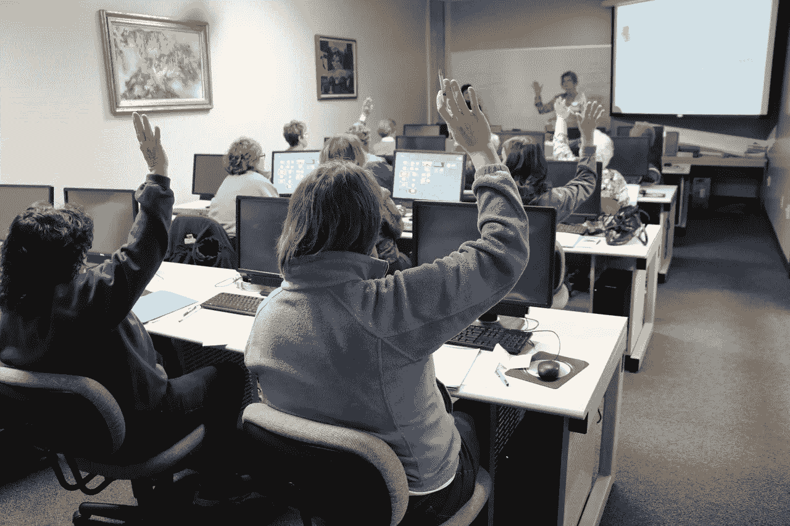

# 写给年轻自己的信

> 原文：<https://blog.devgenius.io/letter-to-my-younger-self-86c7ca389e6a?source=collection_archive---------28----------------------->

*我在熨斗学校软件工程训练营的旅程*


嘿，迈克，现在是 2019 年 1 月，你即将做出改变人生的决定。你作为一名搜索引擎优化分析师已经在数字营销领域工作了几年，虽然你喜欢帮助客户改善他们的网络形象并在搜索引擎上被发现，但你知道还有更多等着你。

在参加 Flatiron 学校的在线兼职软件工程训练营之前，你几乎没有编码经验。您总是对技术感兴趣，您第一次看到代码可能是在 2006 年，当时您更改了 Myspace 个人资料的 HTML 代码。后来，作为一名搜索引擎优化分析师，你在长岛的一家营销机构工作，开始摆弄一些 HTML 来手动改变客户的元数据(标题标签、元描述、H1 标签)。还记得您第一次更改客户的元数据并立即在他们的网站上看到这些更改吗？多酷啊！？！？！这开始激发你对编码的兴趣，你会查看 Codecademy 并在这里或那里做一些免费的课程，但你和我都知道，通过遵循一个设定了截止日期和期望的结构化课程，你会学得最好。

现在是 2018 年底，2019 年初，你决定没有比现在更好的时间来参加熨斗学校的在线软件工程训练营了。

我今天给你写信是关于如何在软件工程训练营中取得成功的一些提示和建议。

1.  **和你的同伴一起努力！**



你知道你是一个外向的人，与人交谈没有问题，所以当训练营开始时，确保与你的同伴建立关系和联系。请记住，你决定参加训练营，在一个队列中遵循结构化的课程，那么你为什么要试图通过自己的努力。

很多时候，你会发现自己陷入了在项目中调试代码的困境。你会确信你想不出来，你会看 20 篇关于栈溢出的文章，不知道该怎么办。我告诉你，有一天晚上，你正在做你的 JavaScript Rails 项目，却不知道你的代码出了什么问题。它会看起来像这样，你无论如何也想不出是哪里出了问题。

```
const formContainer = document.findElementById(`book-${bookId}`) 
```

在最终屈服并向你的同伴中的一个朋友伸出援手，并参加视频会议后，他们会在一分钟内帮你找到错误。没有 findElementById 这种东西。

```
const formContainer = document.getElementById(`book-${bookId}`)
```

我只是想让你少睡一会儿，所以早点接触，对一些代码有新的看法是很有帮助的。

你会发现，即使当别人向你寻求帮助，而你发现了他们代码中的错误，这对你来说也是有意义的实践，你会为帮助别人而感到惊奇，你会觉得自己实际上掌握了软件开发的诀窍！

2.**定期与你的团队领导进行一对一交流！**

再一次，记住你想成为团队中的一员，这样你就可以通过结构化的课程学习成为一名软件工程师。你将会有一个小组领导，他每周都有讲座和学习小组来复习一周的课程。您还可以安排每周 1:1，请务必做到这一点。如果你停留在一个概念上，咳咳，获取请求和承诺，不要试图跋涉向前，并认为你最终会得到它。时间表 a 1:1，你的团队领导可以尝试更好地向你解释这些概念。如果你不这样做，它会堆积在你身上，你会落后的！

3.**尝试与其他软件工程师交流，帮助他们决定哪条道路最适合你**


请记住，进入这个训练营时，你什么都不知道，因为你所知道的唯一的工作头衔是软件工程师，每个工程师都做同样的事情。一旦你开始找工作，你很快就会明白有很多不同的路可以走。作为一名 SEO 分析师，与你工作的公司的工程师交流。他们将能够帮助你理解软件开发的前景，这样当你从训练营毕业时，你就可以专注于你的求职。

哦，是的，我想我会告诉你一个小秘密。你将从熨斗学校毕业后，几乎一年的全职工作在搜索引擎优化，并投入 20 多个小时，每周编码。有时候你会觉得自己不行，太难了，你就坚持 SEO 就好了。但是让我告诉你，在许多不眠之夜和许多许多与你的队友和队长的视频会议之后，你将完成你的最后一个项目，在一次全球疫情中。尽管你可能仍然认为自己不适合，但当你在最后的项目评估中被告知你用他那周听到的最好的回答回答了技术问题时，你会感到很惊讶。

祝贺你，迈克，这并不容易，但你做到了。

现在请去找一份工作，我们有一些令人兴奋的目标要实现，还有很多东西要学习，到目前为止你只是触及了冰山一角。