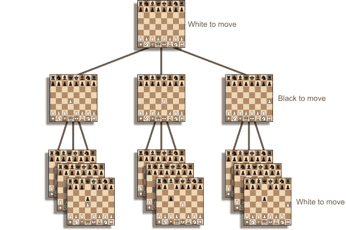

# 通过编写国际象棋引擎来升级为软件工程师

> 原文：<https://blog.devgenius.io/level-up-as-a-software-engineer-by-writing-a-chess-engine-1d0ffc7aebf9?source=collection_archive---------6----------------------->

## 测试


健康的软件需要测试。如今，测试与开发周期密不可分，因为它提高了可靠性，简化了重构，从而加快了功能开发。**本文涵盖了 chess 引擎开发中常用的测试策略。**这些策略遵循技术行业最佳实践，可以应用于任何软件项目。

# 组件测试

国际象棋引擎需要一个移动生成函数来计算合法的移动。这是象棋引擎整体质量的基础组成部分。

因为国际象棋是确定性的，所以从一个位置开始的合法移动的确切次数是已知的。**测试移动生成的一个常用方法是从棘手的位置计算所有可能的移动，并检查计算是否正确。**这种方法被称为移动路径枚举，有时也称为“性能”测试。

例如，白棋从以下位置有 48 个合法移动:


R3K2R/P1 ppqpb 1/bn 2 PNP 1/3pn 3/1p2p 3/2n 2 q1p/ppbbppp/R3K2R w KQkq-

如果你继续检查所有 48 个结果位置的每个合法移动，你会发现 2039 个合法移动。这些被称为移动树的叶节点。这张图片有助于理解我所说的叶节点的含义:



树底部的叶节点

每个叶节点不一定是唯一的位置。然而，导致结束位置的移动的有序组合是唯一的。扩展到六步，从上面显示的位置正好有 88，031，647，685 个叶节点。

如果引擎能够匹配困难位置的预期叶节点数，则移动生成函数中不太可能有错误。有了这种类型的测试，您就可以放心地更新引擎的移动生成代码了。

对于这种类型的测试，有一些有用的公共数据库。比如 [Numpty](https://sites.google.com/site/numptychess/home) creator 在这里列出了几个职位和预期结果[。我的象棋引擎的移动路径枚举测试是](https://sites.google.com/site/numptychess/perft)[这里](https://github.com/tonyOreglia/glee/blob/19ec9959911ab9a045a9d40e7548fd0f8dd4b6e9/pkg/engine/engine_test.go)。

点击阅读组件测试[。](https://martinfowler.com/bliki/ComponentTest.html)

## 关于测试驱动开发的一点说明

测试 bug 可以在你有工作软件之前就开始。事实上，使用测试驱动开发(TDD)的想法是将预期的功能写入测试，然后开发能够通过测试的软件。这是一个很好的策略，并且带来了额外的好处，即从通过测试强制定义的行为开始。

我建议在实现移动生成之前构建移动路径枚举测试。这将在你工作时提供持续的反馈。

点击阅读更多关于 TDD [的信息。](https://martinfowler.com/bliki/TestDrivenDevelopment.html)

# 特性试验

这种测试还有另一个优点。通过监视移动枚举的速度，您可以很好地了解移动生成的性能。

请注意，这种类型的测试必须绕过任何优化，如阿尔法-贝塔剪枝和散列。这是因为测试标准依赖于整个移动树。因此，任何修剪部分移动树的优化都会破坏这些测试。这就是为什么它本质上是一个组件测试，它没有涵盖象棋引擎的所有方面。因此，应该使用额外的性能测试来查看引擎优化搜索空间的效率。

# 宽栈测试

对搜索和位置评估功能的改进需要我们进行一些测试来评估象棋引擎的表现。对于一些没有集成用户界面的引擎，这种级别的测试基本上是端到端的。如果引擎正在与某个协议或 UI 集成，那么这更像是一个广泛的测试。这本质上是引擎的端到端测试。它考虑了移动生成、搜索和评估方法的所有方面。参见马丁·福勒的[测试指南](https://martinfowler.com/testing/)，了解更多关于这些测试类别的信息。

类似于**移动路径枚举**测试**，**在线有测试位置和相应最佳移动的资源。例如， [Bratko-Kopec 测试](https://www.chessprogramming.org/Bratko-Kopec_Test)是一个使用了四十多年的受人尊敬的测试套件。

在这里阅读关于宽栈测试的一般方法[。](https://martinfowler.com/bliki/BroadStackTest.html)

# 单元测试

单元测试是实践测试驱动开发(TDD)的另一个机会。

假设您使用一个[位板](/improve-as-a-software-engineer-by-writing-a-chess-engine-c360109371aa)来表示象棋引擎的位置。例如，拥有一个实现最低有效位计算等通用位板机制的接口是很有用的。在实现实际方法之前，这是一个使用 TDD 来定义接口方法的确切结果的绝佳机会。

举个例子，一些为我的象棋引擎的 bitboard 接口编写的测试是[这里是](https://github.com/tonyOreglia/glee/blob/master/pkg/bitboard/bitboard_test.go)。

尽管这些较低级的方法不应该经常改变，但是如果有一个方法成为性能瓶颈，您可能会发现自己正在改变它们。然后进行一个涵盖预期行为的测试是有帮助的。

> “质量从来不是偶然；它总是智慧努力的结果。”—约翰·罗斯金

测试至关重要。编写一个象棋引擎是提高这些技能的好机会。如果你决定接受这个挑战并编写自己的引擎，请在评论中告诉我！

我希望这篇文章对你有所帮助！如果你想和我一起深入国际象棋编程，[加入 Medium](https://tony-oreglia.medium.com/membership) ，[关注](https://tony-oreglia.medium.com/)，[订阅我的时事通讯](https://tony-oreglia.medium.com/subscribe)，或者在 [Twitter](https://twitter.com/tony_oreglia) 和 [LinkedIn](https://www.linkedin.com/in/tony-oreglia/) 上联系。

```
This article is part four of a series
- Find the introduction [here](/level-up-as-a-software-engineer-by-writing-a-chess-engine-896b7f8eb443).
- Find Part two about Data Structures [here](/improve-as-a-software-engineer-by-writing-a-chess-engine-c360109371aa).
- Find Part three about Move Generation [here](/level-up-as-a-software-engineer-by-writing-a-chess-engine-f4532f509b56).
```

我的象棋引擎被命名为 Glee，是 Golang 象棋引擎的缩写。

*   [象棋引擎源代码](https://github.com/tonyOreglia/glee)
*   [前端源代码](https://github.com/tonyOreglia/personal-website/tree/master/src/ChessGame)
*   [在这里对抗欢乐合唱团！](https://tonycodes.com/chess)

# 资源

*   [性能测试(perft)，移动路径枚举](https://www.chessprogramming.org/Perft)
*   [空棋](https://sites.google.com/site/numptychess/home)
*   [布拉特科-科佩克试验](https://www.chessprogramming.org/Bratko-Kopec_Test)
*   [马丁·福勒测试指南](https://martinfowler.com/testing/)
*   [组件测试](https://martinfowler.com/bliki/ComponentTest.html)
*   [宽展测试](https://martinfowler.com/bliki/BroadStackTest.html)
*   [测试驱动开发](https://martinfowler.com/bliki/TestDrivenDevelopment.html)
*   [分批注](https://en.wikipedia.org/wiki/Forsyth%E2%80%93Edwards_Notation)
*   [极限编程](https://martinfowler.com/bliki/ExtremeProgramming.html)