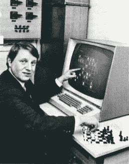
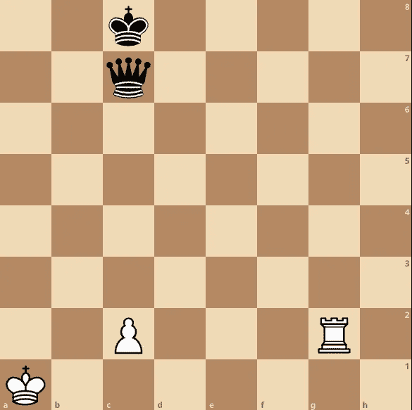
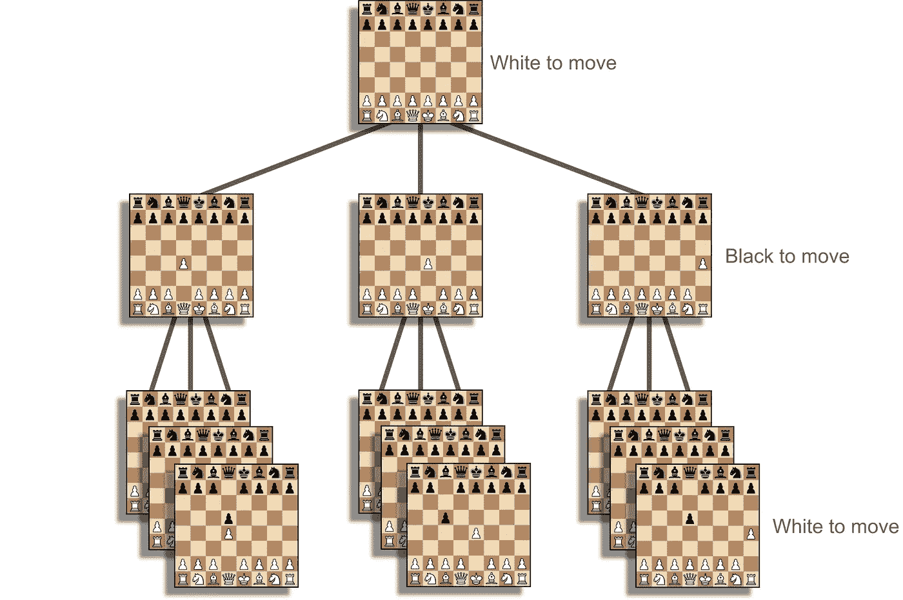

# 通过编写国际象棋引擎来升级为软件工程师

> 原文：<https://blog.devgenius.io/level-up-as-a-software-engineer-by-writing-a-chess-engine-f4532f509b56?source=collection_archive---------9----------------------->

## 第三部分:移动世代



[路德维希·扎格勒](https://www.chessprogramming.org/Ludwig_Zagler)带 Daja 象棋引擎，1976[【1】](https://www.chessprogramming.org/Daja#cite_note-1)

**计算机是如何思考的？它必须知道两件事:什么是可能的，什么是最优的。**

棋步生成函数计算从给定位置可能发生的情况。评价函数决定什么是最优的。**移动代是这两种能力的结合，也是本文的重点。**

## 关于评价函数的一点注记

没有一台计算机可以“看到”一盘棋的结局，但是引擎仍然需要找到有利的位置。这就是为什么需要一个评估函数来对职位的近似优势进行评分。

评估通常使用点数系统，棋子价值为 100，相对值如下:

```
pawn:    100
knight:  300
bishop:  320
queen:   900
king:    99999
```

评价函数还考虑了位置优势。我引擎的评测功能很简单，你可以在这里[找到](https://github.com/tonyOreglia/glee/blob/master/pkg/evaluate/evaluate.go)。

就本文的目的而言，想象一个简单的评估，它只是将每件作品的分数相加，而忽略了位置优势。**根据这种评估方法和移动生成功能，您将如何选择最佳移动？**

# 天真的解决方案

天真的方法是评估每一步棋，选择得分最高的一步。

这种方法有严重的问题。例如，考虑以下用黑色来移动的位置



在所有可能的走法中，得分最高的是在黑皇后抓住棋子之后。使用上面提到的评估，拿走棋子将得到负 400 分(负分对黑棋有利)。

但显然，这是一个糟糕的举动！白方将会抓住黑方皇后，白方得到 500 分。

就像人类棋手一样，国际象棋引擎需要超越一步棋才能下好。

## 更好—最小最大

想象一下引擎看起来有三层[在前面。](https://www.chessprogramming.org/Ply)



双重搜索

这提出了一个有趣的问题。引擎不能简单地选择具有最佳结果的移动，因为对手有机会消除最佳结果。工程师必须假设对手会理性地比赛。它的工作是限制对手的选择，同时最大化自己的选择。**极大极小算法的目的正是为了做到这一点。**

这个故事帮助我将极小极大概念化。想象一下和你讨厌的敌人玩游戏。你们之间有两个敞开的盒子，里面有一堆东西。你必须给你的对手一个盒子。然后他们会从盒子里选择一件东西给你。当然，对手会选择最差的物品。为了使你得到的价值最大化，你必须消除装有最差物品的盒子。

例如，如果一个盒子里有一堆狗屎，而另一个盒子里最糟糕的东西是一个回形针，那么你应该选择有回形针的盒子。

这种情况类似于双重搜索。但是这个策略也适用于更深层次的搜索。

下面是一个任意深度的最小-最大函数的伪代码示例(来自[象棋编程维基](https://www.chessprogramming.org/Main_Page)):

极大极小搜索伪码

从给定位置开始的每次移动都会调用此函数，并选择得分最高的移动。Minimax 要求一方优势为正，对手为负。

## 更好— Alpha-beta 修剪

极小极大效率低。

要理解为什么，再想象一下这两个盒子。现在想象你往第一个箱子里看去，最糟糕的东西是一袋钱(**太棒了！**)。现在想象一下，你在第二个盒子里看到的第一件东西是你姻亲的午餐邀请(**哎哟！！**)。对手肯定会给你邀请的。您可以停止勾选第二个框，只选择第一个框。

**这是一种优化。Alpha-beta 修剪可以做到这一点。本质上，阿尔法-贝塔将忽略那些肯定比之前分析的走势更差的走势。**

这里有一些 alpha-beta 修剪函数的伪代码(来自 chess programming wiki):

# 最佳化

可能的优化和改进是无穷无尽的。我将提到几个，并为感兴趣的人提供链接。

## 哈希算法

散列表可用于消除重复工作。例如，移动树的一部分将与先前的搜索重叠。如果你能散列位置(用 [bitboards](/improve-as-a-software-engineer-by-writing-a-chess-engine-c360109371aa) 很有效)并存储关于结果的信息，那么在接下来的搜索中可以节省时间。

## 静止搜索或选择性深化

引擎的[深度视野](https://en.wikipedia.org/wiki/Horizon_effect)有问题。如果引擎向前看了六步，但是第七步是王后捕获，这可能是一个关键的盲点。人类自然会注意到这一点。对于引擎，静止搜索解决了这个问题。静止搜索在某些情况下会更深入。这个想法是只评估“安静”的位置(没有迫在眉睫的捕获或战术)，但在动态位置进行更深入的搜索。

## 迭代深化

整个游戏的复杂程度各不相同。在游戏的最后阶段，可能会有两个合法的行动。中局可以有三十步。随着位置的简化，引擎将能够更深入地搜索。因此，搜索深度应该在整个游戏中有所不同。

迭代加深从低深度搜索开始，并迭代地增加深度，直到达到某个时间限制。这听起来可能效率很低，但是低深度计算是快速的(每层的时间是指数级增加的)。通常，这优化了给定时间窗口的搜索深度。在时间不多，引擎需要快速做出决定的情况下，这很有用。

# 训练电脑思考

我希望这篇文章激起了你对国际象棋编程和编程机器思考的兴趣。即使在机器学习时代，也必须向机器展示**什么是可能的，什么是最优的。**例如，训练一个 ML 算法需要一个数据集进行反馈，以调整“神经元”并增加准确性。甚至 AlphaGo 也被赋予了规则(什么是可能的)，然后自学什么是最优的。

如果你想和我一起深入象棋编程，[加入 Medium](https://tony-oreglia.medium.com/membership) ，[关注](https://tony-oreglia.medium.com/)，[订阅我的简讯](https://tony-oreglia.medium.com/subscribe)，或者在 [Twitter](https://twitter.com/tony_oreglia) 和 [LinkedIn](https://www.linkedin.com/in/tony-oreglia/) 上连接。

```
This article is part three of a series
- Find Part one [here](/level-up-as-a-software-engineer-by-writing-a-chess-engine-896b7f8eb443).
- Find Part three about Move Generation [here](/level-up-as-a-software-engineer-by-writing-a-chess-engine-f4532f509b56).
- Find Part four about Testing [here](/level-up-as-a-software-engineer-by-writing-a-chess-engine-1d0ffc7aebf9).
```

我的象棋引擎被命名为 Glee，是 Golang 象棋引擎的缩写。

*   [象棋引擎源代码](https://github.com/tonyOreglia/glee)
*   [前端源代码](https://github.com/tonyOreglia/personal-website/tree/master/src/ChessGame)
*   [在这里对抗欢乐合唱团！](https://tonycodes.com/chess)

# 资源

*   [迭代深化](https://www.chessprogramming.org/Iterative_Deepening)
*   [阿尔法-贝塔修剪](https://en.wikipedia.org/wiki/Alpha%E2%80%93beta_pruning)
*   [极小极大](https://en.wikipedia.org/wiki/Minimax)
*   [选择性加深](https://www.chessprogramming.org/Selectivity)
*   [静止搜索](https://www.chessprogramming.org/Quiescence_Search)
*   [使用哈希表](https://www.chessprogramming.org/Hash_Table)
*   [游戏搜索树](https://www.chessprogramming.org/Search_Tree)
*   [板层](https://www.chessprogramming.org/Ply)