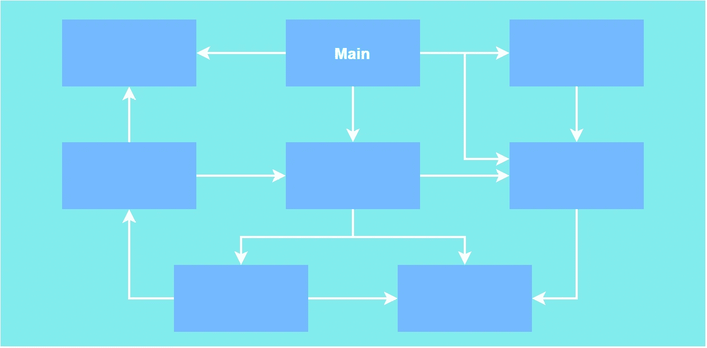
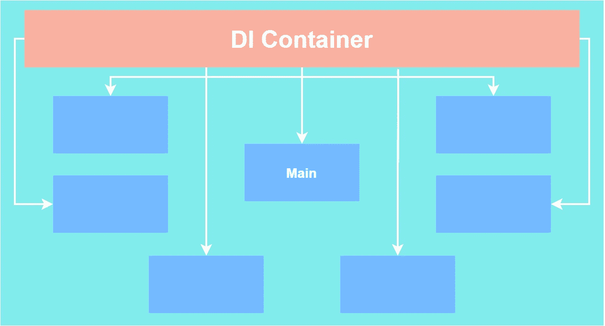

# 通过投资依赖注入来提升你的编程技能

> 原文：<https://blog.devgenius.io/level-up-your-programming-skills-by-investing-in-dependency-injection-5c8c626e0344?source=collection_archive---------3----------------------->

## 这里是你学习它的起点

作为一名来自企业应用程序世界的开发人员，我不被允许使用 **new** 关键字。多亏了一个**依赖注入(DI)** 框架，我们可以成功地做到这一点。因此，我将对该模式及其优势进行基本的解释。除此之外，我将向您介绍一个精心设计的 DI 框架—[zenjet](https://github.com/modesttree/Zenject)—目标是 C#编程语言。

[Fatos Bytyqi](https://unsplash.com/@fatosi?utm_source=unsplash&utm_medium=referral&utm_content=creditCopyText) 在 [Unsplash](https://unsplash.com/s/photos/coding?utm_source=unsplash&utm_medium=referral&utm_content=creditCopyText) 上的照片

# 依赖注入 101

我们有一个设计原则叫做**控制反转(IoC)** 。DI 背后的思想是 IoC，因此在讨论 DI 之前，有必要先了解 IoC。一个简单的介绍应该给我们背后的 DI 想法的推理。

## 控制反转(IoC)

顾名思义，其原理是反转控制。这里的**控件**是指应用或**对象创建**的**流程。我不打算触及应用程序流。但是，如果你感兴趣，你可以很容易地找到它的例子。我的重点将是在一个类中创建依赖对象。**

我们来看一个非常简单的例子；

你在上面看到的是`ScoreManager` 对`ScoreBoard`的纯粹依赖。你可以问为什么这不好。嗯，这是一种不好的做法，因为`ScoreBoard`**可以无声无息地改变**。因此，这一变化可能会对`ScoreManager`产生影响。此外，想象一下`ScoreBoard` 也用在其他类中。在那之后，所有这些都需要更多的修改。

让我们创造一个更好的`ScoreManager`版本；

在上面的版本中，没有`new` 关键字。除此之外，`ScoreManager` 依赖于抽象而不是具体的实现。它甚至不再关心它的实现。它只是从外面得到它。正如你所看到的，我们已经将创建对象的控制从 T8 转换到了更高的级别。

IoC 在这里给了我们很大的灵活性来修改所有的`IScoreBoard` 接口的具体实现。

## 依赖注入与 IoC 到底有什么关系？

我相信你已经了解了国际奥委会的概念。因此，依赖注入只不过是 IoC 的一个应用。所有的依赖项都是在一个容器中创建的。我们称之为 **DI 容器**。之后，注入器在需要的地方注入这些依赖项。今天，我们几乎为每一种编程语言都提供了非常强大的 DI 框架。在举例之前，我想先想象一下我们在这里取得的成就。

*传统的依赖管理方式*

在上图中，您可以看到传统的依赖性管理方式。想象一下在一个有数百个类的项目上的依赖图。几乎每一个班级的变化都会有很大的影响。

现在让我们看看使用阿迪框架如何改变这个图表；

*依赖注入式依赖管理方式*

甚至从视觉上解释，看起来更清晰。DI 容器包含所有实例或创建新实例的信息。它将这些实例分发给需要的类。

现在，你得到了阿迪集装箱的基本概念。你可以马上坐下来写你的注射器。这取决于你，但我宁愿不从零开始创建阿迪框架。因为有很棒的免费工具，比如:

*   Zenject，因此可以在 Unity 中使用)
*   Google Guice (Java)
*   [Inversify](http://inversify.io/) (类型脚本，因此可以在 nodeJS 应用程序中使用)

还有很多你喜欢的语言。我将很快介绍 Zenject，给出使用阿迪容器的基本概念。

# Zenject DI 框架

Zenject 是主要为 Unity 游戏引擎编写的阿迪框架。但是，因为它是用 C#编写的，所以你也可以在 Unity 之外的 C#项目中使用它。它是完全免费的。支持所有主要的软件平台。它是开源的，非常容易使用，并且有多种配置。

使您的项目适应 DI 可能会花费大量的时间，但是这绝对是值得的。因此，我认为这是一项投资，并强烈建议这样做。

## 它是如何工作的？

在此之前，您应该访问[项目的主页](https://github.com/svermeulen/Zenject)以获取初始设置和文档。我已经说过框架将注入依赖项，但是如何注入呢？

## 配置

每个 DI 框架都希望用户提供某种配置。换句话说，您应该提供实例绑定信息。比如说；

在上面的配置中，我们将具体的类`ScoreBoard`绑定到接口`IScoreBoard`。然而，绑定的配置不限于此。我们可以决定；

*   **是否应该有单个实例:**是的，这可以让你不用使用单例设计模式。因为如果将绑定设置为 Single，容器将只创建一个实例，并将它分发到任何需要的地方。
*   **如果应该延迟创建实例:**因此，如果您将要创建的对象很重，并且您不想在应用程序开始时实例化它，您可以推迟创建该对象。

这些是所有 DI 容器都必须具备的非常简单的配置。您可以检查该框架的所有其他特性。它们给人的印象太深刻了，给你很大的灵活性。

## 注射

让我们看看我们的记分牌例子，注入；

所以，用法就像使用一个`Inject`标签一样简单。当`ScoreManager` 被创建时，Zenject 将检测这个标签，并注入给定的`IScoreBoard`的具体绑定。

上面的例子叫做**场注入**。每个 DI 框架都能够做到这一点，但是这里有一个问题。`ScoreManager` 的依赖关系在外部是不明确的。让我们解决这个问题；

我总是在构造函数中暴露所有的依赖关系。这是一个很好的做法。为什么？

*   构造函数清楚地显示了类的依赖关系。
*   您可以更有效地使用 IDE，而不必直接进入类中。
*   这也是一个警告。如果你有 3 个以上的依赖项，你应该停止。这是一个明显的迹象，表明这个班有许多职责。所以，你可能想把它分成两个或更多的类。

即使 Zenject 不需要接口来创建对象，我还是建议您创建定义良好的接口。一旦你有了一个好的界面，管理变化的影响就相当容易了。

# 最后的话

我恳求你投入一些时间来学习阿迪框架。我保证你会为你的项目结构感到骄傲。它将比以往任何时候都更加清晰和易于管理。您将看到低耦合类是如何提高您的生产率的。此外，您的代码将更具可读性和可测试性。

您可以为您的单元测试提供不同的配置。您可以编写 A/B 测试、性能测试，除了您的 DI 配置类之外，不涉及任何类。

希望对于那些从未使用过 DI 的人来说，这个解释简单明了。非常感谢你的时间。如果你有任何问题，我很乐意回答你。

# 资源

[zenjet 文档](https://github.com/modesttree/Zenject/blob/master/README.md)
[zenjet 视频教程(主要针对 Unity 游戏引擎)](https://www.youtube.com/watch?v=IS2YUIb_w_M&list=PLKERDLXpXl_jNJPY2czQcfPXW4BJaGZc_)