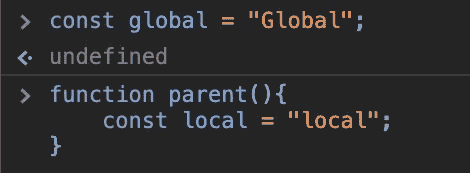
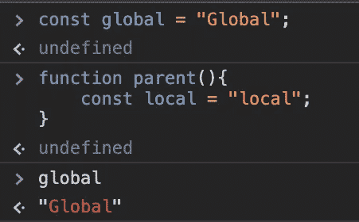
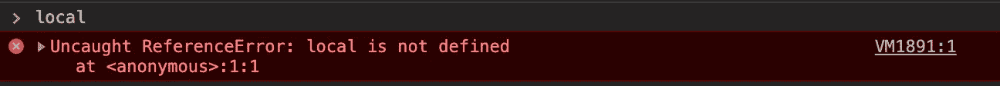
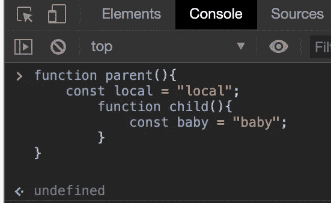

# 词汇范围:初学者指南

> 原文：<https://blog.devgenius.io/lexical-scope-beginners-guide-c563331e7e46?source=collection_archive---------35----------------------->

用最简单的术语来说，词法范围意味着可以使用或调用变量的区域取决于它的创建位置。

当函数嵌套时，词法范围通常会发挥作用。我将在下面展示它是如何工作的。

首先，我将创建一个全局变量“global”，它独立于任何函数之外，然后创建一个函数“parent”，它也有自己的局部变量“local”。我应该可以在任何地方调用全局变量，特别是在父函数中，但是不能在父函数之外单独调用局部变量。为了访问这个局部变量，我必须调用这个局部变量所在的函数。下面，我创建了全局变量和带有局部变量的父函数—

我将能够单独调用“全局”变量—

但是当我试图单独调用“局部”变量时，我无法—

我也可以在我的“父”函数中调用全局变量。

现在，当我在父函数中添加另一个函数“child”时会发生什么？

在父函数中创建了一个嵌套子函数后，我将在这个嵌套函数中创建一个名为“baby”的局部变量。

从子函数中，我将能够调用婴儿变量、局部变量(在父函数中)和全局变量！是的，宝宝的手伸得最远！

(旁注— RIP Patrick，永远在我们心中😥)

从父函数中，我只能访问父函数中的全局变量和局部变量。尽管子函数是在父函数中创建的，但我无法访问它。这是因为变量不能在其作用域之外被访问。婴儿变量只能被子函数访问，但是子函数可以调用全局变量和位于它上面的父函数中的局部变量。

全局变量不能调用局部变量或子变量。

你也可以把嵌套函数中的词法作用域想象成一朵盛开的花，每一排花瓣都朝外。靠近中心的每一排可以看到前面的所有花瓣，但看不到后面的花瓣。花的中心可以看到每一片花瓣。