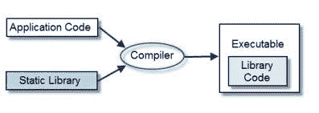

# 库:什么是静态库

> 原文：<https://blog.devgenius.io/libraries-what-is-a-static-library-c4d3a0a0783b?source=collection_archive---------22----------------------->

## 图书馆到底是什么？

在 C 语言中，库是我们可以导入或包含在程序中的特定类型的文件。这些文件包含了不同功能的规范，这些功能已经建立并可用，我们将能够添加到我们的程序中，比如从键盘上阅读或在屏幕上显示一些东西等等。

通过包含这些具有不同功能定义的库，我们可以节省很多东西，例如，想象一下，每次我们需要从键盘上读取数据时，我们必须创建一个函数来完成它(一些非常复杂的东西)，通过在 C 中使用这些库，我们可以利用各种各样的函数来方便我们的生活，并增加我们代码的模块化。

编译过程

## 静态库

静态库，也称为对象库(与它们的组件或模块相关，包括这种类型的文件)，是组合在一个文件中的对象文件的集合，通常带有扩展名。通常伴随着头文件。h，它包含库中定义的对象的声明。稍后，在链接阶段，链接器在可执行文件中包括与应用程序中使用的函数和库类相对应的模块。结果，这样的模块成为可执行文件的一部分，就像任何其他的函数或类一样，这些函数或类本来是写在应用程序的主体中的。

## 使用“ar”和“ranlib”创建静态“C”库

用于创建静态库的基本工具是一个名为“ar”的程序，意为“archiver”。这个程序可以用来创建静态库，修改静态库中的目标文件，列出库中目标文件的名称，等等。为了创建一个静态库，我们可以使用这样的命令:

> ***ar RC libtest . a exa 1 . o exa 2 . o exa 3 . o***

该命令创建一个名为“libtest.a”的静态库，并将目标文件“exa1.o”、“exa2.o”和“exa3.o”的副本放入其中。如果库文件已经存在，则对象文件将被添加到其中，如果对象文件比库文件更新，则对象文件将被替换。“c”指示符告诉 ar 创建库(如果它还不存在)。“r”指示符告诉您用新的对象文件替换库中最旧的对象文件。

创建或修改文件后，需要对其进行索引。编译器随后会使用该索引来加快在库中搜索符号的速度，并确保在编译期间库中符号的顺序无关紧要。用于创建或更新索引的命令称为“ranlib ”,调用方式如下:

> **ran lib libtest . a**

## 在程序中使用“C”库

在我们创建了我们的存档之后，我们想在一个程序中使用它。这是通过使用一个特殊的标志，通常是'-l '，将库的名称添加到给予链接器的目标文件名列表中来完成的。这里有一个例子:

> ***gcc main.o -L. -ltest -o 程序***

这将创建一个使用目标文件“main.o”的程序，以及它需要的来自“test”静态库的任何符号。注意，我们省略了前缀“lib”和“.”。在 link 命令中提到库时，后缀为。链接器将这些部分附加回库的名称，以创建要查找的文件名。还要注意“-L”标志的用法—该标志告诉链接器在给定的目录(“.”中可能会找到库指的是当前目录)，以及编译器查找系统库的标准位置。

这篇博客就写到这里，谢谢你的阅读，希望对你有所帮助。如果您有任何问题，请通过 twitter [@jcamilovillah](http://twitter.com/jcamilovillah) 联系我。永远不要停止学习！