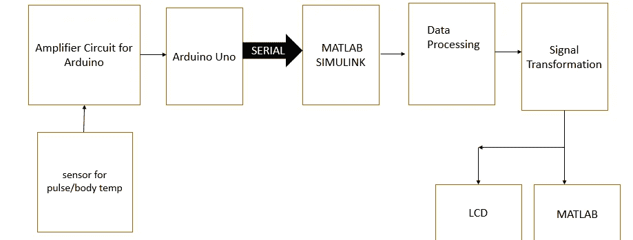
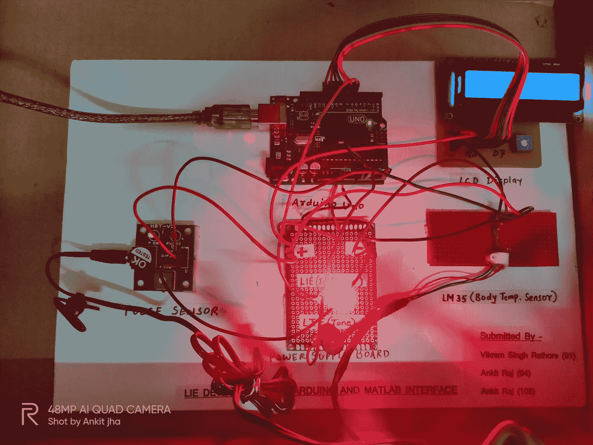
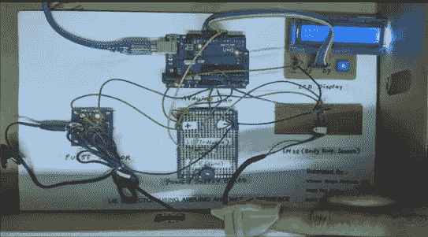
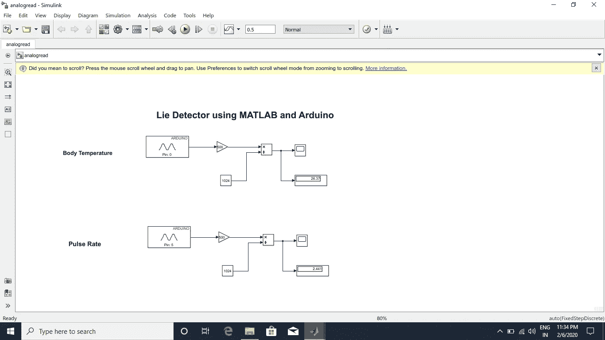
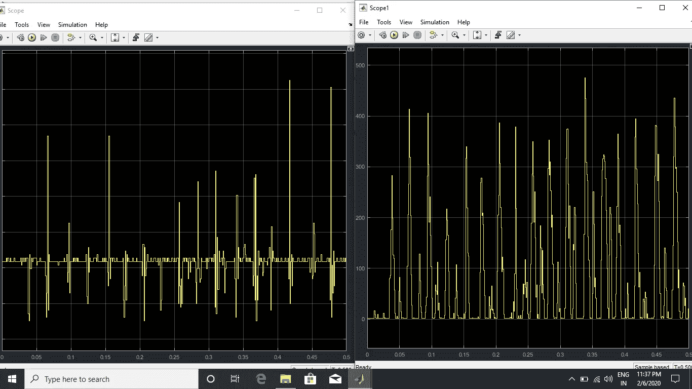

# 基于 MATLAB 和 Simulink 的测谎仪

> 原文：<https://blog.devgenius.io/lie-detector-using-matlab-and-simulink-1540629d4522?source=collection_archive---------13----------------------->

> **摘要**

一般来说，犯罪会惩罚自己，但这并不意味着罪犯应该不受惩罚。我国的犯罪率呈指数增长。问题来了，背后的原因是什么？我们国家的司法是周末还是犯罪不再合法？不，犯罪率上升的原因是我们的司法系统存在漏洞。罪犯犯了罪，却逍遥法外，没有受到惩罚。这是犯罪中最令人心碎的部分。我们使用 MATLAB 和生物传感器的测谎仪可以作为真理和谎言之间的过滤器。因此，我们提出了一个使用 BPM 和温度传感器来检测谎言的项目。我们提出的项目将从传感器和处理它的输入，并在 LCD，LED，蜂鸣器和 MATLAB 上给出输出。

> **简介**

这里我们使用两个传感器，第一个是血压监测传感器(B.P.M ),另一个是温度传感器，我们对两个传感器的输出数据进行采样。LM35 温度传感器将通过皮肤接触测量个人的体温。第二个传感器是脉搏传感器，它将测量每个人的脉搏并在 LCD 上显示输出。这两个传感器将用于组装测谎仪。集合之后，我们将首先从一组志愿者那里收集数据。我们还将设计一个 Simulink 模型和一个 Simulink 程序，以便我们可以用 MATLAB 与测谎仪进行串行通信，然后在 MATLAB Simulink 模型上以数字方式获取实时读数。硬件读数可以适用于液晶显示器(LCD)。为了校准设备，我们读取了硬件和软件读数。因此，在获得两个读数后，我们可以校准设备。所有的测量值，如体温和血压，都与任何个体的正常读数进行比较。lm35 安装在腕带上，然后戴在个人的手腕上。BPM 是使用安装在指尖上的红外传感器测得的。也可以在 Arduino ide(集成开发环境)的串行窗口中观察读数。

> **框图**

测谎仪框图

> **LM 35**

LM35 是一个温度传感器。输出电压与温度成正比，每增加 10mv，温度就会升高 1 摄氏度。它不需要任何外部校准；它被校准到摄氏 30 度.它是一款线性传感器，工作电压范围为 4v 至 30 v。

> **BPM 传感器模块**

BPM 传感器感测每分钟的心跳，这是使用光学方法完成的。传感器放置在指尖，因为指尖处血液的血管水平的变化率很高。当指尖的血液密度发生变化时，红外光会捕捉到血液密度的变化率，并通过放大器电路放大，然后传递到 Arduino 的模拟引脚。

> Arduino

Arduino 是一款微控制器开发板，包含一个 TMEGA328 微控制器。它由 14 个数字引脚(d0 — d13)和 6 个模拟引脚(a0 — a5)组成。Arduino 的编程是用嵌入式 c 语言完成的。它是一个单板微控制器，具有静态随机存取存储器(SRAM)存储器。它有闪存或 EEPROM 存储。

> **液晶**

LCD 代表液晶显示器。它是一种用于显示输出的输出设备。它们通常用于 LED 电视、智能手机和仪表板。它总共有 16 个引脚，这里我们将以 4 位模式连接 LCD。它有一个寄存器选择引脚，低电平时输入命令，高电平时输入数据。read 和 write 引脚在低电平时写入 LCD，在高电平时从 LCD 读取。最后一个配置引脚是使能引脚，它应该从高电平变为低电平，以便写入 LCD。

> **Simulink**

Simulink 是由 math work 开发的 MATLAB 仿真工具。我们需要 Arduino 包、Simulink 包和 legacy 包来使用 MATLAB(R2018)与 Arduino 接口。MATLAB 和 Simulink 之间的通信是借助串行通信完成的。串行通信端口用于 Arduino 和 MATLAB 之间的通信。

> **Arduino IDE**

它基本上是一个用于编程 Arduino 微控制器板的开源软件。程序是用嵌入式 c 语言编写的。IDE 包含串行窗口和串行监视器，可以看到系统的实时输出。

> **实施**

我们的项目是使用 Arduino UNO (ATMEGA 328)微控制器开发板实现的。LM35 温度传感器与人体皮肤接触，当温度升高时，LM35 模块以输出模拟电压的形式输出。类似地，当 BPM 传感器连接到个人的指尖并且它有两侧时，用于 LED 的一侧和用于放大电路的另一侧检测 BPM 并再次以模拟形式给出输出。两个传感器的输出馈入 Arduino Uno 的模拟引脚，Arduino 的数字引脚连接到 LCD。Arduino 中的 ADC(模数转换器)将模拟信号转换成数字信号，然后在 LCD 上显示出来。温度和 BPM 都有固定的阈值，只要温度或 BPM 超过阈值，蜂鸣器就会发出蜂鸣声，LED 也会闪烁。现在开始实施项目的软件部分。无线电和 Simulink 通过串行通信端口连接。在 Simulink 模型上，通过串行通信端口以 9600 波特率从 Arduino 获取实时读数。两个传感器的 Simulink 模型输出同时绘制在图表上。

硬件实施演示

脉搏测量

软件实施演示

软件实施的结果

> **用于编程 ARDUINO 的代码**

* *编码只能用嵌入式 c 语言完成*

#包括<liquidcrystal.h></liquidcrystal.h>

#定义 USE_ARDUINO_INTERRUPTS true

#包括<pulsesensorplayground.h></pulsesensorplayground.h>

液晶显示器(12，11，10，9，8，7)；

常数 int 传感器= A0//将模拟引脚 A0 分配给变量“传感器”

浮点 tempc//以摄氏度为单位存储温度的变量

浮点 tempf//以 Fahreinheit 格式存储温度的变量

浮动 vout//保存传感器读数的临时变量

int Buzz = A1

int led = 6；

浮点温度= 0；

const int PulseWire = A5//连接到模拟引脚 0 的脉冲传感器紫色线

const int LED13 = 13//板载 Arduino LED，靠近引脚 13。

int Threshold = 550

pulseSensor 操场 pulseSensor//创建名为“pulseSensor”的 PulseSensorPlayground 对象的实例

无效设置()

{

pinMode(传感器，输入)；//将引脚 A1 配置为输入

pinMode(嗡嗡声，输出)；

pinMode (6，输出)；

pulse sensor . analog input(pulse wire)；

pulse sensor . blinkonpulse(led 13)；//随着心跳自动神奇地闪烁 Arduino 的 LED。

pulseSensor.setThreshold(阈值)；

//仔细检查“pulseSensor”对象是否已创建并“开始”看到信号。

if (pulseSensor.begin())

{

Serial.println("我们创建了一个 pulseSensor 对象！");//在 Arduino 上电或 Arduino 复位时打印一次。

LCD . clear()；

LCD . print(" BPM:")；//每分钟节拍数

}

serial . begin(9600)；

lcd.begin(16，2)；

延迟(500)；

}

无效循环()

{

vout=analogRead(传感器)；

vout =(vout * 500)/1023；

tempc = vout//以摄氏度为单位存储值

tempf =(vout * 1.8)+32；//转换为华氏温度

lcd.setCursor(0，0)；

LCD . print(" in DegreeC = ")；

LCD . print(tempc)；

lcd.setCursor(0，1)；

//lcd.print("in 华氏= ")；

//LCD . print(tempf)；

如果(温度> 30)

{

digitalWrite(嗡嗡声，高)；

digitalWrite(6，高)；

}

其他

{

digitalWrite(嗡嗡声，低)；

digitalWrite(6，低)；

}

int my BPM = pulse sensor . getbeatsperminute()；//调用 pulseSensor 对象上的函数，该对象将 BPM 作为“int”返回。

// "myBPM "现在保存这个 BPM 值。

if(pulse sensor . sawstartobfeat()){//不断测试看是否“发生了一拍”。

// Serial.println("♥发生了心跳！”);//如果测试为“真”，则打印一条消息“发生了心跳”。

serial . print(" BPM:")；//打印短语“BPM:”

serial . println(my BPM)；//打印 myBPM 内部的值。

LCD . clear()；

LCD . print(" BPM:")；

lcd.setCursor(0，1)；

LCD . print(my BPM)；

延时(1000)；//延迟 1 秒，以便在串行监视器中查看

}

}

谢谢大家！:-)