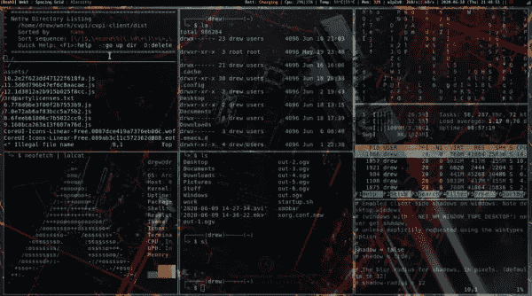

# 自学成才的程序员的生活

> 原文：<https://blog.devgenius.io/life-of-a-self-taught-programmer-fe1174cc958d?source=collection_archive---------18----------------------->

图像= [网络系统编号](https://www.google.com.tr/url?sa=i&url=https%3A%2F%2Fwww.websystemer.no%2Fthe-4-5-years-experience-of-a-self-taught-programmer%2F&psig=AOvVaw3TxnTrAG4EWgKjRXuGzS6O&ust=1595404217570000&source=images&cd=vfe&ved=0CAMQjB1qFwoTCOip5Iju3eoCFQAAAAAdAAAAABAQ)

*没有学历背景？没问题。通过我的经历，我会帮助你成为一个。*

首先，这与学术无关；而是你有多想成为。当你决定成为一名程序员后，你应该从某些人那里获得帮助，并开始在网上寻找课程。我来告诉你我是如何在没有学历的情况下导航整个领域的。

## 1-决定你想追求什么

区块链，人工智能，数据科学，或者其他领域。这取决于你。你选择，然后从你的朋友和网上论坛获得帮助。

## 2-参加课程

网上有许多课程。尤其是在线学习网站和 YouTube 本身。大多数要求你付费并继续学习，而有些则允许你按照自己的进度免费学习。一些人要求坚持他们的计划。以下是我推荐的一些学习平台:

**Udemy**

*一次性支付，终身访问？自定进度？免费还是付费的优质课程？不用担心与课程保持同步？便宜的课程价格？这里是你学习编程的最佳网站。别担心，教师教你很好，最高标价 15 美元。付费或免费，按照自己的进度开始课程。如果你足够努力，你会学到很多东西。并且，完成所有的课程将会给你一个证书，如果它是一个有序列号的付费课程的话。*

**YouTube**

*免费、优质、来源广泛？*还是需要学习自己的语言？然后，YouTube 任你处置。还是和 Udemy 一样没有直接下载资源，没有证书。只需保存您浏览器的链接，以免丢失您免费选择的课程。

**Coursera**

知名机构颁发的证书和一次性获得所有课程的高额学费？或者，支付每门课程一大笔钱？如果一切都可以承受，那么 Coursera 是最好的选择。课程分为几周，包括讲座、测验和作业。如果都通过了，你就有了带有序列号的证书。

## 3-向你的朋友寻求帮助

我提到过学习编程语言时需要朋友。特别是如果你是自学的话。但是，他们必须了解你所学的语言。因为即使你找不到一个错误，但你已经检查并分析了你的错误；你需要一个朋友的指导来纠正错误，并告诉你将来如何不上当。此外，终端的高级功能需要高级知识和帮助。所以，朋友可以让你的生活更轻松。

## 4-记笔记和练习

*真希望我当初学编程的时候就这么做了。现在，它给了我更多的帮助*。尤其是做笔记的时候。你不必经常练习这些功能，但你需要做笔记并阅读它们来记忆。而且，当你写东西的时候，他们可以帮你。这就是为什么记笔记很重要。

## 5-与视频同步学习

它有助于以同样的速度前进。尤其是当你是编程初学者的时候。停下来记下代码的结构对你也有帮助。编写相同的代码教你帮助记忆结构，这样你就不会再次落入相同的陷阱。

*那么，作为一名自学成才的程序员，你的生活是怎样的？在下面的评论区分享你的想法。*